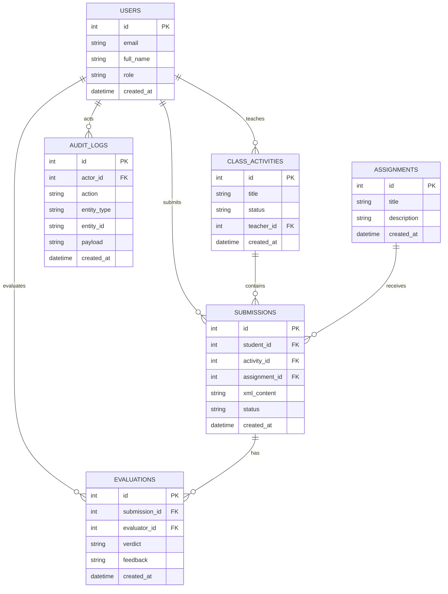
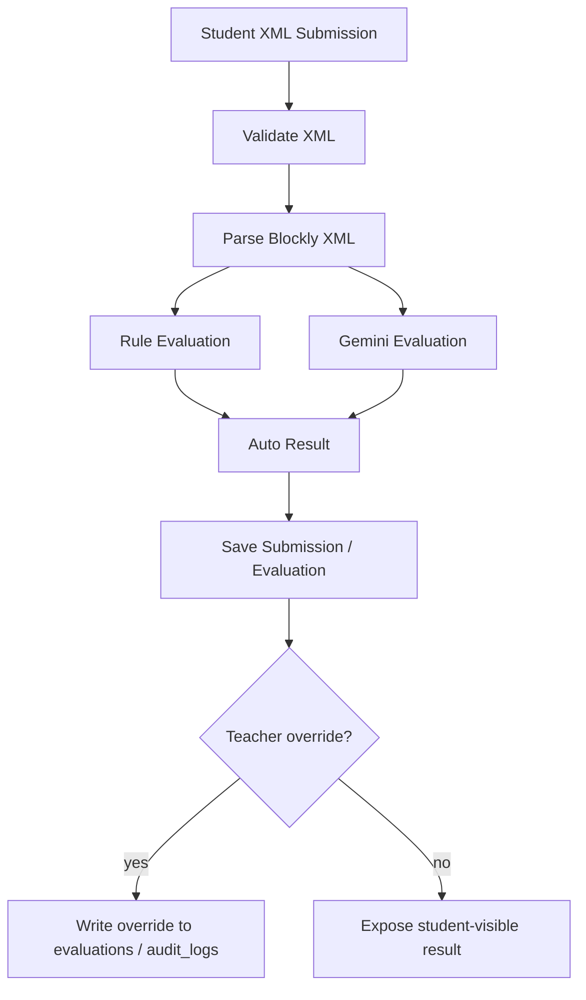

# Student AI Grading ER

這份文件描述目前核心實體與關係。內容以現有 SQLAlchemy model 為主，並補上 API 層的活動-作業語意。

## ER Diagram

## 核心實體

### `users`

- 保存老師與學生帳號
- `role` 用來區分 `teacher` 與 `student`
- 目前登入流程仍以測試帳號 token 示範，正式資料會落在這個 user 結構中

### `class_activities`

- 老師建立的課堂活動
- 目前包含 `title`、`status`、`teacher_id`
- 一個活動可對應多筆 submission

### `assignments`

- 單一作業定義
- 目前只保存 title 與 description
- API 層的 `assignment_ids` 表示活動選到哪些作業；若之後需要持久化多對多關聯，可再加中介表

### `submissions`

- 學生針對某個活動與作業送出的 XML
- `status` 代表 queued / processing / completed / rejected 等處理狀態
- 一筆 submission 會對應一個 activity 與一個 assignment

### `evaluations`

- 保存系統評分或人工評分結果
- `verdict` 與 `feedback` 可表達 AI 輸出或教師回饋
- 可透過 `evaluator_id` 追蹤是系統、老師或其他 evaluator

### `audit_logs`

- 保存操作痕跡與覆核紀錄
- 教師覆核建議記成 `action=teacher_override`
- `payload` 可存覆核前後燈號、等第與原因

## Submission 與 Activity / Assignment 的關係

v1 API 的 `submission create` 會要求同時提供 `activity_id` 與 `assignment_id`，因為這兩個欄位是後續評分、報表與課堂追蹤的最小必要資訊。

目前 SQLAlchemy model 在測試與早期骨架階段仍允許 `activity_id` / `assignment_id` 為 nullable，這是為了保留建模與測試彈性。正式資料層不應依賴 null；實際上應由 API / service 層保證兩者都存在，並在建立 submission 時完成對應關聯。

換句話說：

- 文件與 API 規格上，`activity_id` 與 `assignment_id` 都是 submission create 的必填欄位
- 目前 DB model 只是暫時容許 null，不代表正式資料允許缺值
- 系統在正式流程中應以 API / service 保證資料完整，而不是靠資料庫欄位約束來補救

## 四燈號與教師覆核優先

目前系統採用四種燈號：

- `red`: 明顯不符合或需立即修正
- `yellow`: 需要注意、等待後續判斷或 AI 提示
- `blue`: 已進入教師覆核或人工介入狀態
- `green`: 通過或完成度足夠

優先順序分成兩層：

1. 自動評分路徑內，rule engine 的 hard-fail 可以直接覆蓋 AI 結果，也就是規則失敗時不必等 AI 才能決定最終燈號。
2. 但教師覆核 / override 永遠是最終來源，會覆蓋任何系統產生結果；學生可見結果以教師覆核後的燈號與等第為準。

## 流程對應

## 實作備註

- 目前 model layer 已定義 `ClassActivity`, `Assignment`, `Submission`, `Evaluation`, `AuditLog`, `User`
- `submission.activity_id` 與 `submission.assignment_id` 在 model 上暫時仍可為 nullable，但正式資料流程應確保兩者都有值
- `AuditLog` 是目前可承接 teacher override 與其他操作紀錄的最穩定落點

