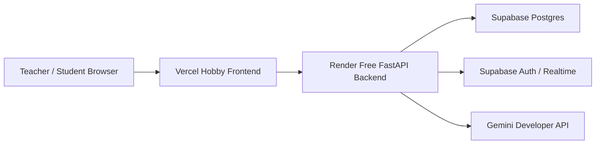

# Free Tier Deployment

這份部署說明反映目前專案已確認的技術選型：

- Frontend: Vercel Hobby
- Backend: Render Free Web Service
- DB / Auth / Realtime: Supabase Free / Postgres
- LLM: Gemini Developer API，模型 `gemini-2.5-flash-lite`
- 非同步處理: FastAPI background task / in-app job queue

## 架構概覽

## 各層責任

| 層級 | 平台 | 職責 |
|---|---|---|
| 前端 | Vercel Hobby | 承載 React UI、靜態資源與前端路由 |
| 後端 | Render Free Web Service | 提供 FastAPI API、WebSocket、XML 驗證與評分流程 |
| 資料庫 | Supabase Free Postgres | 保存 users、activities、assignments、submissions、evaluations、audit logs |
| 身分與即時 | Supabase Free Auth / Realtime | 登入與即時事件基礎能力 |
| LLM | Gemini Developer API | 提供作業語意回饋與燈號判斷 |

## 部署流程

1. Frontend 在 Vercel 建置並發佈，指向 Render backend 的公開 API base URL。
2. Backend 在 Render 啟動 FastAPI，連到 Supabase Postgres。
3. 提交 XML 後，backend 先做 XML 驗證，再把工作丟進 FastAPI background task / in-app queue。
4. Worker 流程在同一個 backend 程序內完成 parse、rule evaluation、Gemini 推論與 final result 決策。
5. 評分結果與教師覆核寫回資料庫，並透過活動 channel 更新 dashboard。

## 環境變數

### Backend

- `DATABASE_URL`: Supabase Postgres 連線字串
- `GEMINI_API_KEY`: Gemini Developer API 金鑰
- `GEMINI_MODEL`: 建議固定為 `gemini-2.5-flash-lite`
- `SUPABASE_URL`: Supabase project URL
- `SUPABASE_SERVICE_ROLE_KEY`: 若後端需要以 service role 存取 Supabase

### Frontend

- `VITE_API_BASE_URL`: Render backend 的公開 API base URL
- `VITE_SUPABASE_URL`: 若前端直接串 Supabase Auth / Realtime
- `VITE_SUPABASE_ANON_KEY`: 若前端直接串 Supabase Auth / Realtime

## Free Tier 注意事項

- Render free web service 可能冷啟動，第一次請求會較慢
- Supabase free 方案要注意連線數、儲存量與 Realtime 用量
- Gemini Developer API 要注意每日或每分鐘 quota
- in-app queue 只適合單服務、低吞吐量情境；服務重啟時，尚未完成的工作可能會遺失
- 若要長期保留歷史評分與報表，結果必須落庫，而不是只留在記憶體

## 上線前檢查

- 確認 backend 能連到 Supabase Postgres
- 確認 frontend 的 API base URL 指向 Render
- 確認 `gemini-2.5-flash-lite` 的 API key 與 quota 有效
- 確認 WebSocket endpoint 可從前端網域連線
- 確認提交流程在 cold start 後仍可恢復

