# Chapter01_硬體及開發環境簡介

## 第 1 頁

第一章 硬體及開發環境簡介
1-1 NodeMCU-32S 介紹
1-2 EZ Start Kit 介紹及組裝
1-3 NodeMCU-32 驅動程式下載及安裝
1-4 BlocklyDuino 下載及安裝
1-5 BlocklyDuino 功能介紹
1-6 撰寫第一個程式

## 第 2 頁

1-1 NodeMCU-32S 介紹
從國外傳來的創客(Maker)活動，在國內也同樣受到大眾的歡迎，並且快速
形成風潮，創客活動是透過動手做，將創意具體化成為作品，由於 Arduino 控制
板簡單易用，且價格便宜，所以 經常使用 Arduino 控制板來完成創意作品，而
Arduino UNO 是最常用的控制板，Arduino UNO 如圖 1-1 所示。
圖 1-1 Arduino UNO R3
近年來物聯網(Internet of Thing) 及人工智慧(Artificial Intelligence)的興起，創
客的創意開始有連接網路或是提高算力的需求，Arduino UNO 已經不敷使用，於
是市面上開始出現許多可以連接 WiFi 及藍牙(Bluetooth)的控制板，其中 ESP32 是
目前討論度很高的晶片組 ，ESP32 是樂鑫科技公司的產品 ， 其內建WiFi 及藍牙晶
片 ， 且相容於Arduino 的操作環境 ， 所以受到全球創客們的青睞 ， 不過使用 ESP32
晶片組的控制板種類眾多，本書採用安信可科技公司所生產的 NodeMCU-32S，
如圖 1-2 所示。
圖 1-2 NodeMCU-32S
NodeMCU-32S 採用 ESP32S 晶片組 ，具有 雙核處理器， 運算時脈速度比
Arduino UNO 快約 8 倍，算力大幅提升，且相容於 Arduino 的操作環境，可使用
Arduino IDE 進行開發，內建 WiFi 及藍牙的連線功能，WiFi 支援 2.4GHz，藍牙支
援傳統藍牙及低功耗藍牙(Bluetooth Low Energy)，另外還內建硬體時鐘(Real Time
Clock)，只要設定時間就可自動計時，電源部分提供有直流 5V 及 3.3V，可連接
5V 及 3.3V 的感測模組，價格的部分十分親民，在物聯網及人工智慧產業興起的
現今，NodeMCU-32S 補足 Arduino UNO 的缺口 ，同時搭配後面會提到的 EZ Start Kit，
讓我們輕鬆完成創意作品。

### 圖片

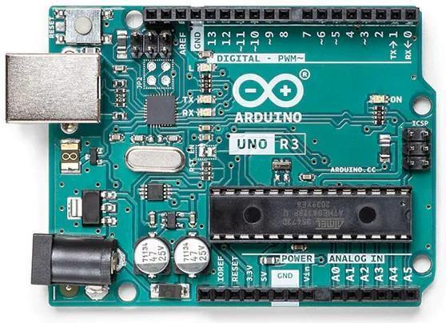

圖片說明：此圖對應「Arduino UNO R3」，位於「1-1 NodeMCU-32S 介紹」相關內容中，主要用來輔助說明 1-1 NodeMCU-32S 介紹 從國外傳來的創客(Maker)活動，在國內也同樣受到大眾的歡迎，並且快速。

圖片說明：此圖對應「NodeMCU-32S」，位於「1-1 NodeMCU-32S 介紹」相關內容中，主要用來輔助說明 1-1 NodeMCU-32S 介紹 從國外傳來的創客(Maker)活動，在國內也同樣受到大眾的歡迎，並且快速。

## 第 3 頁

NodeMCU-32S 控制板上有外接天線座，可外接天線，有兩顆LED，上方紅色
LED 為電源顯示，下方藍色 LED 為內建 LED，接於 GPIO2，可用程式控制，還有
兩顆按鍵 ， 上方按鍵標示EN 為重置(Reset)按鍵 ， 下方按鍵標示IO0 為內建按鍵，
接於 GPIO0，可用程式接收其狀態，在兩顆按鍵的中間是 USB 插槽，其作用為連
接電腦，控制板上元件的實際配置位置如圖 1-3 所示。
圖 1-3 NodeMCU-32S 控制板正面圖
外接天線座
紅色 LED 為電源顯示
藍色 LED 為內建 LED
重置按鍵
內建按鍵
USB 插槽

### 圖片

圖片說明：此圖對應「NodeMCU-32S 控制板正面圖」，位於「NodeMCU-32S 控制板上有外接天線座，可外接天線，有兩顆LED，上方紅色」相關內容中，主要用來輔助說明 NodeMCU-32S 控制板上有外接天線座，可外接天線，有兩顆LED，上方紅色 LED 為電源顯示，下方藍色 LED 為內建 LED，接於 GPIO2，可用程式控制，還有。

圖片說明：這是本頁第 2 張重點圖片，位於「NodeMCU-32S 控制板上有外接天線座，可外接天線，有兩顆LED，上方紅色」相關內容中，主要用來輔助說明 NodeMCU-32S 控制板上有外接天線座，可外接天線，有兩顆LED，上方紅色 LED 為電源顯示，下方藍色 LED 為內建 LED，接於 GPIO2，可用程式控制，還有。

## 第 4 頁

1-2 EZ Start Kit 介紹及組裝
NodeMCU-32S 控制板基本配備齊全，不過控制板上只有內建 LED 及按鈕開
關，想要使用其他感測模組，必須要透過控制板上的排針接線，直接用排針接線
常會造成實作的問題，一般而言，我們會使用擴充板來解決接線不穩定，以及電
源針腳不足的問題，本書選擇 EZ Start Kit 作為擴充板，其內建多種感測模組，無
需接線，方便初學者專注學習程式撰寫，若用於課堂授課，可避免學生接線所造
成的錯誤，讓學習更佳順暢。
EZ Start Kit 為國內電子科技公司 iCShop 的產品，其可做為 NodeMCU-32S 的
擴充板之外，還可用於 micro:bit 及 LinkIt7697，內建感測模組有三顆 LED、三顆
WS2812 RGB LED、兩顆按鈕開關、可變電阻、光感測器、蜂鳴器、DHT11 溫濕度
感測器、紅外線接收器、繼電器以及 1.3 吋 OLED，總共 10 種感測模組，另外還
有擴充應用針腳及 ESP32 插槽可供外接感測模組， 所有模組及元件的配置位置如
圖 1-5 所示，本書在第二章會詳細說明內建感測模組及外接感測模組的使用。
圖 1-4 EZ Start Kit 感測模組位置說明
EZ Start Kit 的每個模組在電路板的正面都有印上 IO 編號，例如：紅色 LED
是 IO4，黃色 LED 是 IO5，綠色 LED 是 IO6，如圖 1-4 所示，這些 IO 編號的作用
是查詢所使用開發板上的 IO 腳位，因為 EZ Start Kit 可以接三種不同的開發板，
所以同一個 IO 編號接不同的開發板時，會對應到不同的開發板 IO 腳位，而 IO
編號對應開發板上的 IO 腳位表印在 EZ Start Kit 電路板的背面，如圖 1-5 所示，
以紅色 LED 為例，紅色 LED 的 IO 編號是 IO4，由對照表可知，IO4 對照到 ESP32
接腳是 GPIO16，對照到 7697 則是 P13，對照到 micro:bit 同樣是 P13，其餘以此
類推。撰寫程式前，我們必須查詢所使用模組的ESP32 腳位，如果程式中的腳位
填錯，會發生錯誤的動作。

### 圖片

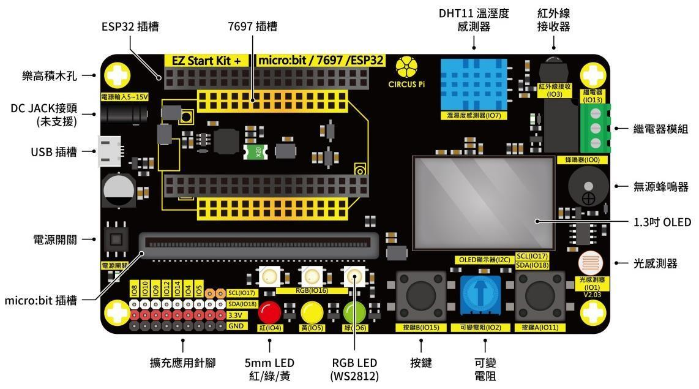

圖片說明：此圖對應「所示，本書在第二章會詳細說明內建感測模組及外接感測模組的使用。」，位於「1-2 EZ Start Kit 介紹及組裝」相關內容中，主要用來輔助說明 1-2 EZ Start Kit 介紹及組裝 NodeMCU-32S 控制板基本配備齊全，不過控制板上只有內建 LED 及按鈕開。

## 第 5 頁

圖 1-5 EZ Start Kit 電路板背面
當我們取得 NodeMCU-32S 及 EZ Start Kit 後，需要做簡單的組裝，才可以使
用，以下說明組裝步驟：
步驟 1：分別取出 NodeMCU-32S 及 EZ Start Kit。
步驟 2：將 2 個板子的 USB 插槽朝左。
步驟 3：將 NodeMCU-32S 的排針輕輕插入 EZ Start Kit 的 ESP32 插槽中。

### 圖片

圖片說明：此圖對應「EZ Start Kit 電路板背面」，位於「圖 1-5 EZ Start Kit 電路板背面」相關內容中，主要用來輔助說明 當我們取得 NodeMCU-32S 及 EZ Start Kit 後，需要做簡單的組裝，才可以使 用，以下說明組裝步驟：。

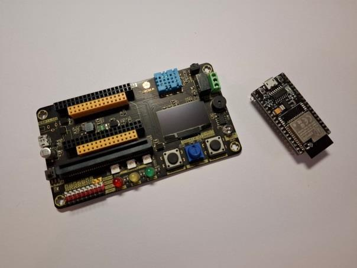

圖片說明：這是本頁第 2 張重點圖片，位於「圖 1-5 EZ Start Kit 電路板背面」相關內容中，主要用來輔助說明 當我們取得 NodeMCU-32S 及 EZ Start Kit 後，需要做簡單的組裝，才可以使 用，以下說明組裝步驟：。

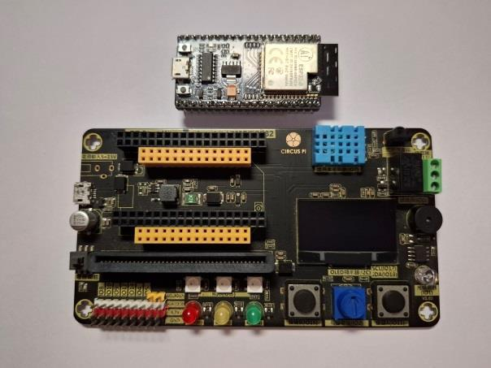

圖片說明：這是本頁第 3 張重點圖片，位於「圖 1-5 EZ Start Kit 電路板背面」相關內容中，主要用來輔助說明 當我們取得 NodeMCU-32S 及 EZ Start Kit 後，需要做簡單的組裝，才可以使 用，以下說明組裝步驟：。

## 第 6 頁

步驟 4：確認 NodeMCU-32S 的每支排針都插入插槽後，再將排針全部插入插槽
內，完成 NodeMCU-32S 與 EZ Start Kit 結合。

### 圖片

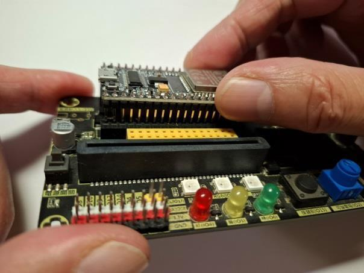

圖片說明：這是本頁第 1 張重點圖片，位於「步驟 4：確認 NodeMCU-32S 的每支排針都插入插槽後，再將排針全部插入插槽」相關內容中，主要用來輔助說明 步驟 4：確認 NodeMCU-32S 的每支排針都插入插槽後，再將排針全部插入插槽 內，完成 NodeMCU-32S 與 EZ Start Kit 結合。

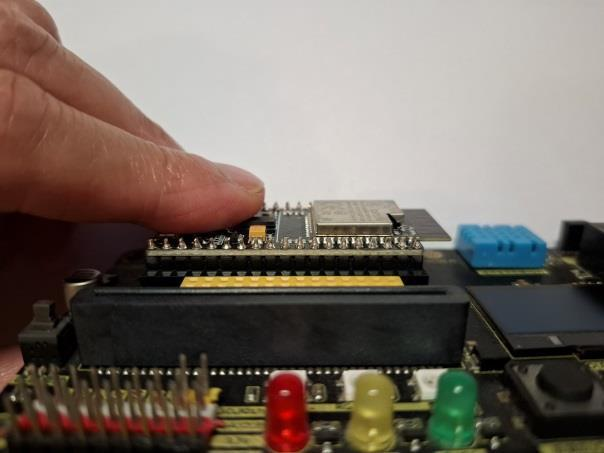

圖片說明：這是本頁第 2 張重點圖片，位於「步驟 4：確認 NodeMCU-32S 的每支排針都插入插槽後，再將排針全部插入插槽」相關內容中，主要用來輔助說明 步驟 4：確認 NodeMCU-32S 的每支排針都插入插槽後，再將排針全部插入插槽 內，完成 NodeMCU-32S 與 EZ Start Kit 結合。

## 第 7 頁

1-3 NodeMCU-32S 驅動程式下載及安裝
程式下載及除錯我們需要透過電腦與 NodeMCU-32S 間的連線，其連線使用
USB 的連線，由於 NodeMCU-32S 使用 CH340 晶片做為 USB 的連線，我們可以直
接到晶片製造商提供網站下載 CH340 的驅動程式，其下載超連結為：
https://www.wch.cn/downloads/CH341SER_EXE.html
以下說明 CH340 的驅動程式的下載及安裝步驟：
步驟 1：進入下載網站後，請點選「下載」。
步驟 2：點選下載完成的「CH341SER.EXE」，以啟動驅動程式的安裝程序。
步驟 3：點選「執行」。
步驟 4：點選「INSTALL」，開始安裝驅動程式。

### 圖片

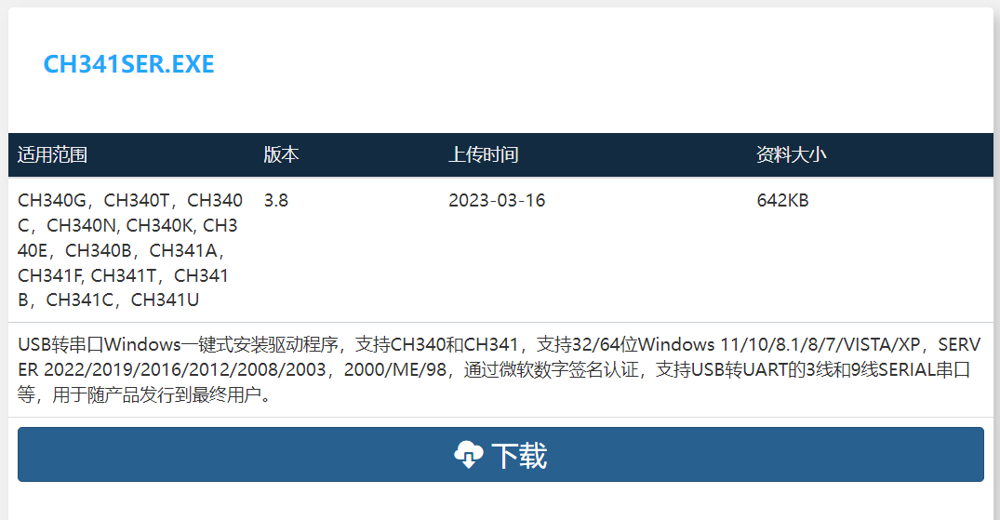

圖片說明：這是本頁第 1 張重點圖片，位於「1-3 NodeMCU-32S 驅動程式下載及安裝」相關內容中，主要用來輔助說明 1-3 NodeMCU-32S 驅動程式下載及安裝 程式下載及除錯我們需要透過電腦與 NodeMCU-32S 間的連線，其連線使用。

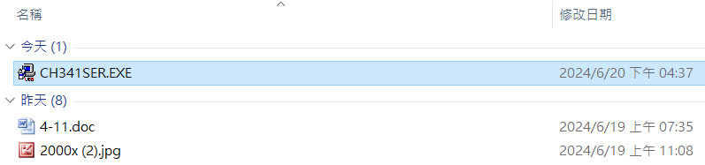

圖片說明：這是本頁第 2 張重點圖片，位於「1-3 NodeMCU-32S 驅動程式下載及安裝」相關內容中，主要用來輔助說明 1-3 NodeMCU-32S 驅動程式下載及安裝 程式下載及除錯我們需要透過電腦與 NodeMCU-32S 間的連線，其連線使用。

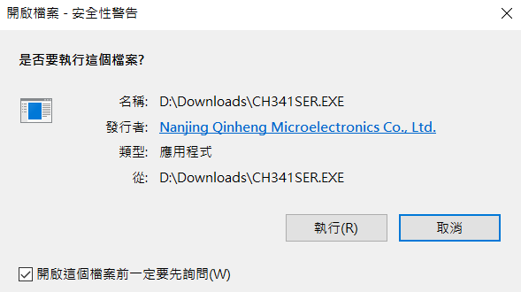

圖片說明：這是本頁第 3 張重點圖片，位於「1-3 NodeMCU-32S 驅動程式下載及安裝」相關內容中，主要用來輔助說明 1-3 NodeMCU-32S 驅動程式下載及安裝 程式下載及除錯我們需要透過電腦與 NodeMCU-32S 間的連線，其連線使用。

## 第 8 頁

步驟 5：跳出提示視窗，提示驅動程式安裝完成，接著點選「確定」，關閉安裝
視窗。
步驟 6：取出 NodeMCU-32S 及 EZ Start Kit，在 EZ Start Kit 的 USB 插槽上插入 USB
線，另一頭插在電腦的 USB 插槽。
步驟 7：在 NodeMCU-32S 的 USB 插槽上也插入 USB 線，另一頭插在電腦的 USB
插槽。

### 圖片

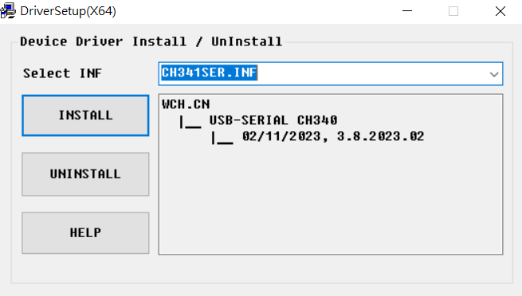

圖片說明：這是本頁第 1 張重點圖片，位於「步驟 5：跳出提示視窗，提示驅動程式安裝完成，接著點選「確定」，關閉安裝」相關內容中，主要用來輔助說明 步驟 5：跳出提示視窗，提示驅動程式安裝完成，接著點選「確定」，關閉安裝 步驟 6：取出 NodeMCU-32S 及 EZ Start Kit，在 EZ Start Kit 的 U。

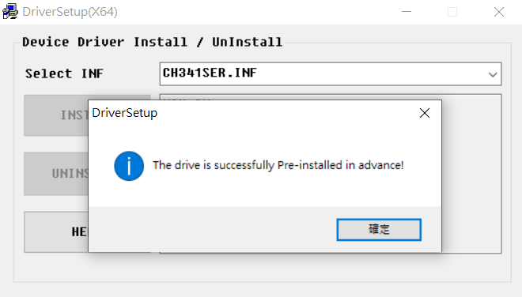

圖片說明：這是本頁第 2 張重點圖片，位於「步驟 5：跳出提示視窗，提示驅動程式安裝完成，接著點選「確定」，關閉安裝」相關內容中，主要用來輔助說明 步驟 5：跳出提示視窗，提示驅動程式安裝完成，接著點選「確定」，關閉安裝 步驟 6：取出 NodeMCU-32S 及 EZ Start Kit，在 EZ Start Kit 的 U。

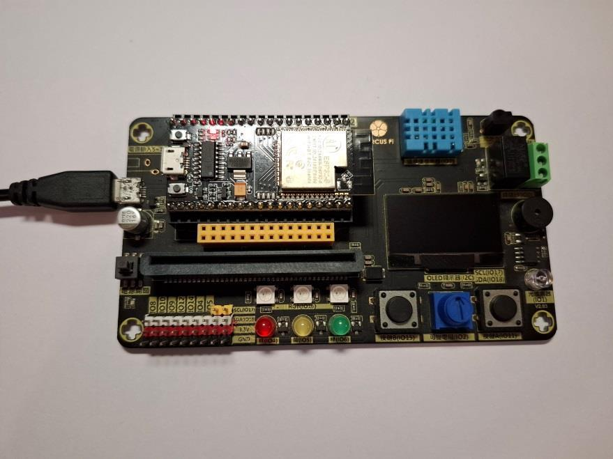

圖片說明：這是本頁第 3 張重點圖片，位於「步驟 5：跳出提示視窗，提示驅動程式安裝完成，接著點選「確定」，關閉安裝」相關內容中，主要用來輔助說明 步驟 5：跳出提示視窗，提示驅動程式安裝完成，接著點選「確定」，關閉安裝 步驟 6：取出 NodeMCU-32S 及 EZ Start Kit，在 EZ Start Kit 的 U。

## 第 9 頁

步驟 8：將滑鼠移到在 Windows 工具列的開始 ，按滑鼠右鍵，接著點選「裝
置管理員」。
步驟 9：點選通訊埠(COM 和 LPT)右邊的「箭頭」。

### 圖片

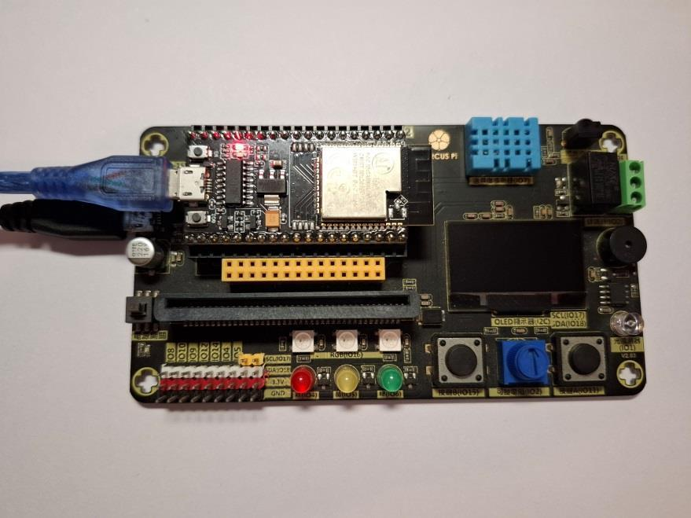

圖片說明：這是本頁第 1 張重點圖片，位於「步驟 8：將滑鼠移到在 Windows 工具列的開始 ，按滑鼠右鍵，接著點選「裝」相關內容中，主要用來輔助說明 步驟 8：將滑鼠移到在 Windows 工具列的開始 ，按滑鼠右鍵，接著點選「裝 步驟 9：點選通訊埠(COM 和 LPT)右邊的「箭頭」。

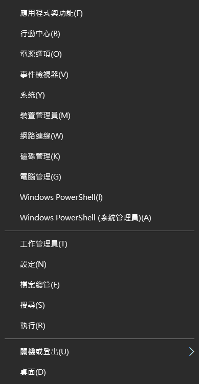

圖片說明：這是本頁第 2 張重點圖片，位於「步驟 8：將滑鼠移到在 Windows 工具列的開始 ，按滑鼠右鍵，接著點選「裝」相關內容中，主要用來輔助說明 步驟 8：將滑鼠移到在 Windows 工具列的開始 ，按滑鼠右鍵，接著點選「裝 步驟 9：點選通訊埠(COM 和 LPT)右邊的「箭頭」。

## 第 10 頁

步驟 10：看到 USB-SERIAL CH340(COMX)，表示驅動程式安裝正確，USB 連線正
確，此處以 COM3 為範例，接下來準備安裝 BlocklyDuino，開始寫程式。

### 圖片

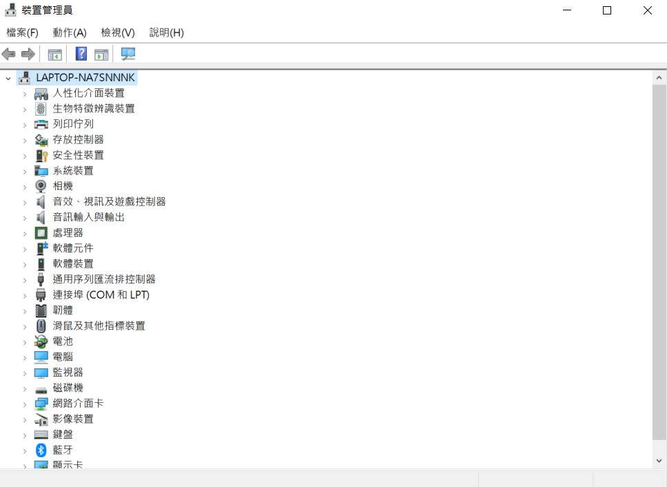

圖片說明：這是本頁第 1 張重點圖片，位於「步驟 10：看到 USB-SERIAL CH340(COMX)，表示驅動程式安裝正確，USB 連線正」相關內容中，主要用來輔助說明 步驟 10：看到 USB-SERIAL CH340(COMX)，表示驅動程式安裝正確，USB 連線正 確，此處以 COM3 為範例，接下來準備安裝 BlocklyDuino，開始寫。

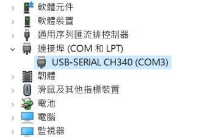

圖片說明：這是本頁第 2 張重點圖片，位於「步驟 10：看到 USB-SERIAL CH340(COMX)，表示驅動程式安裝正確，USB 連線正」相關內容中，主要用來輔助說明 步驟 10：看到 USB-SERIAL CH340(COMX)，表示驅動程式安裝正確，USB 連線正 確，此處以 COM3 為範例，接下來準備安裝 BlocklyDuino，開始寫。

## 第 11 頁

1-4 BlocklyDuino 下載及安裝
圖形化程式語言也就是我們平常所說的積木程式 ， 其簡單易學 ， 任何年齡層
都能輕鬆上手，所以深受創客們的喜愛，同樣地，在學校的教學中，積木程式也
可以讓任何學習階段的孩子輕鬆入門，本書使用 BlocklyDuino 做為積木程式的開
發環境 ，讓使用者輕鬆入門程式設計 ，在面對物聯網及人工智慧的複雜概念時，
也能用 BlocklyDuino 的積木程式輕鬆建立你的創意作品。
BlocklyDuino 由聯發科技公司修改 Google Blockly 發展而成的自由軟體，目前
由退休教師劉正吉老師及鳳山國中傅仲儀老師維護及更新，BlocklyDuino 下載超
連結為：
https://drive.google.com/drive/folders/1FizimTpWh6PhsD6qNA5MPQnHxEZ9vS5d
以下說明 BlocklyDuino 的下載及安裝步驟：
步驟 1：進入下載網站後，請下載主程式 BlocklyduinoF2.zip 及更新檔
BlocklyduinoF2_update_xxxxxxxx.zip。
步驟 2：將兩個檔案下載並解壓縮，可以得到兩個資料夾。
步驟 3：將 BlocklyDuinoF2 資料夾移到 C 磁碟機或 D 磁碟機的根目錄，此處以 D
磁碟機的根目錄為例。

### 圖片

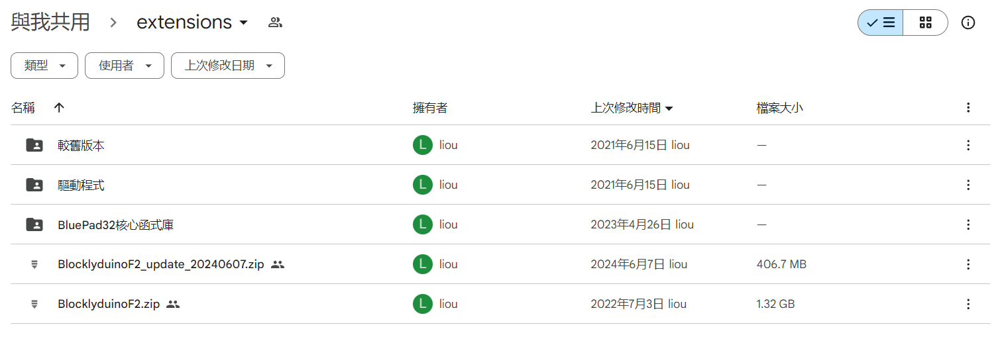

圖片說明：這是本頁第 1 張重點圖片，位於「1-4 BlocklyDuino 下載及安裝」相關內容中，主要用來輔助說明 1-4 BlocklyDuino 下載及安裝 圖形化程式語言也就是我們平常所說的積木程式 ， 其簡單易學 ， 任何年齡層。

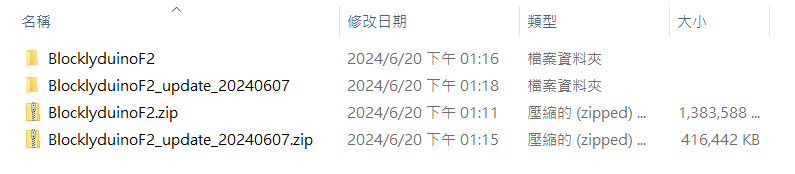

圖片說明：這是本頁第 2 張重點圖片，位於「1-4 BlocklyDuino 下載及安裝」相關內容中，主要用來輔助說明 1-4 BlocklyDuino 下載及安裝 圖形化程式語言也就是我們平常所說的積木程式 ， 其簡單易學 ， 任何年齡層。

## 第 12 頁

步驟 4：打開 BlocklyduinoF2_update_xxxxxxxx 資料夾，此處以
BlocklyduinoF2_update_20240607 為例，將資料夾中的全部檔案複製到 D 磁碟機
的 BlocklyduinoF2 資料夾中。
步驟 5：打開 BlocklyduinoF2 資料夾，使用滑鼠左鍵點選「BlocklyDuino.exe」，接
著在 BlocklyDuino.exe 上按滑鼠右鍵。

### 圖片

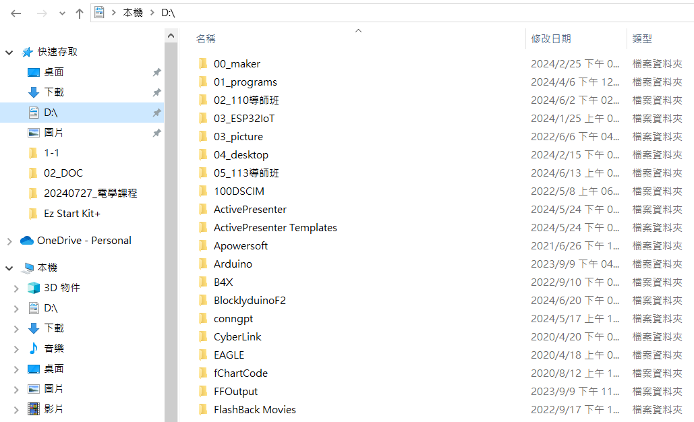

圖片說明：這是本頁第 1 張重點圖片，位於「步驟 4：打開 BlocklyduinoF2_update_xxxxxxxx 資料夾，此處以」相關內容中，主要用來輔助說明 步驟 4：打開 BlocklyduinoF2_update_xxxxxxxx 資料夾，此處以 BlocklyduinoF2_update_20240607 為例，將資料夾中的全部檔。

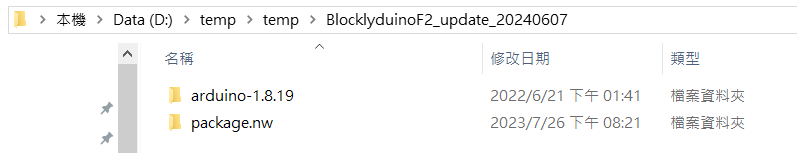

圖片說明：這是本頁第 2 張重點圖片，位於「步驟 4：打開 BlocklyduinoF2_update_xxxxxxxx 資料夾，此處以」相關內容中，主要用來輔助說明 步驟 4：打開 BlocklyduinoF2_update_xxxxxxxx 資料夾，此處以 BlocklyduinoF2_update_20240607 為例，將資料夾中的全部檔。

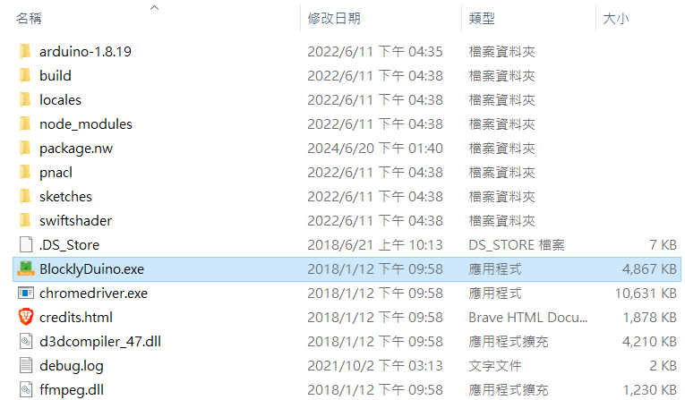

圖片說明：這是本頁第 3 張重點圖片，位於「步驟 4：打開 BlocklyduinoF2_update_xxxxxxxx 資料夾，此處以」相關內容中，主要用來輔助說明 步驟 4：打開 BlocklyduinoF2_update_xxxxxxxx 資料夾，此處以 BlocklyduinoF2_update_20240607 為例，將資料夾中的全部檔。

## 第 13 頁

步驟 6：將滑鼠移至「傳送到」，再點選彈出視窗中的「桌面(建立捷徑)」，在桌
面建立捷徑，方便後續使用。
步驟 7：在桌面找到 捷徑後，點選該「捷徑」，即可看到 BlocklyDuino 啟動
畫面。

### 圖片

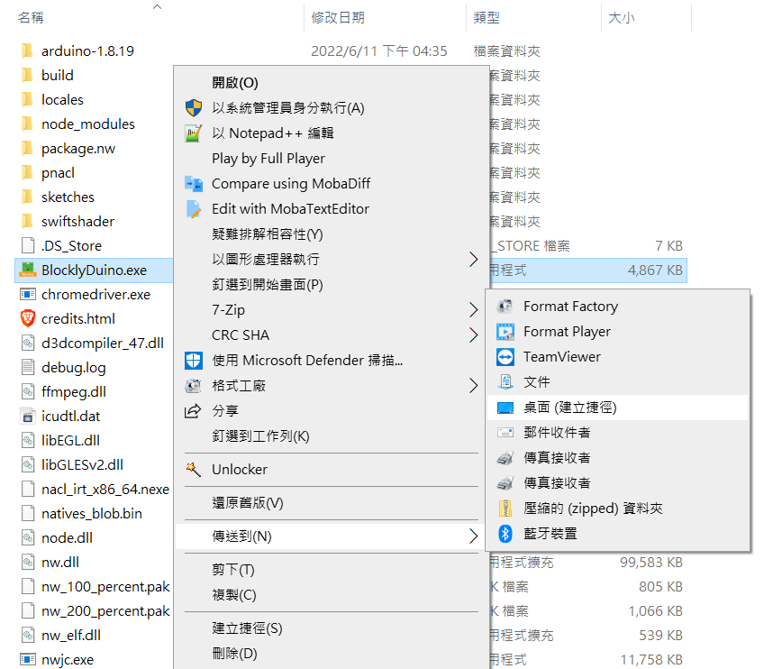

圖片說明：這是本頁第 1 張重點圖片，位於「步驟 6：將滑鼠移至「傳送到」，再點選彈出視窗中的「桌面(建立捷徑)」，在桌」相關內容中，主要用來輔助說明 步驟 6：將滑鼠移至「傳送到」，再點選彈出視窗中的「桌面(建立捷徑)」，在桌 面建立捷徑，方便後續使用。

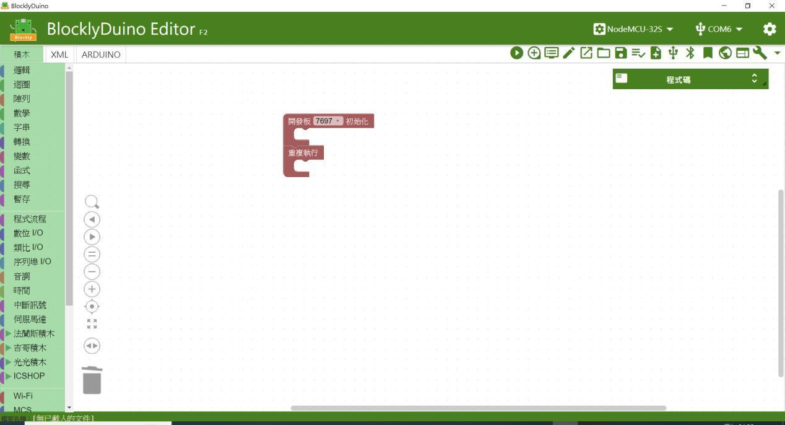

圖片說明：這是本頁第 2 張重點圖片，位於「步驟 6：將滑鼠移至「傳送到」，再點選彈出視窗中的「桌面(建立捷徑)」，在桌」相關內容中，主要用來輔助說明 步驟 6：將滑鼠移至「傳送到」，再點選彈出視窗中的「桌面(建立捷徑)」，在桌 面建立捷徑，方便後續使用。

## 第 14 頁

1-5 BlocklyDuino 功能介紹
經過 1-4 節的安裝，接下來我們要好好認識安裝好的成果，點選桌面上
「BlocklyDuino 捷徑」 ，即可看到BlocklyDuino 啟動的畫面，如圖 1-6 所示。
圖 1-6 BlocklyDuino 編輯畫面
圖 1-6 中 BlocklyDuino 各區說明如下：
1. 積木選單區：程式積木的主選單，點選選單中的項目，即可彈出程式積木或
子選單，供使用者選用。
2. 程式編輯區：程式積木的編輯區域，可將程式積木拖曳至此區進行編輯。
3. 開發版設定：選擇使用的開發版。
4. 序列埠設定：選擇燒錄序列埠編號。
5. 操作介面設定 ： 可設定使用語言 、ESP32 版本 、Arduino IDE 版本 、 自動儲存。
6. 工具列 ： 各式功能工具按鈕的區域 ， 其功能有下載程式、 啟動序列埠視窗等，
後續會有詳細說明。
7. 文字程式碼區：即時顯示積木程式所對應的文字程式，此區域可放大及縮
小。
8. 版本顯示：顯示 BlocklyDuino 版本，目前最新版本為 F2。
9. 積木程式與文字程式切換：積木型程式與所對應文字型程式的顯示切換。
10. 積木與 XML 程式切換：積木與所對應 XML 程式程式的顯示切換。
11. 積木顯示設定：設定程式編輯區的積木顯示，有放大、縮小等功能。
12. 垃圾桶：將程式積木拖曳至此區，即可刪除程式積木。
13. 檔案狀態：顯示目前存檔或開啟的檔案名稱。
1
2
3
5
7
11
13
4
6
8
9
10
12

### 圖片

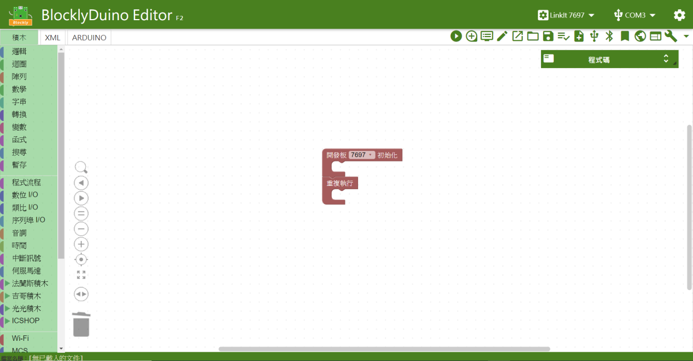

圖片說明：此圖對應「BlocklyDuino 編輯畫面」，位於「1-5 BlocklyDuino 功能介紹」相關內容中，主要用來輔助說明 1-5 BlocklyDuino 功能介紹 經過 1-4 節的安裝，接下來我們要好好認識安裝好的成果，點選桌面上。

## 第 15 頁

工具列各個按鈕的功能說明如下：
下載程式
啟動序列埠
視窗
文字程式區
顯示切換
新建程式
儲存檔案
開啟檔案
啟動
Arduino IDE
積木選單
顯示設定
新增
自訂積木
啟動網頁
序列埠視窗
啟動藍牙
序列埠視窗
啟動 MQTT
網頁
啟動網頁版
BlocklyDuino
啟動
SpBlocklyJS
啟動 SpBlockly
工具
另存新檔

### 圖片

圖片說明：這是本頁第 1 張重點圖片，位於「工具列各個按鈕的功能說明如下：」相關內容中，主要用來輔助說明 工具列各個按鈕的功能說明如下： Arduino IDE。

## 第 16 頁

1-6 撰寫第一個程式
本節以 NodeMCU-32S 內建 LED 閃爍為例，一步一步示範 BlocklyDuino 程式
的撰寫過程。
首先依 1-3 節安裝 NodeMCU-32S 驅動程式， 並取出NodeMCU-32S 及 EZ Start，
以 USB 線連接電腦 ， 再來檢查裝置管理員中的連接埠 ， 記下序列埠的COM 編號，
本範例的 COM 編號為 COM3，如圖 1-7 所示。
圖 1-7 連接埠 COM 編號
接著在桌面找到 捷徑後，點選該「捷徑」，啟動 BlocklyDuino，開始撰
寫程式，程式撰寫步驟說明如下：。
步驟 1：點選工具列上「新建程式」，建立全新程式編輯區。
步驟 2：點選程式編輯區的初始化積木上的「三角箭頭」。
步驟 3：點選彈出視窗中「ESP32」，將開發板設定為 ESP32。

### 圖片

圖片說明：此圖對應「連接埠 COM 編號」，位於「1-6 撰寫第一個程式」相關內容中，主要用來輔助說明 1-6 撰寫第一個程式 本節以 NodeMCU-32S 內建 LED 閃爍為例，一步一步示範 BlocklyDuino 程式。

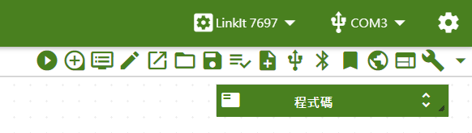

圖片說明：這是本頁第 2 張重點圖片，位於「1-6 撰寫第一個程式」相關內容中，主要用來輔助說明 1-6 撰寫第一個程式 本節以 NodeMCU-32S 內建 LED 閃爍為例，一步一步示範 BlocklyDuino 程式。

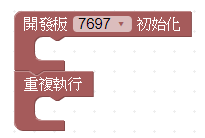

圖片說明：這是本頁第 3 張重點圖片，位於「1-6 撰寫第一個程式」相關內容中，主要用來輔助說明 1-6 撰寫第一個程式 本節以 NodeMCU-32S 內建 LED 閃爍為例，一步一步示範 BlocklyDuino 程式。

## 第 17 頁

步驟 4：點選積木選單中的「數位 I/O」，並將子選單中的內建 LED 狀態積木拖曳
到程式編輯區中。
步驟 5：將內建 LED 狀態積木拖曳到重複執行積木中。
步驟 6：點選積木選單中的「時間」，將子選單的延遲毫秒積木拖曳到程式編輯
區。

### 圖片

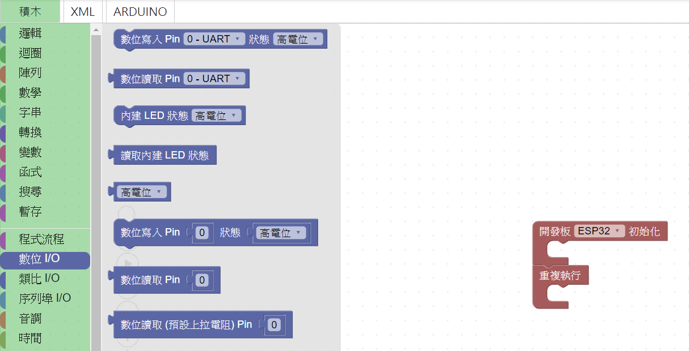

圖片說明：這是本頁第 1 張重點圖片，位於「步驟 4：點選積木選單中的「數位 I/O」，並將子選單中的內建 LED 狀態積木拖曳」相關內容中，主要用來輔助說明 步驟 4：點選積木選單中的「數位 I/O」，並將子選單中的內建 LED 狀態積木拖曳 步驟 5：將內建 LED 狀態積木拖曳到重複執行積木中。

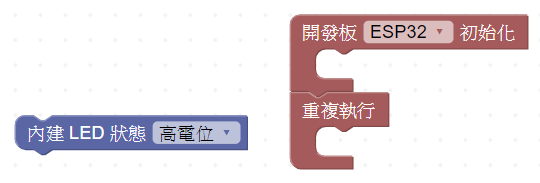

圖片說明：這是本頁第 2 張重點圖片，位於「步驟 4：點選積木選單中的「數位 I/O」，並將子選單中的內建 LED 狀態積木拖曳」相關內容中，主要用來輔助說明 步驟 4：點選積木選單中的「數位 I/O」，並將子選單中的內建 LED 狀態積木拖曳 步驟 5：將內建 LED 狀態積木拖曳到重複執行積木中。

## 第 18 頁

步驟 7：將延遲毫秒積木放到重複執行積木中內建 LED 狀態積木的下方。
步驟 8：將滑鼠移到程式編輯區中內建 LED 狀態積木上，按滑鼠右鍵，點選彈出
視窗中的「複製」，把內建 LED 狀態積木複製到程式編輯區中。

### 圖片

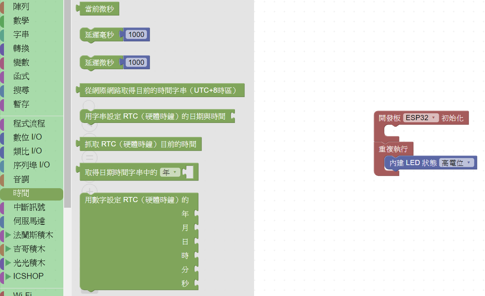

圖片說明：這是本頁第 1 張重點圖片，位於「步驟 7：將延遲毫秒積木放到重複執行積木中內建 LED 狀態積木的下方。」相關內容中，主要用來輔助說明 步驟 7：將延遲毫秒積木放到重複執行積木中內建 LED 狀態積木的下方。 步驟 8：將滑鼠移到程式編輯區中內建 LED 狀態積木上，按滑鼠右鍵，點選彈出。

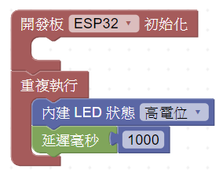

圖片說明：這是本頁第 2 張重點圖片，位於「步驟 7：將延遲毫秒積木放到重複執行積木中內建 LED 狀態積木的下方。」相關內容中，主要用來輔助說明 步驟 7：將延遲毫秒積木放到重複執行積木中內建 LED 狀態積木的下方。 步驟 8：將滑鼠移到程式編輯區中內建 LED 狀態積木上，按滑鼠右鍵，點選彈出。

## 第 19 頁

步驟 9：將複製完成的積木拖曳到延遲毫秒積木的下方。
步驟 10：點選內建 LED 狀態積木上的「三角箭頭」，接著點選彈出視窗中的「低
電位」，把內建 LED 狀態積木的高電位調整成低電位。

### 圖片

圖片說明：這是本頁第 1 張重點圖片，位於「步驟 9：將複製完成的積木拖曳到延遲毫秒積木的下方。」相關內容中，主要用來輔助說明 步驟 9：將複製完成的積木拖曳到延遲毫秒積木的下方。 步驟 10：點選內建 LED 狀態積木上的「三角箭頭」，接著點選彈出視窗中的「低。

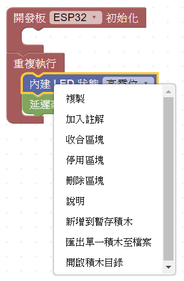

圖片說明：這是本頁第 2 張重點圖片，位於「步驟 9：將複製完成的積木拖曳到延遲毫秒積木的下方。」相關內容中，主要用來輔助說明 步驟 9：將複製完成的積木拖曳到延遲毫秒積木的下方。 步驟 10：點選內建 LED 狀態積木上的「三角箭頭」，接著點選彈出視窗中的「低。

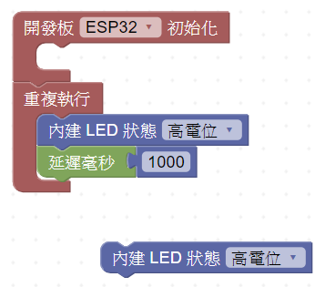

圖片說明：這是本頁第 3 張重點圖片，位於「步驟 9：將複製完成的積木拖曳到延遲毫秒積木的下方。」相關內容中，主要用來輔助說明 步驟 9：將複製完成的積木拖曳到延遲毫秒積木的下方。 步驟 10：點選內建 LED 狀態積木上的「三角箭頭」，接著點選彈出視窗中的「低。

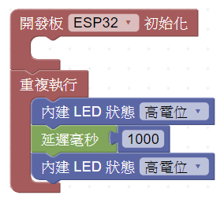

圖片說明：這是本頁第 4 張重點圖片，位於「步驟 9：將複製完成的積木拖曳到延遲毫秒積木的下方。」相關內容中，主要用來輔助說明 步驟 9：將複製完成的積木拖曳到延遲毫秒積木的下方。 步驟 10：點選內建 LED 狀態積木上的「三角箭頭」，接著點選彈出視窗中的「低。

## 第 20 頁

步驟 11：使用步驟 8 及步驟 9 的複製方式，複製延遲毫秒積木，並將該積木放
在第二個內建 LED 狀態積木的下方。
步驟 12：程式寫完後，要先儲存程式檔案，點選工具列上的「另存新檔」，
步驟 13：點選彈出視窗中的「另存新檔」。
步驟 14：選擇存檔的資料夾，此處以「Chapter01」為例，接著點選「確定」。

### 圖片

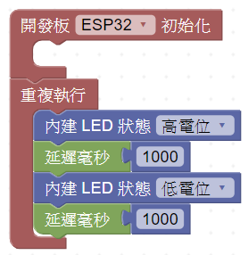

圖片說明：這是本頁第 1 張重點圖片，位於「步驟 11：使用步驟 8 及步驟 9 的複製方式，複製延遲毫秒積木，並將該積木放」相關內容中，主要用來輔助說明 步驟 11：使用步驟 8 及步驟 9 的複製方式，複製延遲毫秒積木，並將該積木放 在第二個內建 LED 狀態積木的下方。

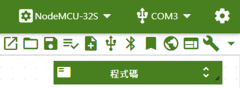

圖片說明：這是本頁第 2 張重點圖片，位於「步驟 11：使用步驟 8 及步驟 9 的複製方式，複製延遲毫秒積木，並將該積木放」相關內容中，主要用來輔助說明 步驟 11：使用步驟 8 及步驟 9 的複製方式，複製延遲毫秒積木，並將該積木放 在第二個內建 LED 狀態積木的下方。

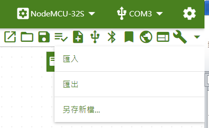

圖片說明：這是本頁第 3 張重點圖片，位於「步驟 11：使用步驟 8 及步驟 9 的複製方式，複製延遲毫秒積木，並將該積木放」相關內容中，主要用來輔助說明 步驟 11：使用步驟 8 及步驟 9 的複製方式，複製延遲毫秒積木，並將該積木放 在第二個內建 LED 狀態積木的下方。

## 第 21 頁

步驟 15：在檔案名稱中輸入”Ch1_1”，接著點選「OK」。
步驟 16：程式儲存完成後，接著要設定工具列上開發板及 COM 編號，點選工具
列上的開發板設定的「三角箭頭」。
步驟 17：點選彈出視窗中的 NodeMCU-32S，把開發板設定為 NodeMCU-32S。

### 圖片

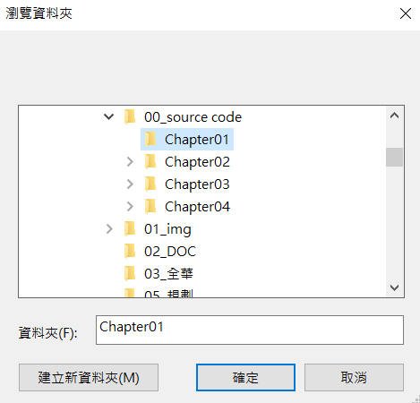

圖片說明：這是本頁第 1 張重點圖片，位於「步驟 15：在檔案名稱中輸入”Ch1_1”，接著點選「OK」。」相關內容中，主要用來輔助說明 步驟 15：在檔案名稱中輸入”Ch1_1”，接著點選「OK」。 步驟 16：程式儲存完成後，接著要設定工具列上開發板及 COM 編號，點選工具。

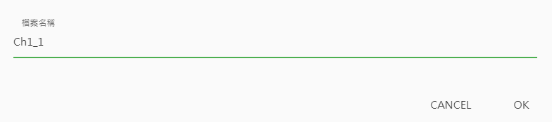

圖片說明：這是本頁第 2 張重點圖片，位於「步驟 15：在檔案名稱中輸入”Ch1_1”，接著點選「OK」。」相關內容中，主要用來輔助說明 步驟 15：在檔案名稱中輸入”Ch1_1”，接著點選「OK」。 步驟 16：程式儲存完成後，接著要設定工具列上開發板及 COM 編號，點選工具。

圖片說明：這是本頁第 3 張重點圖片，位於「步驟 15：在檔案名稱中輸入”Ch1_1”，接著點選「OK」。」相關內容中，主要用來輔助說明 步驟 15：在檔案名稱中輸入”Ch1_1”，接著點選「OK」。 步驟 16：程式儲存完成後，接著要設定工具列上開發板及 COM 編號，點選工具。

## 第 22 頁

步驟 18： 點選工具列上COM 編號的「三角箭頭」， 接著點選彈出視窗中的「COM3」，
完成設定 COM 的編號。
步驟 19：點選工具列上的「下載程式」，準備把程式透過 COM3 下載到
NodeMCU-32S。
步驟 20：點選彈出視窗中的「下載」，將程式做編譯並下載到 NodeMCU-32S。

### 圖片

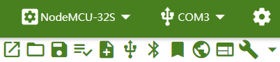

圖片說明：這是本頁第 1 張重點圖片，位於「步驟 18： 點選工具列上COM 編號的「三角箭頭」， 接著點選彈出視窗中的「COM3」，」相關內容中，主要用來輔助說明 步驟 18： 點選工具列上COM 編號的「三角箭頭」， 接著點選彈出視窗中的「COM3」， 完成設定 COM 的編號。

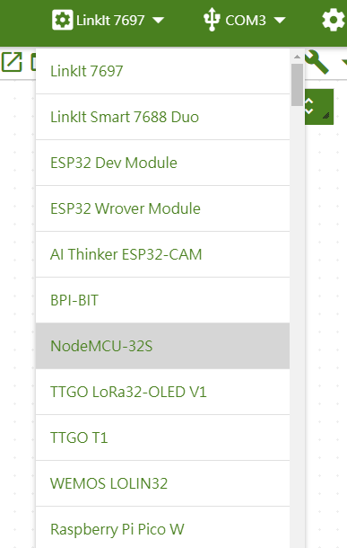

圖片說明：這是本頁第 2 張重點圖片，位於「步驟 18： 點選工具列上COM 編號的「三角箭頭」， 接著點選彈出視窗中的「COM3」，」相關內容中，主要用來輔助說明 步驟 18： 點選工具列上COM 編號的「三角箭頭」， 接著點選彈出視窗中的「COM3」， 完成設定 COM 的編號。

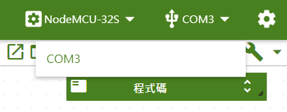

圖片說明：這是本頁第 3 張重點圖片，位於「步驟 18： 點選工具列上COM 編號的「三角箭頭」， 接著點選彈出視窗中的「COM3」，」相關內容中，主要用來輔助說明 步驟 18： 點選工具列上COM 編號的「三角箭頭」， 接著點選彈出視窗中的「COM3」， 完成設定 COM 的編號。

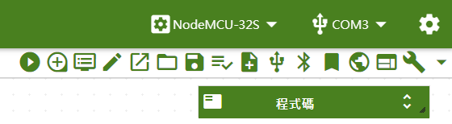

圖片說明：這是本頁第 4 張重點圖片，位於「步驟 18： 點選工具列上COM 編號的「三角箭頭」， 接著點選彈出視窗中的「COM3」，」相關內容中，主要用來輔助說明 步驟 18： 點選工具列上COM 編號的「三角箭頭」， 接著點選彈出視窗中的「COM3」， 完成設定 COM 的編號。

## 第 23 頁

步驟 21：看到下載視窗中沒有錯誤訊息並顯示 Finish，表示下載完成，可以點選
「關閉」。

### 圖片

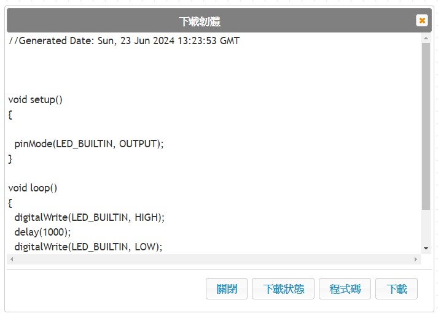

圖片說明：這是本頁第 1 張重點圖片，位於「步驟 21：看到下載視窗中沒有錯誤訊息並顯示 Finish，表示下載完成，可以點選」相關內容中，主要用來輔助說明 步驟 21：看到下載視窗中沒有錯誤訊息並顯示 Finish，表示下載完成，可以點選。

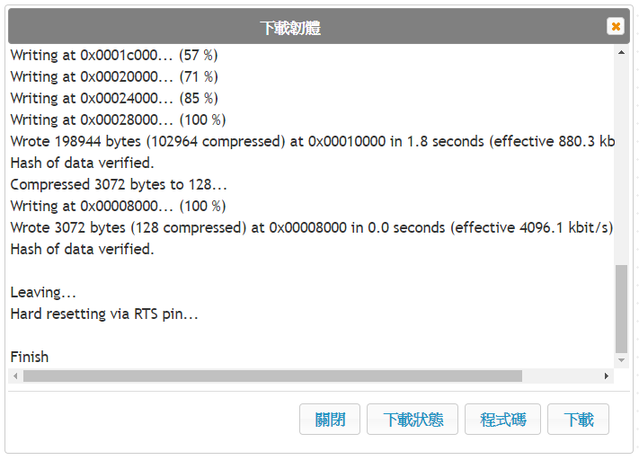

圖片說明：這是本頁第 2 張重點圖片，位於「步驟 21：看到下載視窗中沒有錯誤訊息並顯示 Finish，表示下載完成，可以點選」相關內容中，主要用來輔助說明 步驟 21：看到下載視窗中沒有錯誤訊息並顯示 Finish，表示下載完成，可以點選。

## 第 24 頁

步驟 22：觀察 NodeMCU-32S 的內建 LED，可以看到藍色 LED 一亮一滅。
步驟 23：最後點選工具列上「儲存程式」，再將程式儲存到檔案 Ch1_1。
範例程式檔案的使用方式
步驟 1：點選工具列上的「開啟檔案」。
步驟 2：在彈出視窗中點選範例程式的資料夾，此處以「Ch1_1」為例，接著點
選「確定」。

### 圖片

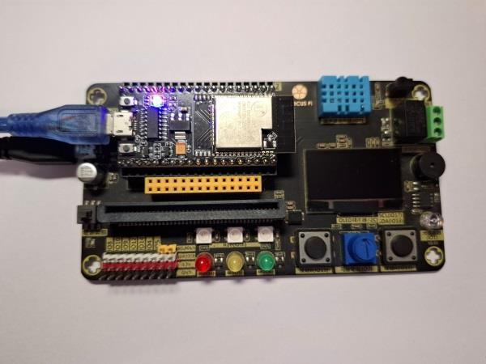

圖片說明：這是本頁第 1 張重點圖片，位於「步驟 22：觀察 NodeMCU-32S 的內建 LED，可以看到藍色 LED 一亮一滅。」相關內容中，主要用來輔助說明 步驟 22：觀察 NodeMCU-32S 的內建 LED，可以看到藍色 LED 一亮一滅。 步驟 23：最後點選工具列上「儲存程式」，再將程式儲存到檔案 Ch1_1。

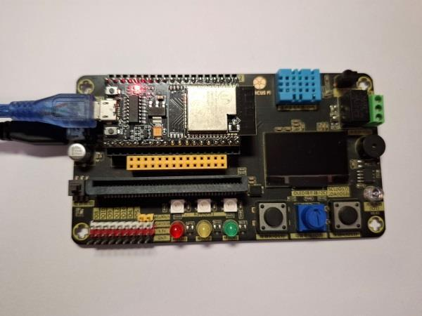

圖片說明：這是本頁第 2 張重點圖片，位於「步驟 22：觀察 NodeMCU-32S 的內建 LED，可以看到藍色 LED 一亮一滅。」相關內容中，主要用來輔助說明 步驟 22：觀察 NodeMCU-32S 的內建 LED，可以看到藍色 LED 一亮一滅。 步驟 23：最後點選工具列上「儲存程式」，再將程式儲存到檔案 Ch1_1。

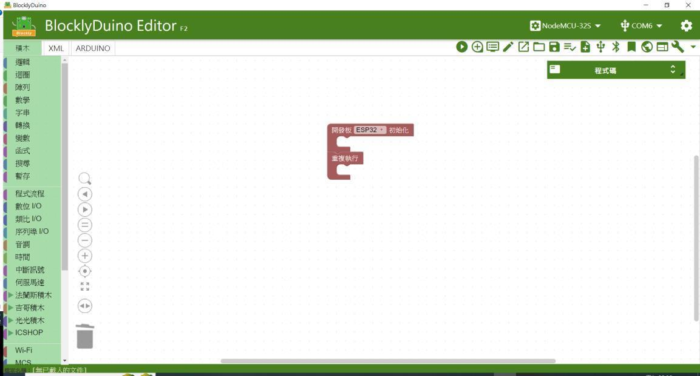

圖片說明：這是本頁第 3 張重點圖片，位於「步驟 22：觀察 NodeMCU-32S 的內建 LED，可以看到藍色 LED 一亮一滅。」相關內容中，主要用來輔助說明 步驟 22：觀察 NodeMCU-32S 的內建 LED，可以看到藍色 LED 一亮一滅。 步驟 23：最後點選工具列上「儲存程式」，再將程式儲存到檔案 Ch1_1。

## 第 25 頁

步驟 3：範例程式開啟在程式編輯區。

### 圖片

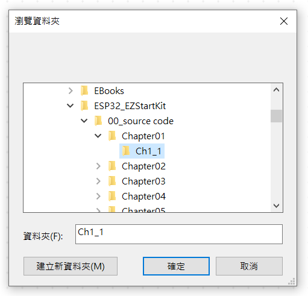

圖片說明：這是本頁第 1 張重點圖片，位於「步驟 3：範例程式開啟在程式編輯區。」相關內容中，主要用來輔助說明 步驟 3：範例程式開啟在程式編輯區。

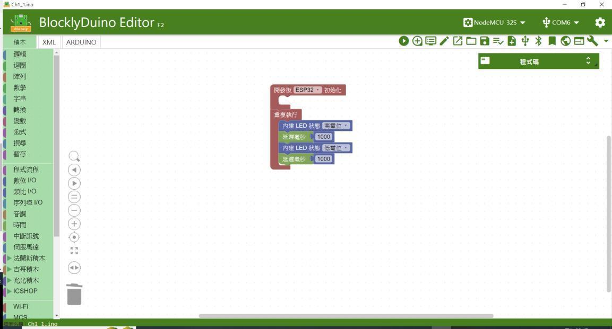

圖片說明：這是本頁第 2 張重點圖片，位於「步驟 3：範例程式開啟在程式編輯區。」相關內容中，主要用來輔助說明 步驟 3：範例程式開啟在程式編輯區。
