# Chapter02_基礎感測模組

## 第 1 頁

第二章 基本感測模組
2-1 LED 控制
2-2 按鈕開關控制 LED
2-3 呼吸燈控制
2-4 可變電阻與光感測器

## 第 2 頁

2-1 LED 控制
LED 模組是最常用的顯示模組，可藉由 LED 是否發亮顯示不同狀態，其主要
由 LED(light-emitting diode)所組成 ，LED 有兩隻接腳 ， 長腳叫做陽極 ， 短腳叫陰極，
如圖 2-1，當長腳接上正電壓，短腳接上負電壓時，LED 就會發亮，反接則不會
發亮，我們可使用 ESP32 接腳的輸出電壓，控制LED 的亮滅，LED 模組在 EZ Start
Kit 的位置如圖 2-2，有紅色、綠色及黃色 LED 各一顆。
圖 2-1 LED 圖 2-2 EZ Start Kit 中 LED 模組的位置
數位(digital)信號是指只有『0』與『1』兩種變化的信號，『0』 為低電位 ，『1』
為高電位，如圖 2-3 所示，當 LED 模組輸入高電位時，會產生『亮』的狀態，而
當 LED 模組輸入低電位時，則產生『滅』的狀態，如此會有兩種狀態的模組稱
為數位模組。
圖 2-3 數位信號波形
EZ Start Kit 共有三顆 LED，本節首先介紹單顆 LED 的控制，另外再介紹三顆
LED 的控制。
使用積木：
積木選單 積木 說明
法蘭斯積木/
I/O 引腳
數位輸出積木，功用為讓指定的
腳位輸出高電位或低電位。
時間
延遲毫秒積木，功用 為延遲時
間，其時間單位為毫秒，請注意
1000 毫秒 = 1 秒。

### 圖片

圖片說明：此圖對應「LED 圖 2-2 EZ Start Kit 中 LED 模組的位置」，位於「2-1 LED 控制」相關內容中，主要用來輔助說明 2-1 LED 控制 LED 模組是最常用的顯示模組，可藉由 LED 是否發亮顯示不同狀態，其主要。

圖片說明：此圖對應「數位信號波形」，位於「2-1 LED 控制」相關內容中，主要用來輔助說明 2-1 LED 控制 LED 模組是最常用的顯示模組，可藉由 LED 是否發亮顯示不同狀態，其主要。

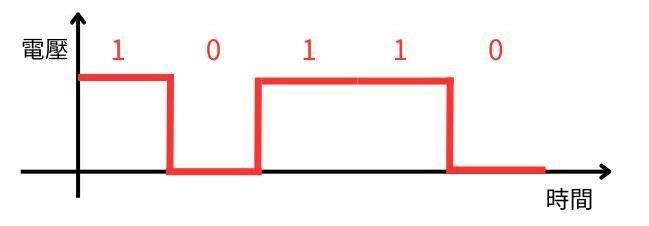

圖片說明：這是本頁第 3 張重點圖片，位於「2-1 LED 控制」相關內容中，主要用來輔助說明 2-1 LED 控制 LED 模組是最常用的顯示模組，可藉由 LED 是否發亮顯示不同狀態，其主要。

圖片說明：這是本頁第 4 張重點圖片，位於「2-1 LED 控制」相關內容中，主要用來輔助說明 2-1 LED 控制 LED 模組是最常用的顯示模組，可藉由 LED 是否發亮顯示不同狀態，其主要。

## 第 3 頁

使用元件及接腳：
元件名稱 IO 編號 實際接腳
紅色 LED IO4 GPIO16
黃色 LED IO5 GPIO12
綠色 LED IO6 GPIO13
積木程式 1—單顆 LED 控制：
程式說明 1：
1. 腳位 16 輸出高電位，讓接在腳位 16 的紅色 LED 發亮。
2. 延遲 1 秒。(1000 毫秒 = 1 秒)
3. 腳位 16 輸出低電位，讓接在腳位 16 的紅色 LED 熄滅。
4. 延遲 1 秒。
BlocklyDuino 程式的架構主要由兩個積木組成，也就是新建程式時會出現的
兩個程式積木 ， 分別是初始化積木及重複執行積木 ，當 BlocklyDuino 程式執行時，
首先會執行初始化積木中的程式 ，不過這些程式只會一次， 其目的要做初始化。
當初始化積木執行結束後 ， 會繼續執行重複執行積木中的程式 ， 而且會重複執行 ，
永遠不會停止，所以主要的程式會放在重複執行積木中。
圖 2-4 BlocklyDuino 程式主要架構積木
本範例所有積木程式都在重複執行積木中，程式中以腳位 16 輸出高電位，
範例程式：ch2_1_1
1
2
3
4

### 圖片

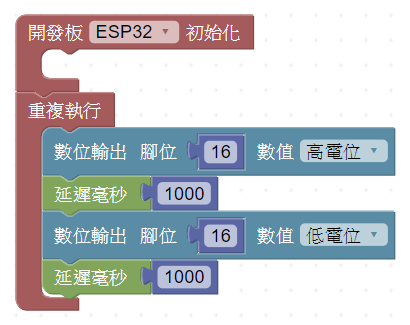

圖片說明：此圖對應「BlocklyDuino 程式主要架構積木」，位於「使用元件及接腳：」相關內容中，主要用來輔助說明 元件名稱 IO 編號 實際接腳 紅色 LED IO4 GPIO16。

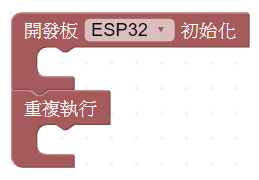

圖片說明：這是本頁第 2 張重點圖片，位於「使用元件及接腳：」相關內容中，主要用來輔助說明 元件名稱 IO 編號 實際接腳 紅色 LED IO4 GPIO16。

圖片說明：這是本頁第 3 張重點圖片，位於「使用元件及接腳：」相關內容中，主要用來輔助說明 元件名稱 IO 編號 實際接腳 紅色 LED IO4 GPIO16。

圖片說明：這是本頁第 4 張重點圖片，位於「使用元件及接腳：」相關內容中，主要用來輔助說明 元件名稱 IO 編號 實際接腳 紅色 LED IO4 GPIO16。

## 第 4 頁

因紅色 LED 接在腳位 16，所以紅色 LED 會發亮，接著延遲 1 秒，再讓腳位 16 輸
出低電位，讓 LED 滅，延遲 1 秒後，繼續重覆執行程式。
執行結果 1：
請注意！程式執行前要把 EZ Start Kit 的電源打開，其電源開關的位置如圖
2-5 所示。
圖 2-5 EZ Start Kit 電源開關
程式下載後立即開始執行，執行結果為 EZ Start Kit 的紅色 LED 發亮，如圖
2-6(a)所示，一秒後紅色 LED 滅掉，如圖 2-6(b)所示。
圖 2-6 紅色 LED 控制 (a)LED 變亮 (b)紅色 LED 變滅
積木程式 2—三顆 LED 控制：
(a)
(b)

### 圖片

圖片說明：此圖對應「EZ Start Kit 電源開關」，位於「2-5 所示。」相關內容中，主要用來輔助說明 因紅色 LED 接在腳位 16，所以紅色 LED 會發亮，接著延遲 1 秒，再讓腳位 16 輸 出低電位，讓 LED 滅，延遲 1 秒後，繼續重覆執行程式。

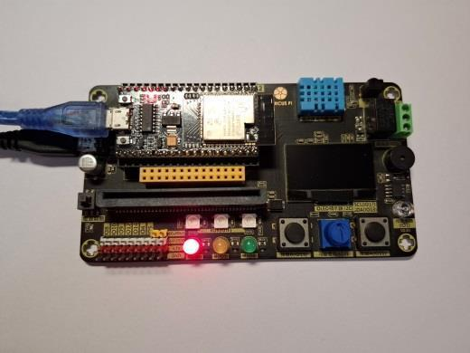

圖片說明：此圖對應「紅色 LED 控制 (a)LED 變亮 (b)紅色 LED 變滅」，位於「2-5 所示。」相關內容中，主要用來輔助說明 因紅色 LED 接在腳位 16，所以紅色 LED 會發亮，接著延遲 1 秒，再讓腳位 16 輸 出低電位，讓 LED 滅，延遲 1 秒後，繼續重覆執行程式。

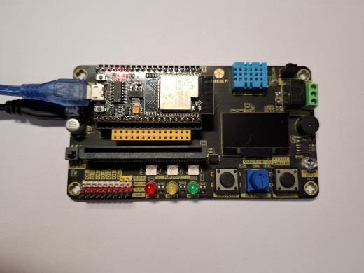

圖片說明：這是本頁第 3 張重點圖片，位於「2-5 所示。」相關內容中，主要用來輔助說明 因紅色 LED 接在腳位 16，所以紅色 LED 會發亮，接著延遲 1 秒，再讓腳位 16 輸 出低電位，讓 LED 滅，延遲 1 秒後，繼續重覆執行程式。

## 第 5 頁

程式說明 2：
1. 腳位 16 輸出高電位，讓接在腳位 16 的紅色 LED 發亮。
2. 腳位 12 輸出高電位，讓接在腳位 12 的黃色 LED 發亮。
3. 腳位 13 輸出高電位，讓接在腳位 13 的綠色 LED 發亮。
4. 延遲 1 秒。(1000 毫秒 = 1 秒)
5. 腳位 16 輸出低電位，讓接在腳位 16 的紅色 LED 熄滅。
6. 腳位 12 輸出高電位，讓接在腳位 12 的黃色 LED 熄滅。
7. 腳位 13 輸出高電位，讓接在腳位 13 的綠色 LED 熄滅。
8. 延遲 1 秒。
程式中首先分別讓腳位 16、腳位 12 及腳位 13 輸出高電位，讓接在腳位 16
的紅色 LED、腳位 12 的黃色 LED 以及腳位 13 的綠色 LED 發亮，延遲一秒後，再
讓讓腳位 16、腳位 12 及腳位 13 輸出低電位，讓三顆 LED 滅掉，延遲 1 秒後，
繼續重覆執行程式。
執行結果 2：
程式執行前務必要把 EZ Start Kit 的電源打開，程式執行後，EZ Start Kit
的紅色、黃色及綠色 LED 同時發亮，如圖 2-7(a)所示，一秒後三顆 LED 滅掉，如
圖 2-7(b)所示。
1
2
3
4
5
6
7
8
範例程式：ch2_1_2

### 圖片

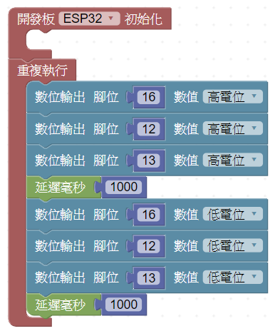

圖片說明：此圖對應「(b)所示。」，位於「程式說明 2：」相關內容中，主要用來輔助說明 1. 腳位 16 輸出高電位，讓接在腳位 16 的紅色 LED 發亮。 2. 腳位 12 輸出高電位，讓接在腳位 12 的黃色 LED 發亮。

圖片說明：這是本頁第 2 張重點圖片，位於「程式說明 2：」相關內容中，主要用來輔助說明 1. 腳位 16 輸出高電位，讓接在腳位 16 的紅色 LED 發亮。 2. 腳位 12 輸出高電位，讓接在腳位 12 的黃色 LED 發亮。

圖片說明：這是本頁第 3 張重點圖片，位於「程式說明 2：」相關內容中，主要用來輔助說明 1. 腳位 16 輸出高電位，讓接在腳位 16 的紅色 LED 發亮。 2. 腳位 12 輸出高電位，讓接在腳位 12 的黃色 LED 發亮。

## 第 6 頁

圖 2-7 三顆 LED 控制 (a)三顆 LED 同時亮 (b)三顆 LED 同時滅
延伸練習：
路口紅綠燈號誌的燈號顏色是紅、黃及綠色，請觀察燈號的變化，並設計程
式，使用紅色、黃色及綠色 LED 模擬路口紅綠燈號誌的運作。
(a)
(b)

### 圖片

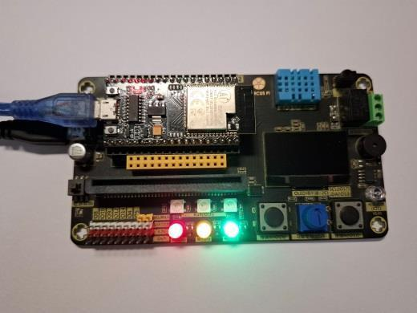

圖片說明：此圖對應「三顆 LED 控制 (a)三顆 LED 同時亮 (b)三顆 LED 同時滅」，位於「圖 2-7 三顆 LED 控制 (a)三顆 LED 同時亮 (b)三顆 LED 同時滅」相關內容中，主要用來輔助說明 路口紅綠燈號誌的燈號顏色是紅、黃及綠色，請觀察燈號的變化，並設計程 式，使用紅色、黃色及綠色 LED 模擬路口紅綠燈號誌的運作。

圖片說明：這是本頁第 2 張重點圖片，位於「圖 2-7 三顆 LED 控制 (a)三顆 LED 同時亮 (b)三顆 LED 同時滅」相關內容中，主要用來輔助說明 路口紅綠燈號誌的燈號顏色是紅、黃及綠色，請觀察燈號的變化，並設計程 式，使用紅色、黃色及綠色 LED 模擬路口紅綠燈號誌的運作。

## 第 7 頁

2-2 按鈕開關控制 LED
按鈕模組由按鈕開關所組成，如圖 2-8 所示，當按鈕按下時，其中的開關成
通路，可輸出『低電位』或『0』，當放開按鈕時其中的開關成斷路，可輸出『高
電位』或『1』，我們可使用按鈕模組作為 ESP32 的輸入，控制其他模組，例如控
制 LED 的亮滅，按鈕模組在 EZ Start Kit 的位置如圖 2-9，共有兩個按鈕模組，右
邊叫做按鍵 A，左邊叫做按鍵 B。
圖 2-8 按鈕開關 圖 2-9 EZ Start Kit 中按鈕模組的位置
一般而言，使用 ESP32 所設計的控制系統，如圖 2-12 所示，系統的運作方
式是由輸入模組提供輸入信號，當 ESP32 收到輸入信號後進行處理，處理後的結
果輸出給輸出模組，按鈕模組屬於輸入模組，又可稱為數位輸入模組，而 2-1 節
提到的 LED 模組屬於輸出模組，又可稱為數位輸出模組。
圖 2-10 控制系統方塊圖
在 1-6 節提到下載程式的 COM 埠又稱為序列埠(Serial Port)，其可提供電腦
與 ESP32 間的連線，如圖2-11 所示，該連線可以從電腦下載程式到ESP32，另外
還可以提供程式執行過程中，電腦與 ESP32 互相傳送資料資料。
當控制系統運作時，如圖 2-10 所示，我們無法得知 ESP32 內部的變化，只
能觀察輸出模組的變化，不過透過序列埠的連線，我們就可以讓電腦與ESP32 互
相傳送資料資料，如此久可以知道ESP32 內部產生的變化，同時也可以用來尋找
程式中的錯誤，本節後續會介紹使用程式中加入序列埠連線的方法。

### 圖片

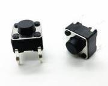

圖片說明：此圖對應「按鈕開關 圖 2-9 EZ Start Kit 中按鈕模組的位置」，位於「2-2 按鈕開關控制 LED」相關內容中，主要用來輔助說明 2-2 按鈕開關控制 LED 按鈕模組由按鈕開關所組成，如圖 2-8 所示，當按鈕按下時，其中的開關成。

圖片說明：此圖對應「控制系統方塊圖」，位於「2-2 按鈕開關控制 LED」相關內容中，主要用來輔助說明 2-2 按鈕開關控制 LED 按鈕模組由按鈕開關所組成，如圖 2-8 所示，當按鈕按下時，其中的開關成。

圖片說明：這是本頁第 3 張重點圖片，位於「2-2 按鈕開關控制 LED」相關內容中，主要用來輔助說明 2-2 按鈕開關控制 LED 按鈕模組由按鈕開關所組成，如圖 2-8 所示，當按鈕按下時，其中的開關成。

## 第 8 頁

圖 2-11 序列埠的連線
本節首先介紹透過序列埠連線 ， 將按鈕開關A 鍵的數值列印在電腦， 另外再
介紹使用按鈕開關 A 鍵控制 LED 的亮滅。
使用積木：
積木選單 積木 說明
序列埠 IO
序列埠初始化積木，功用為設定
序列埠的傳輸速度，一般會設定
115200(鮑率或位元/秒)。
序列埠 IO
序列埠印出 (換行)積木，功用 為
透過序列埠連線，將文字顯示在
電腦，顯示後會換行。
法蘭斯積木/
I/O 引腳
數位輸入積木 ， 功用為讀取 IO 腳
位的數值。
邏輯
如果積木，功用為如果條件參數
是正確，則做執行範圍中的積
木，如果如果條件參數是錯誤，
則做如果積木下方的程式。
邏輯
如果否則積木，功用為如果條件
參數是正確，則做執行範圍中的
積木，如果如果條件參數是錯
誤，則做否則範圍中的積木，本
積木需由如果積木修改而得。
邏輯
是否相等積木，功用為比較等號
兩邊是否相等，積木的參數為等
於，可調整為大於(>)、大於或等
於(≧)、小於 (<) 、 小 於 或 等 於
(≦)。
數學 數字積木，功用為產生數字。
使用元件及接腳：

### 圖片

圖片說明：此圖對應「序列埠的連線」，位於「圖 2-11 序列埠的連線」相關內容中，主要用來輔助說明 本節首先介紹透過序列埠連線 ， 將按鈕開關A 鍵的數值列印在電腦， 另外再 介紹使用按鈕開關 A 鍵控制 LED 的亮滅。

## 第 9 頁

元件名稱 IO 編號 實際接腳
紅色 LED IO4 GPIO16
黃色 LED IO5 GPIO12
綠色 LED IO6 GPIO13
按鈕 A IO11 GPIO5
按鈕 B IO15 GPIO36
積木程式 1—序列埠顯示 A 鍵的輸入值：
程式說明 1：
初始化部分：
1. 初始化序列埠連線，設定傳輸速度為 115200。
重複執行部分：
2. 將數位輸入接腳 5 的輸入數值列印在序列埠，列印後換行。
3. 延遲 100 毫秒(0.1 秒)。
在初始化中設定序列埠連線 ， 並設定其速度為115200(鮑率)， 讓電腦與ESP32
可以透過序列埠連線交換資料 。 在重複執行中首先讀取數位輸入接腳 5 的數值，
接腳 5 是連接 EZ Start Kit 的 A 鍵， 再透過序列埠印出積木 ， 將接腳5 所讀取的數
值列印在序列埠，我們可以在電腦上透過 BlocklyDuino 的序列埠監視視窗看到列
印的結果，列印完成後，等待 0.1 秒繼續重複讀取接腳 5 的數值並換行列印。
執行結果 1：
想在 BlocklyDuino 中要看到序列埠列印結果，需要啟動序列埠監視視窗，啟
動步驟說明如下：
步驟 1：點選工具列上啟動序列埠視窗。
步驟 2：彈出的序列埠監看視窗中，鮑率已自動設定為 115200，接著「點選開啟
範例程式：ch2_2_1
1
2
3

### 圖片

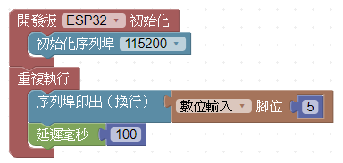

圖片說明：這是本頁第 1 張重點圖片，位於「元件名稱 IO 編號 實際接腳」相關內容中，主要用來輔助說明 元件名稱 IO 編號 實際接腳 紅色 LED IO4 GPIO16。

圖片說明：這是本頁第 2 張重點圖片，位於「元件名稱 IO 編號 實際接腳」相關內容中，主要用來輔助說明 元件名稱 IO 編號 實際接腳 紅色 LED IO4 GPIO16。

圖片說明：這是本頁第 3 張重點圖片，位於「元件名稱 IO 編號 實際接腳」相關內容中，主要用來輔助說明 元件名稱 IO 編號 實際接腳 紅色 LED IO4 GPIO16。

圖片說明：這是本頁第 4 張重點圖片，位於「元件名稱 IO 編號 實際接腳」相關內容中，主要用來輔助說明 元件名稱 IO 編號 實際接腳 紅色 LED IO4 GPIO16。

## 第 10 頁

PUTTY」。
步驟 3：查看開啟序列埠監看視窗。
程式下載完成後，啟動序列埠監看視窗，當按下A 鍵時，序列埠監看視窗中
顯示『0』，表示輸入為『低電位』 ，如圖2-12(a)及圖 2-12(b)所示。
圖 2-12 按鈕開關顯示數值 (a)按下 A 鍵時 (b)序列埠視窗顯示
當放開 A 鍵時，序列埠監看視窗中顯示『1』，表示輸入為『高電位』 ，如圖
2-13(a)及圖 2-13(b)所示。
(a)
(b)

### 圖片

圖片說明：此圖對應「按鈕開關顯示數值 (a)按下 A 鍵時 (b)序列埠視窗顯示」，位於「PUTTY」。」相關內容中，主要用來輔助說明 步驟 3：查看開啟序列埠監看視窗。 程式下載完成後，啟動序列埠監看視窗，當按下A 鍵時，序列埠監看視窗中。

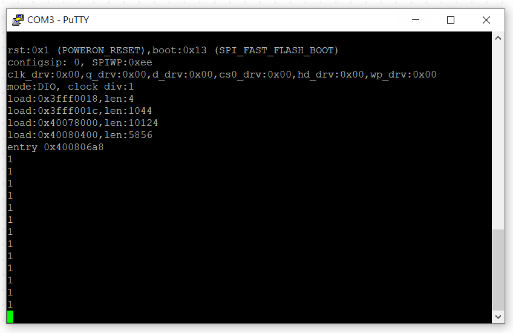

圖片說明：這是本頁第 2 張重點圖片，位於「PUTTY」。」相關內容中，主要用來輔助說明 步驟 3：查看開啟序列埠監看視窗。 程式下載完成後，啟動序列埠監看視窗，當按下A 鍵時，序列埠監看視窗中。

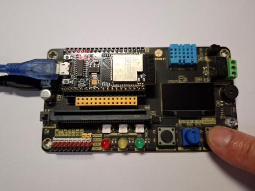

圖片說明：這是本頁第 3 張重點圖片，位於「PUTTY」。」相關內容中，主要用來輔助說明 步驟 3：查看開啟序列埠監看視窗。 程式下載完成後，啟動序列埠監看視窗，當按下A 鍵時，序列埠監看視窗中。

圖片說明：這是本頁第 4 張重點圖片，位於「PUTTY」。」相關內容中，主要用來輔助說明 步驟 3：查看開啟序列埠監看視窗。 程式下載完成後，啟動序列埠監看視窗，當按下A 鍵時，序列埠監看視窗中。

## 第 11 頁

圖 2-13 按鈕開關顯示數值 (a)放開 A 鍵時 序列埠視窗顯示
積木程式 2—按鈕開關控制 LED：
程式說明 2：
重複執行部分：
1. 判斷數位輸入腳位的輸入數值是否為 0，如果為 0，則執行積木 2，否則執行
積木 3。
2. 腳位 16 輸出高電位，讓接在腳位 16 的紅色 LED 發亮。
3. 腳位 16 輸出低電位，讓接在腳位 16 的紅色 LED 熄滅。
使用如果積木時 ， 只有如果與執行區域可拼其他積木 ， 新增否則區域的操作 ，
說明如下：
步驟 1：點選如果積木上的「齒輪符號」，接著會彈出新視窗。
1
2
3
範例程式：ch2_2_2
(a)
(b)

### 圖片

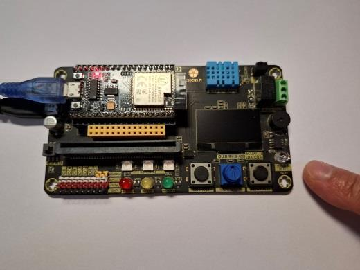

圖片說明：此圖對應「按鈕開關顯示數值 (a)放開 A 鍵時 序列埠視窗顯示」，位於「圖 2-13 按鈕開關顯示數值 (a)放開 A 鍵時 序列埠視窗顯示」相關內容中，主要用來輔助說明 積木程式 2—按鈕開關控制 LED： 1. 判斷數位輸入腳位的輸入數值是否為 0，如果為 0，則執行積木 2，否則執行。

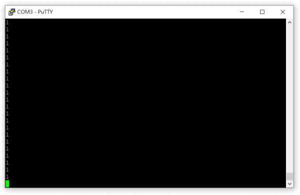

圖片說明：這是本頁第 2 張重點圖片，位於「圖 2-13 按鈕開關顯示數值 (a)放開 A 鍵時 序列埠視窗顯示」相關內容中，主要用來輔助說明 積木程式 2—按鈕開關控制 LED： 1. 判斷數位輸入腳位的輸入數值是否為 0，如果為 0，則執行積木 2，否則執行。

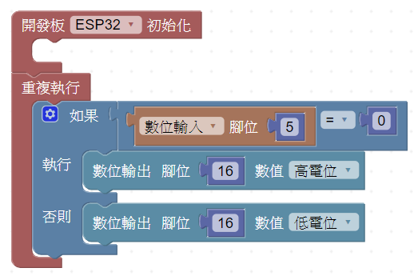

圖片說明：這是本頁第 3 張重點圖片，位於「圖 2-13 按鈕開關顯示數值 (a)放開 A 鍵時 序列埠視窗顯示」相關內容中，主要用來輔助說明 積木程式 2—按鈕開關控制 LED： 1. 判斷數位輸入腳位的輸入數值是否為 0，如果為 0，則執行積木 2，否則執行。

圖片說明：這是本頁第 4 張重點圖片，位於「圖 2-13 按鈕開關顯示數值 (a)放開 A 鍵時 序列埠視窗顯示」相關內容中，主要用來輔助說明 積木程式 2—按鈕開關控制 LED： 1. 判斷數位輸入腳位的輸入數值是否為 0，如果為 0，則執行積木 2，否則執行。

## 第 12 頁

步驟 2：將彈出視窗中左側的否則積木拖曳到右側如果積木的下方。
步驟 3：再次點選「齒輪符號」，收回彈出的視窗，即可得如果否則積木。
由範例程式 ch2_2_1 的執行結果可知 ， 當『按下 A 鍵』時 ， 開關的輸出為『0』，
當『放開 A 鍵』時 ， 開關的輸出為『1』，所以我們使用如果積木及是否相等積木，
判斷 A 鍵是否被按下，如果按下，則讓紅色 LED 發亮，否則讓 LED 變滅。
執行結果 2：
程式執行後 ，按下 EZ Start Kit 的 A 鍵 ， 則紅色LED 發亮 ， 如圖2-14(a)所示，
當放開 A 鍵，則紅色 LED 變滅，如圖 2-14(b)所示。

### 圖片

圖片說明：這是本頁第 1 張重點圖片，位於「步驟 2：將彈出視窗中左側的否則積木拖曳到右側如果積木的下方。」相關內容中，主要用來輔助說明 步驟 2：將彈出視窗中左側的否則積木拖曳到右側如果積木的下方。 步驟 3：再次點選「齒輪符號」，收回彈出的視窗，即可得如果否則積木。

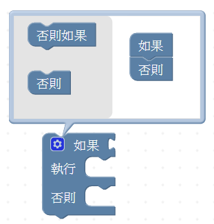

圖片說明：這是本頁第 2 張重點圖片，位於「步驟 2：將彈出視窗中左側的否則積木拖曳到右側如果積木的下方。」相關內容中，主要用來輔助說明 步驟 2：將彈出視窗中左側的否則積木拖曳到右側如果積木的下方。 步驟 3：再次點選「齒輪符號」，收回彈出的視窗，即可得如果否則積木。

圖片說明：這是本頁第 3 張重點圖片，位於「步驟 2：將彈出視窗中左側的否則積木拖曳到右側如果積木的下方。」相關內容中，主要用來輔助說明 步驟 2：將彈出視窗中左側的否則積木拖曳到右側如果積木的下方。 步驟 3：再次點選「齒輪符號」，收回彈出的視窗，即可得如果否則積木。

## 第 13 頁

圖 2-14 按鈕開關控制 LED (a) 按下 A 鍵的結果 放開 A 鍵的結果
延伸練習：
家中常見兩個開關控制一盞電燈，請使用兩個按鈕開關及一顆 LED，模擬開
關控制電燈，當 A 鍵及 B 鍵同時按下時，紅色 LED 才會亮起，其餘情況紅色 LED
都不會亮。
(a)
(b)

### 圖片

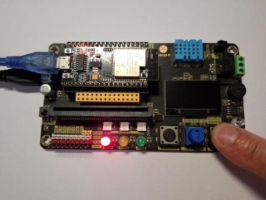

圖片說明：此圖對應「按鈕開關控制 LED (a) 按下 A 鍵的結果 放開 A 鍵的結果」，位於「圖 2-14 按鈕開關控制 LED (a) 按下 A 鍵的結果 放開 A 鍵的結果」相關內容中，主要用來輔助說明 家中常見兩個開關控制一盞電燈，請使用兩個按鈕開關及一顆 LED，模擬開 關控制電燈，當 A 鍵及 B 鍵同時按下時，紅色 LED 才會亮起，其餘情況紅色 LED。

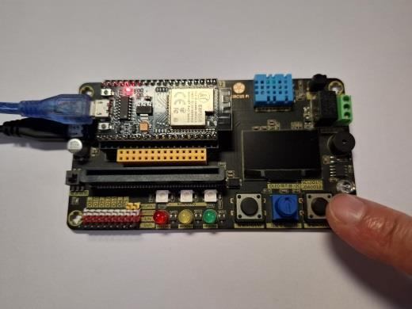

圖片說明：這是本頁第 2 張重點圖片，位於「圖 2-14 按鈕開關控制 LED (a) 按下 A 鍵的結果 放開 A 鍵的結果」相關內容中，主要用來輔助說明 家中常見兩個開關控制一盞電燈，請使用兩個按鈕開關及一顆 LED，模擬開 關控制電燈，當 A 鍵及 B 鍵同時按下時，紅色 LED 才會亮起，其餘情況紅色 LED。

## 第 14 頁

2-3 呼吸燈控制
呼吸燈顧名思義就跟深呼吸一樣，首先慢慢吸氣，吸足了氣，再慢慢吐氣，
所以呼吸燈動作是燈光由全暗開始，慢慢變亮，最後到達全亮的狀態，再由全亮
開始，慢慢變暗，最後進入全暗的狀態。本節使用 LED 模擬市售呼吸燈的動作，
EZ Start Kit 中 LED 模組的位置，如圖 2-15 所示。
圖 2-15 EZ Start Kit 中 LED 模組的位置
2-1 及 2-2 節介紹數位信號，亦即只有『0』與『1』兩種變化的信號，如圖
2-16(a)，不過自然界中存在的信號，如聲音和氣溫等，都是多種變化的數值，這
樣的數值變化稱為類比(Analog)信號，亦即連續變化的信號，如圖 2-16(b)所示，
本節要介紹的呼吸燈控制必須使用類比控制的方式 ， 所以我們會使用類比輸出的
積木控制 LED 模組。
圖 2-16 信號分類 (a)數位信號 (b) 類比信號
本節首先介紹類比輸出積木，將紅色 LED 由最暗變成半亮 ， 再從半亮變成最
亮，再來我們會使用迴圈方式，讓紅色 LED 由最暗慢慢變成全亮。
使用積木：
積木選單 積木 說明
法蘭斯積木/
I/O 引腳
類比輸出積木，功用為輸出類比
信號，輸出數值最小值為 0，最
大值為 255，通道共有 16 個，不
(a)
(b)

### 圖片

圖片說明：此圖對應「EZ Start Kit 中 LED 模組的位置」，位於「2-3 呼吸燈控制」相關內容中，主要用來輔助說明 2-3 呼吸燈控制 呼吸燈顧名思義就跟深呼吸一樣，首先慢慢吸氣，吸足了氣，再慢慢吐氣。

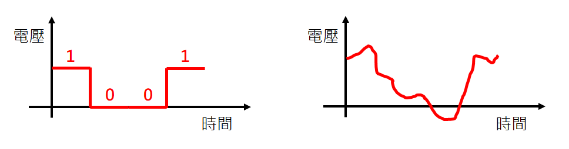

圖片說明：此圖對應「信號分類 (a)數位信號 (b) 類比信號」，位於「2-3 呼吸燈控制」相關內容中，主要用來輔助說明 2-3 呼吸燈控制 呼吸燈顧名思義就跟深呼吸一樣，首先慢慢吸氣，吸足了氣，再慢慢吐氣。

圖片說明：這是本頁第 3 張重點圖片，位於「2-3 呼吸燈控制」相關內容中，主要用來輔助說明 2-3 呼吸燈控制 呼吸燈顧名思義就跟深呼吸一樣，首先慢慢吸氣，吸足了氣，再慢慢吐氣。

## 第 15 頁

同腳位控制需用不同通道，通道
的編號為 0~15。
迴圈
循環計數迴圈積木，功用為讓本
積木範圍中的程式積木重複執
行，重複的次數由計次變數 i 的
內容值決定，迴圈第一次會將初
始參數 1 放入計次變數 i 中，判
斷變數 i 的內容值是否超過終值
參數 10，如果沒有超過就執行本
積木範圍中的積木，再把變數的
內容值增加間隔數 1，如此重複
迴圈，直到計次變數 i 的內容值
超過終值參數 10，即停止迴圈執
行，而往本積木的下方繼續執
行。
文字
字串組合積木，功能為把多個字
串連接在一起，變成一個字串。
變數
取用變數積木，功用為讀取變數
的內容值。
使用元件及接腳：
元件名稱 IO 編號 實際接腳
紅色 LED IO4 GPIO16
黃色 LED IO5 GPIO12
綠色 LED IO6 GPIO13
積木程式 1—變亮的呼吸燈：
範例程式：ch2_3_1

### 圖片

圖片說明：這是本頁第 1 張重點圖片，位於「同腳位控制需用不同通道，通道」相關內容中，主要用來輔助說明 同腳位控制需用不同通道，通道 的編號為 0~15。

圖片說明：這是本頁第 2 張重點圖片，位於「同腳位控制需用不同通道，通道」相關內容中，主要用來輔助說明 同腳位控制需用不同通道，通道 的編號為 0~15。

圖片說明：這是本頁第 3 張重點圖片，位於「同腳位控制需用不同通道，通道」相關內容中，主要用來輔助說明 同腳位控制需用不同通道，通道 的編號為 0~15。

## 第 16 頁

程式說明 1：
重複執行部分：
1. 將腳位 16 使用通道 1 做類比輸出，輸出值為 0，亦即控制紅色 LED 為全暗。
2. 延遲 1000 毫秒(1 秒)。
3. 將腳位 16 使用通道 1 做類比輸出 ， 輸出值為127， 亦即控制紅色LED 為半亮。
4. 延遲 1000 毫秒(1 秒)。
5. 將腳位 16 使用通道 1 做類比輸出 ， 輸出值為255， 亦即控制紅色LED 為全亮。
6. 延遲 1000 毫秒(1 秒)。
執行結果 1：
程式執行後，啟動序列埠監看視窗，當按下A 鍵時，序列埠監看視窗中顯示
『0』，表示輸入為『低電位』 ，如圖2-14 及圖 2-15 所示。
圖 2-17 類比輸出控制紅色 LED (a)LED 全滅 (b)LED 半亮 (c)LED 全亮
積木程式 2—使用迴圈變亮的呼吸燈：
1
2
3
範例程式：ch2_3_2
4
6
5
(a)
(b)
(c)

### 圖片

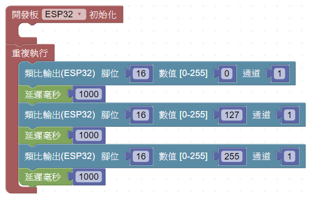

圖片說明：此圖對應「類比輸出控制紅色 LED (a)LED 全滅 (b)LED 半亮 (c)LED 全亮」，位於「程式說明 1：」相關內容中，主要用來輔助說明 1. 將腳位 16 使用通道 1 做類比輸出，輸出值為 0，亦即控制紅色 LED 為全暗。 2. 延遲 1000 毫秒(1 秒)。

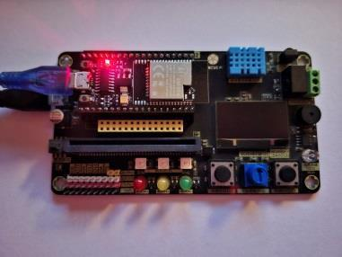

圖片說明：這是本頁第 2 張重點圖片，位於「程式說明 1：」相關內容中，主要用來輔助說明 1. 將腳位 16 使用通道 1 做類比輸出，輸出值為 0，亦即控制紅色 LED 為全暗。 2. 延遲 1000 毫秒(1 秒)。

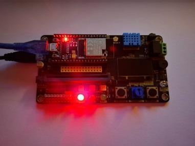

圖片說明：這是本頁第 3 張重點圖片，位於「程式說明 1：」相關內容中，主要用來輔助說明 1. 將腳位 16 使用通道 1 做類比輸出，輸出值為 0，亦即控制紅色 LED 為全暗。 2. 延遲 1000 毫秒(1 秒)。

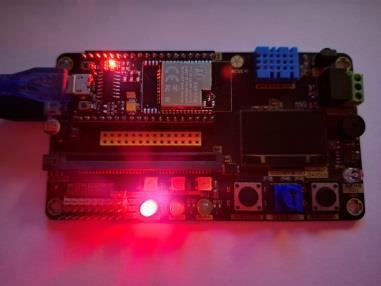

圖片說明：這是本頁第 4 張重點圖片，位於「程式說明 1：」相關內容中，主要用來輔助說明 1. 將腳位 16 使用通道 1 做類比輸出，輸出值為 0，亦即控制紅色 LED 為全暗。 2. 延遲 1000 毫秒(1 秒)。

## 第 17 頁

程式說明 2：
初始化部分：
1. 初始化序列埠連線，設定傳輸速度為 115200。
重複執行部分：
2. 使用循環計次迴圈積木，讓計次變數 i 由 0 開始，每次迴圈執行增加 5，直到
超過 255 才會停止迴圈，迴圈每次會重複執行積木 2、積木 3 及積木 4。
3. 由序列埠列印『i=』及變數 i 的內容值。
4. 將腳位 16 使用通道 1 做類比輸出，輸出值為變數 i 的內容值。
撰寫程式的過程中 ， 有機會碰到某一部份的積木程式需要一直重複 ， 例如範
例程式中序列埠列印 、 類比輸出及時間延遲等積木程式會一直重複 ， 此時我們可
以拆解出重複的部分，改用迴圈積木撰寫程式，讓程式變得簡潔，也容易閱讀，
拆解概念如圖 2-18 所示。
圖 2-18 重複程式部分的拆解
變數(Variable)為一塊記憶體的空間，在程式執行過程中用來記憶資料，而且
記憶新資料時就會把舊資料覆蓋過去，範例程式的迴圈中使用計次變數 i，迴圈
初始化時會把初始值 0 存入變數 i 中，如圖 2-18(a)所示，第一次執行迴圈時，會
檢查變數內容值 0 是否超過終值 10，檢查結果沒有超過，所以會把迴圈中的程
式執行一次，接著把變數的內容值讀出為 0，再加上間隔數 5，得到結果是 10，
1
2
3
4
. . .

### 圖片

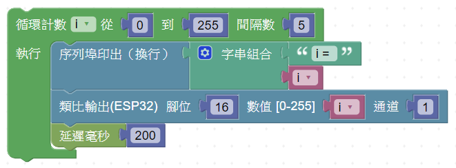

圖片說明：此圖對應「重複程式部分的拆解」，位於「程式說明 2：」相關內容中，主要用來輔助說明 1. 初始化序列埠連線，設定傳輸速度為 115200。 2. 使用循環計次迴圈積木，讓計次變數 i 由 0 開始，每次迴圈執行增加 5，直到。

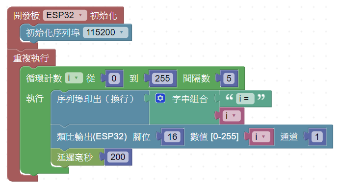

圖片說明：這是本頁第 2 張重點圖片，位於「程式說明 2：」相關內容中，主要用來輔助說明 1. 初始化序列埠連線，設定傳輸速度為 115200。 2. 使用循環計次迴圈積木，讓計次變數 i 由 0 開始，每次迴圈執行增加 5，直到。

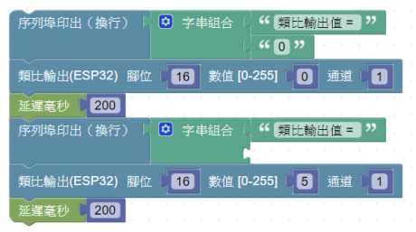

圖片說明：這是本頁第 3 張重點圖片，位於「程式說明 2：」相關內容中，主要用來輔助說明 1. 初始化序列埠連線，設定傳輸速度為 115200。 2. 使用循環計次迴圈積木，讓計次變數 i 由 0 開始，每次迴圈執行增加 5，直到。

## 第 18 頁

再存回變數 i，由於變數的新內容值會覆蓋舊內容，所以變數的內容值變成 5，
如圖 2-18(b)所示，如此重複執行直到變數 i 的內容值超過 255，就會結束迴圈，
往迴圈下方的程式繼續執行。
圖 2-18 計次變數內容值的變化 (a)迴圈初始時 (b)第一次執行迴圈
程式中使用序列埠列印積木，將計次變數 i 的內容值印出，其目的是為了觀
察變數 i 內容值的變化，當我們想知道程式執行過程中變數的內容，就可以使用
序列埠列印積木把變數內容印出，然後觀察程式是否正確。
執行結果 2：
程式執行後，打開序列埠監看視窗，查看計次變數 i 的變化，同時也可觀察
紅色 LED 的亮度，如圖 2-19 所示。
圖 2-19
延伸練習：
請觀察並修改範例程式 ， 讓紅色LED 由暗逐漸變成全亮 ， 再從全亮逐漸變成
全暗(提示：循環計次迴圈積木的間隔數參數可用負值。
(a)
(b)

### 圖片

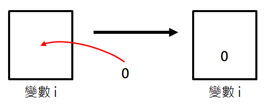

圖片說明：此圖對應「計次變數內容值的變化 (a)迴圈初始時 (b)第一次執行迴圈」，位於「再存回變數 i，由於變數的新內容值會覆蓋舊內容，所以變數的內容值變成 5，」相關內容中，主要用來輔助說明 再存回變數 i，由於變數的新內容值會覆蓋舊內容，所以變數的內容值變成 5， 如圖 2-18(b)所示，如此重複執行直到變數 i 的內容值超過 255，就會結束迴圈。

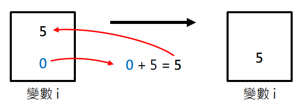

圖片說明：這是本頁第 2 張重點圖片，位於「再存回變數 i，由於變數的新內容值會覆蓋舊內容，所以變數的內容值變成 5，」相關內容中，主要用來輔助說明 再存回變數 i，由於變數的新內容值會覆蓋舊內容，所以變數的內容值變成 5， 如圖 2-18(b)所示，如此重複執行直到變數 i 的內容值超過 255，就會結束迴圈。

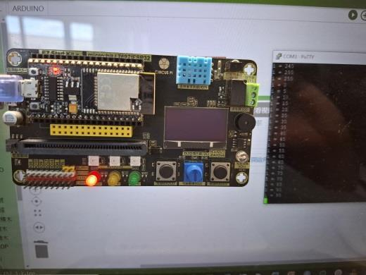

圖片說明：這是本頁第 3 張重點圖片，位於「再存回變數 i，由於變數的新內容值會覆蓋舊內容，所以變數的內容值變成 5，」相關內容中，主要用來輔助說明 再存回變數 i，由於變數的新內容值會覆蓋舊內容，所以變數的內容值變成 5， 如圖 2-18(b)所示，如此重複執行直到變數 i 的內容值超過 255，就會結束迴圈。

## 第 19 頁

2-4 可變電阻與光感測器
可變電阻跟一般電阻不同 ， 一般電阻的電阻值是固定 ， 但是可變電阻的電阻
值是可變的，如圖 2-20 所示，可變電阻上有旋鈕裝置，用手轉動旋鈕可以改變
其電阻值，可變電阻接上電源，因不同的電阻值而獲得不同的輸出電壓值，所以
可變電阻又叫電位器，又因其可產生不同的輸出電壓值，所以接上 ESP32 後就成
為類比輸入。可變電阻在 EZ Start Kit 的位置，如圖 2-21 所示。
圖 2-20 可變電阻 圖 2-21 可變電阻及光感測器的位置
光敏電阻如圖 2-22 所示，跟可變電阻相同，其電阻值是可變的，只是可變
電阻的電阻值用旋鈕調整 ， 而光敏電阻的電阻值是由其所照到的光線大小改變，
所以由光敏電阻所組成的光感測器也是一種類比輸入模組。光感測器在 EZ Start
Kit 的位置，如圖 2-21 所示。
圖 2-22 光敏電阻
本節首先介紹可變電阻的使用 ， 觀察其輸入數值的最小值及最大值 ， 再利用
可變電阻的輸入值控制 LED 的亮度 ， 接著介紹光感測器的使用 ， 最後使用光感測
器做 LED 控制，模擬以光線亮度控制路燈亮滅。
使用積木：
積木選單 積木 說明
法蘭斯積木/
I/O 引腳
類比輸入積木，功用為讀取類比
接腳的數值。
變數
變數宣告 積木，功用為 宣告變
數，變數宣告後才可以使用，可
調整的參數有使用區域、資料型

### 圖片

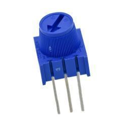

圖片說明：此圖對應「可變電阻 圖 2-21 可變電阻及光感測器的位置」，位於「2-4 可變電阻與光感測器」相關內容中，主要用來輔助說明 2-4 可變電阻與光感測器 可變電阻跟一般電阻不同 ， 一般電阻的電阻值是固定 ， 但是可變電阻的電阻。

圖片說明：此圖對應「光敏電阻」，位於「2-4 可變電阻與光感測器」相關內容中，主要用來輔助說明 2-4 可變電阻與光感測器 可變電阻跟一般電阻不同 ， 一般電阻的電阻值是固定 ， 但是可變電阻的電阻。

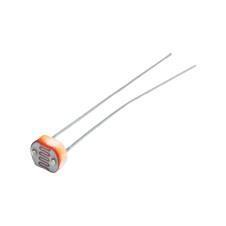

圖片說明：這是本頁第 3 張重點圖片，位於「2-4 可變電阻與光感測器」相關內容中，主要用來輔助說明 2-4 可變電阻與光感測器 可變電阻跟一般電阻不同 ， 一般電阻的電阻值是固定 ， 但是可變電阻的電阻。

圖片說明：這是本頁第 4 張重點圖片，位於「2-4 可變電阻與光感測器」相關內容中，主要用來輔助說明 2-4 可變電阻與光感測器 可變電阻跟一般電阻不同 ， 一般電阻的電阻值是固定 ， 但是可變電阻的電阻。

## 第 20 頁

態、名稱及初始值。
變數
變數設定積木，功能為設定變數
的內容值，設定的內容值會覆蓋
原本的內容值。
變數
取用變數積木，功用為讀取變數
的內容值。
數學
映射數值積木，功用為將某一個
區間的數值映射到另一個區間，
例如：由 0~1023 映射到 0~255，
參數有輸入變數、輸入區間及輸
出區間
使用元件及接腳：
元件名稱 IO 編號 實際接腳
紅色 LED IO4 GPIO16
黃色 LED IO5 GPIO12
綠色 LED IO6 GPIO13
可變電阻 IO2 GPIO34
光感測器 IO1 GPIO39
積木程式 1—序列埠印出可變電阻的輸入數值：
程式說明 1：
初始化部分：
1. 初始化序列埠連線，設定傳輸速度為 115200。
2. 宣告全域整數變數 VR，並設定其初始值為 0。
重複執行部分：
3. 讀取類比輸入腳位 34 的數值，即讀取可變電阻的輸入數值，並放入變數 VR
範例程式：ch2_4_1
1
2
3
4
5

### 圖片

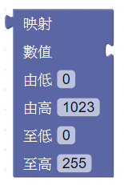

圖片說明：這是本頁第 1 張重點圖片，位於「態、名稱及初始值。」相關內容中，主要用來輔助說明 態、名稱及初始值。 變數設定積木，功能為設定變數。

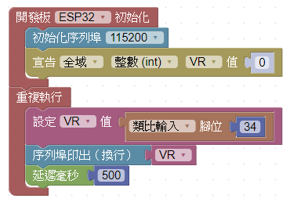

圖片說明：這是本頁第 2 張重點圖片，位於「態、名稱及初始值。」相關內容中，主要用來輔助說明 態、名稱及初始值。 變數設定積木，功能為設定變數。

圖片說明：這是本頁第 3 張重點圖片，位於「態、名稱及初始值。」相關內容中，主要用來輔助說明 態、名稱及初始值。 變數設定積木，功能為設定變數。

圖片說明：這是本頁第 4 張重點圖片，位於「態、名稱及初始值。」相關內容中，主要用來輔助說明 態、名稱及初始值。 變數設定積木，功能為設定變數。

## 第 21 頁

中。
4. 序列埠印出變數 VR 的內容值，列印完成後換行。
5. 延遲 500 毫秒(0.5 秒)。
使用變數紀錄輸入模組的輸入數值是最適當的方式 ，將輸入的數值存入變數
後，可以再做各種處理或運算，宣告變數積木設定的方式說明如下：
步驟 1：點選積木選單中的「變數」，接著將子選單中的宣告變數積木拖曳至程
式編輯區。
步驟 2：點選變數名稱 i 旁的「三角箭頭」，接著點選彈出視窗中的建立變數，準
備建立新的變數。
步驟 3：在彈出視窗的新變數名稱中輸入”VR”，接著點選確定。
步驟 4：如果需要修改使用區域或是資料型態，可點選對應的三角符號，可從彈
出視窗中修改，另外也可以直接點選初始值後，輸入所需的初始值，輸入完成後
按下「enter」，即可完成修改，變數名稱修改完成後，點選積木選單中的變數，
就可以看到變數 VR 的其他積木。
程式中使用整數變數 VR 儲存可變電阻的輸入數值 ， 接著再從序列埠中印出 ，
我們可以從序列埠監看視窗中觀察可變電阻的輸入數值 ， 雖然有更簡短的方式可

### 圖片

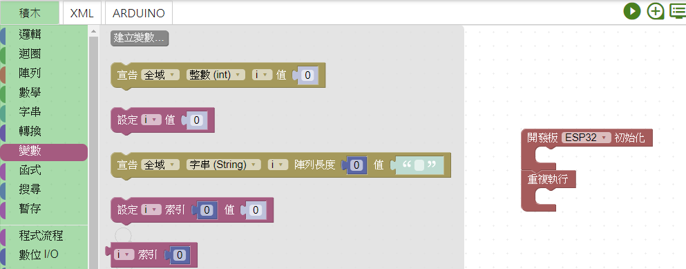

圖片說明：這是本頁第 1 張重點圖片，位於「中。」相關內容中，主要用來輔助說明 4. 序列埠印出變數 VR 的內容值，列印完成後換行。 5. 延遲 500 毫秒(0.5 秒)。

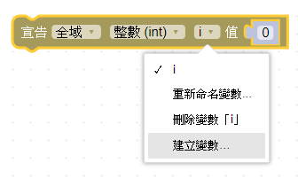

圖片說明：這是本頁第 2 張重點圖片，位於「中。」相關內容中，主要用來輔助說明 4. 序列埠印出變數 VR 的內容值，列印完成後換行。 5. 延遲 500 毫秒(0.5 秒)。

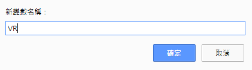

圖片說明：這是本頁第 3 張重點圖片，位於「中。」相關內容中，主要用來輔助說明 4. 序列埠印出變數 VR 的內容值，列印完成後換行。 5. 延遲 500 毫秒(0.5 秒)。

## 第 22 頁

做可變電阻的輸入數值的顯示，但是使用變數 VR 儲存輸入模組的數值是最適當
的方式。
變數使用區域可設定為全域及區域 ， 全域變數可使用程式中的所有區域 ， 區
域變數如果宣告初始化積木中，該變數只能用在初始化積木，同理，如果宣告重
複執行積木中 ， 該變數只能用在重複執行積木，本範例變數 VR 設定為全域變數，
所以可使用程式中的所有區域，另外本範例變數 VR 的資料型態設為整數，所以
變數 VR 只能儲存整數數值，如果存入的數值有小數，則小數部分會被捨棄。
執行結果 1：
程式執行後，打開序列埠監看視窗 ， 可觀察到顯示數值會隨旋鈕轉動而變化 ，
顯示的最大值為 4095，最小值為 0，如圖 2-23 所示。
圖 2-23 序列埠觀看視窗顯示變數 VR 內容值
積木程式 2—使用可變電阻控制 LED 亮度：
1
2
3
範例程式：ch2_4_2
4
5
6
7

### 圖片

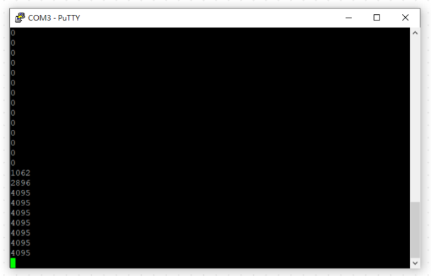

圖片說明：此圖對應「序列埠觀看視窗顯示變數 VR 內容值」，位於「做可變電阻的輸入數值的顯示，但是使用變數 VR 儲存輸入模組的數值是最適當」相關內容中，主要用來輔助說明 做可變電阻的輸入數值的顯示，但是使用變數 VR 儲存輸入模組的數值是最適當 變數使用區域可設定為全域及區域 ， 全域變數可使用程式中的所有區域 ， 區。

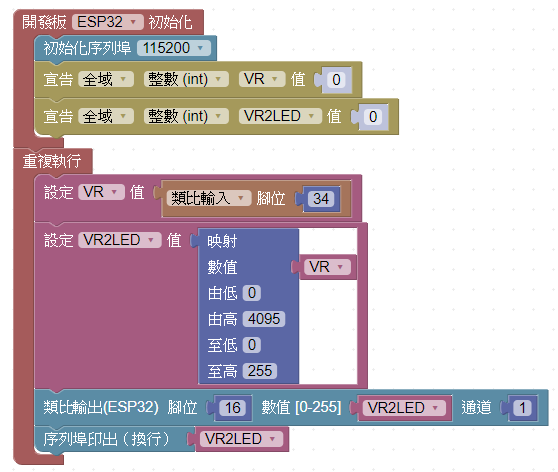

圖片說明：這是本頁第 2 張重點圖片，位於「做可變電阻的輸入數值的顯示，但是使用變數 VR 儲存輸入模組的數值是最適當」相關內容中，主要用來輔助說明 做可變電阻的輸入數值的顯示，但是使用變數 VR 儲存輸入模組的數值是最適當 變數使用區域可設定為全域及區域 ， 全域變數可使用程式中的所有區域 ， 區。

圖片說明：這是本頁第 3 張重點圖片，位於「做可變電阻的輸入數值的顯示，但是使用變數 VR 儲存輸入模組的數值是最適當」相關內容中，主要用來輔助說明 做可變電阻的輸入數值的顯示，但是使用變數 VR 儲存輸入模組的數值是最適當 變數使用區域可設定為全域及區域 ， 全域變數可使用程式中的所有區域 ， 區。

## 第 23 頁

程式說明 2：
初始化部分：
1. 初始化序列埠連線，設定傳輸速度為 115200。
2. 宣告全域整數變數 VR，並設定其初始值為 0。
3. 宣告全域整數變數 VR2LED，並設定其初始值為 0。
重複執行部分：
4. 讀取類比輸入腳位 34 的數值，即讀取可變電阻的輸入數值，並放入變數 VR
中。
5. 將變數 VR 的內容值從 0~4095 映射成 0~255，並存入變數 VR2LED。
6. 將腳位 16 使用通道 1 做類比輸出，輸出值為變數 VR2LED 的內容值。
7. 序列埠印出變數 VR2LED 的內容值，列印完成後換行。
程式中把可變電阻的數值存入變數 VR 中，接著將變數 VR 的內容值映射到
變數 VR2LED，因為可變電阻產生的數值範圍為 0~4095，而控制 LED 所需的數值
範圍為 0~255， 無法直接使用可變電阻輸出控制LED， 所以必須進行映射的運算，
最後把運算完成的結果存入變數 VR2LED，再由序列埠輸出，本範例中我們再次
看到變數的妙用 ， 在程式的執行過程紀錄所需的數值 ， 另外範例中以類比輸入模
組的可變電阻，控制類比輸出模組的 LED，達成以類比輸入控制類比輸出。
執行結果 2：
程式執行後 ， 可使用可變電阻的旋紐控制LED 的亮度 ， 同時可由序列埠監看
視窗中觀察到顯示的數值範圍在 0~255 之間，如圖 2-24 所示。
圖 2-24 可變電阻控制 LED 亮度 (a)旋轉控制旋紐 (b) 序列埠視窗顯示
積木程式 3—序列埠印出光感測器的輸入數值：
範例程式：ch2_4_3
(a)
(b)

### 圖片

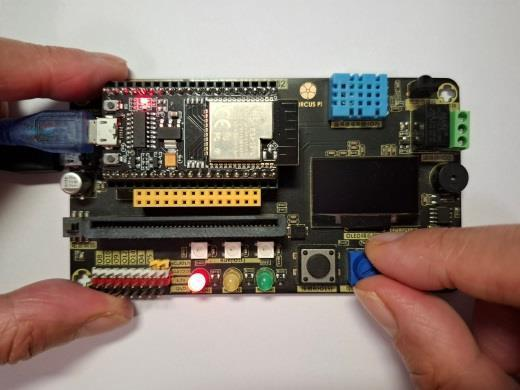

圖片說明：此圖對應「可變電阻控制 LED 亮度 (a)旋轉控制旋紐 (b) 序列埠視窗顯示」，位於「程式說明 2：」相關內容中，主要用來輔助說明 1. 初始化序列埠連線，設定傳輸速度為 115200。 2. 宣告全域整數變數 VR，並設定其初始值為 0。

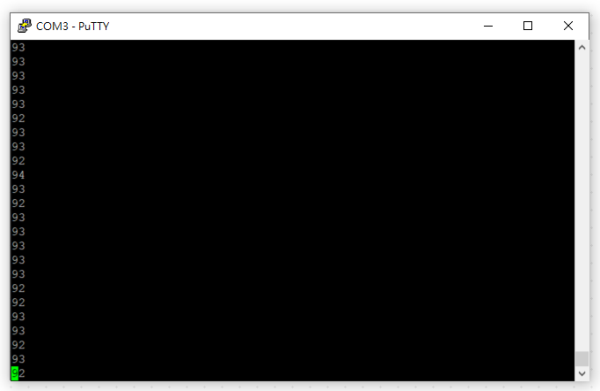

圖片說明：這是本頁第 2 張重點圖片，位於「程式說明 2：」相關內容中，主要用來輔助說明 1. 初始化序列埠連線，設定傳輸速度為 115200。 2. 宣告全域整數變數 VR，並設定其初始值為 0。

圖片說明：這是本頁第 3 張重點圖片，位於「程式說明 2：」相關內容中，主要用來輔助說明 1. 初始化序列埠連線，設定傳輸速度為 115200。 2. 宣告全域整數變數 VR，並設定其初始值為 0。

圖片說明：這是本頁第 4 張重點圖片，位於「程式說明 2：」相關內容中，主要用來輔助說明 1. 初始化序列埠連線，設定傳輸速度為 115200。 2. 宣告全域整數變數 VR，並設定其初始值為 0。

## 第 24 頁

程式說明 3：
初始化部分：
1. 初始化序列埠連線，設定傳輸速度為 115200。
2. 宣告全域整數變數 Light，並設定其初始值為 0。
重複執行部分：
3. 讀取類比輸入腳位 39 的數值 ， 即讀取光感測器的輸入數值 ， 並放入變數Light
中。
4. 序列埠印出變數 Light 的內容值，列印完成後換行。
5. 延遲 200 毫秒(0.2 秒)。
程式中使用整數變數 Light 儲存可變電阻的輸入數值，接著再從序列埠中印
出，我們可以從序列埠監看視窗中觀察可變電阻在不同環境的輸入數值。
執行結果 3：
程式執行後，打開序列埠監看視窗，改變光感測器的受光狀態，可觀察到顯
示數值會隨受光狀態而變化，如圖 2-25 所示。
圖 2-25 序列埠視窗顯示光感測器輸入數值 (a)遮蓋光感測器 (b) 序列埠視窗
顯示
1
2
3
4
5
(a)
(b)

### 圖片

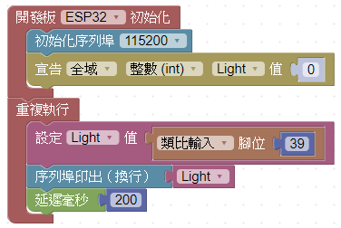

圖片說明：此圖對應「序列埠視窗顯示光感測器輸入數值 (a)遮蓋光感測器 (b) 序列埠視窗」，位於「程式說明 3：」相關內容中，主要用來輔助說明 1. 初始化序列埠連線，設定傳輸速度為 115200。 2. 宣告全域整數變數 Light，並設定其初始值為 0。

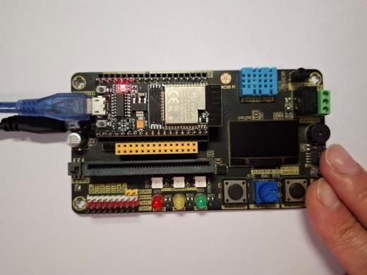

圖片說明：這是本頁第 2 張重點圖片，位於「程式說明 3：」相關內容中，主要用來輔助說明 1. 初始化序列埠連線，設定傳輸速度為 115200。 2. 宣告全域整數變數 Light，並設定其初始值為 0。

圖片說明：這是本頁第 3 張重點圖片，位於「程式說明 3：」相關內容中，主要用來輔助說明 1. 初始化序列埠連線，設定傳輸速度為 115200。 2. 宣告全域整數變數 Light，並設定其初始值為 0。

## 第 25 頁

積木程式 4—使用光感測器控制 LED：
程式說明 4：
初始化部分：
1. 初始化序列埠連線，設定傳輸速度為 115200。
2. 宣告全域整數變數 Light，並設定其初始值為 0。
重複執行部分：
3. 讀取類比輸入腳位 39 的數值 ， 即讀取光感測器的輸入數值 ， 並放入變數Light
中。
4. 序列埠印出變數 Light 的內容值，列印完成後換行。
5. 判斷變數 Light 的內容值，如果變數 Light 的內容值小於 300，則執行積木 6，
否則執行積木 7。
6. 腳位 16 輸出高電位，讓接在腳位 16 的紅色 LED 發亮。
7. 腳位 16 輸出低電位，讓接在腳位 16 的紅色 LED 熄滅。
程式中把光感測器的數值存入變數 Light 中 ， 接著判斷變數 Light 的內容值是
否大於 300， 決定是否點亮紅色LED， 達到模擬光線亮度控制路燈亮滅 ，其中 300
是筆者根據測試環境所訂定 ， 該數值一般稱為門檻值 ， 測試時可依據現場環境修
改。
執行結果 4：
程式執行後，當光線足夠時，紅色 LED 滅，當光線不足時，紅色LED 發亮。
1
2
3
範例程式：ch2_4_4
4
5
6
7

### 圖片

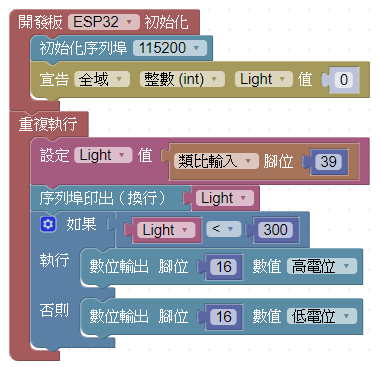

圖片說明：這是本頁第 1 張重點圖片，位於「積木程式 4—使用光感測器控制 LED：」相關內容中，主要用來輔助說明 積木程式 4—使用光感測器控制 LED： 1. 初始化序列埠連線，設定傳輸速度為 115200。

圖片說明：這是本頁第 2 張重點圖片，位於「積木程式 4—使用光感測器控制 LED：」相關內容中，主要用來輔助說明 積木程式 4—使用光感測器控制 LED： 1. 初始化序列埠連線，設定傳輸速度為 115200。

圖片說明：這是本頁第 3 張重點圖片，位於「積木程式 4—使用光感測器控制 LED：」相關內容中，主要用來輔助說明 積木程式 4—使用光感測器控制 LED： 1. 初始化序列埠連線，設定傳輸速度為 115200。

## 第 26 頁

圖 2-26 光感測器控制 LED (a)光感測器受光 (b) 光感測器遮光
延伸練習：
為了即時顯示環境的亮度 ， 請製作自動亮度計 ， 當環境的亮度為低亮度時，
顯示紅色 LED，當環境的亮度為中亮度時，顯示黃色 LED，當環境的亮度為高亮
度時，顯示綠色 LED(提示：亮度門檻值可自行設定)。

### 圖片

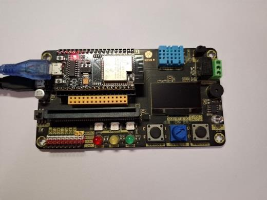

圖片說明：此圖對應「光感測器控制 LED (a)光感測器受光 (b) 光感測器遮光」，位於「圖 2-26 光感測器控制 LED (a)光感測器受光 (b) 光感測器遮光」相關內容中，主要用來輔助說明 為了即時顯示環境的亮度 ， 請製作自動亮度計 ， 當環境的亮度為低亮度時， 顯示紅色 LED，當環境的亮度為中亮度時，顯示黃色 LED，當環境的亮度為高亮。

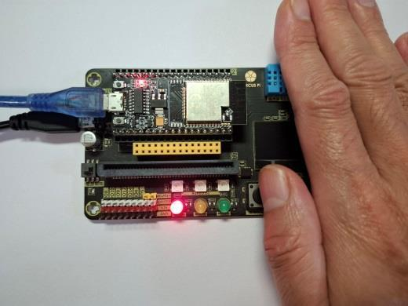

圖片說明：這是本頁第 2 張重點圖片，位於「圖 2-26 光感測器控制 LED (a)光感測器受光 (b) 光感測器遮光」相關內容中，主要用來輔助說明 為了即時顯示環境的亮度 ， 請製作自動亮度計 ， 當環境的亮度為低亮度時， 顯示紅色 LED，當環境的亮度為中亮度時，顯示黃色 LED，當環境的亮度為高亮。
