# Chapter03_進階感測模組

## 第 1 頁

第三章 進階感測模組
3-1 OLED 顯示器控制
3-2 WS-2812 LED 控制
3-3 蜂鳴器播放音樂
3-4 數位溫濕度計
3-5 紅外線遙控
3-6 繼電器控制

## 第 2 頁

3-1 OLED 顯示器控制
第二章介紹過的輸出模組只有 LED 模組，LED 只能顯示亮跟滅兩種狀態，無
顯示其他複雜的資訊 ， 有人會說序列埠輸出視窗就可以顯示 ， 不過當我們把ESP32
專案完成，安裝到現場時，電腦是不會一起安裝，所以無法啟動序列埠輸出視窗
監看系統運作的狀態。
本節介紹的 OLED 顯示器模組可以解決複雜資訊顯示的問題，OLED 顯示器
模組主要由 1.3 吋的 OLED 顯示幕所構成，其解析度為 128╳64 像素， 如圖3-1 所
示，其在 EZ Start Kit 的位置，如圖 3-2 所示，OLED 顯示器模組可以顯示英文、
中文、數字、特殊符號，還可顯示圖示及圖片，比起 16╳2 LCD 顯示器，可以顯
示的內容變得更多。
圖 3-1 1.3 吋 OLED 圖 3-2 EZ Start Kit 中 OLED 模組的位置
本節首先介紹 OLED 顯示器模組顯示英數字、中文、圖示及圖片，提醒如要
自行接線，OLED 模組的通訊方式為 I2C(Inter-Integrated Circuit)協定，所以接線時
要用 I2C 方式連接 ESP32。
使用積木：
積木選單 積木 說明
法蘭斯積木/
OLED 顯示器
OLED 初始化積木，功用 為設定
OLED 的解析度 、 連線方式 、 顯示
方式及中文顯示，本積木的預設
參數可供 EZ Start Kit 使用，除了
中文顯示部分可視需要，設定為
啟動。
法蘭斯積木/
OLED 顯示器
OLED 英數字字型設定積木 ， 功用
為設定 OLED 顯示的英數字字型。
法蘭斯積木/
OLED 顯示器
OLED 整頁顯示積木 ， 功用為使用
本積木內的顯示內容，以整頁方
式刷新 OLED 顯示器的顯示，即

### 圖片

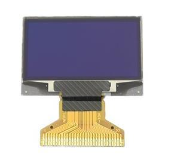

圖片說明：此圖對應「1.3 吋 OLED 圖 3-2 EZ Start Kit 中 OLED 模組的位置」，位於「3-1 OLED 顯示器控制」相關內容中，主要用來輔助說明 3-1 OLED 顯示器控制 第二章介紹過的輸出模組只有 LED 模組，LED 只能顯示亮跟滅兩種狀態，無。

圖片說明：這是本頁第 2 張重點圖片，位於「3-1 OLED 顯示器控制」相關內容中，主要用來輔助說明 3-1 OLED 顯示器控制 第二章介紹過的輸出模組只有 LED 模組，LED 只能顯示亮跟滅兩種狀態，無。

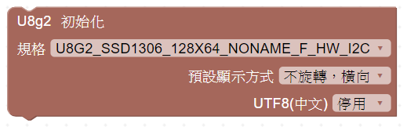

圖片說明：這是本頁第 3 張重點圖片，位於「3-1 OLED 顯示器控制」相關內容中，主要用來輔助說明 3-1 OLED 顯示器控制 第二章介紹過的輸出模組只有 LED 模組，LED 只能顯示亮跟滅兩種狀態，無。

## 第 3 頁

清除原本顯示內容，更換為本積
木內的顯示內容。
法蘭斯積木/
OLED 顯示器
OLED 英數字顯示積木 ， 功用為設
定顯示 英數字 的起始位置及內
容。
法蘭斯積木/
OLED 顯示器
OLED 中文字型設定積木 ， 功用為
設定 OLED 顯示的中文字型。
法蘭斯積木/
OLED 顯示器
OLED 圖示顯示積木 ， 功用為設定
顯示中文的起始位置及內容。
法蘭斯積木/
OLED 顯示器
OLED 英數字顯示積木 ， 功用為以
logo 形式 ， 設定顯示圖示的內容 。
法蘭斯積木/
OLED 顯示器
OLED 圖示顯示積木 ， 功用為設定
顯示 logo 的大小及起始位置。
法蘭斯積木/
OLED 顯示器
OLED 圖片顯示積木，功用為以
logo 的形式，設定顯示圖片的內
容。
使用元件及接腳：
元件名稱 IO 編號 實際接腳
OLED 顯示器 IO17(SCL) GPIO22
OLED 顯示器 IO18(SDA) GPIO21
積木程式 1—英數字顯示：
程式說明 1：
初始化部分：
1. 將 OLED 顯示器初始化，設定 UTF8(中文)「停用」。
2. 設定顯示英數字的字型為「u8g2_fint_10X20_me」。
範例程式：ch3_1_1
1
2
3
4

### 圖片

圖片說明：這是本頁第 1 張重點圖片，位於「清除原本顯示內容，更換為本積」相關內容中，主要用來輔助說明 清除原本顯示內容，更換為本積 OLED 英數字顯示積木 ， 功用為設。

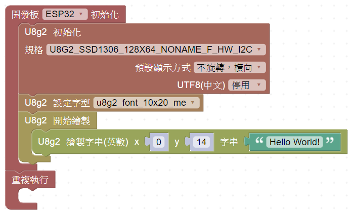

圖片說明：這是本頁第 2 張重點圖片，位於「清除原本顯示內容，更換為本積」相關內容中，主要用來輔助說明 清除原本顯示內容，更換為本積 OLED 英數字顯示積木 ， 功用為設。

圖片說明：這是本頁第 3 張重點圖片，位於「清除原本顯示內容，更換為本積」相關內容中，主要用來輔助說明 清除原本顯示內容，更換為本積 OLED 英數字顯示積木 ， 功用為設。

## 第 4 頁

3. 以整頁的方式，先清除 OLED 顯示的內容，再顯示積木 4。
4. 設定 OLED 顯示起始位置為 x 軸：0、y 軸：14，內容為「Hello World!」。
圖 3-3 OLED 顯示相關位置
OLED 顯示器的相關位置，如圖 3-3 所示，原點(0, 0)位於顯示器的左上角，x
軸座標為水平方向，且越往右邊其數值越大，y 軸座標為垂直方向，且越往下方
其數值越大。顯示器顯示內容為「Hello」，其顯示的起始位置為該文字的左側下
方。
程式中首先設定 OLED 顯示器的規格、橫向顯示及停用中文，接著設定顯示
的字型，最後設定顯示的內容為「Hello World!」，如果沒有設定字型，將無法顯
示文字，另外字型可自行調整。
執行結果 1：
程式執行後，OLED 顯示模組顯示「Hello World!」，如圖 3-4 所示。
圖 3-4 OLED 顯示英數字畫面
積木程式 2—中文顯示：

### 圖片

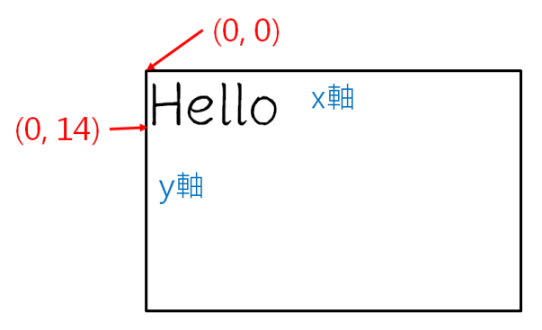

圖片說明：此圖對應「OLED 顯示相關位置」，位於「3. 以整頁的方式，先清除 OLED 顯示的內容，再顯示積木 4。」相關內容中，主要用來輔助說明 3. 以整頁的方式，先清除 OLED 顯示的內容，再顯示積木 4。 4. 設定 OLED 顯示起始位置為 x 軸：0、y 軸：14，內容為「Hello World!」。

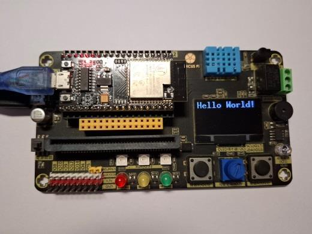

圖片說明：此圖對應「OLED 顯示英數字畫面」，位於「3. 以整頁的方式，先清除 OLED 顯示的內容，再顯示積木 4。」相關內容中，主要用來輔助說明 3. 以整頁的方式，先清除 OLED 顯示的內容，再顯示積木 4。 4. 設定 OLED 顯示起始位置為 x 軸：0、y 軸：14，內容為「Hello World!」。

## 第 5 頁

程式說明 2：
1. 將 OLED 顯示器初始化，設定 UTF8(中文)「啟用」。
2. 設定顯示中文的字型為「u8g2_font_unifont_t_chinese1」。
3. 以整頁的方式，先清除 OLED 顯示的內容，再顯示積木 4。
4. 設定 OLED 顯示起始位置為 x 軸：0、y 軸：14，內容為「嗨，世界！」。
程式中首先設定 OLED 顯示器的規格、橫向顯示及啟用中文，接著設定顯示
的中文字型，最後設定顯示的內容為「嗨，世界！」，顯示內容可以使用全形符
號 ， 另外u8g2_font_unifont_t_chinese1 字型的中文會齊全 ， 其他字型使用前要確
定是否缺字。
執行結果 2：
程式執行後，OLED 顯示模組顯示「嗨，世界！」，如圖 3-5 所示。
圖 3-5 OLED 顯示中文畫面
積木程式 3—圖示顯示：
1
2
3
4
範例程式：ch3_1_2

### 圖片

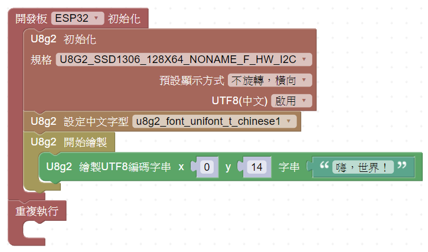

圖片說明：此圖對應「OLED 顯示中文畫面」，位於「程式說明 2：」相關內容中，主要用來輔助說明 1. 將 OLED 顯示器初始化，設定 UTF8(中文)「啟用」。 2. 設定顯示中文的字型為「u8g2_font_unifont_t_chinese1」。

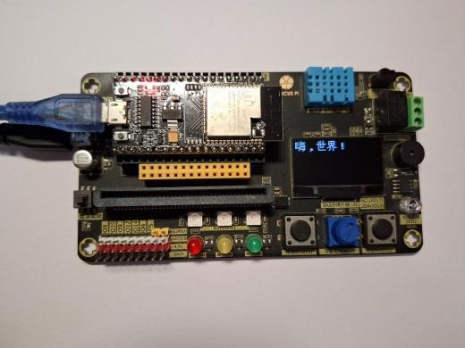

圖片說明：這是本頁第 2 張重點圖片，位於「程式說明 2：」相關內容中，主要用來輔助說明 1. 將 OLED 顯示器初始化，設定 UTF8(中文)「啟用」。 2. 設定顯示中文的字型為「u8g2_font_unifont_t_chinese1」。

圖片說明：這是本頁第 3 張重點圖片，位於「程式說明 2：」相關內容中，主要用來輔助說明 1. 將 OLED 顯示器初始化，設定 UTF8(中文)「啟用」。 2. 設定顯示中文的字型為「u8g2_font_unifont_t_chinese1」。

## 第 6 頁

程式說明 3：
1. 將 OLED 顯示器初始化，設定 UTF8(中文)「停用」。
2. 設定 logo 為 40X40 的「太陽圖示」。
3. 以整頁的方式，先清除 OLED 顯示的內容，再顯示積木 4。
4. 設定 OLED 顯示 logo，起始位置為 x 軸：0、y 軸：0，寬度：40、高度 40。
程式中首先設定 OLED 顯示器的規格、橫向顯示及停用中文，接著設定以圖
片方式顯示的圖示，因為不是顯示文字，所以不用設定字型，最後設定顯示 logo
圖片的大小及起始位置 ， 圖片顯示的起始位置為該圖的左側上方 ， 如圖3-6 所示，
請注意！圖片與文字顯示的起始位置不同。
圖 3-6 OLED 顯示圖片的起始位置
執行結果 3：
程式執行後，OLED 顯示模組顯示「太陽圖示」，如圖 3-7 所示。
1
2
3
4
範例程式：ch3_1_3

### 圖片

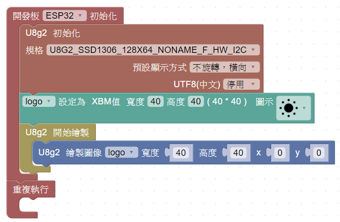

圖片說明：此圖對應「OLED 顯示圖片的起始位置」，位於「程式說明 3：」相關內容中，主要用來輔助說明 1. 將 OLED 顯示器初始化，設定 UTF8(中文)「停用」。 2. 設定 logo 為 40X40 的「太陽圖示」。

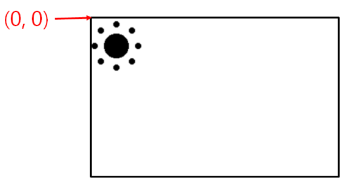

圖片說明：這是本頁第 2 張重點圖片，位於「程式說明 3：」相關內容中，主要用來輔助說明 1. 將 OLED 顯示器初始化，設定 UTF8(中文)「停用」。 2. 設定 logo 為 40X40 的「太陽圖示」。

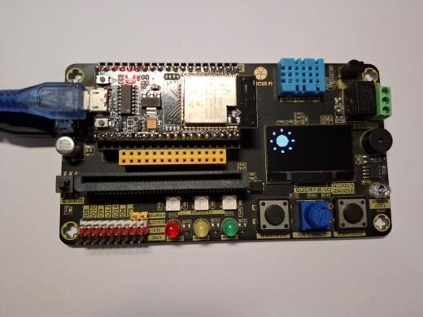

圖片說明：這是本頁第 3 張重點圖片，位於「程式說明 3：」相關內容中，主要用來輔助說明 1. 將 OLED 顯示器初始化，設定 UTF8(中文)「停用」。 2. 設定 logo 為 40X40 的「太陽圖示」。

圖片說明：這是本頁第 4 張重點圖片，位於「程式說明 3：」相關內容中，主要用來輔助說明 1. 將 OLED 顯示器初始化，設定 UTF8(中文)「停用」。 2. 設定 logo 為 40X40 的「太陽圖示」。

## 第 7 頁

圖 3-7 OLED 顯示圖示畫面
積木程式 4—圖片顯示：
程式說明 4：
1. 將 OLED 顯示器初始化，設定 UTF8(中文)「停用」。
2. 設定 logo 為「福爾摩沙圖片」。
3. 以整頁的方式，先清除 OLED 顯示的內容，再顯示積木 4。
4. 設定 OLED 顯示 logo，起始位置為 x 軸：0、y 軸：0，寬度：128、高度 64。
OLED 圖片顯示積木設定前要先準備好圖片檔案，圖片的顏色必須是黑白，
大小不可超過 128X64 畫素，設定步驟說明如下：
步驟 1：將 OLED 圖片顯示積木拖曳道成事編輯區，接著點選積木上「放大鏡圖
示」。
步驟 2：從彈出視窗中選好圖片檔案 ， 此處以「ch3_1_4.png」為例 ， 接著點選「開
啟」。
1
2
3
4
範例程式：ch3_1_4

### 圖片

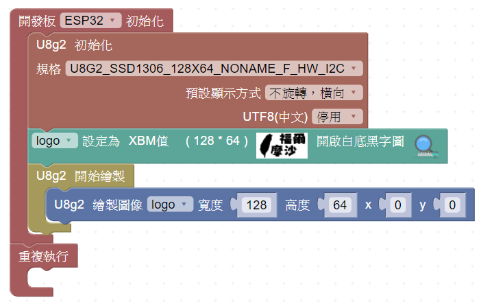

圖片說明：此圖對應「OLED 顯示圖示畫面」，位於「圖 3-7 OLED 顯示圖示畫面」相關內容中，主要用來輔助說明 積木程式 4—圖片顯示： 1. 將 OLED 顯示器初始化，設定 UTF8(中文)「停用」。

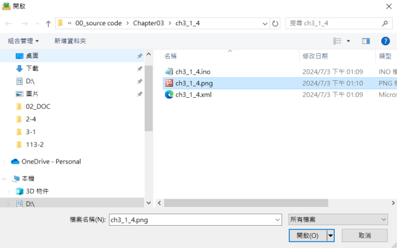

圖片說明：這是本頁第 2 張重點圖片，位於「圖 3-7 OLED 顯示圖示畫面」相關內容中，主要用來輔助說明 積木程式 4—圖片顯示： 1. 將 OLED 顯示器初始化，設定 UTF8(中文)「停用」。

圖片說明：這是本頁第 3 張重點圖片，位於「圖 3-7 OLED 顯示圖示畫面」相關內容中，主要用來輔助說明 積木程式 4—圖片顯示： 1. 將 OLED 顯示器初始化，設定 UTF8(中文)「停用」。

## 第 8 頁

步驟 3：觀察設定完成的積木，出現我們所選的圖片縮圖，另外還會出現圖片的
尺寸，此處以 128X64 畫素為例。
程式中首先設定 OLED 顯示器的規格、橫向顯示及停用中文，接著設定以圖
片方式顯示的圖示，因為不是顯示文字，所以不用設定字型，最後設定顯示logo
圖片的大小及起始位置 ， 圖片顯示的起始位置為該圖的左側上方 ， 如圖3-6 所示，
請注意！圖片與文字顯示的起始位置不同。
執行結果 4：
程式執行後，OLED 顯示模組顯示「福爾摩沙圖片」，如圖 3-8 所示。
圖 3-8 OLED 顯示圖片畫面
延伸練習：
1. 使用 OLED 顯示器，以中文顯示電位計及光感測器的數值，例如：
電位計：1025
光感：2135
2. 以 Cnava 製作 128X64 的黑白圖片，並在 OLED 顯示器中顯示。

### 圖片

圖片說明：此圖對應「OLED 顯示圖片畫面」，位於「步驟 3：觀察設定完成的積木，出現我們所選的圖片縮圖，另外還會出現圖片的」相關內容中，主要用來輔助說明 步驟 3：觀察設定完成的積木，出現我們所選的圖片縮圖，另外還會出現圖片的 尺寸，此處以 128X64 畫素為例。

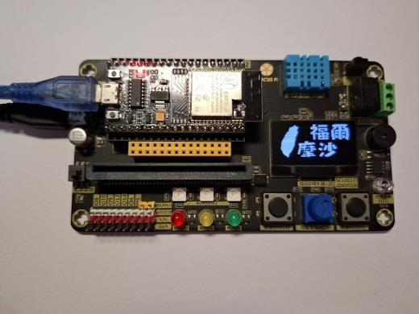

圖片說明：這是本頁第 2 張重點圖片，位於「步驟 3：觀察設定完成的積木，出現我們所選的圖片縮圖，另外還會出現圖片的」相關內容中，主要用來輔助說明 步驟 3：觀察設定完成的積木，出現我們所選的圖片縮圖，另外還會出現圖片的 尺寸，此處以 128X64 畫素為例。

## 第 9 頁

3-2 WS-2812 LED 控制
在 2-1 節介紹過 LED 模組 ，EZ Start Kit 中還有另一種 LED 模組 ， 稱為WS-2182
LED 模組， 其位置為圖3-10 所示 ，WS-2812 LED 模組由 ES-2812 RGB LED 所組成，
如圖 3-9 所示，名字叫做 RGB 代表由三顆 LED 所組成，分別是紅色(Red)、綠色
(Green)及藍色(Blue)，這三種顏色就是光的三原色，我們可以使用這三種顏色組
合出各式各樣的顏色。
圖 3-9 WS-2812 RGB LED 圖 3-10 EZ Start Kit 中 WS-2812 LED 的位置
WS-2812 RGB LED 的每顆 LED 都有控制晶片，還有數位輸入(DI)及數位輸出
(DO)，並且以串聯的方式連接，如圖 3-11，每顆 LED 都有數位輸入(DI)使用串聯
連接的好處是控制信號只需一條，無需複雜的接線，安裝施工非常方便，所以許
多廣告燈或展場燈會使用，不過使用數量非常大時，要注意電源的電流夠大。
圖 3-11 控制系統方塊圖
本節首先介紹使用積木上的色盤控制 LED 的發光顏色，再介紹使用 RGB 值
控制 LED 的發光顏色，最後介紹使用迴圈方式控制 LED，可讓程式更簡潔。
使用積木：
積木選單 積木 說明
法蘭斯積木/
WS2812條燈
WS2812 初始化積木，功用 為設
定控制接腳及全部 LED 的數量。
法蘭斯積木/
WS2812條燈
WS2812 亮度積木，功用為控制
LED 發光的亮度，其可調的亮度
範圍為 0~255。

### 圖片

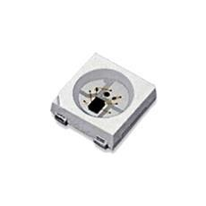

圖片說明：此圖對應「WS-2812 RGB LED 圖 3-10 EZ Start Kit 中 WS-2812 LED 的位置」，位於「3-2 WS-2812 LED 控制」相關內容中，主要用來輔助說明 3-2 WS-2812 LED 控制 在 2-1 節介紹過 LED 模組 ，EZ Start Kit 中還有另一種 LED 模組 ， 稱為WS-2182。

圖片說明：此圖對應「控制系統方塊圖」，位於「3-2 WS-2812 LED 控制」相關內容中，主要用來輔助說明 3-2 WS-2812 LED 控制 在 2-1 節介紹過 LED 模組 ，EZ Start Kit 中還有另一種 LED 模組 ， 稱為WS-2182。

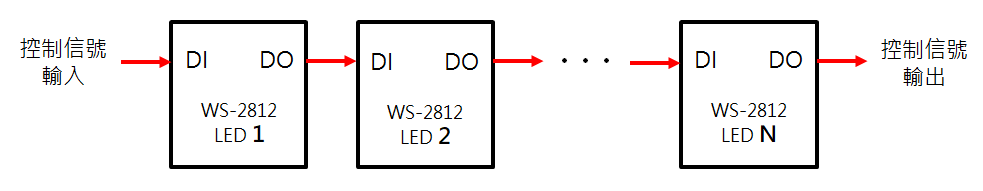

圖片說明：這是本頁第 3 張重點圖片，位於「3-2 WS-2812 LED 控制」相關內容中，主要用來輔助說明 3-2 WS-2812 LED 控制 在 2-1 節介紹過 LED 模組 ，EZ Start Kit 中還有另一種 LED 模組 ， 稱為WS-2182。

## 第 10 頁

法蘭斯積木/
WS2812條燈
WS2812 清除亮燈積木，功用為
讓全部 LED 變滅。
法蘭斯積木/
WS2812條燈
WS2812 調色盤顏色控制積木，
功用為控制 LED 發光的顏色，其
可調參數為 LED 的編號及調色盤
內的顏色。
法蘭斯積木/
WS2812條燈
WS2812 RGB 數值控制積木， 功用
為功用為控制 LED 發光的顏色，
其可調參數為 LED 的編號及 RGB
數值的大小。
使用元件及接腳：
元件名稱 IO 編號 實際接腳
WS-2812 RGB LED IO16 GPIO26
積木程式 1—調色盤顏色控制 LED：
程式說明 1：
初始化部分：
1. 初始化 WS-2812 LED，設定腳位為 26，燈數為 3。。
2. 設定亮度為 100。
3. 將全部 LED 設定為暗。
4. 將 WS-2812 LED 燈號 1 設定為調色盤中的紅色。
5. 將 WS-2812 LED 燈號 2 設定為調色盤中的藍色。
6. 將 WS-2812 LED 燈號 3 設定為調色盤中的綠色。
WS-2812 的初始化設定包括控制接腳、LED 數量、LED 亮度及全部 LED 調整
為暗，其中特別注意 LED 亮度在測試時，避免設定超過 100，如果需要設定超過
範例程式：ch3_2_1
1
2
3
4
5
6

### 圖片

圖片說明：這是本頁第 1 張重點圖片，位於「法蘭斯積木/」相關內容中，主要用來輔助說明 WS2812 清除亮燈積木，功用為 讓全部 LED 變滅。

圖片說明：這是本頁第 2 張重點圖片，位於「法蘭斯積木/」相關內容中，主要用來輔助說明 WS2812 清除亮燈積木，功用為 讓全部 LED 變滅。

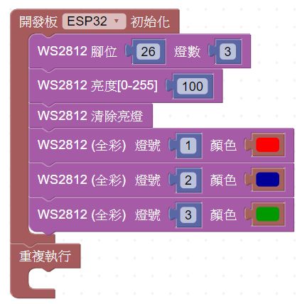

圖片說明：這是本頁第 3 張重點圖片，位於「法蘭斯積木/」相關內容中，主要用來輔助說明 WS2812 清除亮燈積木，功用為 讓全部 LED 變滅。

圖片說明：這是本頁第 4 張重點圖片，位於「法蘭斯積木/」相關內容中，主要用來輔助說明 WS2812 清除亮燈積木，功用為 讓全部 LED 變滅。

## 第 11 頁

100 的亮度，在測試時，避免長時間直視 LED，以免視力受損。另外，調色盤設
定顏色時，挑選合適的顏色，如果沒有合適的顏色，請改用範例 3-2-2 的方式設
定顏色。
執行結果 1：
程式下載完成後 ，WS-2812 LED 依序顯示紅色 、 藍色及綠色 ， 如圖3-12 所示。
圖 3-12 WS-2812 顯示紅藍綠色
積木程式 2—RGB 數值控制 LED：
程式說明 2：
初始化部分：
1. 初始化 WS-2812 LED，設定腳位為 26，燈數為 3。。
2. 設定亮度為 100。
3. 將全部 LED 設定為暗。
4. 將 WS-2812 LED 燈號 1 設定 R 為 255，G 為 0，B 為 0。
5. 將 WS-2812 LED 燈號 2 設定 R 為 0，G 為 255，B 為 0。
6. 將 WS-2812 LED 燈號 3 設定 R 為 0，G 為 0，B 為 255。
本程式以顯示紅色、綠色及藍色為範例，不過我們可以調整 RGB 的數值，
調成想要顯示的顏色，例如 R 設為 255 及 G 設為 255 可以顯示黃色，又如 R 設
1
2
3
範例程式：ch3_2_2
4
5
6

### 圖片

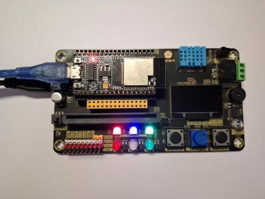

圖片說明：此圖對應「WS-2812 顯示紅藍綠色」，位於「100 的亮度，在測試時，避免長時間直視 LED，以免視力受損。另外，調色盤設」相關內容中，主要用來輔助說明 100 的亮度，在測試時，避免長時間直視 LED，以免視力受損。另外，調色盤設 定顏色時，挑選合適的顏色，如果沒有合適的顏色，請改用範例 3-2-2 的方式設。

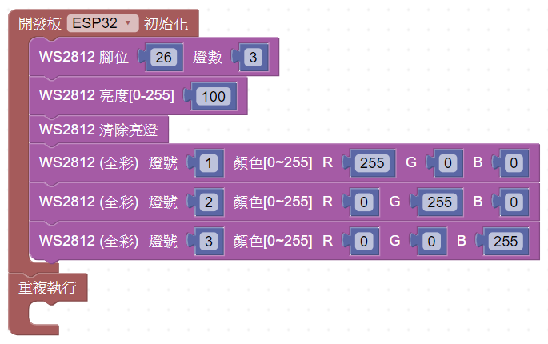

圖片說明：這是本頁第 2 張重點圖片，位於「100 的亮度，在測試時，避免長時間直視 LED，以免視力受損。另外，調色盤設」相關內容中，主要用來輔助說明 100 的亮度，在測試時，避免長時間直視 LED，以免視力受損。另外，調色盤設 定顏色時，挑選合適的顏色，如果沒有合適的顏色，請改用範例 3-2-2 的方式設。

圖片說明：這是本頁第 3 張重點圖片，位於「100 的亮度，在測試時，避免長時間直視 LED，以免視力受損。另外，調色盤設」相關內容中，主要用來輔助說明 100 的亮度，在測試時，避免長時間直視 LED，以免視力受損。另外，調色盤設 定顏色時，挑選合適的顏色，如果沒有合適的顏色，請改用範例 3-2-2 的方式設。

## 第 12 頁

為 255 及 B 設為 255 可以顯示紫色。
執行結果 2：
程式下載完成後，WS-2812 LED 依序顯示紅色、綠色及藍色，如圖 3-13
所示。
圖 3-13 WS-2812 顯示紅綠藍色
積木程式 3—調色盤顏色控制 LED：
程式說明 3：
初始化部分：
1. 初始化 WS-2812 LED，設定腳位為 26，燈數為 3。。
2. 設定亮度為 100。
3. 將全部 LED 設定為暗。
重複執行部分：
4. 循環計次迴圈，計次變數 i 的初始值為 1，終值為 3，間隔數為 1，亦即迴圈
範例程式：ch3_2_3
1
2
3
4
5
6
7
8
9
10
11
12

### 圖片

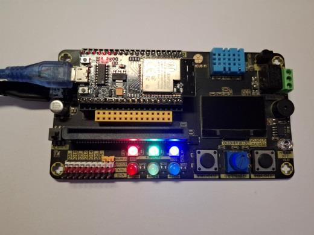

圖片說明：此圖對應「WS-2812 顯示紅綠藍色」，位於「為 255 及 B 設為 255 可以顯示紫色。」相關內容中，主要用來輔助說明 為 255 及 B 設為 255 可以顯示紫色。 程式下載完成後，WS-2812 LED 依序顯示紅色、綠色及藍色，如圖 3-13。

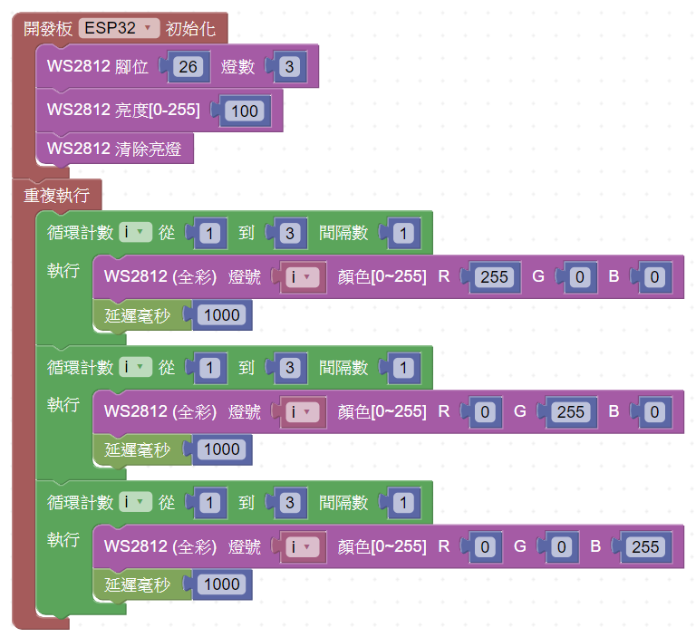

圖片說明：這是本頁第 2 張重點圖片，位於「為 255 及 B 設為 255 可以顯示紫色。」相關內容中，主要用來輔助說明 為 255 及 B 設為 255 可以顯示紫色。 程式下載完成後，WS-2812 LED 依序顯示紅色、綠色及藍色，如圖 3-13。

## 第 13 頁

會重複執行 3 次，變數在每次迴圈的變化值為 1、2、3，迴圈會重複執行積木 5
及積木 6。
5. 將 WS-2812 LED 燈號以變數 i 的內容值，設定 R 為 255，G 為 0，B 為 0。
6. 延遲 1000 毫秒(1 秒)。
7. 循環計次迴圈，計次變數 i 的初始值為 1，終值為 3，間隔數為 1，亦即迴圈
會重複執行 3 次，變數在每次迴圈的變化值為 1、2、3，迴圈會重複執行積木 8
及積木 9。
8. 將 WS-2812 LED 燈號以變數 i 的內容值，設定 R 為 0，G 為 255，B 為 0。
9. 延遲 1000 毫秒(1 秒)。
10. 循環計次迴圈，計次變數 i 的初始值為 1，終值為 3，間隔數為 1，亦即迴圈
會重複執行 3 次，變數在每次迴圈的變化值為 1、2、3，迴圈會重複執行積木 11
及積木 12。
11. 將 WS-2812 LED 燈號以變數 i 的內容值，設定 R 為 0，G 為 0，B 為 255。
12. 延遲 1000 毫秒(1 秒)。
程式中我們使用迴圈設定 WS-2812 LED 的顯示顏色 ， 特別是LED 的數量非常
大時，這個方法非常適合。
執行結果 3：
程式下載完成後，WS-2812 依序從左到右變成紅色，如圖3-14(a)，接著依序
從左到右變成綠色，如圖 3-14(b)，最後依序從左到右變成藍色，如圖 3-14(c)，
依此不斷循環。
圖 3-14 WS-2812 顯示不同顏色 (a)顯示紅色 (b)顯示綠色 (c)顯示藍色
延伸練習：
請使用 WS-2812 LED 模組，設計園遊會中吸引目光的廣告燈。
(a)
(b)
(c)

### 圖片

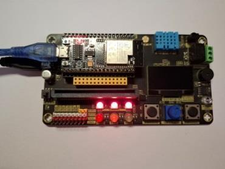

圖片說明：此圖對應「WS-2812 顯示不同顏色 (a)顯示紅色 (b)顯示綠色 (c)顯示藍色」，位於「會重複執行 3 次，變數在每次迴圈的變化值為 1、2、3，迴圈會重複執行積木 5」相關內容中，主要用來輔助說明 會重複執行 3 次，變數在每次迴圈的變化值為 1、2、3，迴圈會重複執行積木 5 5. 將 WS-2812 LED 燈號以變數 i 的內容值，設定 R 為 255，G 為 0，B。

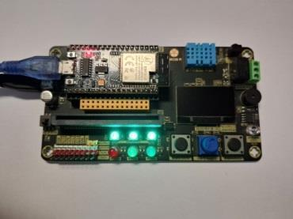

圖片說明：這是本頁第 2 張重點圖片，位於「會重複執行 3 次，變數在每次迴圈的變化值為 1、2、3，迴圈會重複執行積木 5」相關內容中，主要用來輔助說明 會重複執行 3 次，變數在每次迴圈的變化值為 1、2、3，迴圈會重複執行積木 5 5. 將 WS-2812 LED 燈號以變數 i 的內容值，設定 R 為 255，G 為 0，B。

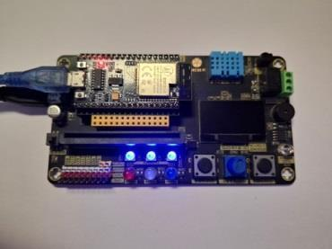

圖片說明：這是本頁第 3 張重點圖片，位於「會重複執行 3 次，變數在每次迴圈的變化值為 1、2、3，迴圈會重複執行積木 5」相關內容中，主要用來輔助說明 會重複執行 3 次，變數在每次迴圈的變化值為 1、2、3，迴圈會重複執行積木 5 5. 將 WS-2812 LED 燈號以變數 i 的內容值，設定 R 為 255，G 為 0，B。

## 第 14 頁

3-3 蜂鳴器模組播放音樂
目前我們介紹過的輸出模組都是視覺型，如 LED 模組、WS-2812 LED 模組及
OLED 顯示器模組，不過也會經常用到聽覺型的輸出模組，EZ Start Kit 的蜂鳴器
模組就是聽覺型的輸出模組，蜂鳴器模組主要由蜂鳴器組成，蜂鳴器如圖 3-15
所示，蜂鳴器就是我們平常講的喇叭，它靠震動空氣發出聲音，我們可以使用
ESP32 以不同震動頻率 ， 讓蜂鳴器發出不同頻率的聲音， 蜂鳴器模組在EZ Start Kit
中的位置，如圖 3-16 所示。
圖 3-15 蜂鳴器 圖 3-16 EZ Start Kit 中 LED 模組的位置
程式設計時我們可以把功能獨立的程式寫成函式(Function)，以函式設計程
式的方式稱為模組化的程式設計， 本節介紹函式的寫法 ， 使用函式設計程式的優
點有可重複使用、降低程式長度以及容易找錯誤等。
函式為功能獨立的程式 ， 當函式寫好後 ， 程式編輯區的顯示如圖 3-18 所示，
圖中左側的程式稱為主程式，右側則為函式，當主程式中呼叫 AlarmSound 函式
時 ， 程式會轉換到AlarmSound 函式的程式中執行 ，接著 AlarmSound 函式程式由
上而下執行，當 AlarmSound 函式程式執行結束後，再回到主程式中呼叫函式下
方的時間延遲積木繼續執行。
圖 3-18 主程式與函式的運作
本節首先介紹以頻率的設定發出救護車的警報聲 ， 接著介紹歌曲小蜜蜂片段
的演奏程式，範例全部使用函式的寫法。

### 圖片

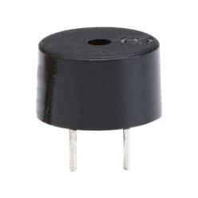

圖片說明：此圖對應「蜂鳴器 圖 3-16 EZ Start Kit 中 LED 模組的位置」，位於「3-3 蜂鳴器模組播放音樂」相關內容中，主要用來輔助說明 3-3 蜂鳴器模組播放音樂 目前我們介紹過的輸出模組都是視覺型，如 LED 模組、WS-2812 LED 模組及。

圖片說明：此圖對應「主程式與函式的運作」，位於「3-3 蜂鳴器模組播放音樂」相關內容中，主要用來輔助說明 3-3 蜂鳴器模組播放音樂 目前我們介紹過的輸出模組都是視覺型，如 LED 模組、WS-2812 LED 模組及。

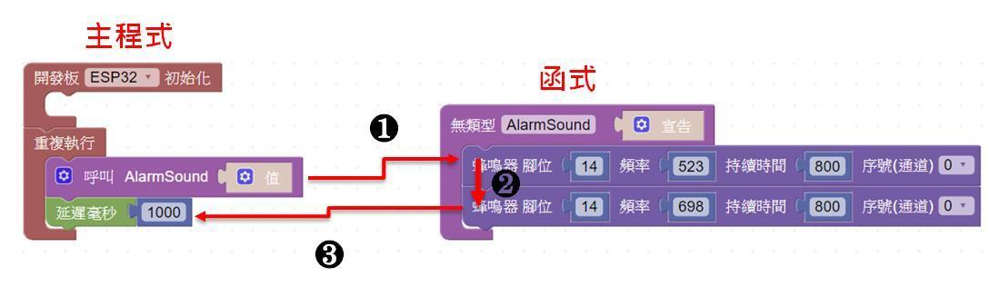

圖片說明：這是本頁第 3 張重點圖片，位於「3-3 蜂鳴器模組播放音樂」相關內容中，主要用來輔助說明 3-3 蜂鳴器模組播放音樂 目前我們介紹過的輸出模組都是視覺型，如 LED 模組、WS-2812 LED 模組及。

## 第 15 頁

使用積木：
積木選單 積木 說明
法蘭斯積木/
蜂鳴器
蜂鳴器頻率發聲積木，功用為控
制蜂鳴器發出設定頻率的聲音，
可調整的參數為腳位、頻率、持
續的時間及通道，其中持續時間
的單位為毫秒。
函式
函式定義積木，功用為定義函式
名稱，以及設定函式內的功能程
式。
函式
函式呼叫積木，功能為呼叫涵式
的執行。。
法蘭斯積木/
蜂鳴器
蜂鳴器音階發聲積木，功用為控
制蜂鳴器發出設定音階的聲音，
可調整的參數為腳位、頻率、持
續的時間及通道，其中持續時間
的單位為毫秒。
使用元件及接腳：
元件名稱 IO 編號 實際接腳
蜂鳴器 IO0 GPIO14
積木程式 1—救護車警報：
程式說明 1：
重複執行部分：
範例程式：ch3_3_1
1
2
3
4
6
5
7
8
9

### 圖片

圖片說明：這是本頁第 1 張重點圖片，位於「使用積木：」相關內容中，主要用來輔助說明 積木選單 積木 說明 蜂鳴器頻率發聲積木，功用為控。

圖片說明：這是本頁第 2 張重點圖片，位於「使用積木：」相關內容中，主要用來輔助說明 積木選單 積木 說明 蜂鳴器頻率發聲積木，功用為控。

圖片說明：這是本頁第 3 張重點圖片，位於「使用積木：」相關內容中，主要用來輔助說明 積木選單 積木 說明 蜂鳴器頻率發聲積木，功用為控。

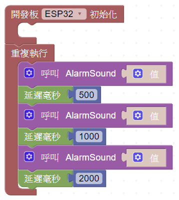

圖片說明：這是本頁第 4 張重點圖片，位於「使用積木：」相關內容中，主要用來輔助說明 積木選單 積木 說明 蜂鳴器頻率發聲積木，功用為控。

## 第 16 頁

1. 呼叫 Alarm 函式。
2. 延遲 500 毫秒(0.5 秒)。
3. 呼叫 Alarm 函式。
4. 延遲 1000 毫秒(1 秒)。
5. 呼叫 Alarm 函式。
6. 延遲 2000 毫秒(2 秒)。
AlarmSound 函式：
7. 定義函式名稱為 AlarmSound。
8. 讓蜂鳴器發出 523Hz 的聲音，持續 0.8 秒。
9. 讓蜂鳴器發出 698Hz 的聲音，持續 0.8 秒。
函式定義積木中函式名稱的設定，需要用滑鼠點選「myFunc」後，myFunc
反白時，如圖 3-19 所示，即可修改函式名稱。
圖 3-19 函式名稱修改
程式中以函式方式，將發聲功能寫成獨立的 AlarmSound 函式，並在主程式
中呼叫該函式，如果函式的程式很長，以函式的寫法，可以讓主程式變得簡短易
讀 ， 且函式可以重複使用 。程式第一次呼叫 AlarmSound 函式會發出一次警報聲，
然後延遲 0.5 秒，第二次呼叫AlarmSound 函式，再發出一次警報聲，然後延遲1
秒，第三次呼叫 AlarmSound 函式，再發出一次警報聲，然後延遲 2 秒，進入重
複執行。
執行結果 1：
本範例程式為蜂鳴器發音，無觀察畫面，聆聽聲音，可聽到第一次警報聲，
再等 0.5 秒後，聽到第二次警報聲，再等 1 秒後，聽到第三次警報聲，再等 2 秒
後進入循環。
積木程式 2—歌曲小蜜蜂演奏：
1
2
範例程式：ch3_3_2

### 圖片

圖片說明：此圖對應「函式名稱修改」，位於「1. 呼叫 Alarm 函式。」相關內容中，主要用來輔助說明 1. 呼叫 Alarm 函式。 2. 延遲 500 毫秒(0.5 秒)。

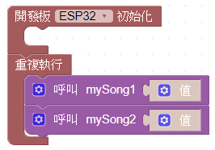

圖片說明：這是本頁第 2 張重點圖片，位於「1. 呼叫 Alarm 函式。」相關內容中，主要用來輔助說明 1. 呼叫 Alarm 函式。 2. 延遲 500 毫秒(0.5 秒)。

圖片說明：這是本頁第 3 張重點圖片，位於「1. 呼叫 Alarm 函式。」相關內容中，主要用來輔助說明 1. 呼叫 Alarm 函式。 2. 延遲 500 毫秒(0.5 秒)。

圖片說明：這是本頁第 4 張重點圖片，位於「1. 呼叫 Alarm 函式。」相關內容中，主要用來輔助說明 1. 呼叫 Alarm 函式。 2. 延遲 500 毫秒(0.5 秒)。

## 第 17 頁

程式說明 2：
重複執行部分：
1. 呼叫 mySong1 函式。
2. 呼叫 mySong1 函式。
mySong1 函式部分：
3. 定義函式名稱為 mySong1，並設定函式內的功能程式為積木 4 至積木 7。
4. 讓蜂鳴器發出 Sol(G5)的聲音，持續 0.5 秒。
5. 讓蜂鳴器發出 Mi(E5)的聲音，持續 0.5 秒。
6. 讓蜂鳴器發出 Mi(E5)的聲音，持續 0.5 秒。。
7. 延遲 500 毫秒(0.5 秒)。
mySong2 函式部分：
8. 定義函式名稱為 mySong2，並設定函式內的功能程式為積木 9 至積木 12。
9. 讓蜂鳴器發出 Fa(F5)的聲音，持續 0.5 秒。
10. 讓蜂鳴器發出 Re(D5)的聲音，持續 0.5 秒。
11. 讓蜂鳴器發出 Re(D5)的聲音，持續 0.5 秒。
12. 延遲 500 毫秒(0.5 秒)。
程式中有兩個函式分別是 mySong1 及 mySong2，這兩個函式分別演奏兒歌
的第一小節及第二小節，從唱音或簡譜數字要轉換成音階，可查詢表 3-1，我們
撰寫歌曲演奏的程式，可以使用函式的寫法，讓程式更為簡短，也讓函式可以重
複使用，請參考本節的延伸練習。
3
4
5
6
7
8
9
10
11
12

### 圖片

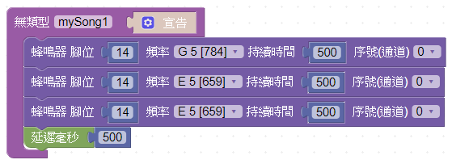

圖片說明：這是本頁第 1 張重點圖片，位於「程式說明 2：」相關內容中，主要用來輔助說明 1. 呼叫 mySong1 函式。 2. 呼叫 mySong1 函式。

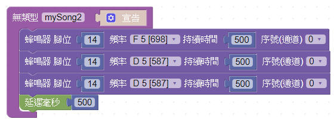

圖片說明：這是本頁第 2 張重點圖片，位於「程式說明 2：」相關內容中，主要用來輔助說明 1. 呼叫 mySong1 函式。 2. 呼叫 mySong1 函式。

## 第 18 頁

表 3-1 簡譜對照表
數字 1 2 3 4 5 6 7
音階 C D E F G A B
唱名 Do Re Mi Fa Sol La Si
執行結果 2：
本範例程式為蜂鳴器發音，無觀察畫面，聆聽聲音，可聽到兒歌小蜜蜂
的演奏 So Mi Mi Fa Re Re。
延伸練習：
小蜜蜂
| 5 3 3 - | 4 2 2 - | 1 2 3 4 | 5 5 5 - |
| 5 3 3 - | 4 2 2 - | 1 3 5 5 | 3 - 0 0 |
| 2 2 2 2 | 2 3 4 - | 3 3 3 3 | 3 4 5 - |
| 5 3 3 - | 4 2 2 - | 1 3 5 5 | 1 - 0 0 |
請觀察小蜜蜂的簡譜，找出重複之處，再決定使用幾個函式撰寫程式，可以
讓演奏小蜜蜂的程式最簡短，最後完成演奏小蜜蜂的程式設計。

## 第 19 頁

3-4 數位溫濕度計
我們要實作數位溫濕度計 ， 需要溫濕度感測器 ， 市面上容易取得的溫濕度感
測器為 DHT11，如圖 3-20 所示，DHT11 可同時感測溫度及相對濕度，EZ Start Kit
所使用的 DHT11 為四支接腳，另外還有一種是三支接腳，接線時要特別注意。
DHT11 在 EZ Start Kit 的位置，如圖 3-21 所示。
圖 3-20 DHT11 圖 3-21 EZ Start Kit 中 DHT11 模組的位置
當開始著手製作專案作品時 ， 會把製作流程分為設計及實作兩個階段 ，首先
設計階段是在做系統性的規劃 ， 根據作品的功能及使用的場景等，做好全面性的
規劃，在設計階段常會使用由上而下(Top-down)的設計，先有整體的概念，再逐
步加入細部的描述。
以數位溫濕度計的設計為例 ， 我們依據日常生活所見的溫濕度計來看 ， 須要
溫濕度感測及顯示感測結果 ， 最後是可以整合感測及顯示的運算及處理 ， 再以這
個三大功能畫出心智圖，如圖 3-22 所示，接著做每個功能的描述，運算處理由
ESP32 作為運算核心， 溫濕度感測使用DHT11 溫濕度模組作為輸入模組，最後顯
示感測結果使用 OLED 顯示器模組作為輸出模組。
圖 3-22 數位溫濕度計的規劃心智圖
根據圖 3-22 所規劃的心智圖，轉化成為系統方塊圖，如圖 3-23 所示，中間
為運算核心 ESP32，負責運算及處理，左邊為負責輸入的DHT11 溫濕度模組，功
用為溫濕度感測，並將感測的數值送入 ESP32，圖中的箭頭為資料傳輸的方向，
右邊為負責輸出的 OLED 顯示器模組，功用為接收 ESP32 送出的資料，並顯示在
OLED 顯示器。

### 圖片

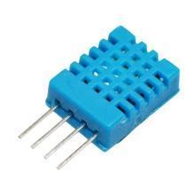

圖片說明：此圖對應「DHT11 圖 3-21 EZ Start Kit 中 DHT11 模組的位置」，位於「3-4 數位溫濕度計」相關內容中，主要用來輔助說明 3-4 數位溫濕度計 我們要實作數位溫濕度計 ， 需要溫濕度感測器 ， 市面上容易取得的溫濕度感。

圖片說明：此圖對應「數位溫濕度計的規劃心智圖」，位於「3-4 數位溫濕度計」相關內容中，主要用來輔助說明 3-4 數位溫濕度計 我們要實作數位溫濕度計 ， 需要溫濕度感測器 ， 市面上容易取得的溫濕度感。

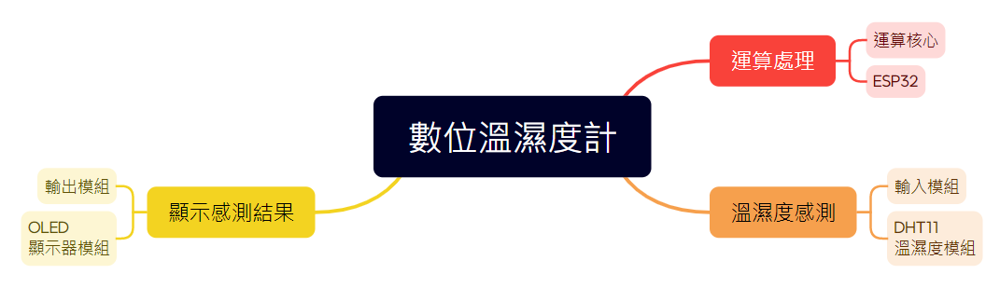

圖片說明：這是本頁第 3 張重點圖片，位於「3-4 數位溫濕度計」相關內容中，主要用來輔助說明 3-4 數位溫濕度計 我們要實作數位溫濕度計 ， 需要溫濕度感測器 ， 市面上容易取得的溫濕度感。

## 第 20 頁

圖 3-23 數位溫濕度計的系統方塊圖
當我們設計完成，開始進入第二階段實作，實作階段會採用由下而上
(Button-up)的方式組合，先完成基本模組，然後再將這些基本模組阻合起來，由
小到大最後完成整個系統，本系統的基本模組如圖 3-24 所示，我們先完成圖
3-24(a)的感測輸入模組，接著完成圖 3-24(b)的顯示輸出模組，最後將兩個基本
模組組合起來成為圖 3-23 的數位溫濕度計。
圖 3-24 數位溫濕度計的基本模組 (a)感測輸入模組 (b) 顯示輸出模組
在 3-3 節介紹過函式的概念，本節以由下而上方式實作，繼續使用函式做模
組的組合，不過我們會使用函式的『引數』及『參數』 ，讓函式更具使用的彈性，
如圖 3-25 所示，呼叫函式時，可以使用引數傳送數值到函式，函式以參數接收
傳送過來的數值，簡單來說，呼叫函式時，引數的內容值會複製給參數，讓參數
在函式中使用。
圖 3-25 函式傳值呼叫
本節以圖 3-24 的順序，首先介紹 DHT11 溫濕度模組的基本用法，接著複習
OLED 顯示器的基本功能，最後以函式的方式設計程式，將兩個模組合併成為數
位溫濕度計。
使用積木：
積木選單 積木 說明
法蘭斯積木/
溫 濕 度 感 測 器
DHT11 溫濕度感測器初始化 積
木，功用為初始化 DHT11 溫濕度
感測器，並設定連接腳位。
(a)
(b)
複製

### 圖片

圖片說明：此圖對應「數位溫濕度計的系統方塊圖」，位於「圖 3-23 數位溫濕度計的系統方塊圖」相關內容中，主要用來輔助說明 當我們設計完成，開始進入第二階段實作，實作階段會採用由下而上 (Button-up)的方式組合，先完成基本模組，然後再將這些基本模組阻合起來，由。

圖片說明：此圖對應「數位溫濕度計的基本模組 (a)感測輸入模組 (b) 顯示輸出模組」，位於「圖 3-23 數位溫濕度計的系統方塊圖」相關內容中，主要用來輔助說明 當我們設計完成，開始進入第二階段實作，實作階段會採用由下而上 (Button-up)的方式組合，先完成基本模組，然後再將這些基本模組阻合起來，由。

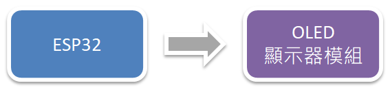

圖片說明：此圖對應「函式傳值呼叫」，位於「圖 3-23 數位溫濕度計的系統方塊圖」相關內容中，主要用來輔助說明 當我們設計完成，開始進入第二階段實作，實作階段會採用由下而上 (Button-up)的方式組合，先完成基本模組，然後再將這些基本模組阻合起來，由。

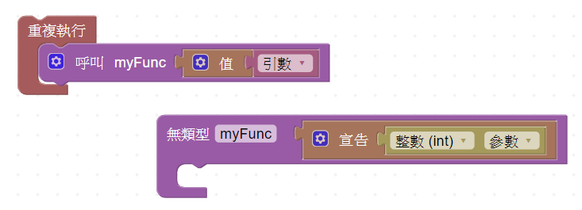

圖片說明：這是本頁第 4 張重點圖片，位於「圖 3-23 數位溫濕度計的系統方塊圖」相關內容中，主要用來輔助說明 當我們設計完成，開始進入第二階段實作，實作階段會採用由下而上 (Button-up)的方式組合，先完成基本模組，然後再將這些基本模組阻合起來，由。

## 第 21 頁

法蘭斯積木/
溫 濕 度 感 測 器
DHT11 溫濕度感測器讀取資料積
木，功用為讀取 DHT11 溫濕度感
測器的資料。
法蘭斯積木/
溫 濕 度 感 測 器
取用 DHT11 溫濕度感測器資料積
木，功能為取用 DHT11 溫濕度感
測器的溫度或相對濕度資料，其
參數可調整為溫度或相對濕度。
使用元件及接腳：
元件名稱 IO 編號 實際接腳
溫濕度感測器 IO7 GPIO15
OLED 顯示器 IO17(SCL) GPIO22
OLED 顯示器 IO18(SDA) GPIO21
積木程式 1—序列埠印出溫濕度感測器的輸入數值：
程式說明 1：
初始化部分：
1. 初始化序列埠連線，設定傳輸速度為 115200。
2. 初始化 DHT11 溫濕度感測器，設定連接腳位為 15。
重複執行部分：
3. 讀取 DHT11 溫濕度感測器的資料。
4. 序列埠印出「溫度 ：」及 DHT11 溫濕度感測器的溫度數值 ， 列印完成後換行。
5. 序列埠印出「相對濕度：」及 DHT11 溫濕度感測器的相對濕度數值，列印完
成後換行。
5. 延遲 1000 毫秒(1 秒)。
本程式說明 DHT11 溫濕度感測器的基本用法，首先在初始化積木中設定
範例程式：ch3_4_1
1
2
3
4
5
6

### 圖片

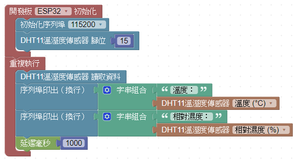

圖片說明：這是本頁第 1 張重點圖片，位於「法蘭斯積木/」相關內容中，主要用來輔助說明 溫 濕 度 感 測 器 DHT11 溫濕度感測器讀取資料積。

圖片說明：這是本頁第 2 張重點圖片，位於「法蘭斯積木/」相關內容中，主要用來輔助說明 溫 濕 度 感 測 器 DHT11 溫濕度感測器讀取資料積。

圖片說明：這是本頁第 3 張重點圖片，位於「法蘭斯積木/」相關內容中，主要用來輔助說明 溫 濕 度 感 測 器 DHT11 溫濕度感測器讀取資料積。

## 第 22 頁

DHT11 的連接腳位，再來必須先讀取 DHT11 溫濕度感測器的資料，才能取用
DHT11 的溫度或相對濕度。
執行結果 1：
程式執行後，打開序列埠監看視窗，可觀察到顯示的溫度及相對濕度，如圖
3-26 所示。
圖 3-26 序列埠顯示 DHT11 溫濕度的結果
積木程式 2—OLED 顯示設定：
程式說明 2：
初始化部分：
1. 將 OLED 顯示器初始化，設定 UTF8(中文)「啟用」。
2. 設定顯示中文的字型為「u8g2_font_unifont_t_chinese1」。
3. 以整頁的方式 ， 先清除OLED 顯示的內容 ， 再顯示積木4 及積木 5 的設定內容。
4. 設定 OLED 顯示起始位置為 x 軸：0、y 軸：14，內容為「溫度：」。
5. 設定 OLED 顯示起始位置為 x 軸：0、y 軸：32，內容為「相對濕度：」。
1
2
3
範例程式：ch3_4_2
4
5

### 圖片

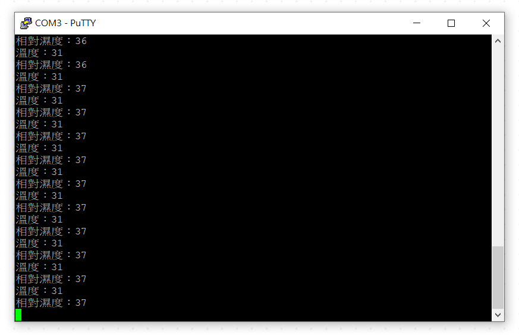

圖片說明：此圖對應「序列埠顯示 DHT11 溫濕度的結果」，位於「3-26 所示。」相關內容中，主要用來輔助說明 DHT11 的連接腳位，再來必須先讀取 DHT11 溫濕度感測器的資料，才能取用 DHT11 的溫度或相對濕度。

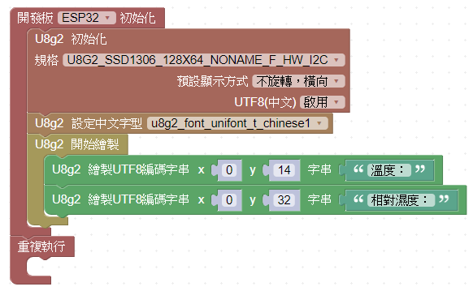

圖片說明：這是本頁第 2 張重點圖片，位於「3-26 所示。」相關內容中，主要用來輔助說明 DHT11 的連接腳位，再來必須先讀取 DHT11 溫濕度感測器的資料，才能取用 DHT11 的溫度或相對濕度。

## 第 23 頁

我們來複習 OLED 顯示器模組的用法，首先初始化將 UTF8(中文)啟動，再來
設定中文顯示字型 ， 最後顯示的部分以整頁方式顯示 ， 同時顯示兩列不同的文字 ，
記得將顯示得起始位調整正確，以免顯示位置重複而相互遮蓋。。
執行結果 2：
程式執行後，可觀察 OLED 顯示「溫度：」及「相對濕度：」，如圖 3-27 所
示。
圖 3-27 可變電阻控制 LED 亮度
積木程式 3—數位溫濕度計：
範例程式：ch3_4_3
1
2
3
4
5
6
7
8
9
10
11
12

### 圖片

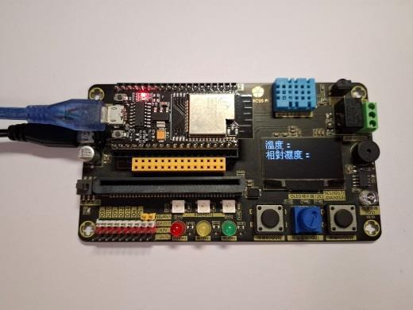

圖片說明：此圖對應「可變電阻控制 LED 亮度」，位於「我們來複習 OLED 顯示器模組的用法，首先初始化將 UTF8(中文)啟動，再來」相關內容中，主要用來輔助說明 我們來複習 OLED 顯示器模組的用法，首先初始化將 UTF8(中文)啟動，再來 設定中文顯示字型 ， 最後顯示的部分以整頁方式顯示 ， 同時顯示兩列不同的文字。

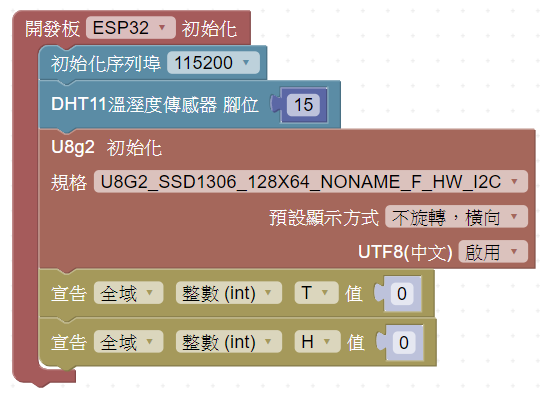

圖片說明：這是本頁第 2 張重點圖片，位於「我們來複習 OLED 顯示器模組的用法，首先初始化將 UTF8(中文)啟動，再來」相關內容中，主要用來輔助說明 我們來複習 OLED 顯示器模組的用法，首先初始化將 UTF8(中文)啟動，再來 設定中文顯示字型 ， 最後顯示的部分以整頁方式顯示 ， 同時顯示兩列不同的文字。

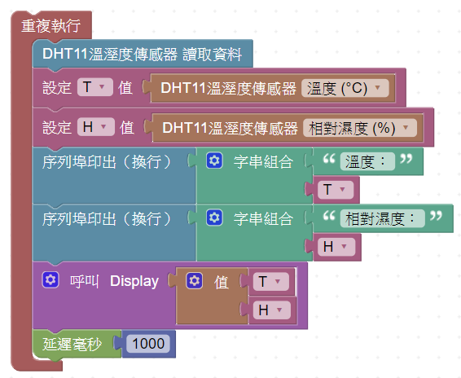

圖片說明：這是本頁第 3 張重點圖片，位於「我們來複習 OLED 顯示器模組的用法，首先初始化將 UTF8(中文)啟動，再來」相關內容中，主要用來輔助說明 我們來複習 OLED 顯示器模組的用法，首先初始化將 UTF8(中文)啟動，再來 設定中文顯示字型 ， 最後顯示的部分以整頁方式顯示 ， 同時顯示兩列不同的文字。

圖片說明：這是本頁第 4 張重點圖片，位於「我們來複習 OLED 顯示器模組的用法，首先初始化將 UTF8(中文)啟動，再來」相關內容中，主要用來輔助說明 我們來複習 OLED 顯示器模組的用法，首先初始化將 UTF8(中文)啟動，再來 設定中文顯示字型 ， 最後顯示的部分以整頁方式顯示 ， 同時顯示兩列不同的文字。

## 第 24 頁

程式說明 3：
初始化部分：
1. 初始化序列埠連線，設定傳輸速度為 115200。
2. 初始化 DHT11 溫濕度感測器，設定連接腳位為 15。
3. 將 OLED 顯示器初始化，設定 UTF8(中文)「啟用」。
4. 宣告全域整數變數 T，並設定其初始值為 0。
5. 宣告全域整數變數 H，並設定其初始值為 0。
重複執行部分：
6. 讀取 DHT11 溫濕度感測器的資料。
7. 取用 DHT11 溫濕度感測器的溫度數值，存入整數變數 T。
8. 取用 DHT11 溫濕度感測器的相對濕度數值，存入整數變數 H。
9. 序列埠印出「溫度：」及變數 T 的內容值，即列印 DHT11 的溫度值，列印完
成後換行。
10. 序列埠印出「相對濕度：」及變數 H 的內容值，即列印 DHT11 的相對濕度
值，列印完成後換行。
11. 呼叫 Display 函式，並且傳遞變數 T 及變數 H 給 Display 函式。
12. 延遲 1000 毫秒(1 秒)。
Dispaly 函式部分：
13. 定義函式名稱為 Display，負責顯示部份的工作，並宣告兩個整數引數，分別
為 T4F 及 H4F，負責接收來自變數 T 及變數 H 傳送來的數值，另外設定函式內的
功能程式為積木 14 至積木 17。
14. 設定顯示中文的字型為「u8g2_font_unifont_t_chinese1」。
15. 以整頁的方式，先清除 OLED 顯示的內容，再顯示積木 14 及積木 15 的設定
內容。
16. 設定 OLED 顯示起始位置為 x 軸：0、y 軸：14，內容為「溫度：」 、變數T4F
及「度」，即顯示 DHT11 的溫度值。
17. 設定 OLED 顯示起始位置為 x 軸：0、y 軸：32，內容為「相對濕度：」 、變數
13
14
15
16
17

### 圖片

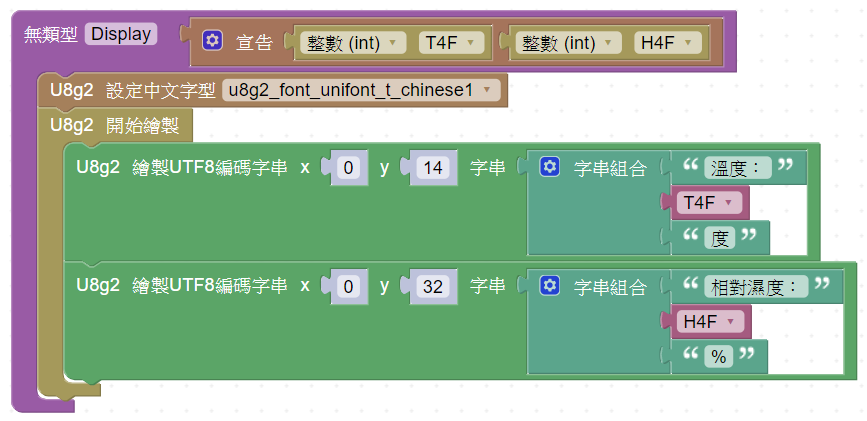

圖片說明：這是本頁第 1 張重點圖片，位於「程式說明 3：」相關內容中，主要用來輔助說明 1. 初始化序列埠連線，設定傳輸速度為 115200。 2. 初始化 DHT11 溫濕度感測器，設定連接腳位為 15。

## 第 25 頁

H4F 及「%」，即顯示 DHT11 的相對濕度值。
程式中函式定義積木中有另外設定好的參數，其設定步驟說明如下：
步驟 1：點選函式定義積木中的「齒輪符號」。
步驟 2：從彈出視窗中拖曳左側的項目，放到清單積木中，要做兩次。
步驟 3：再點選函式定義積木中的「齒輪符號」 ，即可收起彈出的視窗，完成新
增兩個參數，參數名稱的設定與變數名稱的設定方式一樣，可自行設定。
初始化的部分結合範例 3_4_1 的 DHT11 溫濕度感測器及範例 3_4_2 的 OLED
顯示器初始化，不過將中文字型的設定移至函式 Display，讓設定顯示字型在設
定顯示內容之前完成 ， 另外新增兩個全域整數變數T 及 H， 準備紀錄DHT11 溫濕
度感測器的溫度與相對濕度。
重複執行的部分延續範例 3_4_1， 先讀取DHT11 溫濕度感測器的資料 ， 再取
用溫度及相對濕度的數值，分別存入變數 T 及 H，接著將範例 3_4_2 的 OLED 顯
示的部分拆解成 Disaply 函式，本範例只要呼叫 Dispaly 函式即可完成 OLED 的顯
示 ， 讓主程式變得簡潔 ， 同時Display 函式在後續的範例中可以重複使用 ， 另外，
呼叫 Dispaly 函式時 ， 同時將變數T 及 H 的內容值傳給 Dispaly 函式的變數 T4F 及
H4F。
在重複執行的部分使用序列埠顯示變數 T 及 H 的內容值，主要的目的是讓

### 圖片

圖片說明：這是本頁第 1 張重點圖片，位於「H4F 及「%」，即顯示 DHT11 的相對濕度值。」相關內容中，主要用來輔助說明 H4F 及「%」，即顯示 DHT11 的相對濕度值。 程式中函式定義積木中有另外設定好的參數，其設定步驟說明如下：。

圖片說明：這是本頁第 2 張重點圖片，位於「H4F 及「%」，即顯示 DHT11 的相對濕度值。」相關內容中，主要用來輔助說明 H4F 及「%」，即顯示 DHT11 的相對濕度值。 程式中函式定義積木中有另外設定好的參數，其設定步驟說明如下：。

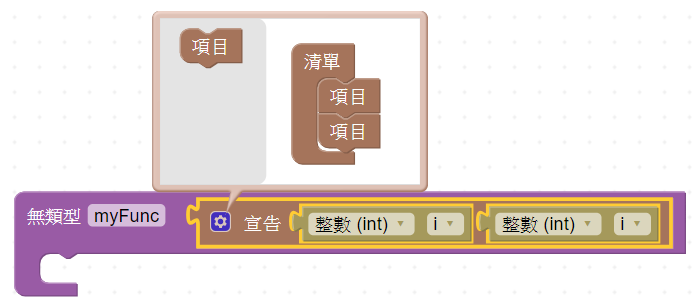

圖片說明：這是本頁第 3 張重點圖片，位於「H4F 及「%」，即顯示 DHT11 的相對濕度值。」相關內容中，主要用來輔助說明 H4F 及「%」，即顯示 DHT11 的相對濕度值。 程式中函式定義積木中有另外設定好的參數，其設定步驟說明如下：。

## 第 26 頁

我們可以對照主程式取得的溫濕度數值跟 Disaply 函式的顯示結果是否相同，如
果不同，則要找出哪裡發生錯誤。
在 Display 函式以變數 T4F 接收主程式中的變數 T 傳來的數值 ， 另外變數H4F
接收主程式中的變數 H 傳來的數值，變數 T4F 及 H4F 只能用於 Display 函式中，
不可使用於主程式，其中的變數名稱T4F 是 T for function 的縮寫。函式中先設定
OLED 顯示中文字型，再來以整頁方式顯示變數 T4F 及 H4F 的內容值，亦即顯示
溫度及相對濕度。
執行結果 3：
程式執行後 ，觀察 OLED 顯示器上顯示的溫度及相對濕度， 如圖3-28(a)所示，
另外，打開序列埠監看視窗，觀察序列埠顯示的溫度及相對濕度，如圖 3-28(b)
所示，顯示內容與 OLED 顯示相同，。
圖 3-28 數位溫濕度計顯示畫面 (a)OLED 顯示器顯示結果 (b)序列埠監看視窗
顯示結果
延伸練習：
美國慣用的溫度單位是華氏溫度 ，為了到美國旅行時馬上可得知氣溫的華氏
溫度，請設計同時可顯示華氏溫度及攝氏溫度的數位溫濕度計。
(a)
(b)

### 圖片

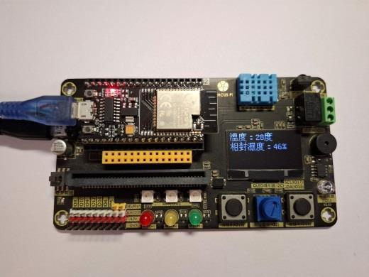

圖片說明：此圖對應「數位溫濕度計顯示畫面 (a)OLED 顯示器顯示結果 (b)序列埠監看視窗」，位於「我們可以對照主程式取得的溫濕度數值跟 Disaply 函式的顯示結果是否相同，如」相關內容中，主要用來輔助說明 我們可以對照主程式取得的溫濕度數值跟 Disaply 函式的顯示結果是否相同，如 果不同，則要找出哪裡發生錯誤。

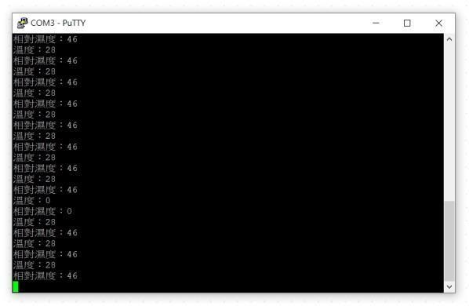

圖片說明：這是本頁第 2 張重點圖片，位於「我們可以對照主程式取得的溫濕度數值跟 Disaply 函式的顯示結果是否相同，如」相關內容中，主要用來輔助說明 我們可以對照主程式取得的溫濕度數值跟 Disaply 函式的顯示結果是否相同，如 果不同，則要找出哪裡發生錯誤。

## 第 27 頁

3-5 紅外線遙控
一般家用遙控器如電視遙控器或冷氣遙控器都屬於紅外線遙控器 ，肉眼可見
光的波長約為 400-700nm，而波長在 400n 以下稱為紫外線，波長在 700nm 以上
稱為紅外線， 所以紅外線及紫外線都是不可見光 ， 紅外線遙控器的傳遞媒介就是
紅外線 ， 紅外線接收器如圖3-29 所示 ， 可接收紅外線發射器發出的紅外線訊號，
紅外線接收器在 EZ Start Kit 的位置，如圖 3-30 所示。
圖 3-29 紅外線接收器 圖 3-30 EZ Start Kit 中紅外線接收器的位置
紅外線遙控器如圖 3-30(a)所示，觀察操作面板上有按鈕，另外在側面可以
找到一顆像是 LED 的元件，如圖 3-30(b)所示，圖中像 LED 而且在發光的元件是
紅外線發射器 ， 紅外線是不可見光 ， 不過透過攝影鏡頭可以拍到紅外線發射器發
光的樣子。紅外線發射及接收器有效傳輸距離為 11-13m，接收器有效角度為±35
度，所以操作遙控器時要對準紅外線接收器，並且不要超過有效距離。
圖 3-31 紅外線遙控器 (a)紅外線遙控器本體 (b)紅外線發射器發光
本節首先介紹紅外線接收器的基本用法 ， 接著以紅外線接收程式結合 3-4 節
OLED 顯示函式，製作模擬小車遙控器。
使用積木：
積木選單 積木 說明
(a)
(b)

### 圖片

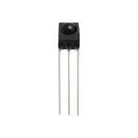

圖片說明：此圖對應「紅外線接收器 圖 3-30 EZ Start Kit 中紅外線接收器的位置」，位於「3-5 紅外線遙控」相關內容中，主要用來輔助說明 3-5 紅外線遙控 一般家用遙控器如電視遙控器或冷氣遙控器都屬於紅外線遙控器 ，肉眼可見。

圖片說明：此圖對應「紅外線遙控器 (a)紅外線遙控器本體 (b)紅外線發射器發光」，位於「3-5 紅外線遙控」相關內容中，主要用來輔助說明 3-5 紅外線遙控 一般家用遙控器如電視遙控器或冷氣遙控器都屬於紅外線遙控器 ，肉眼可見。

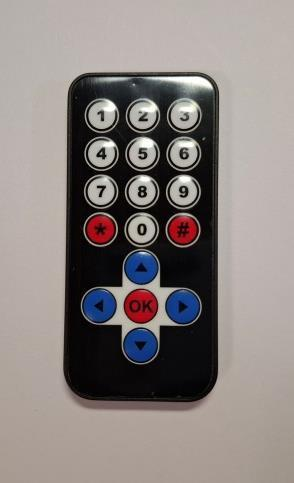

圖片說明：這是本頁第 3 張重點圖片，位於「3-5 紅外線遙控」相關內容中，主要用來輔助說明 3-5 紅外線遙控 一般家用遙控器如電視遙控器或冷氣遙控器都屬於紅外線遙控器 ，肉眼可見。

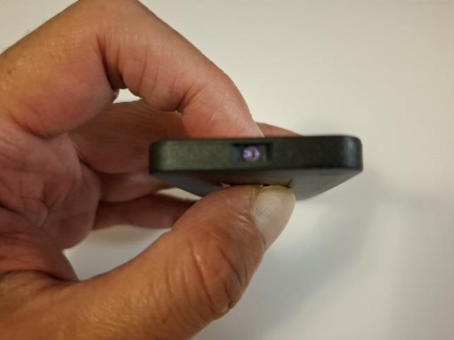

圖片說明：這是本頁第 4 張重點圖片，位於「3-5 紅外線遙控」相關內容中，主要用來輔助說明 3-5 紅外線遙控 一般家用遙控器如電視遙控器或冷氣遙控器都屬於紅外線遙控器 ，肉眼可見。

## 第 28 頁

吉哥 積木 /
模組/紅外線
紅外線接收器初始化積木，功用
為初始化紅外線接收器，並設定
連接腳位。
吉哥積木 /
模組/紅外線
當收到紅外線訊號積木，功用為
當收到收到紅外線訊號時會觸發
本積木，而執行積木內的程式。
吉哥積木 /
模組/紅外線
接收到的紅外線編碼類型積木，
功能為當收到紅外線訊號時，取
用接收到的紅外線編碼類型。
吉哥積木 /
模組/紅外線
接收到的紅外線編碼積木，當收
到紅外線訊號時，取用接收到的
紅外線訊號。
使用元件及接腳：
元件名稱 IO 編號 實際接腳
紅外線接收器 IO3 GPIO33
OLED 顯示器 IO17(SCL) GPIO22
OLED 顯示器 IO18(SDA) GPIO21
使用外接模組或元件
模組名稱 數量 備註
紅外線遙控器 1
積木程式 1—序列埠印出紅外線接收器的輸入數值：
程式說明 1：
範例程式：ch3_5_1
1
2
3
4
5

### 圖片

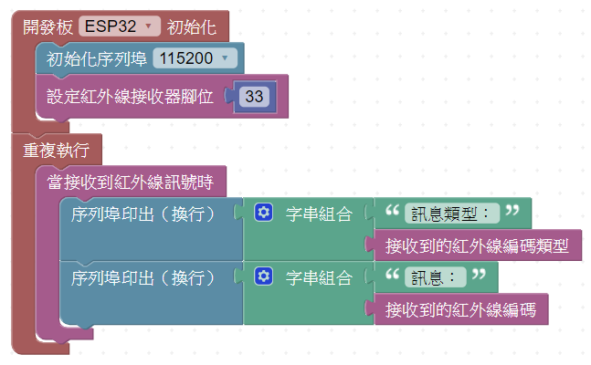

圖片說明：這是本頁第 1 張重點圖片，位於「吉哥 積木 /」相關內容中，主要用來輔助說明 紅外線接收器初始化積木，功用 為初始化紅外線接收器，並設定。

圖片說明：這是本頁第 2 張重點圖片，位於「吉哥 積木 /」相關內容中，主要用來輔助說明 紅外線接收器初始化積木，功用 為初始化紅外線接收器，並設定。

## 第 29 頁

初始化部分：
1. 初始化序列埠連線，設定傳輸速度為 115200。
2. 初始化紅外線接收器，設定連接腳位為 33。
重複執行部分：
3. 當接收到紅外線訊號時，觸動本積木並執行積木內的積木 4 及積木 5。
4. 序列埠印出「訊息類型：」及紅外線接收器接收到的編碼類型，列印完成後
換行。
5. 序列埠印出「訊息：」及紅外線接收器接收到的訊息，列印完成後換行。
本程式說明紅外線接收器的基本用法 ， 首先在初始化積木中設定紅外線接收
器的連接腳位 ， 再來當接收到紅外線的訊號時， 取用接收到的紅外線訊號的編碼
類型及訊息內容。
紅外線接收器收到的訊息不是只有「0」與「1」兩種狀態，而是收到一連串
的 0 與 1，這些數位信號是經過特殊形式的編碼，市面上常見的紅外線遙控器使
用的編碼形式是 NEC 編碼，紅外線接收器收到 NEC 編碼的訊息，經過解碼後可
以得到 16 進制的數字。
執行結果 1：
程式執行後，打開序列埠監看視窗，並且按下遙控器的「OK 鍵」，可觀察到
顯示的編碼類型為 NEC，訊息為 16 進制的 ff387c，如圖 3-26 所示，請紀錄按下
上、下、左、右及 OK 鍵時傳送的訊息，我們在下個範例會用到。
圖 3-32 序列埠顯示紅外線接收器接收訊息的結果
積木程式 2—模擬小車遙控器：
範例程式：ch3_5_2

### 圖片

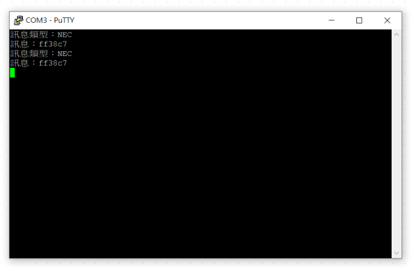

圖片說明：此圖對應「序列埠顯示紅外線接收器接收訊息的結果」，位於「初始化部分：」相關內容中，主要用來輔助說明 1. 初始化序列埠連線，設定傳輸速度為 115200。 2. 初始化紅外線接收器，設定連接腳位為 33。

圖片說明：這是本頁第 2 張重點圖片，位於「初始化部分：」相關內容中，主要用來輔助說明 1. 初始化序列埠連線，設定傳輸速度為 115200。 2. 初始化紅外線接收器，設定連接腳位為 33。

圖片說明：這是本頁第 3 張重點圖片，位於「初始化部分：」相關內容中，主要用來輔助說明 1. 初始化序列埠連線，設定傳輸速度為 115200。 2. 初始化紅外線接收器，設定連接腳位為 33。

## 第 30 頁

1
2
3
4
5
6
8
9
10
9
11
12
18
13
14
17
15
16
19
20
21
22
23
24
7

### 圖片

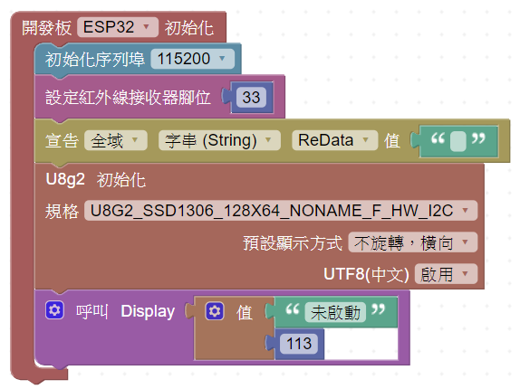

圖片說明：這是本頁第 1 張重點圖片，位於「1」相關內容中，主要用來輔助說明 本頁重點內容。

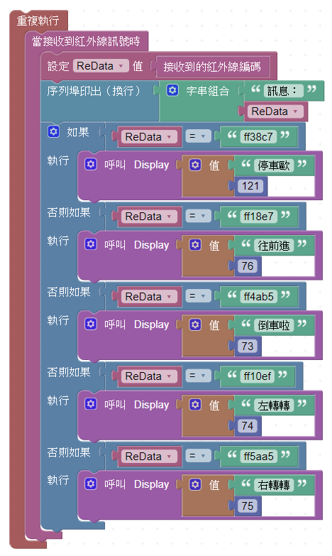

圖片說明：這是本頁第 2 張重點圖片，位於「1」相關內容中，主要用來輔助說明 本頁重點內容。

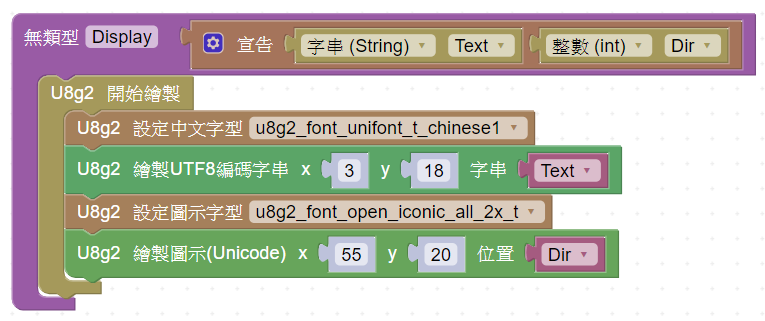

圖片說明：這是本頁第 3 張重點圖片，位於「1」相關內容中，主要用來輔助說明 本頁重點內容。

## 第 31 頁

程式說明 2：
初始化部分：
1. 初始化序列埠連線，設定傳輸速度為 115200。
2. 初始化紅外線接收器，設定連接腳位為 33。
3. 宣告全域字串變數 ReData，並設定其初始值為空字串。
4. 將 OLED 顯示器初始化，設定 UTF8(中文)「啟用」。
5. 呼叫 Display 函式，並且傳遞字串”未啟動”及數值 131 給 Display 函式。
重複執行部分：
6. 當接收到紅外線訊號時，觸動本積木並執行積木內的積木 7 至積木 18。
7. 將紅外線接收器接收到的訊息儲存於字串變數 ReData。
8. 序列埠印出「訊息：」及紅外線接收器接收到的訊息，列印完成後換行。
9. 如果變數 ReData 的內容值等於”ff38c7”則執行積木 10， 否則依照積木 11 條件
執行。
10. 呼叫 Display 函式，並且字串”停車歐”及數值 121 給 Display 函式。
11. 如果變數 ReData 的內容值等於”ff18e7”則執行積木 12，否則依照積木 13 條
件執行。
12. 呼叫 Display 函式，並且字串”往前進”及數值 76 給 Display 函式。
13. 如果變數 ReData 的內容值等於”ff4ab5”則執行積木 14，否則依照積木 15 條
件執行。
14. 呼叫 Display 函式，並且字串”倒車啦”及數值 73 給 Display 函式。
15. 如果變數 ReData 的內容值等於”ff10ef”則執行積木 16，否則依照積木 17 條
件執行。
16. 呼叫 Display 函式，並且字串”左轉轉”及數值 74 給 Display 函式。
17. 如果變數 ReData 的內容值等於”ff5aa5”則執行積木 18，否則往下繼續執行。
18. 呼叫 Display 函式，並且字串”右轉轉”及數值 75 給 Display 函式。
Display 函式部分：
19. 定義函式名稱為 Display，負責顯示部份的工作，並宣告兩個整數引數，分別
為 Text 及 Dir，負責接收來自引數傳送來的數值，另外設定函式內的功能程式為
積木 20 至積木 24。
20. 以整頁的方式，先清除 OLED 顯示的內容，再顯示積木 21 至積木 24 的設定
內容。
21. 設定顯示中文的字型為「u8g2_font_unifont_t_chinese1」。
22. 設定 OLED 顯示起始位置為 x 軸：3、y 軸：18，顯示的中文為變數 Text 的內
容值。
23. 設定顯示圖示的字型為「u8g2_font_open_iconic_all_2x_t」。

## 第 32 頁

24. 設定 OLED 顯示起始位置為 x 軸：55、y 軸：20，顯示圖示的編號為變數 Dir
的內容值。
撰寫函式程式時 ， 會用到先前寫的程式 ， 但是積木程式無法跨越不同程式編
輯畫面的複製，所以建議使用 BlocklyDuino 的暫存積木區的功能，操作步驟說明
如下：
步驟 1：將滑鼠移至函式積木上，按滑鼠右鍵，接著點選彈出視窗中的「新增到
暫存積木」 ，即可將整個函式程式放在暫存積木區。
步驟 2： 想要取用放在暫存積木區的積木程式時 ， 只要由積木選單中點選 「暫存」 ，
彈出的子選單中就會出現先前暫存的程式 ， 可以用拖曳方式將程式拖曳到程式編
輯區中，進行程式的撰寫。請注意，BlocklyDuino 關閉後再啟動，暫存區的程式
會清空。
本範例程式中使用圖示顯示方式跟範例 ch3_1_3 不同 ， 本範例可使用自行選
定的圖示，我們可以從開源字型網站中找自己想用的圖示，BlocklyDuino 使用的
開源圖示字型網站：
https://github.com/olikraus/u8g2/wiki/fntgrpiconic
我們以範例中向下箭頭 為例，操作步驟說明如下：
步驟 1：先到開源字型網站中找到向下箭頭 ，記下字型的名稱為
open_iconic_all_2x，另外，下箭頭該列的最左側的數字 64 為該列符號的起始位

### 圖片

圖片說明：這是本頁第 1 張重點圖片，位於「24. 設定 OLED 顯示起始位置為 x 軸：55、y 軸：20，顯示圖示的編號為變數 Dir」相關內容中，主要用來輔助說明 24. 設定 OLED 顯示起始位置為 x 軸：55、y 軸：20，顯示圖示的編號為變數 Dir 撰寫函式程式時 ， 會用到先前寫的程式 ， 但是積木程式無法跨越不同程式編。

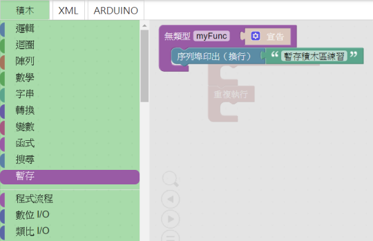

圖片說明：這是本頁第 2 張重點圖片，位於「24. 設定 OLED 顯示起始位置為 x 軸：55、y 軸：20，顯示圖示的編號為變數 Dir」相關內容中，主要用來輔助說明 24. 設定 OLED 顯示起始位置為 x 軸：55、y 軸：20，顯示圖示的編號為變數 Dir 撰寫函式程式時 ， 會用到先前寫的程式 ， 但是積木程式無法跨越不同程式編。

## 第 33 頁

置，由起始位置 64 開始算起，算到向下箭頭的位置為 73，記下這個位置。
步驟 2：由設定圖示字型積木的選單中找到 open_iconic_all_2x。
步驟 3：設定繪製圖示積木中位置參數為 73，完成以上設定，再依 OLED 顯示的
程式撰寫顯示圖示，即可顯示向下箭頭 。
程式中，一開始由 OLED 顯示器顯示「未啟動」，再來將紅外線接收器收的
訊息存入變數 ReData 中，然後從序列埠列印出變數 ReData 的內容值，作為除錯
之用，接著判斷變數 ReData 的內容是否為按下向上、向下、向左、向右及 OK
鍵?然後根據判斷結果做不同的顯示， 顯示內容分別為「往前進」、「倒車啦」、「左
轉轉」、「右轉轉」及「停車歐」，跟 3-4 節的範例一樣，將 OLED 顯示部分獨力成
寫成 Display 函式，同樣以引數及參數方式傳遞數值，讓主程式變得精簡，OLED
整頁顯示允許使用不同字型，所以在函式中使用兩種不字型，請記住規則，顯示
前要先設定好對應的字型。
執行結果 2：
模擬小車遙控程式執行後，可觀察OLED 顯示結果畫面，如圖 3-33 所示，當
ESP32 啟動時顯示未啟動，如圖 3-33(a)，表示小車還未啟動；當按下向上鍵時顯
示往前進，如圖 3-33(b)，表示小車向前進；當按下向下鍵時顯示倒車啦，如圖
3-33(c)，表示小車向後退；當按下向左鍵時顯示左轉轉，如圖3-33(d)，表示小車
向左轉；當按下向右鍵時顯示右轉轉，如圖 3-33(e)，表示小車向右轉；當按下

### 圖片

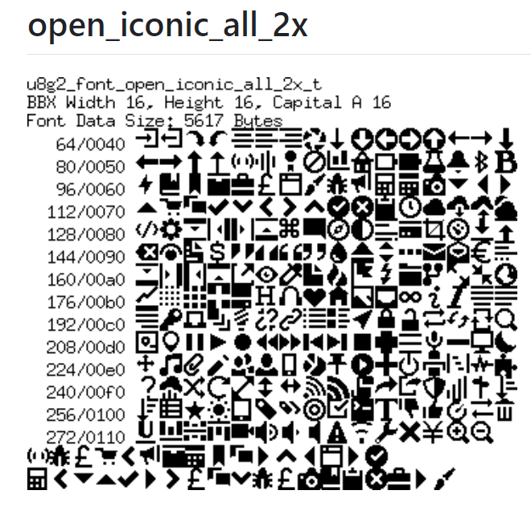

圖片說明：這是本頁第 1 張重點圖片，位於「置，由起始位置 64 開始算起，算到向下箭頭的位置為 73，記下這個位置。」相關內容中，主要用來輔助說明 置，由起始位置 64 開始算起，算到向下箭頭的位置為 73，記下這個位置。 步驟 2：由設定圖示字型積木的選單中找到 open_iconic_all_2x。

## 第 34 頁

OK 鍵時顯示停車歐，如圖 3-33(f)，表示小車停止。
圖 3-33 OLED 顯示結果畫面 (a)當 ESP32 啟動時 (b)當按下向上鍵時 (c) 當按
下向下鍵時 (d) 當按下向左鍵時 (e) 當按下向右鍵時 (f) 當按下 OK 鍵時
延伸練習：
請使用紅外線遙控器控制 LED 及 WS-2812 LED，讓按鍵 1、按鍵 2 到按鍵 0
共十個按鍵，每個按鍵控制不同的 LED 及亮滅方式。
(a)
(b)
(c)
(d)
(e)
(f)

### 圖片

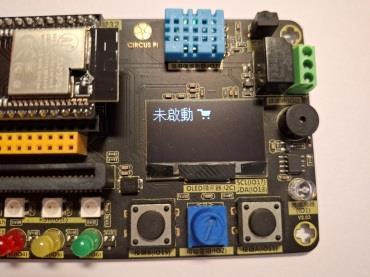

圖片說明：此圖對應「OLED 顯示結果畫面 (a)當 ESP32 啟動時 (b)當按下向上鍵時 (c) 當按」，位於「OK 鍵時顯示停車歐，如圖 3-33(f)，表示小車停止。」相關內容中，主要用來輔助說明 OK 鍵時顯示停車歐，如圖 3-33(f)，表示小車停止。 下向下鍵時 (d) 當按下向左鍵時 (e) 當按下向右鍵時 (f) 當按下 OK 鍵時。

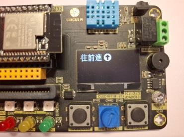

圖片說明：這是本頁第 2 張重點圖片，位於「OK 鍵時顯示停車歐，如圖 3-33(f)，表示小車停止。」相關內容中，主要用來輔助說明 OK 鍵時顯示停車歐，如圖 3-33(f)，表示小車停止。 下向下鍵時 (d) 當按下向左鍵時 (e) 當按下向右鍵時 (f) 當按下 OK 鍵時。

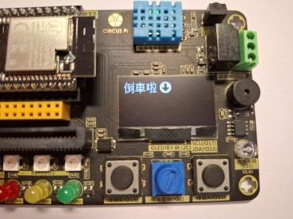

圖片說明：這是本頁第 3 張重點圖片，位於「OK 鍵時顯示停車歐，如圖 3-33(f)，表示小車停止。」相關內容中，主要用來輔助說明 OK 鍵時顯示停車歐，如圖 3-33(f)，表示小車停止。 下向下鍵時 (d) 當按下向左鍵時 (e) 當按下向右鍵時 (f) 當按下 OK 鍵時。

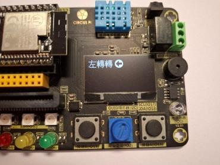

圖片說明：這是本頁第 4 張重點圖片，位於「OK 鍵時顯示停車歐，如圖 3-33(f)，表示小車停止。」相關內容中，主要用來輔助說明 OK 鍵時顯示停車歐，如圖 3-33(f)，表示小車停止。 下向下鍵時 (d) 當按下向左鍵時 (e) 當按下向右鍵時 (f) 當按下 OK 鍵時。

## 第 35 頁

3-6 繼電器控制
繼電器如圖 3-34 所示，其主要用於不同電壓的控制，例如以 ESP32 控制家
用電器，ESP32 使用直流電源，電壓約為 5V，而家用電器使用交流電源，電壓為
110V，兩種完全不同電壓型態，且電壓大小也不同，無法直接控制，所以需要使
用繼電器來做控制，繼電器在 EZ Start Kit 的位置，如圖 3-35 所示。。
圖 3-34 繼電器 圖 3-35 EZ Start Kit 中繼電器的位置
繼電器的內部由控制輸入的線圈及接點的輸出組成，如圖 3-36(a)所示，圖
中左側為控制輸入 ，當沒有任何輸入電壓或輸入直流低電位時 ， 線圈不會產生任
何磁場，輸出的接點為原本的開路(open)狀態，當輸入直流高電位時線圈會產生
磁場，讓輸出的接點變成閉合(close)，如圖 3-36(b)所示，簡單來說，當輸入為高
電位時，輸出接點變成閉合，當輸入為低電位時，輸出接點回到開啟，我們可以
使用接點的變化來做控制。
圖 3-36 繼電器內部簡圖 (a)接點開路 (b)接點閉合
家用電器的控制方式如圖 3-38(a)所示，當開關切成閉合時，交流電源與馬
達間的迴路形成通路 ， 交流電源提供能量 ， 讓馬達開始運轉 ， 當開關切成開路時，
交流電源與馬達間的迴路形成斷路 ， 馬達就會停止運轉 。 將原本的手動的開關改
成繼電器，如圖 3-38(b)所示，我們可以使用 ESP32 接腳輸出高電位或低電位，
控制輸出接點閉合或開路，進而控制馬達運轉或停止，其中 ESP32 的工作電壓是
直流 5V，而馬達的工作電壓可能是交流 110V，兩者的工作電壓完全不同。
(a)
(b)

### 圖片

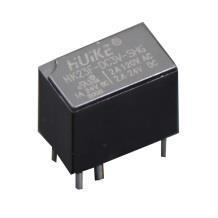

圖片說明：此圖對應「繼電器 圖 3-35 EZ Start Kit 中繼電器的位置」，位於「3-6 繼電器控制」相關內容中，主要用來輔助說明 3-6 繼電器控制 繼電器如圖 3-34 所示，其主要用於不同電壓的控制，例如以 ESP32 控制家。

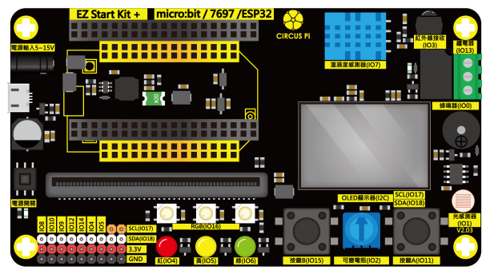

圖片說明：此圖對應「繼電器內部簡圖 (a)接點開路 (b)接點閉合」，位於「3-6 繼電器控制」相關內容中，主要用來輔助說明 3-6 繼電器控制 繼電器如圖 3-34 所示，其主要用於不同電壓的控制，例如以 ESP32 控制家。

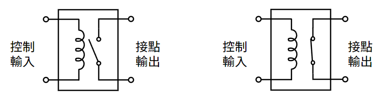

圖片說明：這是本頁第 3 張重點圖片，位於「3-6 繼電器控制」相關內容中，主要用來輔助說明 3-6 繼電器控制 繼電器如圖 3-34 所示，其主要用於不同電壓的控制，例如以 ESP32 控制家。

## 第 36 頁

圖 3-38 控制接線圖 (a)手動開關控制 (b)繼電器控制
由於使用交流電源進行實作 ， 容易發生意外 ， 也配合EZ Start Kit 已有的模組，
本節實作將交流電源改為直流 3.3V，另外將馬達改成紅色 LED，修改完成的電路
圖如圖 3-39 所示。
圖 3-39 繼電器控制 LED
本節首先介紹繼電器的基本用法 ， 接著以繼電器結合 3-5 節紅外線遙控程式 ，
製作 LED 控制遙控器。
使用元件及接腳：
元件名稱 IO 編號 實際接腳
紅外線接收器 IO3 GPIO33
繼電器 IO13 GPIO25
紅色 LED IO4
OLED 顯示器 IO17(SCL) GPIO22
OLED 顯示器 IO18(SDA) GPIO21
(a)
(b)

### 圖片

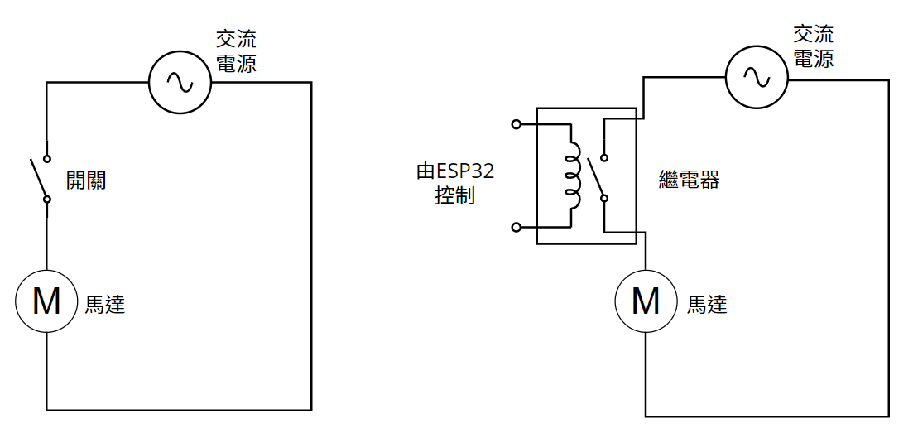

圖片說明：此圖對應「控制接線圖 (a)手動開關控制 (b)繼電器控制」，位於「圖 3-38 控制接線圖 (a)手動開關控制 (b)繼電器控制」相關內容中，主要用來輔助說明 由於使用交流電源進行實作 ， 容易發生意外 ， 也配合EZ Start Kit 已有的模組， 本節實作將交流電源改為直流 3.3V，另外將馬達改成紅色 LED，修改完成的電路。

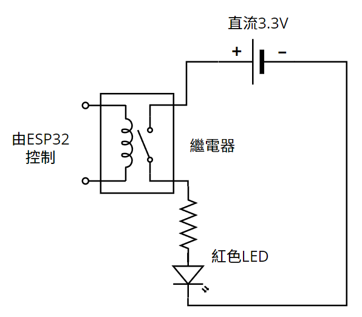

圖片說明：此圖對應「繼電器控制 LED」，位於「圖 3-38 控制接線圖 (a)手動開關控制 (b)繼電器控制」相關內容中，主要用來輔助說明 由於使用交流電源進行實作 ， 容易發生意外 ， 也配合EZ Start Kit 已有的模組， 本節實作將交流電源改為直流 3.3V，另外將馬達改成紅色 LED，修改完成的電路。

## 第 37 頁

使用外接模組或元件
模組名稱 數量 備註
杜邦線公對母 2
實際接線圖：
繼電器端子的接線使用杜邦線公頭 ，擴充應用針腳的接線使用杜邦線母頭。
積木程式 1—繼電器基本控制：
程式說明 1：
初始化部分：
1. 初始化序列埠連線，設定傳輸速度為 115200。
重複執行部分：
2. 腳位 25 輸出高電位，讓接在腳位 25 的繼電器輸出接點閉合。
3 序列埠印出「輸出高電位」 ，列印完成後換行。
範例程式：ch3_6_1
1
2
3
4
5
6
7

### 圖片

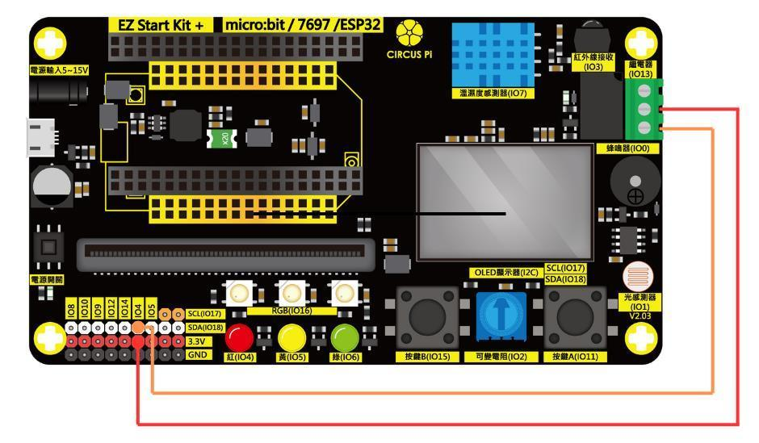

圖片說明：這是本頁第 1 張重點圖片，位於「使用外接模組或元件」相關內容中，主要用來輔助說明 使用外接模組或元件 模組名稱 數量 備註。

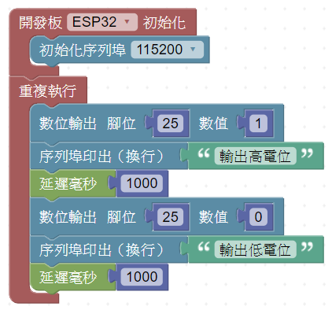

圖片說明：這是本頁第 2 張重點圖片，位於「使用外接模組或元件」相關內容中，主要用來輔助說明 使用外接模組或元件 模組名稱 數量 備註。

## 第 38 頁

4.. 延遲 1000 毫秒(1 秒)。
5. 腳位 25 輸出低電位，讓接在腳位 25 的繼電器輸出接點開路。
6. 序列埠印出「輸出低電位」 ，列印完成後換行。
7. 延遲 1000 毫秒(1 秒)。
本程式與範例程式 2_1_1 幾乎一樣，只有腳位改成 25，由於繼電器是數位
輸出模組，只有兩種變化狀態，所以控制方式跟同樣是數位輸出的LED 一樣，但
是繼電器的輸出是接點狀態的改變 ， 而LED 的輸出則是亮與滅。程式中的序列埠
印出訊息的作用是為了對照實際的輸出 ， 當ESP32 的輸出是高電位時繼電器的輸
出接點改變為閉合 ， 當ESP32 的輸出是低電位時繼電器的輸出接點改變為開路。
執行結果 1：
程式執行後，打開序列埠監看視窗，可以觀察到當顯示輸出高電位時，繼電
器模組的 LED 亮 ， 而且紅色LED 因為接點閉合而變成亮 ， 如圖3-40(a)及(b)所示，
當顯示輸出低電位時 ， 繼電器模組的LED 滅 ， 而且紅色LED 因為接點開路而變成
滅，如圖 3-40(c)及(d)所示，另外從實作中可以觀察到紅色 LED 的工作電源是我
們外接的另外一組電源，以及透過繼電器接點的閉合及開路控制亮滅。
圖 3-40 繼電器接點控制 LED (a) 接點閉合時 LED 亮 (b)序列埠顯示輸出高電位
(c)接點開路時 LED 滅 (b)序列埠顯示輸出低電位
(a)
(b)
(c)
(d)

### 圖片

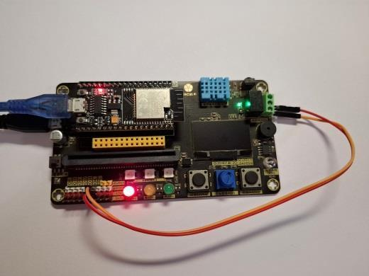

圖片說明：此圖對應「繼電器接點控制 LED (a) 接點閉合時 LED 亮 (b)序列埠顯示輸出高電位」，位於「4.. 延遲 1000 毫秒(1 秒)。」相關內容中，主要用來輔助說明 4.. 延遲 1000 毫秒(1 秒)。 5. 腳位 25 輸出低電位，讓接在腳位 25 的繼電器輸出接點開路。

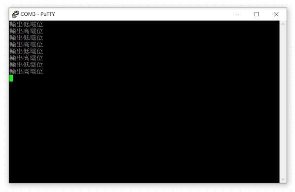

圖片說明：這是本頁第 2 張重點圖片，位於「4.. 延遲 1000 毫秒(1 秒)。」相關內容中，主要用來輔助說明 4.. 延遲 1000 毫秒(1 秒)。 5. 腳位 25 輸出低電位，讓接在腳位 25 的繼電器輸出接點開路。

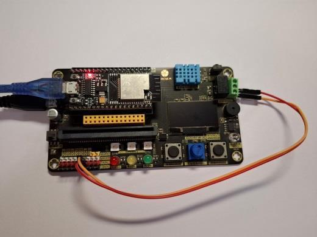

圖片說明：這是本頁第 3 張重點圖片，位於「4.. 延遲 1000 毫秒(1 秒)。」相關內容中，主要用來輔助說明 4.. 延遲 1000 毫秒(1 秒)。 5. 腳位 25 輸出低電位，讓接在腳位 25 的繼電器輸出接點開路。

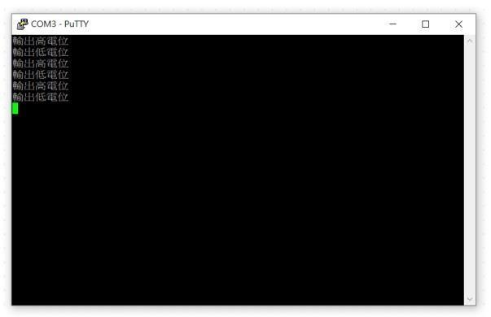

圖片說明：這是本頁第 4 張重點圖片，位於「4.. 延遲 1000 毫秒(1 秒)。」相關內容中，主要用來輔助說明 4.. 延遲 1000 毫秒(1 秒)。 5. 腳位 25 輸出低電位，讓接在腳位 25 的繼電器輸出接點開路。

## 第 39 頁

積木程式 2—LED 控制遙控器：
程式說明 2：
初始化部分：
1. 初始化序列埠連線，設定傳輸速度為 115200。
2. 初始化紅外線接收器，設定連接腳位為 33。
1
2
3
範例程式：ch3_6_2
4
5
6
8
9
10
9
11
12
19
13
14
18
16
17
7
20
15

### 圖片

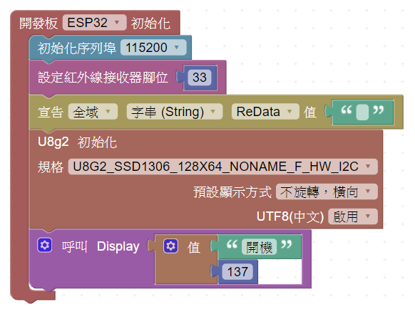

圖片說明：這是本頁第 1 張重點圖片，位於「積木程式 2—LED 控制遙控器：」相關內容中，主要用來輔助說明 積木程式 2—LED 控制遙控器： 1. 初始化序列埠連線，設定傳輸速度為 115200。

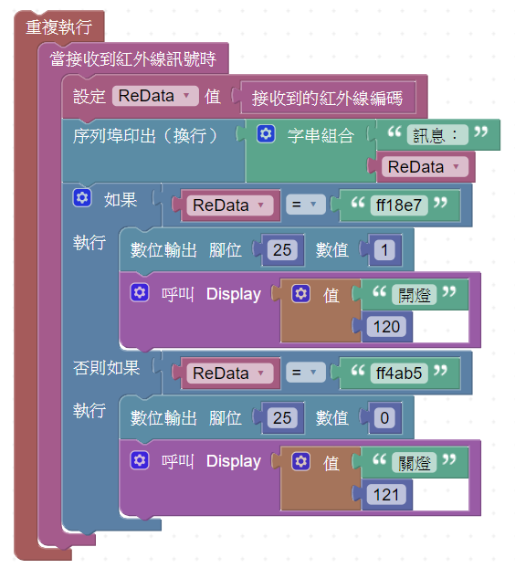

圖片說明：這是本頁第 2 張重點圖片，位於「積木程式 2—LED 控制遙控器：」相關內容中，主要用來輔助說明 積木程式 2—LED 控制遙控器： 1. 初始化序列埠連線，設定傳輸速度為 115200。

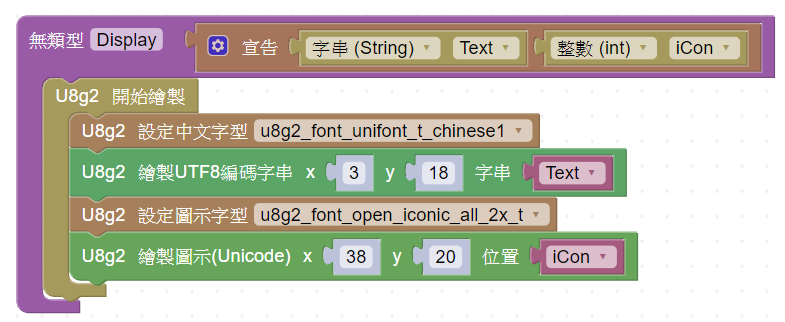

圖片說明：這是本頁第 3 張重點圖片，位於「積木程式 2—LED 控制遙控器：」相關內容中，主要用來輔助說明 積木程式 2—LED 控制遙控器： 1. 初始化序列埠連線，設定傳輸速度為 115200。

圖片說明：這是本頁第 4 張重點圖片，位於「積木程式 2—LED 控制遙控器：」相關內容中，主要用來輔助說明 積木程式 2—LED 控制遙控器： 1. 初始化序列埠連線，設定傳輸速度為 115200。

## 第 40 頁

3. 宣告全域字串變數 ReData，並設定其初始值為空字串。
4. 將 OLED 顯示器初始化，設定 UTF8(中文)「啟用」。
5. 呼叫 Display 函式，並且傳遞字串”關機”及數值 137 給 Display 函式。
重複執行部分：
6. 當接收到紅外線訊號時，觸動本積木並執行積木內的積木 7 至積木 13。
7. 將紅外線接收器接收到的訊息儲存於字串變數 ReData。
8. 序列埠印出「訊息：」及紅外線接收器接收到的訊息，列印完成後換行。
9. 如果變數 ReData 的內容值等於”ff18e7”則執行積木 10 及 11，否則依照積木
12 條件執行。
10. 腳位 25 輸出高電位，讓接在腳位 25 的繼電器輸出接點閉合。
11. 呼叫 Display 函式，並且字串”開燈”及數值 120 給 Display 函式。
12. 如果變數 ReData 的內容值等於”ff4ab5”則執行積木 13 及 14，否則往下繼續
執行。
13. 腳位 25 輸出低電位，讓接在腳位 25 的繼電器輸出接點開路。
14. 呼叫 Display 函式，並且字串”關燈”及數值 121 給 Display 函式。
Display 函式部分：
15. 定義函式名稱為 Display，負責顯示部份的工作，並宣告兩個整數引數，分別
為 Text 及 iCon，負責接收來自引數傳送來的數值，另外設定函式內的功能程式
為積木 16 至積木 20。
16. 以整頁的方式，先清除 OLED 顯示的內容，再顯示積木 17 至積木 20 的設定
內容。
17. 設定顯示中文的字型為「u8g2_font_unifont_t_chinese1」。
18. 設定 OLED 顯示起始位置為 x 軸：3、y 軸：18，顯示的中文為變數 Text 的內
容值。
19. 設定顯示圖示的字型為「u8g2_font_open_iconic_all_2x_t」。
20. 設定 OLED 顯示起始位置為 x 軸：38、y 軸：20，顯示圖示的編號為變數 Dir
的內容值。
程式中，一開始由 OLED 顯示器顯示「開機」，再來將紅外線接收器收的訊
息存入變數 ReData 中，然後從序列埠列印出變數 ReData 的內容值，作為除錯之
用 ， 接著判斷變數 ReData 的內容是否為按下向上或向下?然後根據判斷結果控制
腳位 25 及 OLED 的顯示，當按下按下向上時，腳位 25 輸出高電位，讓繼電器接
點閉合，進而讓紅色 LED 發亮，當按下按下向下時，腳位 25 輸出低電位，讓繼
電器接點開路，進而讓紅色 LED 變滅。
執行結果 2：

## 第 41 頁

遙控程式執行後 ， 可觀察紅色 LED 及 OLED 顯示結果畫面， 如圖3-41 所示，
當 ESP32 啟動時紅色 LED 為滅，同時 OLED 顯示開機如圖 3-33(a)；當按下向上鍵
時，紅色 LED 變亮，OLED 顯示開燈，如圖 3-33(b)；當按下向下鍵時，紅色 LED
變亮變滅，OLED 顯示關燈，如圖 3-33(c)。另外從實作中可以觀察到紅色 LED 的
工作電源是我們外接的另外一組電源 ， 以及透過繼電器接點的閉合及開路控制亮
滅。
圖 3-41 遙控器控制 LED 及 OLED 顯示畫面 (a)當 ESP32 啟動時 (b)當按下向上
鍵時 (c)當按下向下鍵時
延伸練習：
請使用繼電器及紅外線遙控器製作家用電器遙控器 ， 由於家用電器的電壓是
交流 110V，製作時請注意接線，小心會有觸電的危險。
(a)
(b)
(c)

### 圖片

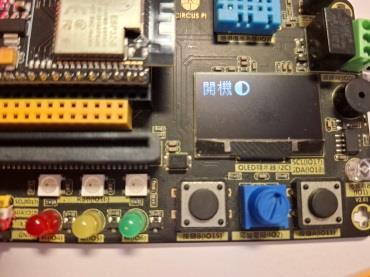

圖片說明：此圖對應「遙控器控制 LED 及 OLED 顯示畫面 (a)當 ESP32 啟動時 (b)當按下向上」，位於「遙控程式執行後 ， 可觀察紅色 LED 及 OLED 顯示結果畫面， 如圖3-41 所示，」相關內容中，主要用來輔助說明 遙控程式執行後 ， 可觀察紅色 LED 及 OLED 顯示結果畫面， 如圖3-41 所示， 當 ESP32 啟動時紅色 LED 為滅，同時 OLED 顯示開機如圖 3-33(a)。

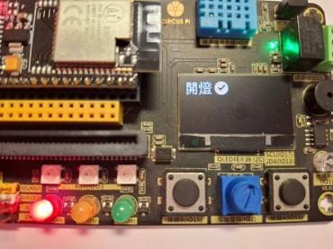

圖片說明：這是本頁第 2 張重點圖片，位於「遙控程式執行後 ， 可觀察紅色 LED 及 OLED 顯示結果畫面， 如圖3-41 所示，」相關內容中，主要用來輔助說明 遙控程式執行後 ， 可觀察紅色 LED 及 OLED 顯示結果畫面， 如圖3-41 所示， 當 ESP32 啟動時紅色 LED 為滅，同時 OLED 顯示開機如圖 3-33(a)。

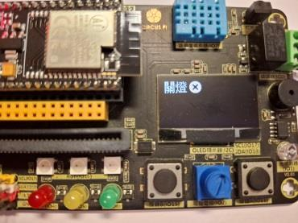

圖片說明：這是本頁第 3 張重點圖片，位於「遙控程式執行後 ， 可觀察紅色 LED 及 OLED 顯示結果畫面， 如圖3-41 所示，」相關內容中，主要用來輔助說明 遙控程式執行後 ， 可觀察紅色 LED 及 OLED 顯示結果畫面， 如圖3-41 所示， 當 ESP32 啟動時紅色 LED 為滅，同時 OLED 顯示開機如圖 3-33(a)。
