# Chapter04_藍牙連線與App Inventor

## 第 1 頁

第四章 藍牙連線與 App Inventor
4-1 MIT App Inventor 基本畫面設計
4-2 手機藍牙連接 ESP32
4-3 手機藍牙遙控器
4-4 手機藍牙溫濕度器

## 第 2 頁

4-1 MIT App Inventor 基本畫面設計
本章介紹手機與 ESP32 之間的藍牙連線 ， 需要撰寫手機與ESP32 的程式 ，ESP3
的程式部分依然使用 BlocklyDuino，手機的程式部分使用 MIT App Inventor 來撰
寫，所以本節介紹 MIT App Inventor 的基本畫面設計，以帥哥美女打招呼手機程
式說明 MIT App Inventor 的操作方式。
本節以 MIT App Inventor 的專案建立、畫面編排、程式設計及程式打包跟安
裝四大部份介紹打招呼手機程式的撰寫過程， 另外介紹範例程式檔案的使用方式，
本章所提供的範例程式均以安卓(Andorid)手機測試。
MIT App Inventor 的專案建立：
步驟 1：首先進入 MIT App Inventor 網站，該網站的超連結為：
https:/ai2.appinventor.mit.edu/
步驟 2：使用 Google 帳號登入，點選已經登入的「Google 帳號」。
步驟 3：點選「繼續」。
步驟 4：閱讀使用說明後 ， 點選說明網頁最底端的「I accept the terms of service!」。
範例程式：ch4_1.aia

### 圖片

圖片說明：這是本頁第 1 張重點圖片，位於「4-1 MIT App Inventor 基本畫面設計」相關內容中，主要用來輔助說明 4-1 MIT App Inventor 基本畫面設計 本章介紹手機與 ESP32 之間的藍牙連線 ， 需要撰寫手機與ESP32 的程式 ，ESP3。

圖片說明：這是本頁第 2 張重點圖片，位於「4-1 MIT App Inventor 基本畫面設計」相關內容中，主要用來輔助說明 4-1 MIT App Inventor 基本畫面設計 本章介紹手機與 ESP32 之間的藍牙連線 ， 需要撰寫手機與ESP32 的程式 ，ESP3。

圖片說明：這是本頁第 3 張重點圖片，位於「4-1 MIT App Inventor 基本畫面設計」相關內容中，主要用來輔助說明 4-1 MIT App Inventor 基本畫面設計 本章介紹手機與 ESP32 之間的藍牙連線 ， 需要撰寫手機與ESP32 的程式 ，ESP3。

## 第 3 頁

步驟 5：點選「Continue」 ，準備進入專案畫面。
步驟 6：點選「START A BLANK PROJECT」，開始空白的專案。
步驟 7：在 Project name 欄位輸入專案名稱”ch4_1”，然後點選「OK」 ，準備進入
畫面編排。

### 圖片

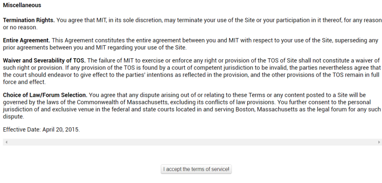

圖片說明：這是本頁第 1 張重點圖片，位於「步驟 5：點選「Continue」 ，準備進入專案畫面。」相關內容中，主要用來輔助說明 步驟 5：點選「Continue」 ，準備進入專案畫面。 步驟 6：點選「START A BLANK PROJECT」，開始空白的專案。

圖片說明：這是本頁第 2 張重點圖片，位於「步驟 5：點選「Continue」 ，準備進入專案畫面。」相關內容中，主要用來輔助說明 步驟 5：點選「Continue」 ，準備進入專案畫面。 步驟 6：點選「START A BLANK PROJECT」，開始空白的專案。

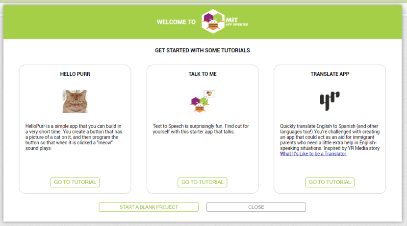

圖片說明：這是本頁第 3 張重點圖片，位於「步驟 5：點選「Continue」 ，準備進入專案畫面。」相關內容中，主要用來輔助說明 步驟 5：點選「Continue」 ，準備進入專案畫面。 步驟 6：點選「START A BLANK PROJECT」，開始空白的專案。

## 第 4 頁

步驟 8：點選工具列的「English」，接著點選彈出視窗的「正體中文」，將顯示文
字調整成繁體中文。
MIT App Inventor 的畫面編排：
畫面編排環境說明：
❶ 元件面板 ： 由此選擇要使用的手機畫面元件 ， 另外擴充積木也是由此處匯入。
❶
❷
❶
❷
❸
❹
❺

### 圖片

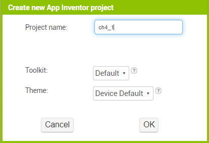

圖片說明：這是本頁第 1 張重點圖片，位於「步驟 8：點選工具列的「English」，接著點選彈出視窗的「正體中文」，將顯示文」相關內容中，主要用來輔助說明 步驟 8：點選工具列的「English」，接著點選彈出視窗的「正體中文」，將顯示文 字調整成繁體中文。

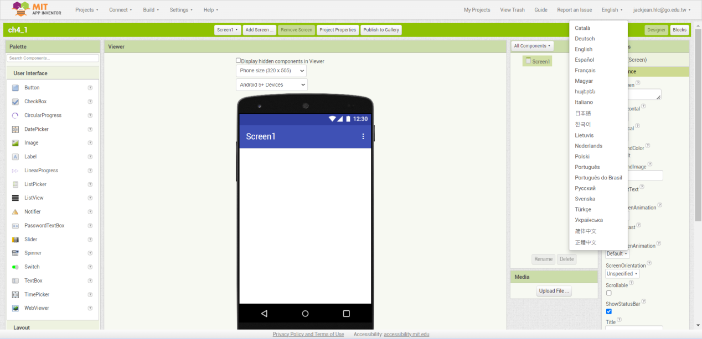

圖片說明：這是本頁第 2 張重點圖片，位於「步驟 8：點選工具列的「English」，接著點選彈出視窗的「正體中文」，將顯示文」相關內容中，主要用來輔助說明 步驟 8：點選工具列的「English」，接著點選彈出視窗的「正體中文」，將顯示文 字調整成繁體中文。

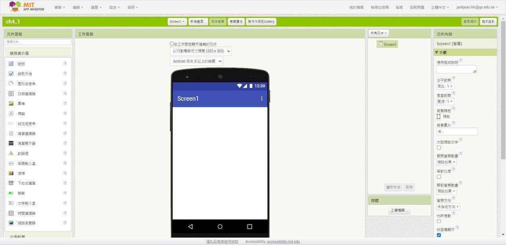

圖片說明：這是本頁第 3 張重點圖片，位於「步驟 8：點選工具列的「English」，接著點選彈出視窗的「正體中文」，將顯示文」相關內容中，主要用來輔助說明 步驟 8：點選工具列的「English」，接著點選彈出視窗的「正體中文」，將顯示文 字調整成繁體中文。

## 第 5 頁

❷ 工作面板：手機畫面編排的編輯區。
❸ 元件清單：使用的手機畫面元件的清單。
❹ 元件屬性：手機畫面元件的屬性。
❺ 工具列：建立專案、連接模擬器、下載手機安裝程式及編輯畫面切換軍在此
工具列。
畫面編排的操作步驟說明如下：
步驟 1：在 Screen1 屬性的最下方找到標題 ， 在標題欄輸入”我的第一個手機程式”，
修改 Screen1 的標題屬性。
步驟 2:從元件面板的介面配置中拖曳「水平配置」元件到工作面板中手機畫面，
查看元件清單中會增加水平配置 1 元件 ， 接著點選元件屬性中寬度裡的「自動」，
水平配置元件能夠將多個元件做水平排列，接著點選彈出視窗中的「填滿」，最
後點選「確定」，調整水平配置元件的寬度。
❶
❷
❸
❹
❺

### 圖片

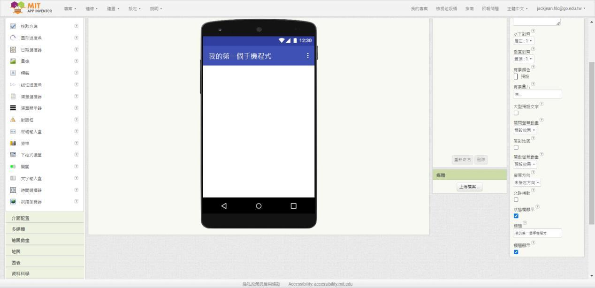

圖片說明：這是本頁第 1 張重點圖片，位於「❷ 工作面板：手機畫面編排的編輯區。」相關內容中，主要用來輔助說明 ❷ 工作面板：手機畫面編排的編輯區。 ❸ 元件清單：使用的手機畫面元件的清單。

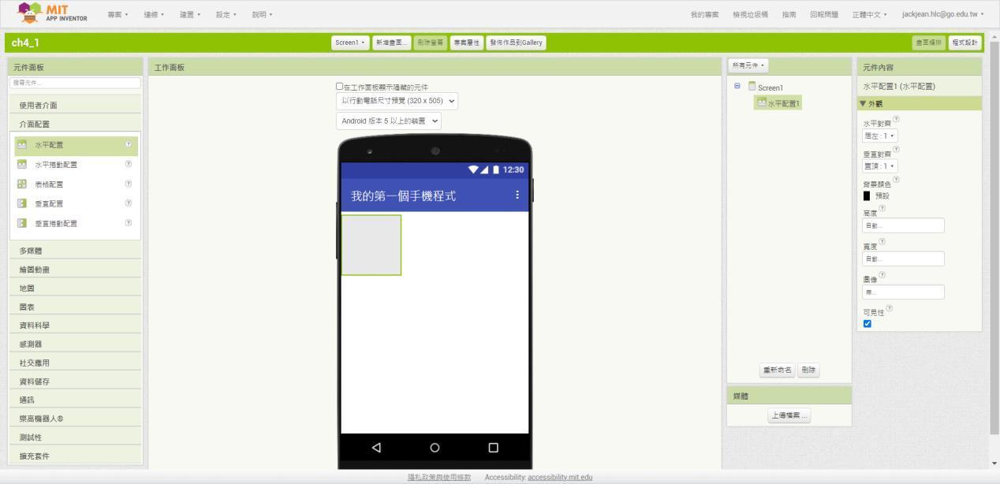

圖片說明：這是本頁第 2 張重點圖片，位於「❷ 工作面板：手機畫面編排的編輯區。」相關內容中，主要用來輔助說明 ❷ 工作面板：手機畫面編排的編輯區。 ❸ 元件清單：使用的手機畫面元件的清單。

## 第 6 頁

步驟 3：從元件面板的使用者介面中拖曳「標籤」元件到工作面板的水平配置 1
中，查看元件清單中會增加標籤 1 元件。
步驟 4：在標籤元件屬性的字體大小欄位中輸入”20”， 在文字欄位中”輸入請輸入
姓名：”，檢查手機畫面中的標籤內容已修改完成。
步驟 5：從元件面板的使用者介面中拖曳「文字輸入盒」元件到工作面板的水平
配置 1 中 ， 查看元件清單中會增加文字輸入盒1 元件 ， 接著到元件屬性的字體大
小欄位中輸入”20”，以及刪除提示欄位的內容。
❶
❷
❸
❶
❷

### 圖片

圖片說明：這是本頁第 1 張重點圖片，位於「步驟 3：從元件面板的使用者介面中拖曳「標籤」元件到工作面板的水平配置 1」相關內容中，主要用來輔助說明 步驟 3：從元件面板的使用者介面中拖曳「標籤」元件到工作面板的水平配置 1 中，查看元件清單中會增加標籤 1 元件。

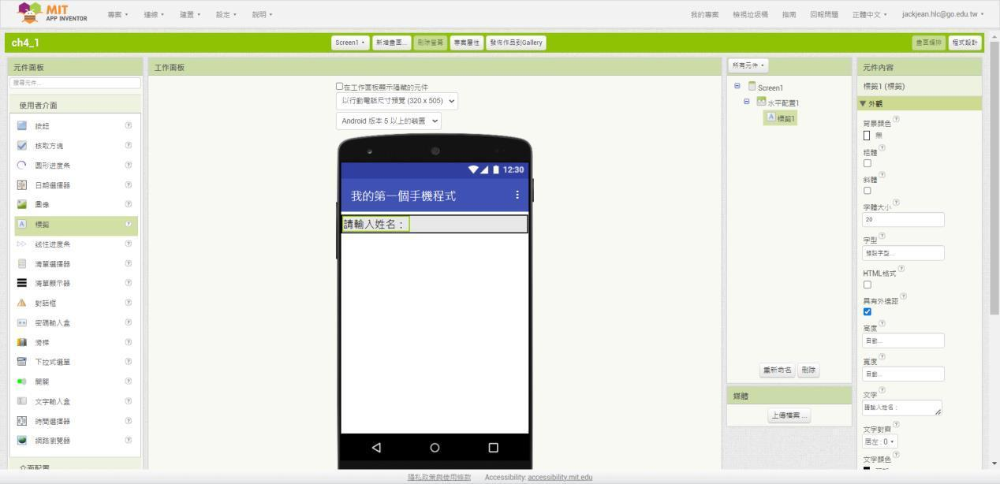

圖片說明：這是本頁第 2 張重點圖片，位於「步驟 3：從元件面板的使用者介面中拖曳「標籤」元件到工作面板的水平配置 1」相關內容中，主要用來輔助說明 步驟 3：從元件面板的使用者介面中拖曳「標籤」元件到工作面板的水平配置 1 中，查看元件清單中會增加標籤 1 元件。

## 第 7 頁

步驟 5： 從元件面板的使用者介面中拖曳「按鍵」元件到工作面板的手機畫面中，
查看元件清單中會增加按鍵 1 元件 ， 接著到元件屬性的字體大小欄位中輸入”20”，
以及文字欄位中輸入”打招呼”。
步驟 6： 從元件面板的使用者介面中拖曳「標籤」元件到工作面板的手機畫面中，
查看元件清單中會增加標籤 2 元件 ， 接著到元件屬性的字體大小欄位中輸入”20”，
以及以及刪除文字欄位的內容 。 因為刪除文字的內容 ， 所以工作面板中看不到標
籤 2。
❶
❷
❸
❹
❶
❷
❸
❹

### 圖片

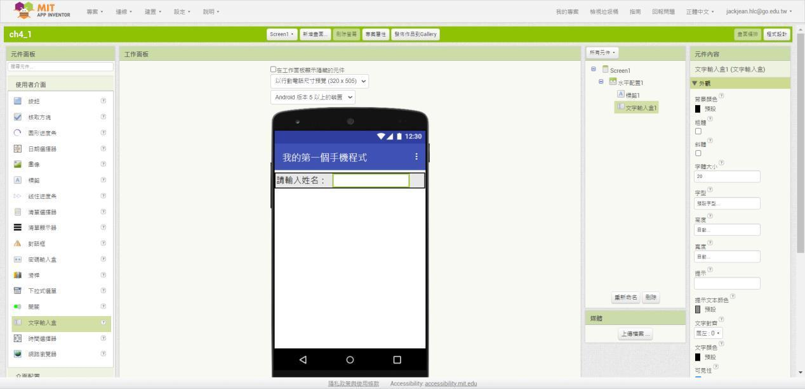

圖片說明：這是本頁第 1 張重點圖片，位於「步驟 5： 從元件面板的使用者介面中拖曳「按鍵」元件到工作面板的手機畫面中，」相關內容中，主要用來輔助說明 步驟 5： 從元件面板的使用者介面中拖曳「按鍵」元件到工作面板的手機畫面中， 查看元件清單中會增加按鍵 1 元件 ， 接著到元件屬性的字體大小欄位中輸入”20”。

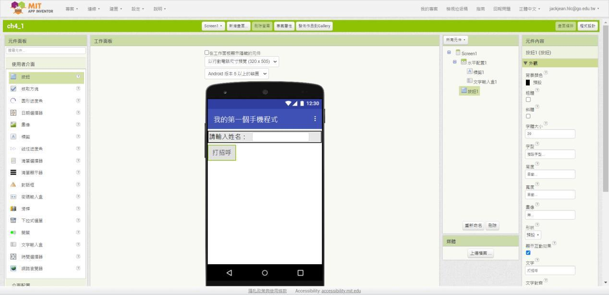

圖片說明：這是本頁第 2 張重點圖片，位於「步驟 5： 從元件面板的使用者介面中拖曳「按鍵」元件到工作面板的手機畫面中，」相關內容中，主要用來輔助說明 步驟 5： 從元件面板的使用者介面中拖曳「按鍵」元件到工作面板的手機畫面中， 查看元件清單中會增加按鍵 1 元件 ， 接著到元件屬性的字體大小欄位中輸入”20”。

## 第 8 頁

步驟 7：從元件面板的使用者介面中拖曳「圖像」元件到工作面板的手機畫面中，
查看元件清單中會增加圖像 1 元件，接著點選元件屬性的圖片欄位中「無」，混
彈出交談視窗。
步驟 8：點選彈出視窗中的「上傳檔案」，接著點選彈出視窗中的 Choose File，
繼續從彈出視窗中選擇「ch4_1.png」，最後點選「開啟」。
❶
❷
❸
❹
❶
❷
❸

### 圖片

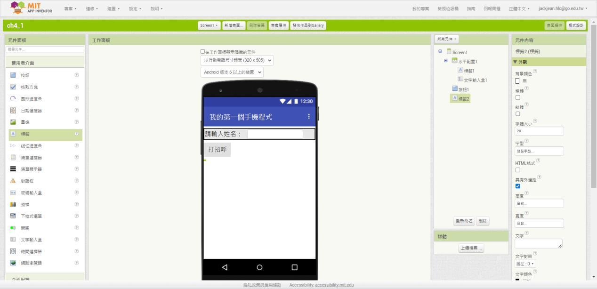

圖片說明：這是本頁第 1 張重點圖片，位於「步驟 7：從元件面板的使用者介面中拖曳「圖像」元件到工作面板的手機畫面中，」相關內容中，主要用來輔助說明 步驟 7：從元件面板的使用者介面中拖曳「圖像」元件到工作面板的手機畫面中， 查看元件清單中會增加圖像 1 元件，接著點選元件屬性的圖片欄位中「無」，混。

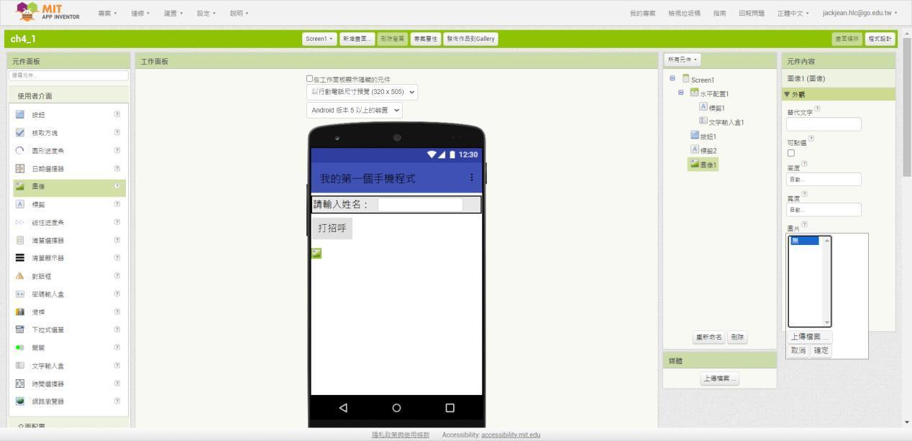

圖片說明：這是本頁第 2 張重點圖片，位於「步驟 7：從元件面板的使用者介面中拖曳「圖像」元件到工作面板的手機畫面中，」相關內容中，主要用來輔助說明 步驟 7：從元件面板的使用者介面中拖曳「圖像」元件到工作面板的手機畫面中， 查看元件清單中會增加圖像 1 元件，接著點選元件屬性的圖片欄位中「無」，混。

## 第 9 頁

步驟 9：點選「確定」。
步驟 10：查看元件清單中的媒體增加 ch4_1.png，接著點選元件屬性的可見性的
「打勾符號」，確認打勾取消。
❶
❷
❸
❹

### 圖片

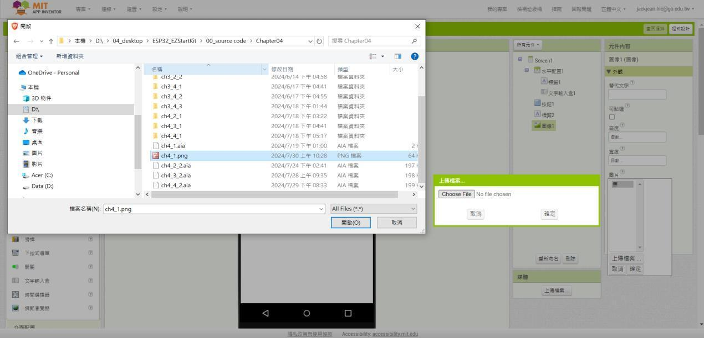

圖片說明：這是本頁第 1 張重點圖片，位於「步驟 9：點選「確定」。」相關內容中，主要用來輔助說明 步驟 9：點選「確定」。 步驟 10：查看元件清單中的媒體增加 ch4_1.png，接著點選元件屬性的可見性的。

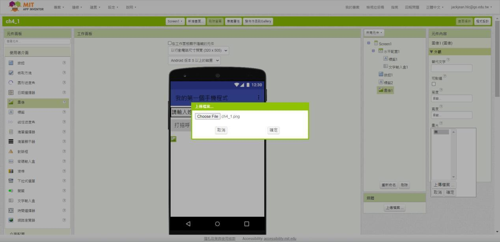

圖片說明：這是本頁第 2 張重點圖片，位於「步驟 9：點選「確定」。」相關內容中，主要用來輔助說明 步驟 9：點選「確定」。 步驟 10：查看元件清單中的媒體增加 ch4_1.png，接著點選元件屬性的可見性的。

## 第 10 頁

步驟 11：完成手機顯示的畫面，準備進入程式設計畫面。點選工具列中的「程
式設計」 ，切換成程式設計畫面，如果想要再回到手機畫面，只要點選「畫面編
排」即可。
MIT App Inventor 的程式設計：
程式設計環境說明：
❶
❷

### 圖片

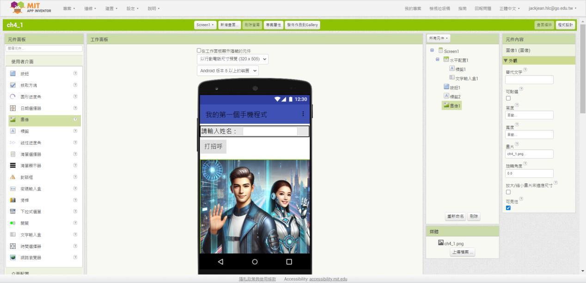

圖片說明：這是本頁第 1 張重點圖片，位於「步驟 11：完成手機顯示的畫面，準備進入程式設計畫面。點選工具列中的「程」相關內容中，主要用來輔助說明 步驟 11：完成手機顯示的畫面，準備進入程式設計畫面。點選工具列中的「程 式設計」 ，切換成程式設計畫面，如果想要再回到手機畫面，只要點選「畫面編。

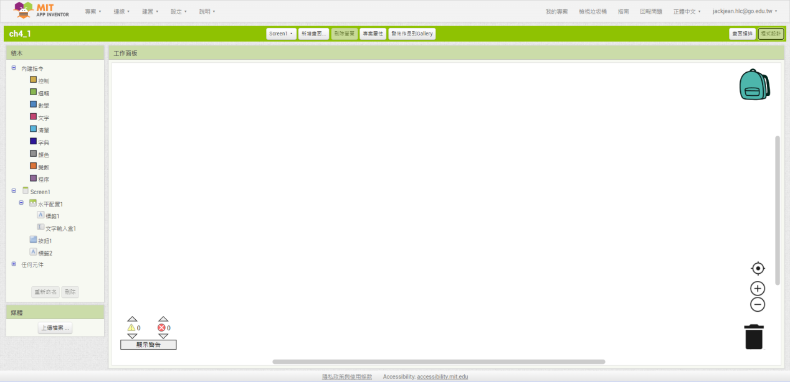

圖片說明：這是本頁第 2 張重點圖片，位於「步驟 11：完成手機顯示的畫面，準備進入程式設計畫面。點選工具列中的「程」相關內容中，主要用來輔助說明 步驟 11：完成手機顯示的畫面，準備進入程式設計畫面。點選工具列中的「程 式設計」 ，切換成程式設計畫面，如果想要再回到手機畫面，只要點選「畫面編。

## 第 11 頁

❶ 積木選單區：內建積木及畫面元件的積木都在選單區，點選選單即可看到積
木，再將所需的積木拖曳到程式編輯區。
❷ 程式編輯區：積木程式編輯得區域。
程式設計的操作步驟說明如下：
步驟 1：點選積木選單中的「按鈕 1」， 接著拖曳彈出的選單中「當按鈕 1 被點選」
積木到程式編輯區
步驟 2：點選積木選單中「文字」，接著拖曳彈出的選單中「合併文字」積木到
程式編輯區。
❶
❷
❶
❷

### 圖片

圖片說明：這是本頁第 1 張重點圖片，位於「❶ 積木選單區：內建積木及畫面元件的積木都在選單區，點選選單即可看到積」相關內容中，主要用來輔助說明 ❶ 積木選單區：內建積木及畫面元件的積木都在選單區，點選選單即可看到積 木，再將所需的積木拖曳到程式編輯區。

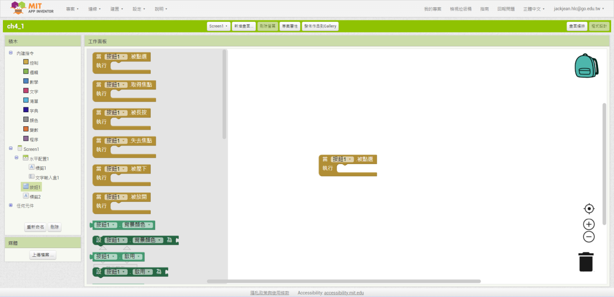

圖片說明：這是本頁第 2 張重點圖片，位於「❶ 積木選單區：內建積木及畫面元件的積木都在選單區，點選選單即可看到積」相關內容中，主要用來輔助說明 ❶ 積木選單區：內建積木及畫面元件的積木都在選單區，點選選單即可看到積 木，再將所需的積木拖曳到程式編輯區。

## 第 12 頁

步驟 3：點選積木選單中「文字輸入盒 1」，接著拖曳彈出的選單中「文字輸入盒
1.文字」積木到程式編輯區，並拼入合併文字積木中。
步驟 4：點選積木選單中的「文字」 ，接著拖曳彈出的選單中「空字串」積木到
程式編輯區，再將文字參數改為「您好!」 ，並拼入合併文字積木中。
❶
❷
❶
❷

### 圖片

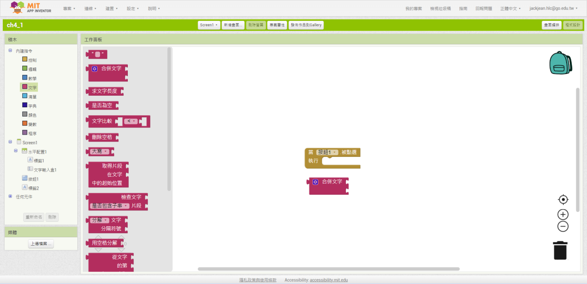

圖片說明：這是本頁第 1 張重點圖片，位於「步驟 3：點選積木選單中「文字輸入盒 1」，接著拖曳彈出的選單中「文字輸入盒」相關內容中，主要用來輔助說明 步驟 3：點選積木選單中「文字輸入盒 1」，接著拖曳彈出的選單中「文字輸入盒 1.文字」積木到程式編輯區，並拼入合併文字積木中。

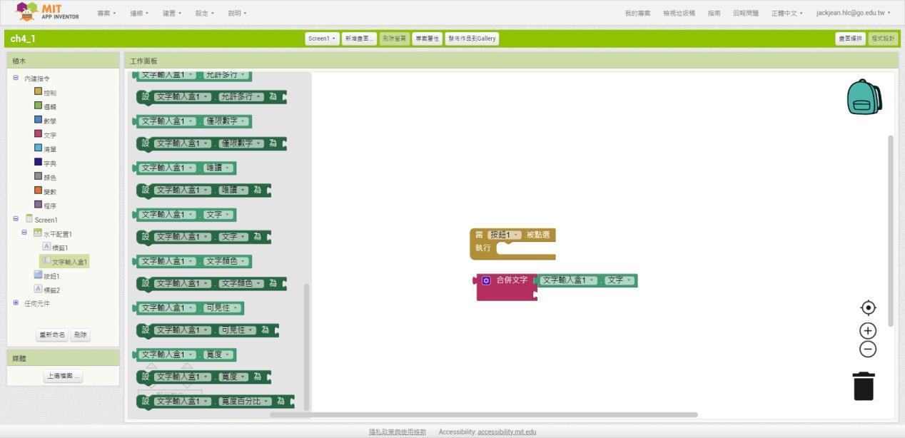

圖片說明：這是本頁第 2 張重點圖片，位於「步驟 3：點選積木選單中「文字輸入盒 1」，接著拖曳彈出的選單中「文字輸入盒」相關內容中，主要用來輔助說明 步驟 3：點選積木選單中「文字輸入盒 1」，接著拖曳彈出的選單中「文字輸入盒 1.文字」積木到程式編輯區，並拼入合併文字積木中。

## 第 13 頁

步驟 5：點選積木選單中的「標籤 2」 ，接著拖曳彈出的選單中「設標籤2 文字」
積木到程式編輯區，再將以設定好的「合併文字積木」拼入，最後將設「標籤2
文字」積木拼入「當按鈕 1 被點選」積木中。
步驟 6：點選積木選單中的 「圖像 1」 ， 接著拖曳彈出的選單中 「設圖像 1.可見性」
積木到程式編輯區。
❶
❷
❶
❷
❸

### 圖片

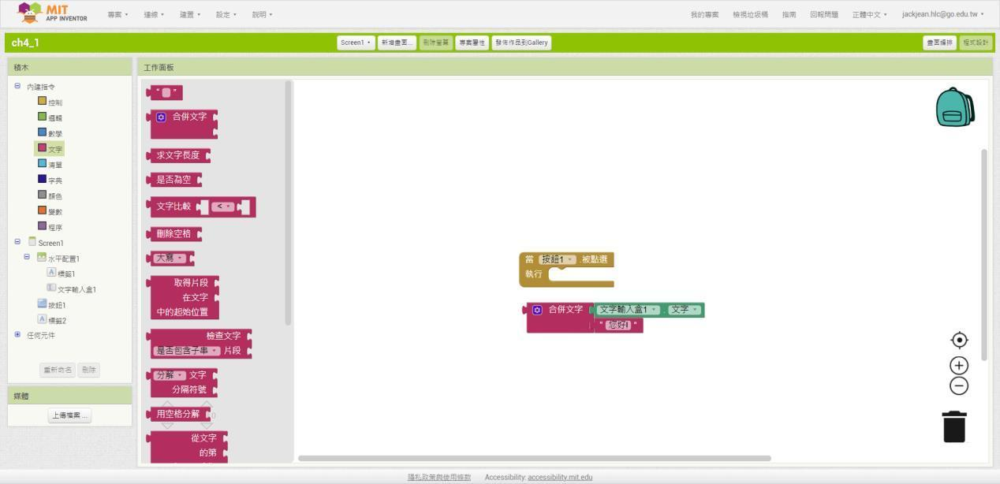

圖片說明：這是本頁第 1 張重點圖片，位於「步驟 5：點選積木選單中的「標籤 2」 ，接著拖曳彈出的選單中「設標籤2 文字」」相關內容中，主要用來輔助說明 步驟 5：點選積木選單中的「標籤 2」 ，接著拖曳彈出的選單中「設標籤2 文字」 積木到程式編輯區，再將以設定好的「合併文字積木」拼入，最後將設「標籤2。

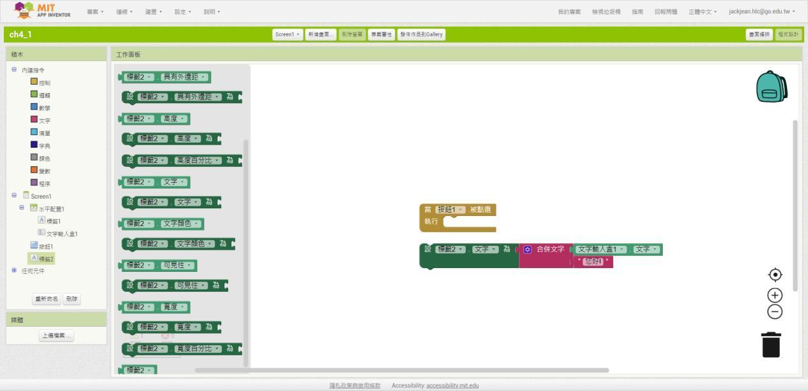

圖片說明：這是本頁第 2 張重點圖片，位於「步驟 5：點選積木選單中的「標籤 2」 ，接著拖曳彈出的選單中「設標籤2 文字」」相關內容中，主要用來輔助說明 步驟 5：點選積木選單中的「標籤 2」 ，接著拖曳彈出的選單中「設標籤2 文字」 積木到程式編輯區，再將以設定好的「合併文字積木」拼入，最後將設「標籤2。

## 第 14 頁

步驟 7：點選積木選單中的「邏輯」 ，接著拖曳彈出的選單中「真」積木到程式
編輯區，並拼入設圖像 1.可見性積木，最後將「設圖像 1.可見性」積木拼入「當
按鈕 1 被點選」積木中。
步驟 6：完成程式設計，準備將寫好的程式打包安裝到手機。
❶
❷
❶
❷
❸

### 圖片

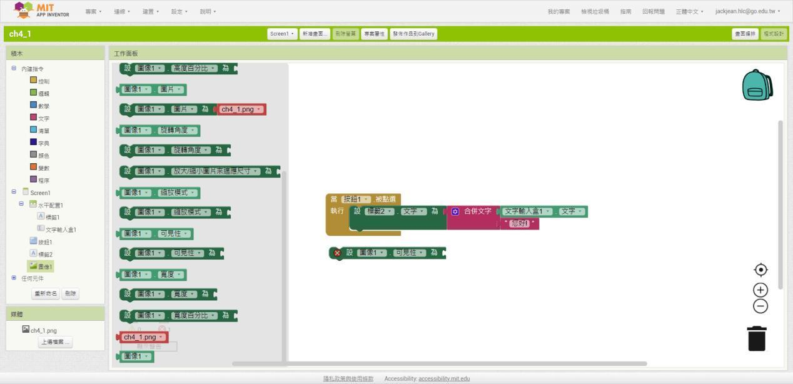

圖片說明：這是本頁第 1 張重點圖片，位於「步驟 7：點選積木選單中的「邏輯」 ，接著拖曳彈出的選單中「真」積木到程式」相關內容中，主要用來輔助說明 步驟 7：點選積木選單中的「邏輯」 ，接著拖曳彈出的選單中「真」積木到程式 編輯區，並拼入設圖像 1.可見性積木，最後將「設圖像 1.可見性」積木拼入「當。

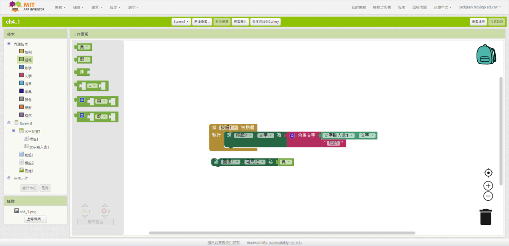

圖片說明：這是本頁第 2 張重點圖片，位於「步驟 7：點選積木選單中的「邏輯」 ，接著拖曳彈出的選單中「真」積木到程式」相關內容中，主要用來輔助說明 步驟 7：點選積木選單中的「邏輯」 ，接著拖曳彈出的選單中「真」積木到程式 編輯區，並拼入設圖像 1.可見性積木，最後將「設圖像 1.可見性」積木拼入「當。

## 第 15 頁

MIT App Inventor 的程式打包與安裝：
步驟 1：點選工具列「建置」 ，接著點選「Android 安裝檔(apk)」。
步驟 2：程式打包中。
❶
❷

### 圖片

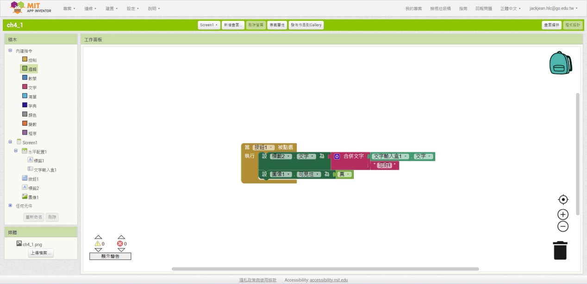

圖片說明：這是本頁第 1 張重點圖片，位於「MIT App Inventor 的程式打包與安裝：」相關內容中，主要用來輔助說明 MIT App Inventor 的程式打包與安裝： 步驟 1：點選工具列「建置」 ，接著點選「Android 安裝檔(apk)」。

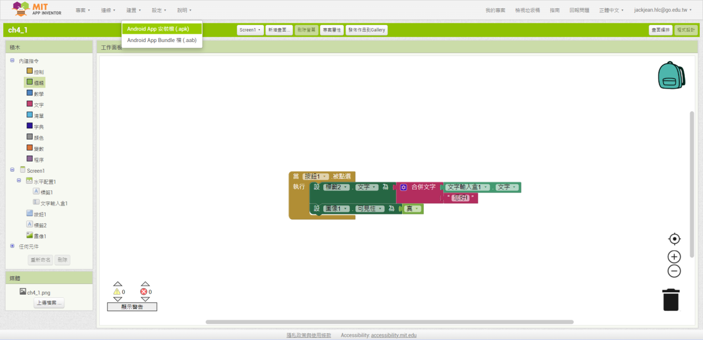

圖片說明：這是本頁第 2 張重點圖片，位於「MIT App Inventor 的程式打包與安裝：」相關內容中，主要用來輔助說明 MIT App Inventor 的程式打包與安裝： 步驟 1：點選工具列「建置」 ，接著點選「Android 安裝檔(apk)」。

## 第 16 頁

步驟 3：apk 打包完成，打開手機上的 QR code 掃描 App，準備下載到手機。
步驟 4：掃描到 QR code 後，點選「打開網站」，開始下載安裝檔，手機會詢問
是否下載，請務必選擇「下載」。各家手機設定不同，此時手機可能跳出程式有
害系統的訊息，我們要往下載及安裝的方向設定，因為這裡的 apk 沒有上架到
Google 商店，所以手機預設會阻擋我們下載或安裝。

### 圖片

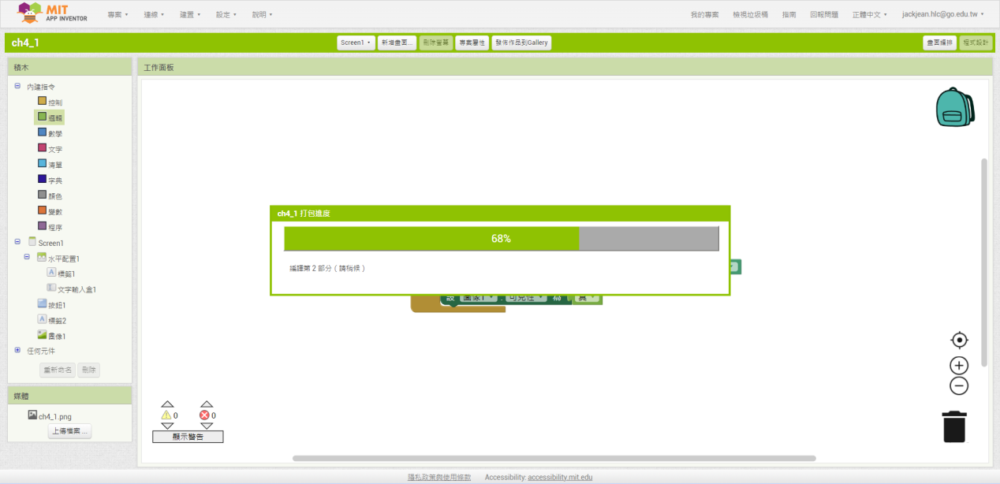

圖片說明：這是本頁第 1 張重點圖片，位於「步驟 3：apk 打包完成，打開手機上的 QR code 掃描 App，準備下載到手機。」相關內容中，主要用來輔助說明 步驟 3：apk 打包完成，打開手機上的 QR code 掃描 App，準備下載到手機。 步驟 4：掃描到 QR code 後，點選「打開網站」，開始下載安裝檔，手機會詢問。

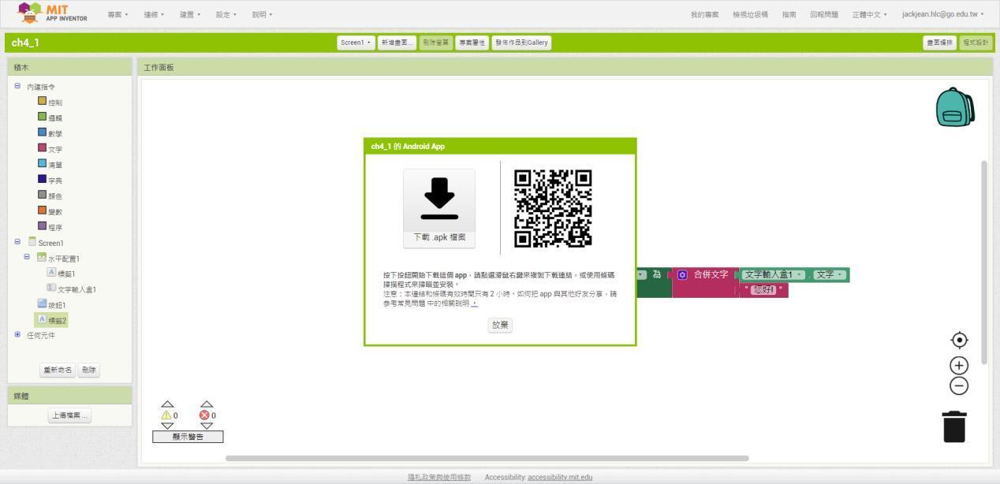

圖片說明：這是本頁第 2 張重點圖片，位於「步驟 3：apk 打包完成，打開手機上的 QR code 掃描 App，準備下載到手機。」相關內容中，主要用來輔助說明 步驟 3：apk 打包完成，打開手機上的 QR code 掃描 App，準備下載到手機。 步驟 4：掃描到 QR code 後，點選「打開網站」，開始下載安裝檔，手機會詢問。

圖片說明：這是本頁第 3 張重點圖片，位於「步驟 3：apk 打包完成，打開手機上的 QR code 掃描 App，準備下載到手機。」相關內容中，主要用來輔助說明 步驟 3：apk 打包完成，打開手機上的 QR code 掃描 App，準備下載到手機。 步驟 4：掃描到 QR code 後，點選「打開網站」，開始下載安裝檔，手機會詢問。

圖片說明：這是本頁第 4 張重點圖片，位於「步驟 3：apk 打包完成，打開手機上的 QR code 掃描 App，準備下載到手機。」相關內容中，主要用來輔助說明 步驟 3：apk 打包完成，打開手機上的 QR code 掃描 App，準備下載到手機。 步驟 4：掃描到 QR code 後，點選「打開網站」，開始下載安裝檔，手機會詢問。

## 第 17 頁

步驟 5：點選手機中的「安裝」，接著系統會要求掃描應用程式，點選「掃描應
用程式」，完成掃描後，點選「安裝」，接著系統要求安全性掃描應用程式，點選
「掃描應用程式」 ，確認程式沒有問題，準備進入安裝，接著點選「安裝」。
步驟 6：安裝完成後，點選「開啟」，啟動應用程式。
步驟 7： 在請輸入姓名的右側輸入姓名 ， 此處以輸入”曾希哲”為例 ， 接著點選「打
招呼」，畫面會出現「曾希哲您好!」及帥哥美女的照片。

### 圖片

圖片說明：這是本頁第 1 張重點圖片，位於「步驟 5：點選手機中的「安裝」，接著系統會要求掃描應用程式，點選「掃描應」相關內容中，主要用來輔助說明 步驟 5：點選手機中的「安裝」，接著系統會要求掃描應用程式，點選「掃描應 用程式」，完成掃描後，點選「安裝」，接著系統要求安全性掃描應用程式，點選。

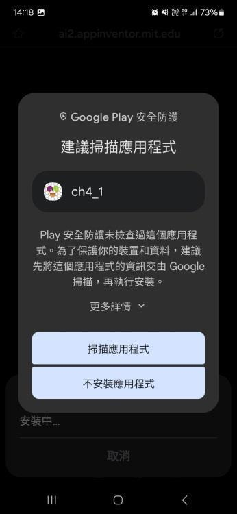

圖片說明：這是本頁第 2 張重點圖片，位於「步驟 5：點選手機中的「安裝」，接著系統會要求掃描應用程式，點選「掃描應」相關內容中，主要用來輔助說明 步驟 5：點選手機中的「安裝」，接著系統會要求掃描應用程式，點選「掃描應 用程式」，完成掃描後，點選「安裝」，接著系統要求安全性掃描應用程式，點選。

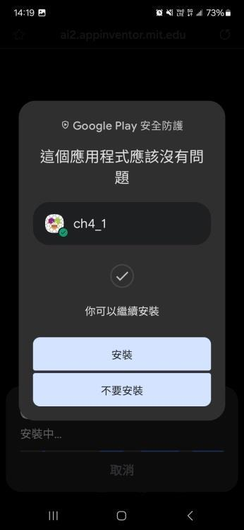

圖片說明：這是本頁第 3 張重點圖片，位於「步驟 5：點選手機中的「安裝」，接著系統會要求掃描應用程式，點選「掃描應」相關內容中，主要用來輔助說明 步驟 5：點選手機中的「安裝」，接著系統會要求掃描應用程式，點選「掃描應 用程式」，完成掃描後，點選「安裝」，接著系統要求安全性掃描應用程式，點選。

圖片說明：這是本頁第 4 張重點圖片，位於「步驟 5：點選手機中的「安裝」，接著系統會要求掃描應用程式，點選「掃描應」相關內容中，主要用來輔助說明 步驟 5：點選手機中的「安裝」，接著系統會要求掃描應用程式，點選「掃描應 用程式」，完成掃描後，點選「安裝」，接著系統要求安全性掃描應用程式，點選。

## 第 18 頁

範例程式檔案的使用方式
步驟 1：點選工具列的「專案」，接著點選「由電腦匯入專案(aia)」。
步驟 2：點選「Choose File」。
❶
❷

### 圖片

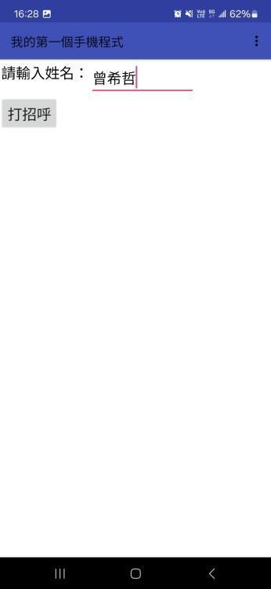

圖片說明：這是本頁第 1 張重點圖片，位於「範例程式檔案的使用方式」相關內容中，主要用來輔助說明 範例程式檔案的使用方式 步驟 1：點選工具列的「專案」，接著點選「由電腦匯入專案(aia)」。

圖片說明：這是本頁第 2 張重點圖片，位於「範例程式檔案的使用方式」相關內容中，主要用來輔助說明 範例程式檔案的使用方式 步驟 1：點選工具列的「專案」，接著點選「由電腦匯入專案(aia)」。

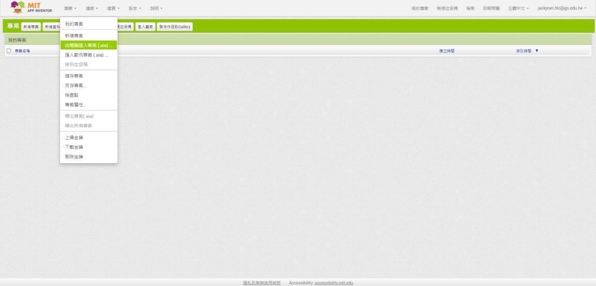

圖片說明：這是本頁第 3 張重點圖片，位於「範例程式檔案的使用方式」相關內容中，主要用來輔助說明 範例程式檔案的使用方式 步驟 1：點選工具列的「專案」，接著點選「由電腦匯入專案(aia)」。

## 第 19 頁

步驟 3：點選「正確的 aia 檔」，接著點選「開啟」。
步驟 4：點選「確定」。
❶
❷

### 圖片

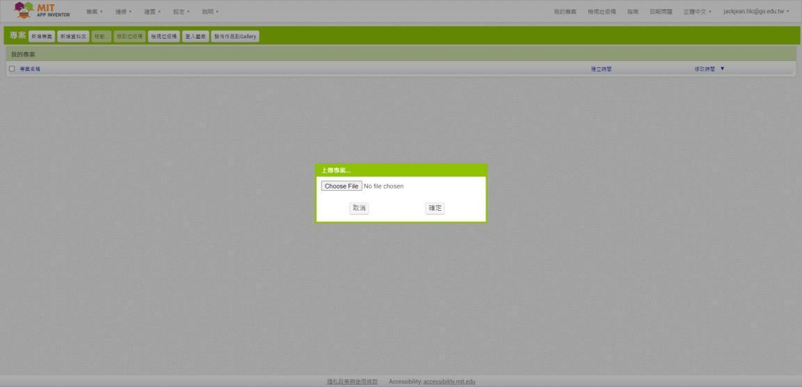

圖片說明：這是本頁第 1 張重點圖片，位於「步驟 3：點選「正確的 aia 檔」，接著點選「開啟」。」相關內容中，主要用來輔助說明 步驟 3：點選「正確的 aia 檔」，接著點選「開啟」。 步驟 4：點選「確定」。

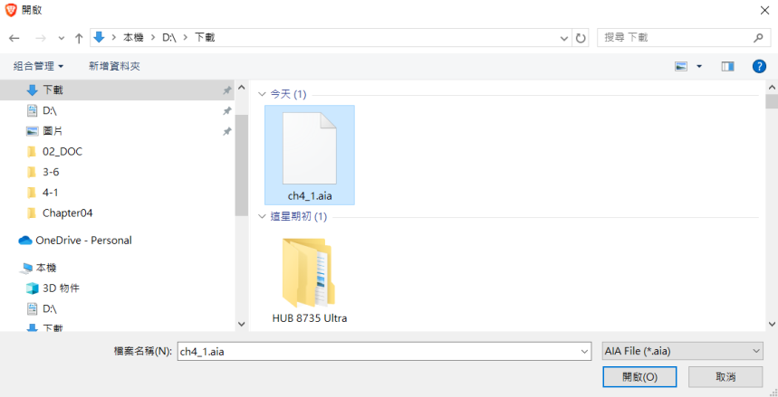

圖片說明：這是本頁第 2 張重點圖片，位於「步驟 3：點選「正確的 aia 檔」，接著點選「開啟」。」相關內容中，主要用來輔助說明 步驟 3：點選「正確的 aia 檔」，接著點選「開啟」。 步驟 4：點選「確定」。

圖片說明：這是本頁第 3 張重點圖片，位於「步驟 3：點選「正確的 aia 檔」，接著點選「開啟」。」相關內容中，主要用來輔助說明 步驟 3：點選「正確的 aia 檔」，接著點選「開啟」。 步驟 4：點選「確定」。

## 第 20 頁

步驟 5：範例程式成功進入 MIT App Inventor 中。
延伸練習：
1. 試試看 ， 讓範例中按下打招呼時 ， 顯示輸入的姓名 ， 再加今天日期以及您好!，
例如：
曾希哲 7 月 18 日您好!

### 圖片

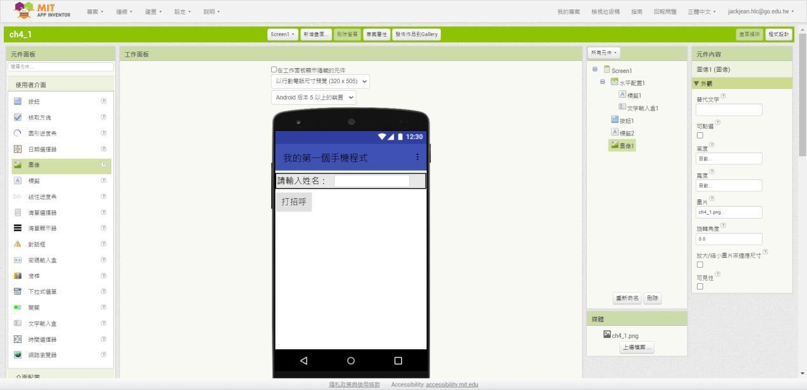

圖片說明：此圖位於「步驟 5：範例程式成功進入 MIT App Inventor 中。」頁面，主要用來輔助說明 步驟 5：範例程式成功進入 MIT App Inventor 中。 1. 試試看 ， 讓範例中按下打招呼時 ， 顯示輸入的姓名 ， 再加今天日期以及您好!。

## 第 21 頁

4-2 手機藍牙連接 ESP32
藍牙(Bluetooth)由瑞典通訊設備製造商易利信 (Ericson)所提出，用於短距離
的無線通訊，其有效距離為 50-300 公尺，廣泛用於手機、汽車、電腦周邊、醫
療保健、家庭自動化及穿戴式裝置。
藍牙由易利信提出後，逐漸演變成業界標準，從第一代開始發展，到目前已
經進入第五代，並由藍牙技術聯盟(SIG)制定標準，ESP32 使用第四代藍牙，其
工作模式可分 (1)傳統藍牙、 (2)高速藍牙、 (3)低功耗藍牙，由於低功耗藍牙
(Bluetooth Low Energy，BLE)非常省電，常被業界採用，本章介紹ESP32 的低
功耗藍牙的基本用法。
本章主要介紹 ESP32 與手機之間透過 BLE 的連線方式，ESP32 中的程式
一樣由 BlocklyDuino 撰寫，手機中的程式由 MIT App I nventor 撰寫，兩邊程式
BLE 程式完成安裝，即可透過低功耗藍牙連線，進行控制資料的傳送，如圖4-1
所示。
圖 4-1 ESP32 與手機的藍牙程式
低功耗藍牙的通訊方式 ， 如圖4-2 所示 ， 首先由ESP32 啟動藍牙服務及連線，
接下來由手機掃描提供藍牙連線的裝置，找到要連線的裝置後，由手機與 ESP32
進行連線，連線成功後，依據ESP32 提供的藍牙服務進行資料交換，整過過程無
須事先做藍牙配對。
圖 4-2 低功耗藍牙的通訊方式
本節介紹 ESP32 與手機透過 BLE 的連線方式，說明方式分成 ESP32 的
BlocklyDuino 程式及手機的 MIT App Inventor 程式兩大部份，程式的功能為當手

### 圖片

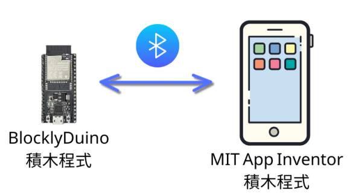

圖片說明：此圖對應「ESP32 與手機的藍牙程式」，位於「4-2 手機藍牙連接 ESP32」相關內容中，主要用來輔助說明 4-2 手機藍牙連接 ESP32 藍牙(Bluetooth)由瑞典通訊設備製造商易利信 (Ericson)所提出，用於短距離。

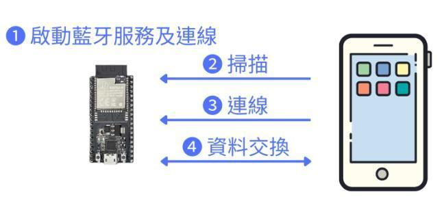

圖片說明：此圖對應「低功耗藍牙的通訊方式」，位於「4-2 手機藍牙連接 ESP32」相關內容中，主要用來輔助說明 4-2 手機藍牙連接 ESP32 藍牙(Bluetooth)由瑞典通訊設備製造商易利信 (Ericson)所提出，用於短距離。

## 第 22 頁

機與 ESP32 完成 BLE 連線時，EZ Start Kit 上的紅色 LED 會發亮，表示完成 BLE 連
線，當 BLE 連線中斷時，EZ Start Kit 上的紅色 LED 會變滅，表示 BLE 連線中斷。
另外資料交換的部分會在後續章節繼續介紹。
ESP32 BlocklyDiono 程式
使用積木：
積木選單 積木 說明
吉哥 積木 /
ESP32/ 藍牙
BLE/BLE 伺服
端
藍牙 BLE 伺服初始化積木，功用
為啟動 BLE 伺服及其提供的服務
的種類、名稱以及服務的 UUID。
吉哥積木 /
ESP32/ 藍牙
BLE/BLE 伺服
端
藍牙 BLE 伺服當連線時積木，本
積木為函式積木，功用為當 BLE
伺服端有藍牙連線連線時，會觸
發本積木內的程式執行。
吉哥積木 /
ESP32/ 藍牙
BLE/BLE 伺服
端
藍牙 BLE 伺服當斷線時積木，本
積木為函式積木，功用為當 BLE
伺服端有藍牙連線斷線時，會觸
發本積木內的程式執行，本積木
須用藍牙 BLE 伺服當連線時積木
修改參數為斷線時。
法蘭斯積木/
EZ Start Kit+
EZ Start Kit+ LED 控制積木，功用
為控制 EZ Start Kit 板上 LED 的亮
滅 ， 此積木僅能使用於EZ Start Kit
板。
使用元件及接腳：
元件名稱 IO 編號 實際接腳
紅色 LED IO4 GPIO16
積木程式—ESP32 BLE 伺服連線：
範例程式：ch4_2_1

### 圖片

圖片說明：這是本頁第 1 張重點圖片，位於「機與 ESP32 完成 BLE 連線時，EZ Start Kit 上的紅色 LED 會發亮，表示完成 BLE 連」相關內容中，主要用來輔助說明 機與 ESP32 完成 BLE 連線時，EZ Start Kit 上的紅色 LED 會發亮，表示完成 BLE 連 線，當 BLE 連線中斷時，EZ Start Kit 上的紅色 L。

圖片說明：這是本頁第 2 張重點圖片，位於「機與 ESP32 完成 BLE 連線時，EZ Start Kit 上的紅色 LED 會發亮，表示完成 BLE 連」相關內容中，主要用來輔助說明 機與 ESP32 完成 BLE 連線時，EZ Start Kit 上的紅色 LED 會發亮，表示完成 BLE 連 線，當 BLE 連線中斷時，EZ Start Kit 上的紅色 L。

圖片說明：這是本頁第 3 張重點圖片，位於「機與 ESP32 完成 BLE 連線時，EZ Start Kit 上的紅色 LED 會發亮，表示完成 BLE 連」相關內容中，主要用來輔助說明 機與 ESP32 完成 BLE 連線時，EZ Start Kit 上的紅色 LED 會發亮，表示完成 BLE 連 線，當 BLE 連線中斷時，EZ Start Kit 上的紅色 L。

圖片說明：這是本頁第 4 張重點圖片，位於「機與 ESP32 完成 BLE 連線時，EZ Start Kit 上的紅色 LED 會發亮，表示完成 BLE 連」相關內容中，主要用來輔助說明 機與 ESP32 完成 BLE 連線時，EZ Start Kit 上的紅色 LED 會發亮，表示完成 BLE 連 線，當 BLE 連線中斷時，EZ Start Kit 上的紅色 L。

## 第 23 頁

程式說明：
初始化部分：
1. 啟動藍牙 BLE 服務，設定 BLE 名稱為 ESP32_BLE，Service UUID 為
6E400001-B5A3-F393-E0A9-E50E24DCCA9E，此為 UART 服務。
函式部分：
2. 當 BLE 伺服端有連線時，會觸動本積木內的積木 3 執行。
3. 將 EZ Start Kit 的紅色 LED 腳位設為 1，即將紅色 LED 變亮。
4. 當 BLE 伺服端的連線中斷時，會觸動本積木內的積木 5 執行。
5. 將 EZ Start Kit 的紅色 LED 腳位設為 0，即將紅色 LED 變滅。
程式主要功能為啟動 BLE 伺服所提供的 UART 服務，當手機透過 BLE 完成連
線時，紅色 LED 變亮，當手機的 BLE 連線中斷時，紅色 LED 變滅，因本程式用來
示範 BLE 的連線與斷線的處理，所以沒有使用 UART 服務做接收或傳送資料。
程式中的 UUID 是 BLE 服務的編號，該編號為 16 進制數字，共有 128 個位
元 ， 我們所用的UUID 是 Nordic Semiconductor 公司所定義的 UART 服務(Service)，
UART 服務可提供接收及傳送資料，除了 Service UUID 之外，還有負責接收的 RX
特性(Characteristic)UUID 及負責傳送的 TX 特性 UUID，UUID 的設定在 MIT App
Inventor 中還會在用到，三個 UUID 的內容為：
UART 服務 UUID：6E400001-B5A3-F393-E0A9-E50E24DCCA9E
RX 特性 UUID：6E400002-B5A3-F393-E0A9-E50E24DCCA9E
TX 特性 UUID：6E400003-B5A3-F393-E0A9-E50E24DCCA9E。
UART 服務的三個 UUID 在 BlocklyDuino 中已經事先設定，寫程式時無須另外設
定。
MIT App Inventor 程式
工作面板設定：
1
2
3
4
5

### 圖片

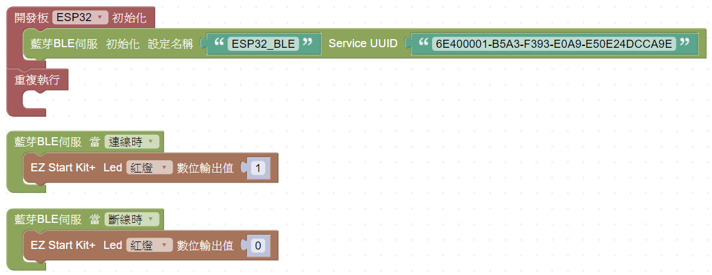

圖片說明：這是本頁第 1 張重點圖片，位於「程式說明：」相關內容中，主要用來輔助說明 1. 啟動藍牙 BLE 服務，設定 BLE 名稱為 ESP32_BLE，Service UUID 為 6E400001-B5A3-F393-E0A9-E50E24DCCA9E，此為。

## 第 24 頁

工作面板中手機畫面下方有不可見元件 BlueToothLE1 的顯示 ， 不可見元件表
示該元件在手機畫面中不會顯示 ， 在背景中執行 ， 而BlueToothLE1 表示使用藍牙
BLE 擴充套件的元件，藍牙 BLE 擴充套件加入專案的操作步驟說明如下：
步驟 1：點選積木選單最下方的「擴充套件」。
步驟 2：點選擴充套件下方的「匯入擴充套件」。

### 圖片

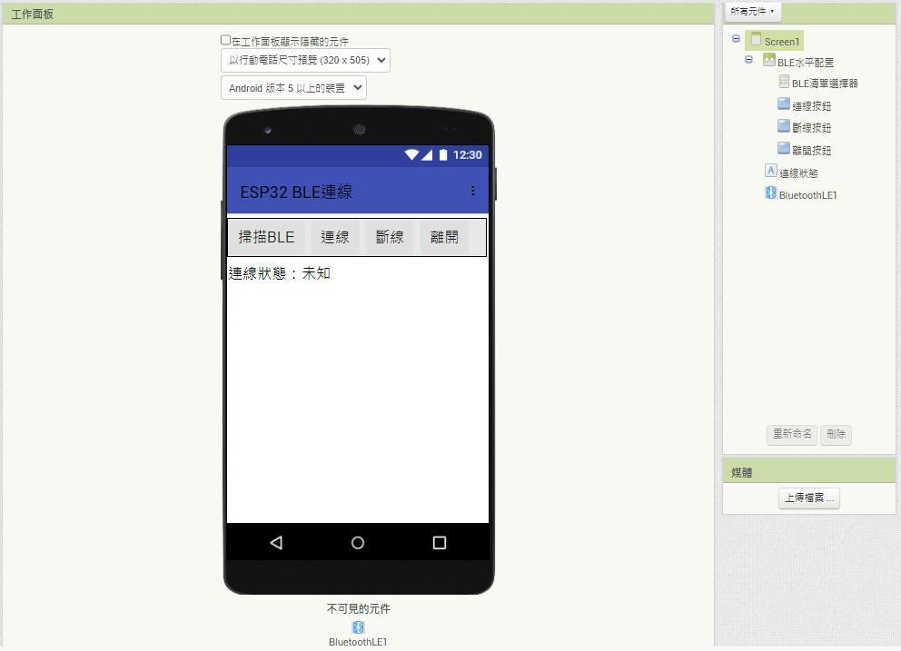

圖片說明：這是本頁第 1 張重點圖片，位於「工作面板中手機畫面下方有不可見元件 BlueToothLE1 的顯示 ， 不可見元件表」相關內容中，主要用來輔助說明 工作面板中手機畫面下方有不可見元件 BlueToothLE1 的顯示 ， 不可見元件表 示該元件在手機畫面中不會顯示 ， 在背景中執行 ， 而BlueToothLE1 表示使用藍牙。

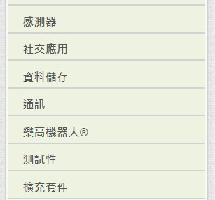

圖片說明：這是本頁第 2 張重點圖片，位於「工作面板中手機畫面下方有不可見元件 BlueToothLE1 的顯示 ， 不可見元件表」相關內容中，主要用來輔助說明 工作面板中手機畫面下方有不可見元件 BlueToothLE1 的顯示 ， 不可見元件表 示該元件在手機畫面中不會顯示 ， 在背景中執行 ， 而BlueToothLE1 表示使用藍牙。

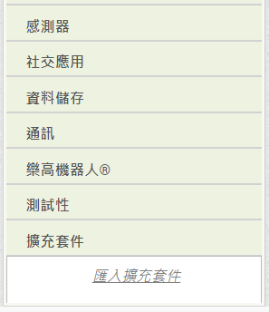

圖片說明：這是本頁第 3 張重點圖片，位於「工作面板中手機畫面下方有不可見元件 BlueToothLE1 的顯示 ， 不可見元件表」相關內容中，主要用來輔助說明 工作面板中手機畫面下方有不可見元件 BlueToothLE1 的顯示 ， 不可見元件表 示該元件在手機畫面中不會顯示 ， 在背景中執行 ， 而BlueToothLE1 表示使用藍牙。

## 第 25 頁

步驟 3：在彈出視窗中點選「網址」，接著在 Url 欄位中輸入
“https://mit-cml.github.io/extensions/data/extensions/edu.mit.appinventor.ble-2023
0728.aix”，最後點選「Import」，匯入 BLE 擴充套件。
步驟 4：匯出 BLE 擴充套件後，可在積木選單中看到 BluetoothLE 元件，接著點
選 BluetoothLE 右側的「?」，可在彈出視窗中看到建置日期為 2023-07-28，2023
版為最新版本。
步驟 5：將 BluetoothLR 元件拖曳到工作面板區，可以看到手機畫面下方出現不
可見元件 BlueToothLE1，另外在元件清單中也可以看到 BlueToothLE1 元件。
❶
❷
❸
❶
❷
❸

### 圖片

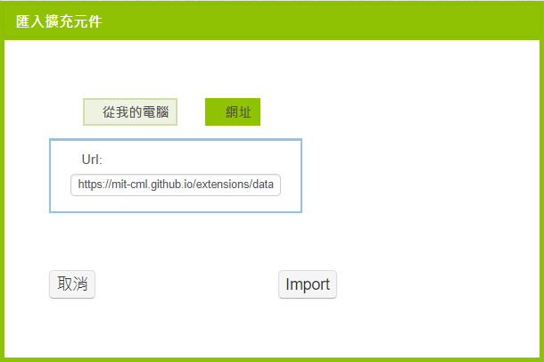

圖片說明：這是本頁第 1 張重點圖片，位於「步驟 3：在彈出視窗中點選「網址」，接著在 Url 欄位中輸入」相關內容中，主要用來輔助說明 步驟 3：在彈出視窗中點選「網址」，接著在 Url 欄位中輸入 “https://mit-cml.github.io/extensions/data/extensions/edu.。

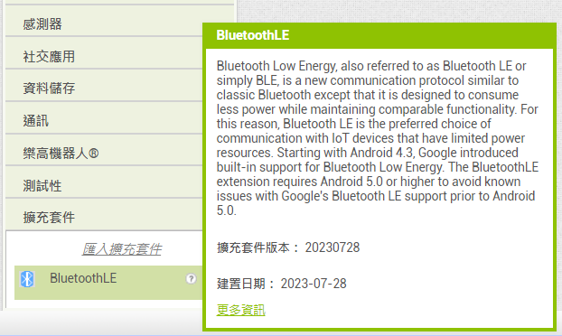

圖片說明：這是本頁第 2 張重點圖片，位於「步驟 3：在彈出視窗中點選「網址」，接著在 Url 欄位中輸入」相關內容中，主要用來輔助說明 步驟 3：在彈出視窗中點選「網址」，接著在 Url 欄位中輸入 “https://mit-cml.github.io/extensions/data/extensions/edu.。

## 第 26 頁

工作面板使用元件：
選單 元件種類 元件名稱 屬性
Screen1 標題：ESP32 BLE 連線
介面配置 水平配置 BLE 水平配置 寬度：填滿。
使用者介面 清單選擇器 BLE 清單選擇器 字體大小：20
文字：掃描 BLE
使用者介面 按鈕 連線按鈕 字體大小：20
文字：連線
使用者介面 按鈕 斷線按鈕 字體大小：20
文字：斷線
使用者介面 按鈕 離開按鈕 字體大小：20
文字：離開
使用者介面 標籤 連線狀態 字體大小：20
文字：連線狀態：未知
Extension BluetoothLE BluetoothLE1 無須修改，本元件為不可見元
件，在手機畫面上不會顯示。
在元件清單中修改元件的名稱，操作步驟說明如下：
步驟 1：點選元件清單中元件的名稱，此處以「水平配置 1」為例，接著點選「重
新命名」。

### 圖片

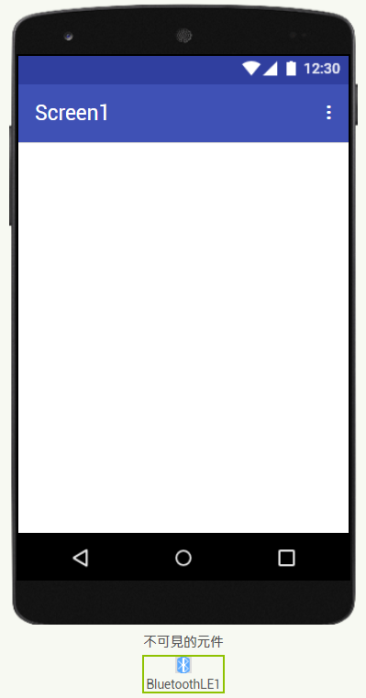

圖片說明：這是本頁第 1 張重點圖片，位於「工作面板使用元件：」相關內容中，主要用來輔助說明 工作面板使用元件： 選單 元件種類 元件名稱 屬性。

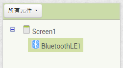

圖片說明：這是本頁第 2 張重點圖片，位於「工作面板使用元件：」相關內容中，主要用來輔助說明 工作面板使用元件： 選單 元件種類 元件名稱 屬性。

## 第 27 頁

步驟 2：在彈出視窗的新名稱欄位中輸入”BLE 水平配置”，接著點選「確定」。
步驟 3： 查看元件清單 ， 元件名稱以修改成BLE 水平配置 ， 如果修改結果有錯誤，
請從步驟 1 再次修改。
使用程式積木：
選單 積木 說明/
內建/變數
初始化全域變數積木， 功用
為設定變數名稱 ， 同時可初
始化變數的內容值。
內建/文字
空字串積木， 功用為空白的
字串文字 ， 可修改參數在雙
引號中加入文字。
Screen
當螢幕初始化積木， 功用為
當 App 開始執行時會觸發
執行本積木中的程式。
❶
❷
❶
❷

### 圖片

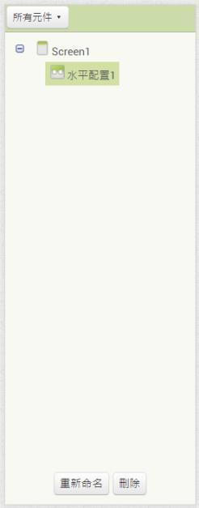

圖片說明：這是本頁第 1 張重點圖片，位於「步驟 2：在彈出視窗的新名稱欄位中輸入”BLE 水平配置”，接著點選「確定」。」相關內容中，主要用來輔助說明 步驟 2：在彈出視窗的新名稱欄位中輸入”BLE 水平配置”，接著點選「確定」。 步驟 3： 查看元件清單 ， 元件名稱以修改成BLE 水平配置 ， 如果修改結果有錯誤。

圖片說明：這是本頁第 2 張重點圖片，位於「步驟 2：在彈出視窗的新名稱欄位中輸入”BLE 水平配置”，接著點選「確定」。」相關內容中，主要用來輔助說明 步驟 2：在彈出視窗的新名稱欄位中輸入”BLE 水平配置”，接著點選「確定」。 步驟 3： 查看元件清單 ， 元件名稱以修改成BLE 水平配置 ， 如果修改結果有錯誤。

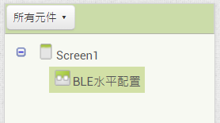

圖片說明：這是本頁第 3 張重點圖片，位於「步驟 2：在彈出視窗的新名稱欄位中輸入”BLE 水平配置”，接著點選「確定」。」相關內容中，主要用來輔助說明 步驟 2：在彈出視窗的新名稱欄位中輸入”BLE 水平配置”，接著點選「確定」。 步驟 3： 查看元件清單 ， 元件名稱以修改成BLE 水平配置 ， 如果修改結果有錯誤。

## 第 28 頁

BluetoothLE1
呼叫藍牙掃描積木， 功用為
開始掃描藍芽裝置。
BluetoothLE1
當發現藍牙裝置積木， 功用
為當掃描發現藍牙裝置時
會觸發執行本積木中的程
式。
清單選擇器
設清單選擇器的元素字串
積木， 功用為設定清單選擇
器的元素字串 ， 可一次設定
整個清單。
BluetoothLE1
藍牙的裝置清單積木， 功用
為當藍牙掃描完成 ， 掃描結
果會以清單方式存在本積
木。
清單選擇器
當清單選擇器完成選擇積
木，功用為當清單顯示後，
使用者完成選擇時 ， 會觸發
執行本積木中的程式。
內建/文字
從文字提取字串， 功用為從
文字中提取某個長處的字
串，由設定的參數決定，從
第幾個字開始 ， 提取多少長
度的字串。
清單選擇器
清單選擇器的選中項， 功用
為當清單顯示後 ， 使用者完
成選擇時 ， 會使用者選定的
結果會記錄在本積木。
內建/數學
數字積木， 功用為產生一般
的數值。
按鈕
當按鈕被點選積木， 功用為
當按鈕(連線按鈕)被點選
時 ， 會觸發執行本積木中的
程式。
按鈕
當按鈕被點選積木， 功用為
當按鈕(斷線按鈕)被點選
時 ， 會觸發執行本積木中的
程式。

### 圖片

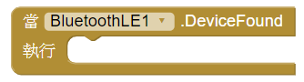

圖片說明：這是本頁第 1 張重點圖片，位於「BluetoothLE1」相關內容中，主要用來輔助說明 BluetoothLE1 呼叫藍牙掃描積木， 功用為。

圖片說明：這是本頁第 2 張重點圖片，位於「BluetoothLE1」相關內容中，主要用來輔助說明 BluetoothLE1 呼叫藍牙掃描積木， 功用為。

圖片說明：這是本頁第 3 張重點圖片，位於「BluetoothLE1」相關內容中，主要用來輔助說明 BluetoothLE1 呼叫藍牙掃描積木， 功用為。

## 第 29 頁

按鈕
當按鈕被點選積木， 功用為
當按鈕(離開按鈕)被點選
時 ， 會觸發執行本積木中的
程式。
BluetoothLE1
呼叫藍牙位址連線積木，功
用為執行連線藍牙裝置 ， 由
參數提供連線的地址。
內建/變數
設置全域變數積木， 功用為
設定變數的內容值 ， 變數名
稱及內容值為可調整的參
數。
內建/變數
取變數內容值積木， 功用為
提取變數的內容值 ， 變數名
稱為可調整的參數。
BluetoothLE1
當藍牙連線積木， 功用為當
藍牙連線完成時 ， 會觸發執
行本積木中的程式。
BluetoothLE1
呼叫藍牙斷線積木， 功用為
執行藍牙斷線。
標籤
設定標籤文字積木， 功用為
設定標籤要顯示的文字。
內建/
流程控制
退出程式積木， 功用為結束
App 的執行。
積木程式—連線 BLE 伺服
範例程式：ch4_2_2
1
2
3
4
5

### 圖片

圖片說明：這是本頁第 1 張重點圖片，位於「按鈕」相關內容中，主要用來輔助說明 當按鈕被點選積木， 功用為 當按鈕(離開按鈕)被點選。

圖片說明：這是本頁第 2 張重點圖片，位於「按鈕」相關內容中，主要用來輔助說明 當按鈕被點選積木， 功用為 當按鈕(離開按鈕)被點選。

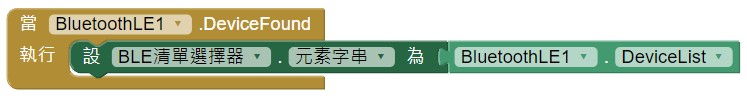

圖片說明：這是本頁第 3 張重點圖片，位於「按鈕」相關內容中，主要用來輔助說明 當按鈕被點選積木， 功用為 當按鈕(離開按鈕)被點選。

圖片說明：這是本頁第 4 張重點圖片，位於「按鈕」相關內容中，主要用來輔助說明 當按鈕被點選積木， 功用為 當按鈕(離開按鈕)被點選。

## 第 30 頁

程式說明：
1. 設定變數 Device 的內容值為空字串。
2. 當 App 執行時，會觸發執行積木 3。
3. 開始掃描藍牙裝置。
4. 當掃描完成發現藍牙裝置時，會觸發執行積木 5。
5. 將掃描到的藍牙地址儲存於 BLE 清單選擇器。
6. 當使用者從 BLE 清單選擇器的清單中選擇完成時，會觸動執行積木 7 及 8。
7. 提取使用者所選中的 BLE 清單項目中從第 1 個字開始長度 17 的字串，儲存於
變數 Device。
8. 設定連線狀態標籤的文字為連線狀態：藍牙選定。
9. 當連線按鈕被按下時，會觸動執行積木 10。
10. 以變數 Device 內容值為地址，進行藍牙連線。
11. 當藍牙連線完成時，會觸動執行積木 12。
12. 設定連線狀態標籤的文字為連線狀態：藍牙連線。
13. 當斷線按鈕被按下時，會觸動執行積木 14 及 15。
14. 進行藍牙斷線。
6
7
8
9
10
11
12
13
14
15
16
17
18

### 圖片

圖片說明：這是本頁第 1 張重點圖片，位於「程式說明：」相關內容中，主要用來輔助說明 1. 設定變數 Device 的內容值為空字串。 2. 當 App 執行時，會觸發執行積木 3。

圖片說明：這是本頁第 2 張重點圖片，位於「程式說明：」相關內容中，主要用來輔助說明 1. 設定變數 Device 的內容值為空字串。 2. 當 App 執行時，會觸發執行積木 3。

圖片說明：這是本頁第 3 張重點圖片，位於「程式說明：」相關內容中，主要用來輔助說明 1. 設定變數 Device 的內容值為空字串。 2. 當 App 執行時，會觸發執行積木 3。

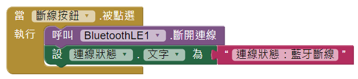

圖片說明：這是本頁第 4 張重點圖片，位於「程式說明：」相關內容中，主要用來輔助說明 1. 設定變數 Device 的內容值為空字串。 2. 當 App 執行時，會觸發執行積木 3。

## 第 31 頁

15. 設定連線狀態標籤的文字為連線狀態：藍牙斷線。
16. 當離開按鈕被按下時，會觸動執行積木 17 及 18。
17. 進行藍牙斷線。
18. 結束 App 的執行。
MIT App Inventor 的程式是屬於事件驅動型，當有事件觸發時就會相關程式
驅動程式，跟ESP32 由上而下執行的程式不一樣，所以讀程式時可以像讀劇本一
樣。
程式可以分成掃描 BLE、連線 BLE 以及結束連線三個部分，一開機後就掃描
伺服端的 BLE 的裝置，當找到裝置後就紀錄在清單中，等待我們從清單去點選適
合的伺服端連線裝置。當選到適合的裝置後，就用 BLE 的地址做連線，當 BLE 連
線完成時，程式會通知我們完成連線。連線結束時，釋放伺服端BLE 連線，準備
下次的連線。BLE 的連線方式跟傳統藍牙不同，傳統藍牙連線前需要事先配對，
但是 BLE 不需要事先配對。
程式中使用的藍牙擴充套件為 MIT App Inventor 官方的套件，目前最新版本
為 2023 年版，關於 MIT App Inventor 所有的官方套件，詳見下方超連結：
https://mit-cml.github.io/extensions/
執行結果：
請先開啟手機的藍牙功能 ， 兩邊的程式開始執行後，EZ Strat Kit 上的紅色 LED
是不亮，手機上的藍牙連線狀態顯示未知。
當點選手機 App 上的「掃描 BLE 按鍵」後，螢幕出現手機附近所有的 BLE

### 圖片

圖片說明：這是本頁第 1 張重點圖片，位於「15. 設定連線狀態標籤的文字為連線狀態：藍牙斷線。」相關內容中，主要用來輔助說明 15. 設定連線狀態標籤的文字為連線狀態：藍牙斷線。 16. 當離開按鈕被按下時，會觸動執行積木 17 及 18。

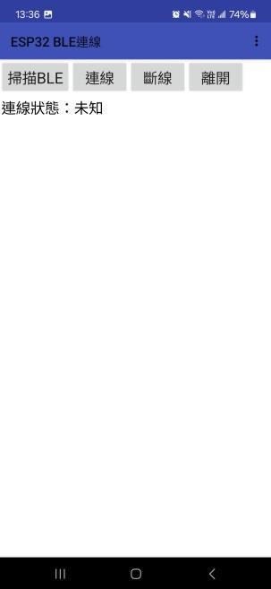

圖片說明：這是本頁第 2 張重點圖片，位於「15. 設定連線狀態標籤的文字為連線狀態：藍牙斷線。」相關內容中，主要用來輔助說明 15. 設定連線狀態標籤的文字為連線狀態：藍牙斷線。 16. 當離開按鈕被按下時，會觸動執行積木 17 及 18。

## 第 32 頁

裝置。
當點選手機上的「ESP32_BLE」後，手機上的藍牙連線狀態顯示藍牙選定。
當點選手機上的「連線按鍵」後，EZ Start Kit 上的紅色 LED 變亮，手機上的
藍牙連線狀態顯示藍牙連線。

### 圖片

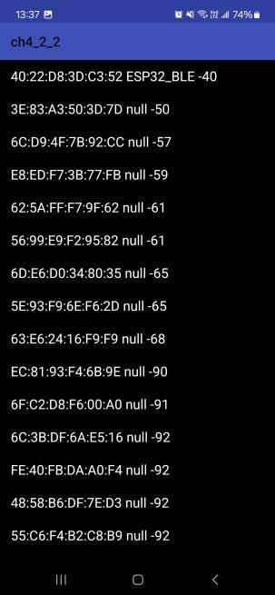

圖片說明：這是本頁第 1 張重點圖片，位於「裝置。」相關內容中，主要用來輔助說明 當點選手機上的「ESP32_BLE」後，手機上的藍牙連線狀態顯示藍牙選定。 當點選手機上的「連線按鍵」後，EZ Start Kit 上的紅色 LED 變亮，手機上的。

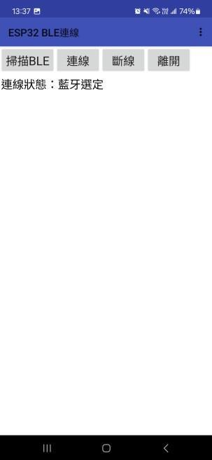

圖片說明：這是本頁第 2 張重點圖片，位於「裝置。」相關內容中，主要用來輔助說明 當點選手機上的「ESP32_BLE」後，手機上的藍牙連線狀態顯示藍牙選定。 當點選手機上的「連線按鍵」後，EZ Start Kit 上的紅色 LED 變亮，手機上的。

## 第 33 頁

當點選手機上的「斷線按鍵」後，EZ Start Kit 上的紅色 LED 變滅，手機上的
藍牙連線狀態顯示藍牙斷線。
本程式為簡單的範例 ， 所以沒有設定保護模式 ， 所以請按執行結果的順序執
行，若有出現錯誤訊息，請關閉 App 後重新執行。
手機上安裝 BLE 程式會出現兩個額外的設定，請務必按照下列說明安裝：
步驟 1：出現要允許「ch4_2_2」尋找、連結及判斷附近裝置的相對位置嗎?要點
選「允許」。

### 圖片

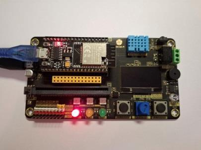

圖片說明：這是本頁第 1 張重點圖片，位於「當點選手機上的「斷線按鍵」後，EZ Start Kit 上的紅色 LED 變滅，手機上的」相關內容中，主要用來輔助說明 當點選手機上的「斷線按鍵」後，EZ Start Kit 上的紅色 LED 變滅，手機上的 藍牙連線狀態顯示藍牙斷線。

圖片說明：這是本頁第 2 張重點圖片，位於「當點選手機上的「斷線按鍵」後，EZ Start Kit 上的紅色 LED 變滅，手機上的」相關內容中，主要用來輔助說明 當點選手機上的「斷線按鍵」後，EZ Start Kit 上的紅色 LED 變滅，手機上的 藍牙連線狀態顯示藍牙斷線。

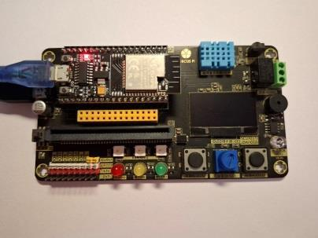

圖片說明：這是本頁第 3 張重點圖片，位於「當點選手機上的「斷線按鍵」後，EZ Start Kit 上的紅色 LED 變滅，手機上的」相關內容中，主要用來輔助說明 當點選手機上的「斷線按鍵」後，EZ Start Kit 上的紅色 LED 變滅，手機上的 藍牙連線狀態顯示藍牙斷線。

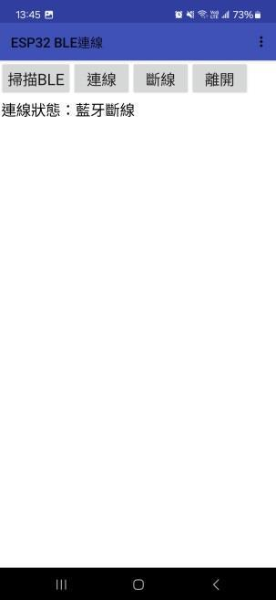

圖片說明：這是本頁第 4 張重點圖片，位於「當點選手機上的「斷線按鍵」後，EZ Start Kit 上的紅色 LED 變滅，手機上的」相關內容中，主要用來輔助說明 當點選手機上的「斷線按鍵」後，EZ Start Kit 上的紅色 LED 變滅，手機上的 藍牙連線狀態顯示藍牙斷線。

## 第 34 頁

步驟 2：出現要允許「ch4_2_2」存取這部裝置的位置資訊嗎?要點選「精確」後，
接著點選「使用應用程式時」。
延伸練習：
我們想用 EZ Start Kit 瞭解 BLE 的連線狀況，連線的狀況分為未知、連線及斷
❶
❷

### 圖片

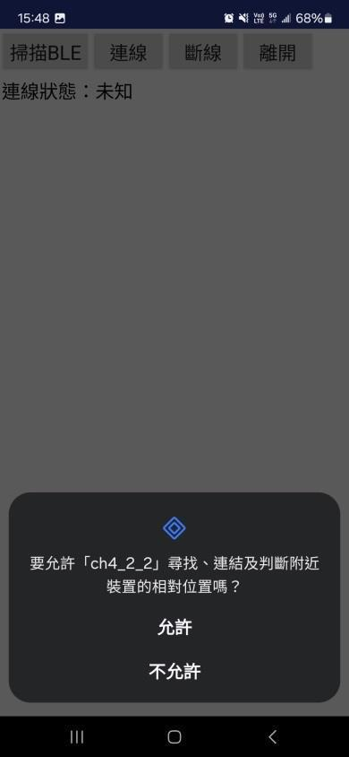

圖片說明：這是本頁第 1 張重點圖片，位於「步驟 2：出現要允許「ch4_2_2」存取這部裝置的位置資訊嗎?要點選「精確」後，」相關內容中，主要用來輔助說明 步驟 2：出現要允許「ch4_2_2」存取這部裝置的位置資訊嗎?要點選「精確」後， 接著點選「使用應用程式時」。

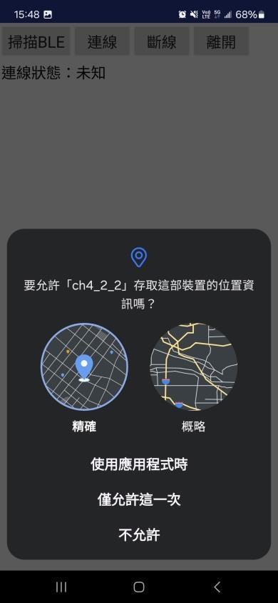

圖片說明：這是本頁第 2 張重點圖片，位於「步驟 2：出現要允許「ch4_2_2」存取這部裝置的位置資訊嗎?要點選「精確」後，」相關內容中，主要用來輔助說明 步驟 2：出現要允許「ch4_2_2」存取這部裝置的位置資訊嗎?要點選「精確」後， 接著點選「使用應用程式時」。

## 第 35 頁

線三種狀況，請用 EZ Start Kit 上的模組顯示這三種狀況。(提示：可使用 LED 模
組的三個 LED 顯示。

## 第 36 頁

4-3 手機藍牙遙控器
本節以藍牙連接 ESP32 與手機之間，達成用手機遙控 EZ Start Kit 上的 LED，
如圖 4-3 所示，ESP32 為 BLE 伺服器，啟動 UART 服務，當手機使用 BLE 與 ESP32
連接後，建立 BLE 通訊通道，雙方協議由 ESP32 的 UART 服務的 RX 特性負責接
收 BLE 通訊通道的資料 ， 而手機則使用UART 服務的 RX 特性 UUID 寫入 BLE 通訊
通道的資料，傳送給 ESP32。當 ESP32 收到控制指令後，再依據控制指令進行模
組的控制。
圖 4-3 手機 BLE 遙控器
本節首先介紹 ESP32 的 BlocklyDuino 程式使用 UART 服務接收藍牙通道的控
制指令，然後依據控制指令決定繼電器接點的狀態，在 3-6 節中提過繼電器的接
點可以控制家電，另外介紹手機的 MIT App Inventor 程式完成 BLE 連線後，使用
UART 服務的 RX 特性 UUID 寫入控制指令到藍牙通道，兩個程式完成後，即可使
用手機遙控家電。
ESP32 BlocklyDiono 程式
使用積木：
積木選單 積木 說明
吉哥積木 /
ESP32/ 藍牙
BLE/BLE 伺服
端
藍牙 BLE 伺服初始化積木，功用
為啟動 BLE 伺服及其提供的服務
種類、名稱以及服務的 UUID。
吉哥積木 /
ESP32/ 藍牙
BLE/BLE 伺服
端
藍牙 BLE 伺服當連線時積木，本
積木為函式積木，功用為當 BLE
伺服端有藍牙連線連線時，會觸
發本積木內的程式執行。

### 圖片

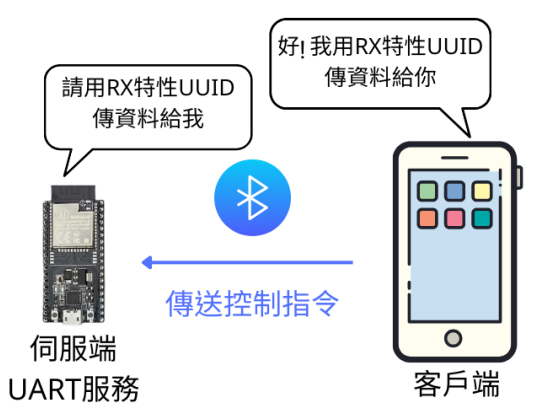

圖片說明：此圖對應「手機 BLE 遙控器」，位於「4-3 手機藍牙遙控器」相關內容中，主要用來輔助說明 4-3 手機藍牙遙控器 本節以藍牙連接 ESP32 與手機之間，達成用手機遙控 EZ Start Kit 上的 LED。

圖片說明：這是本頁第 2 張重點圖片，位於「4-3 手機藍牙遙控器」相關內容中，主要用來輔助說明 4-3 手機藍牙遙控器 本節以藍牙連接 ESP32 與手機之間，達成用手機遙控 EZ Start Kit 上的 LED。

圖片說明：這是本頁第 3 張重點圖片，位於「4-3 手機藍牙遙控器」相關內容中，主要用來輔助說明 4-3 手機藍牙遙控器 本節以藍牙連接 ESP32 與手機之間，達成用手機遙控 EZ Start Kit 上的 LED。

## 第 37 頁

吉哥積木 /
ESP32/ 藍牙
BLE/BLE 伺服
端
藍牙 BLE 伺服當斷線時積木，本
積木為函式積木，功用為當 BLE
伺服端有藍牙連線斷線時，會觸
發本積木內的程式執行，本積木
須用藍牙 BLE 伺服當連線時積木
修改參數為斷線時。
吉哥積木 /
ESP32/ 藍牙
BLE/BLE 伺服
端
藍牙 BLE 伺服當收到訊息時積
木，功用為當藍牙 BLE 伺服收到
訊息時，會觸發本積木內的程式
執行。
吉哥積木 /
ESP32/ 藍牙
BLE/BLE 伺服
端
取用藍牙 BLE 伺服讀取到的字串
積木，功用為當藍牙 BLE 伺服收
到訊息後，取用所收到的字串。
法蘭斯積木/
EZ Start Kit+
EZ Start Kit+ LED 控制積木，功用
為控制 EZ Start Kit 板上 LED 的亮
滅 ， 此積木僅能使用於EZ Start Kit
板。
使用元件及接腳：
元件名稱 IO 編號 實際接腳
繼電器 IO13 GPIO25
內建 LED 無 GPIO2
積木程式—ESP32 BLE 控制繼電器：
範例程式：ch4_3_1
1
2
3
4
5
6
7
8
9
10

### 圖片

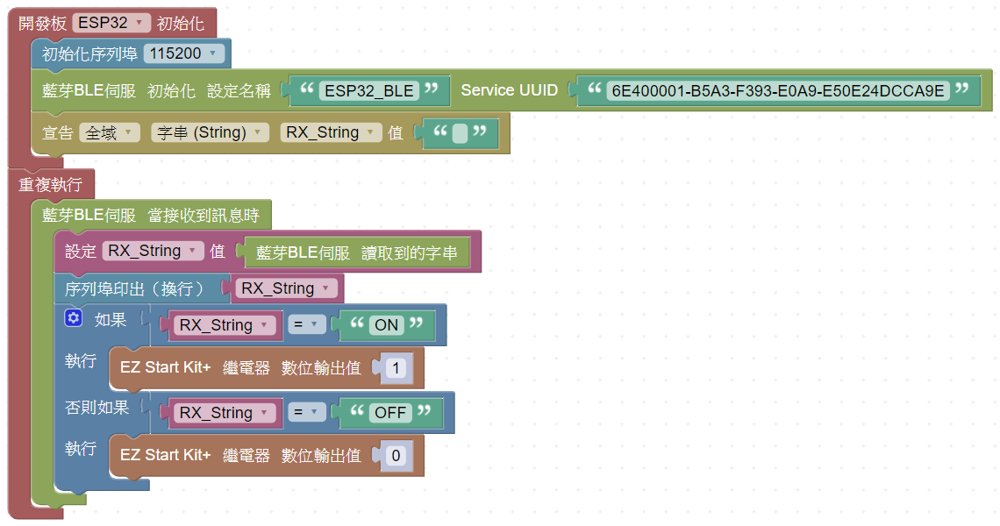

圖片說明：這是本頁第 1 張重點圖片，位於「吉哥積木 /」相關內容中，主要用來輔助說明 ESP32/ 藍牙 BLE/BLE 伺服。

## 第 38 頁

程式說明：
初始化部分：
1. 初始化序列埠連線，設定傳輸速度為 115200。
2. 啟動藍牙 BLE 服務，設定 BLE 名稱為 ESP32_BLE，Service UUID 為
6E400001-B5A3-F393-E0A9-E50E24DCCA9E，此為 UART 服務。
3. 宣告區域字串變數 RX_String，並初始化其內容值為空字串。
重複執行部分：
4. 當藍牙 BLE 伺服收到資料時，會觸動執行積木 5 到積木 10。
5. 將藍牙伺服讀取到的字串儲存於變數 RX_String 中。
6. 序列埠列印出變數 RX_String 的內容值，列印完成後換行。
7. 如果變數 RX_String 的內容值等於”ON”，則執行積木 8。
8. 設定控制繼電器腳位的輸出高電位，即讓繼電器的輸出接點閉合。
9. 如果變數 RX_String 的內容值等於”OFF”，則執行積木 10。
10. 設定控制繼電器腳位的輸出低電位，即讓繼電器的輸出接點開路。
函式部分：
11. 當 BLE 伺服端有連線時，會觸動本積木內的積木 12 執行。
12. 將 ESP32 的腳位 2 設為高電位，即將內建 LED 變亮。
14. 當 BLE 伺服端的連線中斷時，會觸動本積木內的積木 13 執行。
15. 將 ESP32 的腳位 2 設為低電位，即將內建 LED 變滅。
程式一開始先啟動 BLE 伺服的 UART 服務，並宣告全域變數 RX_String 用來儲
存 UART 服務所收到的資料，接著等待 UART 服務的 RX 特性收到資料。當 UART
服務收到的資料是”ON”字串時，就讓繼電器腳位的輸出高電位，當 UART 服務收
到的資料是”OFF”字串時，就讓繼電器腳位的輸出低電位，這裡的”ON”及”OFF”
就是控制指令，準備由手機發出，所以在 MIT App Inventor 程式中會同樣使用控
制指令。
MIT App Inventor 程式
工作面板設定：
11
12
13
14

### 圖片

圖片說明：這是本頁第 1 張重點圖片，位於「程式說明：」相關內容中，主要用來輔助說明 1. 初始化序列埠連線，設定傳輸速度為 115200。 2. 啟動藍牙 BLE 服務，設定 BLE 名稱為 ESP32_BLE，Service UUID 為。

## 第 39 頁

工作面板使用元件：
選單 元件種類 元件名稱 屬性
Screen1 標題：藍牙遙控器
介面配置 水平配置 BLE 水平配置 使用預設值
使用者介面 清單選擇器 BLE 清單選擇器 字體大小：20
文字：掃描 BLE
使用者介面 按鈕 連線按鈕 字體大小：20
文字：連線
使用者介面 按鈕 斷線按鈕 字體大小：20
文字：斷線
使用者介面 按鈕 離開按鈕 字體大小：20
文字：離開
使用者介面 標籤 連線狀態 字體大小：20
文字：連線狀態：未知
使用者介面 標籤 空白列標籤 1 高度：30 像素
寬度：填滿
文字清空
使用者介面 標籤 控制標題標籤 字體大小：30
文字：家電遙控

### 圖片

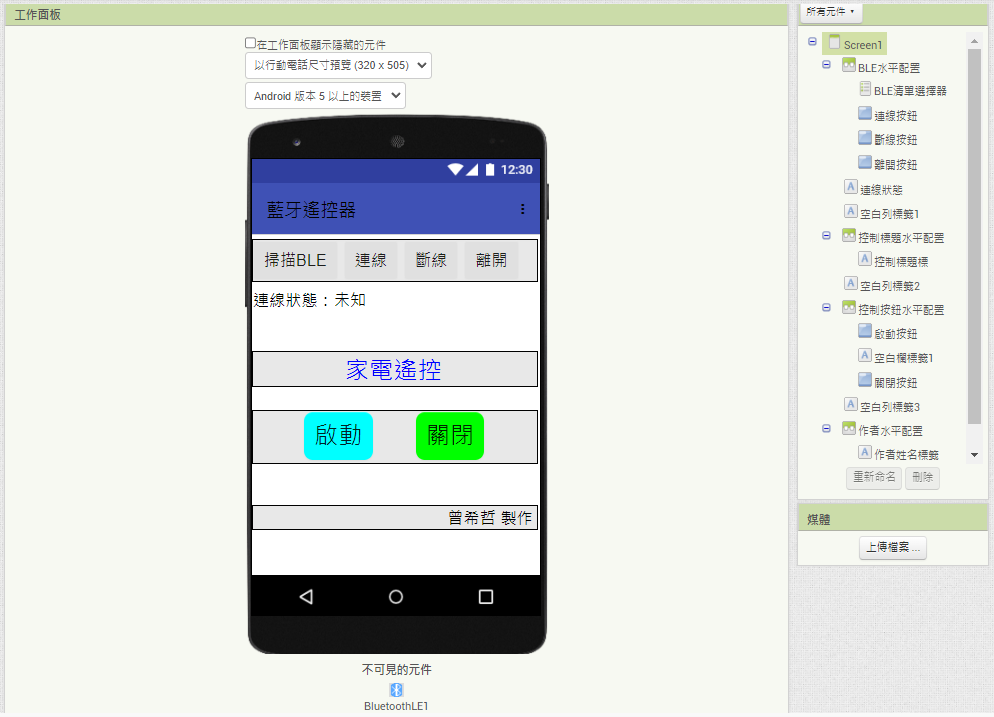

圖片說明：此圖位於「工作面板使用元件：」頁面，主要用來輔助說明 工作面板使用元件： 選單 元件種類 元件名稱 屬性。

## 第 40 頁

文字對齊：置中
使用者介面 標籤 空白列標籤 2 高度：10 像素
寬度：填滿
文字清空
介面配置 水平配置 控制按鈕
水平配置
使用預設值
使用者介面 按鈕 啟動按鈕 背景顏色：青色
字體大小：30
形狀：圓角
文字：啟動
使用者介面 標籤 空白欄標籤 1 寬度：30 像素
文字清空
使用者介面 按鈕 關閉按鈕 背景顏色：綠色
字體大小：30
形狀：圓角
文字：關閉
使用者介面 標籤 空白列標籤 3 高度：30 像素
寬度：填滿
文字清空
使用者介面 標籤 作者姓名標籤 字體大小：20
寬度：填滿
文字：曾希哲 製作
文字對齊：靠右
Extension BluetoothLE BluetoothLE1 無須修改
使用程式積木：
選單 積木 說明
內建/變數
初始化全域變數積木， 功用
為設定變數名稱 ， 同時可初
始化變數的內容值。
內建/文字
空字串積木， 功用為空白的
字串文字 ， 可修改參數在雙
引號中加入文字。
Screen
當螢幕初始化積木， 功用為
當 App 開始執行時會觸發
執行本積木中的程式。
BluetoothLE1
呼叫藍芽掃描積木， 功用為
開始掃描藍芽裝置。

## 第 41 頁

按鈕
按鈕啟用積木， 功用為設定
按鈕是否可用 ， 如果參數為
真則可使用 ， 如果參數為假
則不可使用。
內建/邏輯
邏輯真積木，功用為邏輯
值，當參數為真代表正確，
調整參數為假 ， 則為邏輯值
為假，則代表錯誤。
BluetoothLE1
當發現藍芽裝置積木， 功用
為當掃描發現藍芽裝置時
會觸發執行本積木中的程
式。
清單選擇器
設清單選擇器的元素字串
積木， 功用為設定清單選擇
器的元素字串 ， 可一次設定
整個清單。
BluetoothLE1
藍芽的裝置清單積木， 功用
為當藍芽掃描完成 ， 掃描結
果會以清單方式存在本積
木。
清單選擇器
當清單選擇器完成選擇積
木，功用為當清單顯示後，
使用者完成選擇時 ， 會觸發
執行本積木中的程式。
內建/文字
從文字提取字串， 功用為從
文字中提取某個長處的字
串，由設定的參數決定，從
第幾個字開始 ， 提取多少長
度的字串。
清單選擇器
清單選擇器的選中項， 功用
為當清單顯示後 ， 使用者完
成選擇時 ， 會使用者選定的
結果會記錄在本積木。
內建/數學
數字積木， 功用為產生一般
的數值。
按鈕
當按鈕被點選積木， 功用為
當按鈕(連線按鈕)被點選
時，會觸發執行本積木中的

### 圖片

圖片說明：這是本頁第 1 張重點圖片，位於「按鈕」相關內容中，主要用來輔助說明 按鈕啟用積木， 功用為設定 按鈕是否可用 ， 如果參數為。

圖片說明：這是本頁第 2 張重點圖片，位於「按鈕」相關內容中，主要用來輔助說明 按鈕啟用積木， 功用為設定 按鈕是否可用 ， 如果參數為。

圖片說明：這是本頁第 3 張重點圖片，位於「按鈕」相關內容中，主要用來輔助說明 按鈕啟用積木， 功用為設定 按鈕是否可用 ， 如果參數為。

## 第 42 頁

程式。
BluetoothLE1
呼叫藍芽位址連線積木，功
用為執行連線藍芽裝置 ， 由
參數提供連線的地址。
內建/變數
設置全域變數積木， 功用為
指派變數的內容值 ， 變數名
稱及內容值為可調整的參
數。
內建/變數
取變數內容值積木， 功用為
提取變數的內容值 ， 變數名
稱為可調整的參數。
BluetoothLE1
當藍牙連線積木功用為當
藍牙連線完成時 ，會觸發執
行本積木中的程式。
BluetoothLE1
呼叫藍牙斷線積木， 功用為
執行藍牙斷線。
標籤
設定標籤文字積木功用為
設定標籤要顯示的文字。
內建/
流程控制
退出程式積木， 功用為結束
App 的執行。
BluetoothLE1
呼叫藍牙字串寫入積木功
用為依據服務及特性的
UUID 寫入字串到藍牙通訊
通道 ， 須提供的參數為服務
UUID、特性 UUID、是否為
UTF16 格式及要寫入的字
串。
積木程式—BLE 傳送控制指令
範例程式：ch4_2_2
1
4
5
2
3
6
7

### 圖片

圖片說明：這是本頁第 1 張重點圖片，位於「程式。」相關內容中，主要用來輔助說明 BluetoothLE1 呼叫藍芽位址連線積木，功。

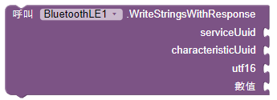

圖片說明：這是本頁第 2 張重點圖片，位於「程式。」相關內容中，主要用來輔助說明 BluetoothLE1 呼叫藍芽位址連線積木，功。

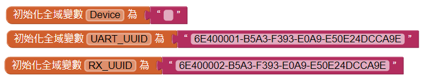

圖片說明：這是本頁第 3 張重點圖片，位於「程式。」相關內容中，主要用來輔助說明 BluetoothLE1 呼叫藍芽位址連線積木，功。

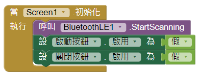

圖片說明：這是本頁第 4 張重點圖片，位於「程式。」相關內容中，主要用來輔助說明 BluetoothLE1 呼叫藍芽位址連線積木，功。

## 第 43 頁

8
9
10
11
12
13
14
15
16
19
20
21
24
25
26
27
28
29
30
17
\
18
22
23

### 圖片

圖片說明：這是本頁第 1 張重點圖片，位於「8」相關內容中，主要用來輔助說明 本頁重點內容。

圖片說明：這是本頁第 2 張重點圖片，位於「8」相關內容中，主要用來輔助說明 本頁重點內容。

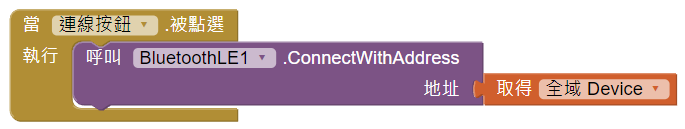

圖片說明：這是本頁第 3 張重點圖片，位於「8」相關內容中，主要用來輔助說明 本頁重點內容。

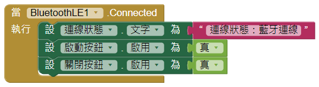

圖片說明：這是本頁第 4 張重點圖片，位於「8」相關內容中，主要用來輔助說明 本頁重點內容。

## 第 44 頁

程式說明：
1. 設定變數 Device 的內容值為空字串。
2. 設定變數 UART_UUID 的內容值
為”6E400001-B5A3-F393-E0A9-E50E24DCCA9E”。
3. 設定變數 UART_UUID 的內容值
為”6E400001-B5A3-F393-E0A9-E50E24DCCA9E”。
4. 當 App 執行時，會觸發執行積木 5、6 及 7。
5. 開始掃描藍牙裝置。
6. 設定啟動按鈕為不可使用。
7. 設定關閉按鈕為不可使用。
8. 當掃描完成發現藍牙裝置時，會觸發執行積木 9。
9. 將掃描到的藍牙地址儲存於 BLE 清單選擇器。
10. 當使用者從 BLE 清單選擇器的清單中選擇完成時 ， 會觸動執行積木11 及 12。
11. 提取使用者所選中的 BLE 清單項目中從第 1 個字開始長度 17 的字串，儲存
於變數 Device。
12. 設定連線狀態標籤的文字為連線狀態：藍牙選定。
13. 當連線按鈕被按下時，會觸動執行積木 14。
14. 以變數 Device 內容值為地址，進行藍牙連線。
15. 當藍牙連線完成時，會觸動執行積木 16、17 及 18。
16. 設定連線狀態標籤的文字為連線狀態：藍牙連線。
17. 設定啟動按鈕為可使用。
18. 設定關閉按鈕為可使用。
19. 當斷線按鈕被按下時，會觸動執行積木 20 至 23。
20. 進行藍牙斷線。
21. 設定連線狀態標籤的文字為連線狀態：藍牙斷線。
22. 設定啟動按鈕為不可使用。
23. 設定關閉按鈕為不可使用。
24. 當離開按鈕被按下時，會觸動執行積木 25 及 26。
25. 進行藍牙斷線。
26. 結束 App 的執行。
27. 當啟動按鈕被按下時，會觸動執行積木 28。
28 以 UART 服務的 RX 特性，將字串”ON”寫入藍牙通訊通道。
29. 當關閉按鈕被按下時，會觸動執行積木 30。
30. 以 UART 服務的 RX 特性，將字串”ON”寫入藍牙通訊通道。
BLE 連線的方式與 4-2 節相同，當 BLE 連線建立後，使用 UART 服務的 RX 特
性，將控制指令寫入藍牙通訊通道，控制指令分別為 ON 代表電氣啟動，OFF 態
表電氣關閉。

## 第 45 頁

在本節程式中特別加入開啟及關閉按鈕的保護機制 ， 當程式一開始執行後，
尚未完成 BLE 連線，關閉開啟及關閉按鈕的使用，直到完成BLE 連線後，才啟動
開啟及關閉按鈕的使用，最後中斷BLE 連線後，同樣要關閉開啟及關閉按鈕的使
用，否則在 BLE 連線尚未完成，就執行藍牙寫入會產生錯誤。
執行結果：
請先開啟手機的藍牙功能 ， 兩邊的程式開始執行後 ， 手機上的藍牙連線狀態
顯示未知。
當點選手機上的「連線按鍵」後，ESP32 上的內建 LED 變亮，手機上的藍牙
連線狀態顯示藍牙連線。

### 圖片

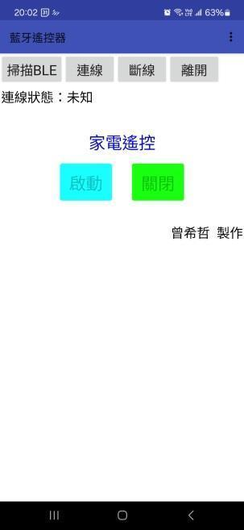

圖片說明：這是本頁第 1 張重點圖片，位於「在本節程式中特別加入開啟及關閉按鈕的保護機制 ， 當程式一開始執行後，」相關內容中，主要用來輔助說明 在本節程式中特別加入開啟及關閉按鈕的保護機制 ， 當程式一開始執行後， 尚未完成 BLE 連線，關閉開啟及關閉按鈕的使用，直到完成BLE 連線後，才啟動。

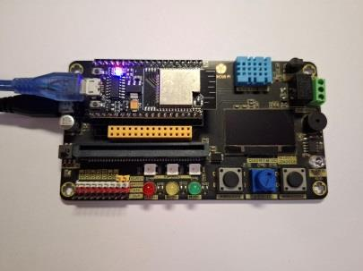

圖片說明：這是本頁第 2 張重點圖片，位於「在本節程式中特別加入開啟及關閉按鈕的保護機制 ， 當程式一開始執行後，」相關內容中，主要用來輔助說明 在本節程式中特別加入開啟及關閉按鈕的保護機制 ， 當程式一開始執行後， 尚未完成 BLE 連線，關閉開啟及關閉按鈕的使用，直到完成BLE 連線後，才啟動。

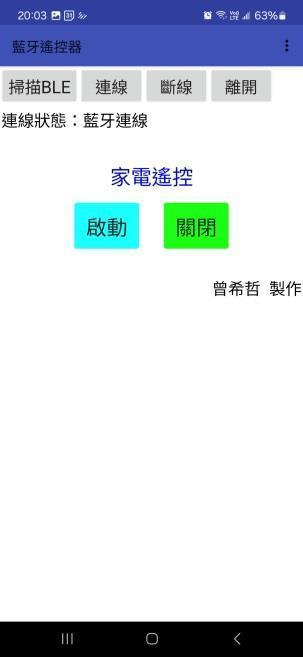

圖片說明：這是本頁第 3 張重點圖片，位於「在本節程式中特別加入開啟及關閉按鈕的保護機制 ， 當程式一開始執行後，」相關內容中，主要用來輔助說明 在本節程式中特別加入開啟及關閉按鈕的保護機制 ， 當程式一開始執行後， 尚未完成 BLE 連線，關閉開啟及關閉按鈕的使用，直到完成BLE 連線後，才啟動。

## 第 46 頁

按下手機上的啟動按鈕，EZ Start Kit 上繼電器動作的綠色 LED 變亮，代表繼
電器動作，輸出接點變成閉合。
按下手機上的關閉按鈕，EZ Start Kit 上繼電器動作的綠色 LED 變滅，代表繼
電器不動作，輸出接點變成開路。
延伸練習：
請修改範例程式，讓手機藍牙控制器可以控制 EZ Start Kit 上的三種顏色的
LED。

### 圖片

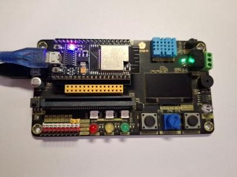

圖片說明：這是本頁第 1 張重點圖片，位於「按下手機上的啟動按鈕，EZ Start Kit 上繼電器動作的綠色 LED 變亮，代表繼」相關內容中，主要用來輔助說明 按下手機上的啟動按鈕，EZ Start Kit 上繼電器動作的綠色 LED 變亮，代表繼 電器動作，輸出接點變成閉合。

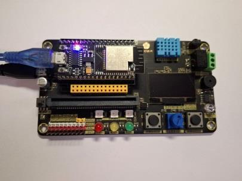

圖片說明：這是本頁第 2 張重點圖片，位於「按下手機上的啟動按鈕，EZ Start Kit 上繼電器動作的綠色 LED 變亮，代表繼」相關內容中，主要用來輔助說明 按下手機上的啟動按鈕，EZ Start Kit 上繼電器動作的綠色 LED 變亮，代表繼 電器動作，輸出接點變成閉合。

## 第 47 頁

4-4 手機藍牙溫濕度計
本節以藍牙連接 ESP32 與手機之間，達成用將 ESP32 的資料傳送給手機，如
圖 4-3 所示，ESP32 為 BLE 伺服器，啟動 UART 服務，當手機使用 BLE 與 ESP32
連接後，建立 BLE 通訊通道，雙方協議由 ESP32 的 UART 服務的 TX 特性負責傳
送 BLE 通訊通道的資料，而手機則使用UART 服務的 TX 特性 UUID 收取 BLE 通訊
通道的資料，最後由 ESP32 讀取溫濕度資料後，傳送給手機顯示。
圖 4-4 手機藍牙溫濕度計
本節首先介紹 ESP32 的 BlocklyDuino 程式使用 UART 服務傳送 DHT11 的溫濕
度資料給藍牙通道，另外介紹手機的 MIT App Inventor 程式完成 BLE 連線後，使
用 UART服務的 TX 特性UUID 接收藍牙通道傳來的溫濕度資料 ， 顯示在手機畫面，
兩個程式完成後，即可將 ESP32 的溫濕度資料傳給手機顯示。
ESP32 BlocklyDiono 程式
使用積木：
積木選單 積木 說明
吉哥積木 /
ESP32/ 藍牙
BLE/BLE 伺服
端
藍牙 BLE 伺服初始化積木，功用
為啟動 BLE 伺服及其提供的服務
種類、名稱以及服務的 UUID。
吉哥積木 /
ESP32/ 藍牙
BLE/BLE 伺服
端
藍牙 BLE 伺服當連線時積木，本
積木為函式積木，功用為當 BLE
伺服端有藍牙連線連線時，會觸
發本積木內的程式執行。
吉哥積木 /
ESP32/ 藍牙
BLE/BLE 伺服
端
藍牙 BLE 伺服當斷線時積木，本
積木為函式積木，功用為當 BLE
伺服端有藍牙連線斷線時，會觸
發本積木內的程式執行，本積木

### 圖片

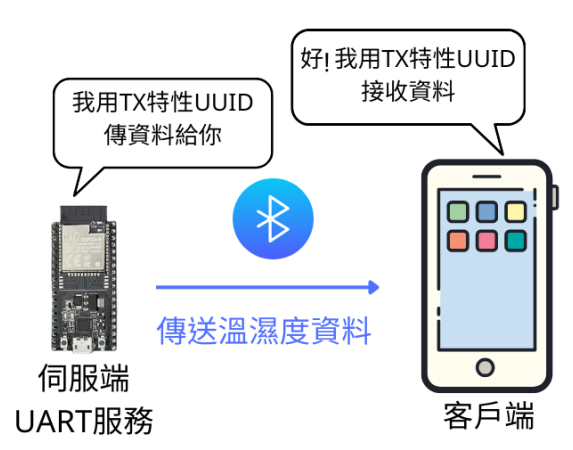

圖片說明：此圖對應「所示，ESP32 為 BLE 伺服器，啟動 UART 服務，當手機使用 BLE 與 ESP32」，位於「4-4 手機藍牙溫濕度計」相關內容中，主要用來輔助說明 4-4 手機藍牙溫濕度計 本節以藍牙連接 ESP32 與手機之間，達成用將 ESP32 的資料傳送給手機，如。

## 第 48 頁

須用藍牙 BLE 伺服當連線時積木
修改參數為斷線時。
吉哥積木 /
ESP32/ 藍牙
BLE/BLE 伺服
端
藍牙 BLE 伺服當收到訊息時積
木，功用為當藍牙 BLE 伺服收到
訊息時，會觸發本積木內的程式
執行。
吉哥積木 /
ESP32/ 藍牙
BLE/BLE 伺服
端
取用藍牙 BLE 伺服讀取到的字串
積木，功用為當藍牙 BLE 伺服收
到訊息後，取用所收到的字串。
吉哥積木 /
ESP32/ 藍牙
BLE/BLE 伺服
端
藍牙 BLE 伺服傳送文字訊息 積
木，功用為傳送文字資料到藍牙
通道。
使用元件及接腳：
元件名稱 IO 編號 實際接腳
內建 LED 無 GPIO2
溫濕度感測器 IO7 GPIO15
OLED 顯示器 IO17(SCL) GPIO22
OLED 顯示器 IO18(SDA) GPIO21
積木程式—ESP32 BLE 傳送溫濕度數值：
範例程式：ch4_3_1
1
2
3
4
5
6

### 圖片

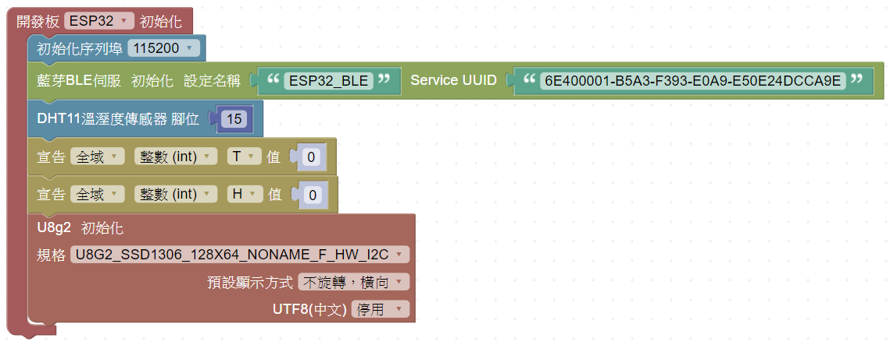

圖片說明：這是本頁第 1 張重點圖片，位於「須用藍牙 BLE 伺服當連線時積木」相關內容中，主要用來輔助說明 須用藍牙 BLE 伺服當連線時積木 修改參數為斷線時。

## 第 49 頁

程式說明：
初始化部分：
1. 初始化序列埠連線，設定傳輸速度為 115200。
2. 啟動藍牙 BLE 服務，設定 BLE 名稱為 ESP32_BLE，Service UUID 為
6E400001-B5A3-F393-E0A9-E50E24DCCA9E，此為 UART 服務。
3. 初始化 DHT11 溫濕度感測器，設定連接腳位為 15。
4. 將 OLED 顯示器初始化，設定 UTF8(中文)「停用」。
5. 宣告全域整數變數 T，並設定其初始值為 0。
6. 宣告全域整數變數 H，並設定其初始值為 0。
重複執行部分：
9. 序列埠印出「溫度：」及變數 T 的內容值，即列印 DHT11 的溫度值，列印完
成後換行。
10. 序列埠印出「相對濕度：」及變數 H 的內容值，即列印 DHT11 的相對濕度
值，列印完成後換行。
11. 呼叫 Display 函式，並且傳遞變數 T 及變數 H 給 Display 函式。
12. 延遲 1000 毫秒(1 秒)。
7
13
14
15
16
8
9
10
11
12
17
18
19
20
21

### 圖片

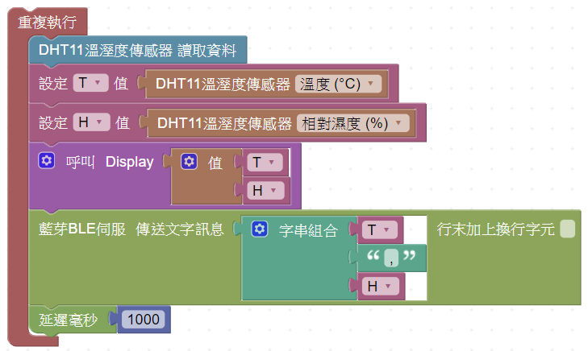

圖片說明：這是本頁第 1 張重點圖片，位於「程式說明：」相關內容中，主要用來輔助說明 1. 初始化序列埠連線，設定傳輸速度為 115200。 2. 啟動藍牙 BLE 服務，設定 BLE 名稱為 ESP32_BLE，Service UUID 為。

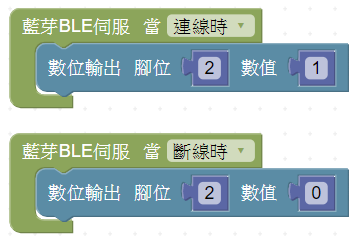

圖片說明：這是本頁第 2 張重點圖片，位於「程式說明：」相關內容中，主要用來輔助說明 1. 初始化序列埠連線，設定傳輸速度為 115200。 2. 啟動藍牙 BLE 服務，設定 BLE 名稱為 ESP32_BLE，Service UUID 為。

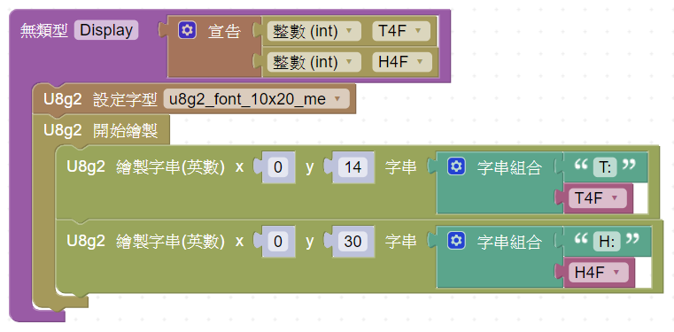

圖片說明：這是本頁第 3 張重點圖片，位於「程式說明：」相關內容中，主要用來輔助說明 1. 初始化序列埠連線，設定傳輸速度為 115200。 2. 啟動藍牙 BLE 服務，設定 BLE 名稱為 ESP32_BLE，Service UUID 為。

## 第 50 頁

7. 讀取 DHT11 溫濕度感測器的資料。
8. 取用 DHT11 溫濕度感測器的溫度數值，存入整數變數 T。
9. 取用 DHT11 溫濕度感測器的相對濕度數值，存入整數變數 H。
10. 呼叫 Display 函式，並且傳遞變數 T 及變數 H 給 Display 函式。
11. 傳送變數 T 的內容值、”，”及變數 H 的內容值到藍牙通道
12. 延遲 1000 毫秒(1 秒)。
BLE 函式部分：
13. 當 BLE 伺服端有連線時，會觸動本積木內的積木 14 執行。
14. 將 ESP32 的腳位 2 設為高電位，即將內建 LED 變亮。
15. 當 BLE 伺服端的連線中斷時，會觸動本積木內的積木 16 執行。
16. 將 ESP32 的腳位 2 設為低電位，即將內建 LED 變滅。
Display 函式部分：
17. 定義函式名稱為 Display，負責顯示部份的工作，並宣告兩個整數引數，分別
為 T4F 及 H4F，負責接收來自變數 T 及變數 H 傳送來的數值，另外設定函式內的
功能程式為積木 18 至積木 21。
18. 設定顯示英數的字型為「u8g2_font_10x20_me」。
19. 以整頁的方式，先清除 OLED 顯示的內容，再顯示積木 20 及積木 21 的設定
內容。
20. 設定 OLED 顯示起始位置為 x 軸：0、y 軸：14，內容為「T：」及變數 T4F，
即顯示 DHT11 的溫度值。
21. 設定 OLED 顯示起始位置為 x 軸：0、y 軸：30，內容為「H：」及變數 H4F，
即顯示 DHT11 的相對濕度值。
程式一開始先啟動 BLE 伺服的 UART 服務 ，接著是 DHT11 溫濕度模組的初始
化及宣告變數 T 及 H，準備儲存溫度及相對濕度的數值，最後初始化 OLED 顯示
模組。初始化完成後，將跟溫度及相對濕度的數值傳送到藍牙通道，同時也在
OLED 顯示模組中顯示。另外再次用上 Display 函式，可見顯示功能的函式常有重
複使用的機會，只要寫一次，後續就可以重複使用。
MIT App Inventor 程式
工作面板設定：

## 第 51 頁

工作面板使用元件：
選單 元件種類 元件名稱 屬性
Screen1 標題：藍牙溫濕度計
介面配置 水平配置 BLE 水平配置 使用預設值
使用者介面 清單選擇器 BLE 清單選擇器 字體大小：20
文字：掃描 BLE
使用者介面 按鈕 連線按鈕 字體大小：20
文字：連線
使用者介面 按鈕 斷線按鈕 字體大小：20
文字：斷線
使用者介面 按鈕 離開按鈕 字體大小：20
文字：離開
使用者介面 標籤 連線狀態 字體大小：20
文字：連線狀態：未知
使用者介面 標籤 空白列標籤 1 高度：30 像素
寬度：填滿
文字清空
使用者介面 水平配置 溫濕度標籤水平
配置
使用預設值
使用者介面 標籤 溫度標題標籤 字體大小：30

### 圖片

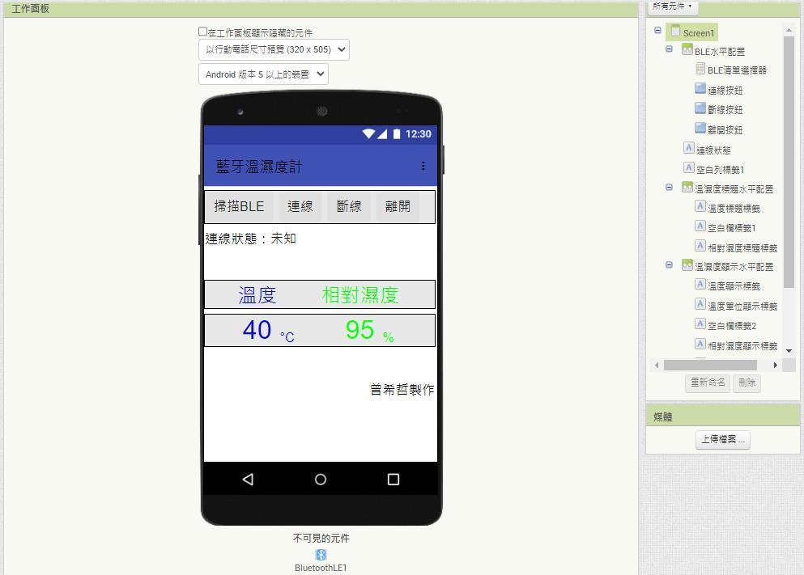

圖片說明：此圖位於「工作面板使用元件：」頁面，主要用來輔助說明 工作面板使用元件： 選單 元件種類 元件名稱 屬性。

## 第 52 頁

文字：溫度
文字顏色：藍色
使用者介面 標籤 空白欄標籤 1 寬度：40 像素
文字清空
使用者介面 標籤 相對濕度標題標
籤
字體大小：30
文字：相對濕度
文字顏色：綠色
介面配置 水平配置 溫濕度顯示水平
配置
使用預設值
使用者介面 標籤 溫度顯示標籤 字體大小：40
文字：40
文字顏色：藍色
使用者介面 標籤 溫度單位顯示標
籤
字體大小：20
文字：°C
文字顏色：藍色
使用者介面 標籤 空白欄標籤 2 寬度：50 像素
文字清空
使用者介面 標籤 相對濕度顯示標
籤
字體大小：40
文字：95
文字顏色：綠色
使用者介面 標籤 相對濕度單位顯
示標籤
字體大小：20
文字：%
文字顏色：綠色
使用者介面 標籤 空白欄標籤 2 寬度：30 像素
寬度：填滿
文字清空
使用者介面 標籤 作者姓名標籤 字體大小：20
寬度：填滿
文字：曾希哲 製作
文字對齊：靠右
Extension BluetoothLE BluetoothLE1 無須修改
使用程式積木：
選單 積木 說明
內建/變數
初始化全域變數積木 ， 功用
為設定變數名稱 ， 同時可初
始化變數的內容值。

### 圖片

圖片說明：此圖位於「文字：溫度」頁面，主要用來輔助說明 使用者介面 標籤 空白欄標籤 1 寬度：40 像素 使用者介面 標籤 相對濕度標題標。

## 第 53 頁

內建/文字
空字串積木 ， 功用為空白的
字串文字 ， 可修改參數在雙
引號中加入文字。
Screen
當螢幕初始化積木 ， 功用為
當 App 開始執行時會觸發
執行本積木中的程式。
BluetoothLE1
呼叫藍芽掃描積木， 功用為
開始掃描藍芽裝置。
按鈕
按鈕啟用積木， 功用為設定
按鈕是否可用 ， 如果參數為
真則可使用 ， 如果參數為假
則不可使用。
內建/邏輯
邏輯真積木，功用為邏輯
值，當參數為真代表正確，
調整參數為假 ， 則為邏輯值
為假，則代表錯誤。
BluetoothLE1
當發現藍芽裝置積木， 功用
為當掃描發現藍芽裝置時
會觸發執行本積木中的程
式。
清單選擇器
設清單選擇器的元素字串
積木， 功用為設定清單選擇
器的元素字串 ， 可一次設定
整個清單。
BluetoothLE1
藍芽的裝置清單積木， 功用
為當藍芽掃描完成 ， 掃描結
果會以清單方式存在本積
木。
清單選擇器
當清單選擇器完成選擇積
木，功用為當清單顯示後，
使用者完成選擇時 ， 會觸發
執行本積木中的程式。
內建/文字
從文字提取字串， 功用為從
文字中提取某個長處的字
串，由設定的參數決定，從
第幾個字開始 ， 提取多少長
度的字串。

### 圖片

圖片說明：這是本頁第 1 張重點圖片，位於「內建/文字」相關內容中，主要用來輔助說明 空字串積木 ， 功用為空白的 字串文字 ， 可修改參數在雙。

圖片說明：這是本頁第 2 張重點圖片，位於「內建/文字」相關內容中，主要用來輔助說明 空字串積木 ， 功用為空白的 字串文字 ， 可修改參數在雙。

圖片說明：這是本頁第 3 張重點圖片，位於「內建/文字」相關內容中，主要用來輔助說明 空字串積木 ， 功用為空白的 字串文字 ， 可修改參數在雙。

## 第 54 頁

清單選擇器
清單選擇器的選中項， 功用
為當清單顯示後 ， 使用者完
成選擇時 ， 會使用者選定的
結果會記錄在本積木。
內建/數學
數字積木， 功用為產生一般
的數值。
按鈕
當按鈕被點選積木， 功用為
當按鈕(連線按鈕)被點選
時，會觸發執行本積木中的
程式。
BluetoothLE1
呼叫藍芽位址連線積木，功
用為執行連線藍芽裝置 ， 由
參數提供連線的地址。
內建/變數
設置全域變數積木， 功用為
指派變數的內容值 ， 變數名
稱及內容值為可調整的參
數。
內建/變數
取變數內容值積木， 功用為
提取變數的內容值 ， 變數名
稱為可調整的參數。
BluetoothLE1
當藍牙連線積木功用為當
藍牙連線完成時 ，會觸發執
行本積木中的程式。
BluetoothLE1
呼叫藍牙斷線積木， 功用為
執行藍牙斷線。
標籤
設定標籤文字積木功用為
設定標籤要顯示的文字。
內建/
流程控制
退出程式積木， 功用為結束
App 的執行。
BluetoothLE1
呼叫登記藍牙讀取字串積
木，功用為以服務及特性的
UUID 登記可由藍牙通訊通
道讀取字串， 須提供的參數
為服務 UUID、特性 UUID、
及字串是否為 UTF16 格式。
BluetoothLE1
當藍牙收到字串積木 ， 功用
為當收到藍牙通道的是字
串時 ， 會觸發執行本積木中

### 圖片

圖片說明：這是本頁第 1 張重點圖片，位於「清單選擇器」相關內容中，主要用來輔助說明 清單選擇器的選中項， 功用 為當清單顯示後 ， 使用者完。

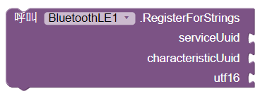

圖片說明：這是本頁第 2 張重點圖片，位於「清單選擇器」相關內容中，主要用來輔助說明 清單選擇器的選中項， 功用 為當清單顯示後 ， 使用者完。

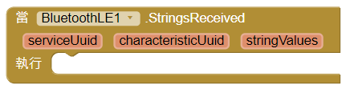

圖片說明：這是本頁第 3 張重點圖片，位於「清單選擇器」相關內容中，主要用來輔助說明 清單選擇器的選中項， 功用 為當清單顯示後 ， 使用者完。

## 第 55 頁

的程式。
內建/文字
分解文字積木 ， 功用為以分
格符號參數來分解文字 ， 分
解後的結果為清單 ， 例如文
字”40，95”以”，”作為分解
符號，分解後可得清單
(“40”, “95”)。
內建/清單
以索引值選擇清單項目積
木 ， 功用為以清單的索引值
取用清單的項目 ， 例如從清
單(“40”, “95”)中取用索引
值為 1 得結果為”40”。
積木程式—BLE 接收溫濕度資料
範例程式：ch4_2_2
1
5
7
8
9
10
11
12
13
2
3
6
4

### 圖片

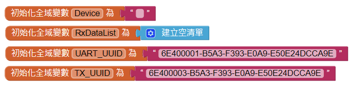

圖片說明：這是本頁第 1 張重點圖片，位於「的程式。」相關內容中，主要用來輔助說明 分解文字積木 ， 功用為以分 格符號參數來分解文字 ， 分。

圖片說明：這是本頁第 2 張重點圖片，位於「的程式。」相關內容中，主要用來輔助說明 分解文字積木 ， 功用為以分 格符號參數來分解文字 ， 分。

圖片說明：這是本頁第 3 張重點圖片，位於「的程式。」相關內容中，主要用來輔助說明 分解文字積木 ， 功用為以分 格符號參數來分解文字 ， 分。

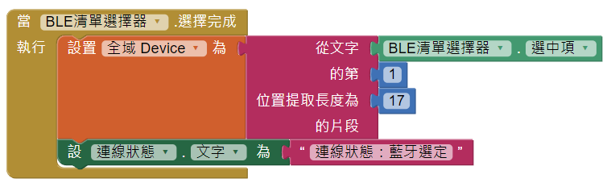

圖片說明：這是本頁第 4 張重點圖片，位於「的程式。」相關內容中，主要用來輔助說明 分解文字積木 ， 功用為以分 格符號參數來分解文字 ， 分。

## 第 56 頁

程式說明：
1. 設定變數 Device 的內容值為空字串。
2. 設定變數 RxDataList 的內容值為空清單。
3. 設定變數 UART_UUID 的內容值
為”6E400001-B5A3-F393-E0A9-E50E24DCCA9E”。
4. 設定變數 UART_UUID 的內容值
為”6E400001-B5A3-F393-E0A9-E50E24DCCA9E”。
5. 當 App 執行時，會觸發執行積木 6。
6. 開始掃描藍牙裝置。
7. 當掃描完成發現藍牙裝置時，會觸發執行積木 8。
8. 將掃描到的藍牙地址儲存於 BLE 清單選擇器。
9. 當使用者從 BLE 清單選擇器的清單中選擇完成時 ， 會觸動執行積木10 及 11。
10. 提取使用者所選中的 BLE 清單項目中從第 1 個字開始長度 17 的字串，儲存
於變數 Device。
14
15
19
20
21
24
25
26
16
18
22
23
17

### 圖片

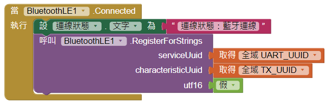

圖片說明：這是本頁第 1 張重點圖片，位於「程式說明：」相關內容中，主要用來輔助說明 1. 設定變數 Device 的內容值為空字串。 2. 設定變數 RxDataList 的內容值為空清單。

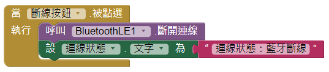

圖片說明：這是本頁第 2 張重點圖片，位於「程式說明：」相關內容中，主要用來輔助說明 1. 設定變數 Device 的內容值為空字串。 2. 設定變數 RxDataList 的內容值為空清單。

圖片說明：這是本頁第 3 張重點圖片，位於「程式說明：」相關內容中，主要用來輔助說明 1. 設定變數 Device 的內容值為空字串。 2. 設定變數 RxDataList 的內容值為空清單。

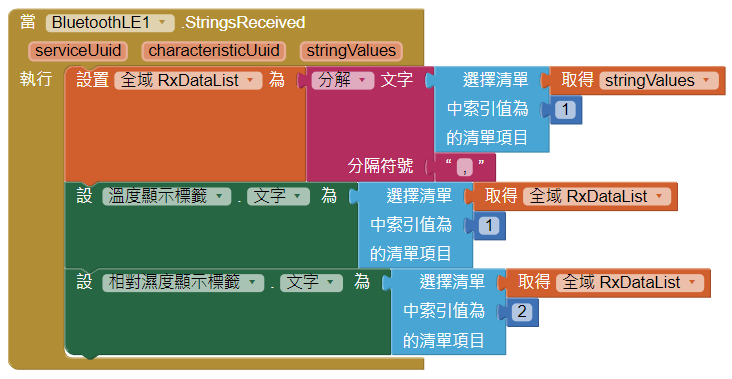

圖片說明：這是本頁第 4 張重點圖片，位於「程式說明：」相關內容中，主要用來輔助說明 1. 設定變數 Device 的內容值為空字串。 2. 設定變數 RxDataList 的內容值為空清單。

## 第 57 頁

11. 設定連線狀態標籤的文字為連線狀態：藍牙選定。
12. 當連線按鈕被按下時，會觸動執行積木 13。
13. 以變數 Device 內容值為地址，進行藍牙連線。
14. 當藍牙連線完成時，會觸動執行積木 15 及 16。
15. 設定連線狀態標籤的文字為連線狀態：藍牙連線。
16. 設定以 UART_UUID 及 TX_UUID 的藍牙通道可讀取字串。
17. 當斷線按鈕被按下時，會觸動執行積木 18 至 19。
18. 進行藍牙斷線。
19. 設定連線狀態標籤的文字為連線狀態：藍牙斷線。
20. 當離開按鈕被按下時，會觸動執行積木 21 及 22。
21. 進行藍牙斷線。
22. 結束 App 的執行。
23. 當藍牙收到字串時，會觸動執行積木 24、25 及 26。
24. 將藍牙所讀取到的內容清單中取用索引值為 1 的項目，再以”，”為分解符號
將該項目進行分解，最後將分解後的結果儲存到清單變數 RxDataList。
25. 設定溫度顯示標籤的文字為清單變數 RxDataList 中索引值為 1 的項目。
26. 設定相對濕度顯示標籤的文字為清單變數 RxDataList 中索引值為 2 的項目。
程式中積木 24 的 stringValues 設定操作方式，說明如下：
步驟 1：將滑鼠移至當藍牙收到字串積木的 stringVlaues 上。
步驟 2：將取得 stringValues 積木拖曳至程式編輯區，即可繼續編輯程式。
程式中 BLE 連線的方式與 4-2 節相同，當 BLE 連線建立後，使用 UART 服務
的 TX 特性設定藍牙通道可讀取字串，當接到藍牙通訊通道所傳來的字串時，該
字串儲存在清單 stringValues 中 ， 每次最新的字串會插入在清單stringValues 索引
值為的項目，接著使用清單 RxDataList 儲存最新的字串，最後從清單 RxDataList
取出溫度及相對濕度，以標籤的文字在手機畫面中顯示。
當藍牙收到字串積木收到字串時，會把字串儲存在 StringValues 清單中，每
次收到新的字串時，會插入 StringValues 清單中索引值為 1 的項目，如圖 4-5 所

### 圖片

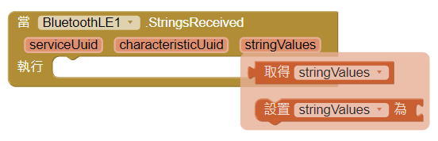

圖片說明：此圖位於「11. 設定連線狀態標籤的文字為連線狀態：藍牙選定。」頁面，主要用來輔助說明 11. 設定連線狀態標籤的文字為連線狀態：藍牙選定。 12. 當連線按鈕被按下時，會觸動執行積木 13。

## 第 58 頁

示，最新從藍牙收到字串為”29, 82“，所以要顯示從 ESP32 傳來的溫度及相對濕
度的資料， 要從為取出 StringValues 清單中索引值為 1 的項目 ， 取得字串”29, 82“後，
再以分解文字積木將字串”29, 82“分解為”29”及”82”， 分解後的結果為清單型態，
所以儲存到清單 RxDataList 中，最後由清單 RxDataList 取出索引值為 1 的項目，
其內容值為溫度，再由清單 RxDataList 取出索引值 2 的項目，其內容值為相對濕
度。
圖 4-5 藍牙收到資料的分解
執行結果：
請先開啟手機的藍牙功能 ， 兩邊的程式開始執行後 ， 手機上的藍牙連線狀態
顯示未知，溫度顯示初始設定的 40°C，相對濕度顯示初始設定的 95%。
當點選手機上的「連線按鍵」後，ESP32 上的內建 LED 變亮，手機上的藍牙
連線狀態顯示藍牙連線，同時手機及 EZ Start Kit OLED 顯示模組上同步顯示的溫
度與相對濕度。

### 圖片

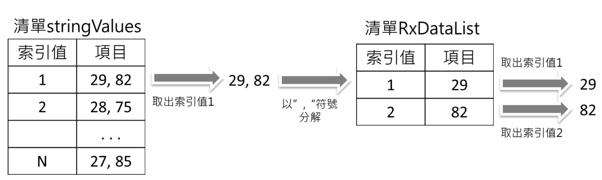

圖片說明：此圖對應「藍牙收到資料的分解」，位於「示，最新從藍牙收到字串為”29, 82“，所以要顯示從 ESP32 傳來的溫度及相對濕」相關內容中，主要用來輔助說明 示，最新從藍牙收到字串為”29, 82“，所以要顯示從 ESP32 傳來的溫度及相對濕 度的資料， 要從為取出 StringValues 清單中索引值為 1 的項目 ， 取得字串”。

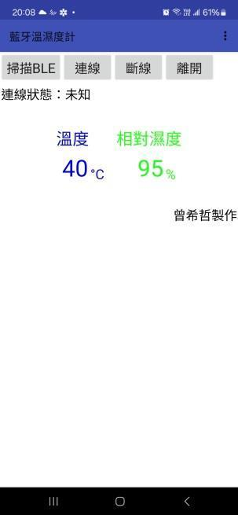

圖片說明：這是本頁第 2 張重點圖片，位於「示，最新從藍牙收到字串為”29, 82“，所以要顯示從 ESP32 傳來的溫度及相對濕」相關內容中，主要用來輔助說明 示，最新從藍牙收到字串為”29, 82“，所以要顯示從 ESP32 傳來的溫度及相對濕 度的資料， 要從為取出 StringValues 清單中索引值為 1 的項目 ， 取得字串”。

## 第 59 頁

延伸練習：
我們在拍照時會使用光度計測試光線是否足夠 ， 請使用EZ Start Kit 的光感測
器及手機，設計可在手機上顯示的光度計。

### 圖片

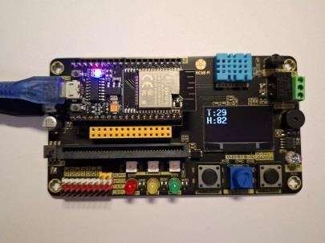

圖片說明：這是本頁第 1 張重點圖片，位於「延伸練習：」相關內容中，主要用來輔助說明 我們在拍照時會使用光度計測試光線是否足夠 ， 請使用EZ Start Kit 的光感測 器及手機，設計可在手機上顯示的光度計。

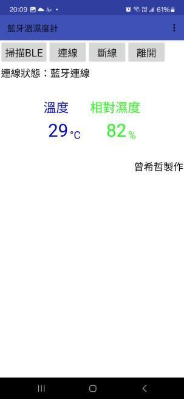

圖片說明：這是本頁第 2 張重點圖片，位於「延伸練習：」相關內容中，主要用來輔助說明 我們在拍照時會使用光度計測試光線是否足夠 ， 請使用EZ Start Kit 的光感測 器及手機，設計可在手機上顯示的光度計。
