# Chapter05_WiF物聯網

## 第 1 頁

第五章 WiFi 物聯網
5-1 WiF 熱點連線
5-2 NTP 計時服務
5-3 LINE Notify
5-4 Google Sheet
5-5 MQTT 控制 LED
5-6 MQTT 接收可變電阻值

## 第 2 頁

5-1 WiF 熱點連線
網際網路(Internet)發展至今已成為大衆每日必須使用的服務 ，網路提供的服
務琳瑯滿目，有網頁、電子郵件及雲端儲存檔案等等，繼當年網際網路發展的創
新，業界提出物聯網(Internet of Things ，簡稱 IoT)的概念，讓所有的電氣產品都
能連上網路 ， 此概念帶動業界設計生產許多功能新穎的產品 ，現今幾乎所有的家
電產品都能連上網路，可讓使用者做即時的監控，大大提升產品的附加價值，同
時可讓使用者更方便使用。
目前最容易使用的物聯網技術是基於網際網路的連線 ， 也就是說要使用物聯
網的技術前要先機器先連上網路，所以要讓 ESP32 使用物聯網技術，必須要讓
ESP32 連上網路，ESP32 內建藍牙及 WiFi 功能，在第四章介紹藍牙的連線，本章
要介紹先 WiFi 的連線，再繼續介紹透過網路的物聯網服務。
WiFi 無線網路又稱為無線區域網路，一般在室內使用，通訊頻率有 2.4GHz
及 5GHz 兩種 ， 有效連線距離約為30m-100m，WiFi 無線網路主要由無線 AP(Access
Point)作為橋接器，將手機、平板及筆記型電腦的無線網路連接到有線的網路，
如圖 5-1 所示，其中 WiFi AP 又稱為 WiFi 熱點，或稱為 WiFi 基地台。
圖 5-1 WiFi 無線網路
本節介紹使用 ESP32 的 WiFi 功能，連接 WiF 熱點，連上熱點後顯示 ESP32
的 IP 地址，網路中的 IP 位址相當於家裡的門牌地址，每個連上網路的機器都會
有一個 IP 地址，所以 ESP32 可以顯示 IP 地址，表示 ESP32 已經連上 WiFi 熱點，
可以透過 WiF 熱點連上網際網路。
使用積木：
積木選單 積木 說明

### 圖片

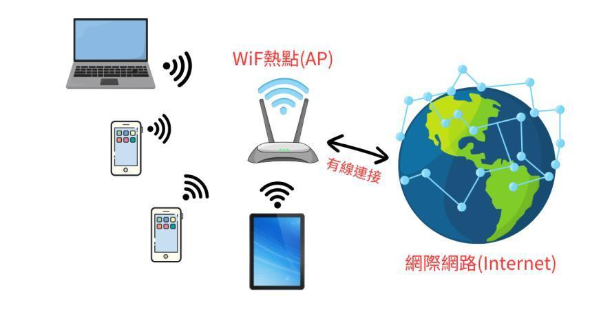

圖片說明：此圖對應「WiFi 無線網路」，位於「5-1 WiF 熱點連線」相關內容中，主要用來輔助說明 5-1 WiF 熱點連線 網際網路(Internet)發展至今已成為大衆每日必須使用的服務 ，網路提供的服。

## 第 3 頁

Wi-Fi
連線到 WiFi AP 積木，功用為使
用 WiFi 熱點帳號及密碼連線到
WiFi AP，當連線成功時本積木才
會停止執行，否則會一直連線
WiFi 熱點。
Wi-Fi
取得 WiFi 位址積木，功用為取用
連線 WiFi 後的 IP 地址。
積木程式—連線 WiFi：
程式說明：
初始化部分：
1. 初始化序列埠連線，設定傳輸速度為 115200。。
2. 使用你的 WiFi 熱點帳號及密碼，連線到 WiF 熱點。
3. 由序列埠列印”WiFi 連線成功!”，列印完成後換行。
4. 由序列埠列印”IP 是”及 IP 的位址，列印完成後換行。
程式主要功能為連線 WiF 熱點 ， 當連線到WiFi AP 積木成功連線到 WiFi 熱點
時，才會往下繼續執行，否則會一直連線。當 WiFi 熱點連線後，從序列埠顯示
連線成功及 IP，提醒使用者 ESP32 以連線成功。WiFi 熱點連線只需要做一次，所
以整個程式都在初始化積木中。
執行結果：
程式上傳成功後，開啟序列埠監看視窗，接著按下 ESP3 的 Reset 鍵，讓程
式重新開始執行，Reset 建的位置，如圖 5-2(a)所示，接著查看序列埠顯示 WiFi
連線成功及 IP 地址。若無法連線，請確認 WiF 熱點是否正常工作。
範例程式：ch5_1
1
2
3
4

### 圖片

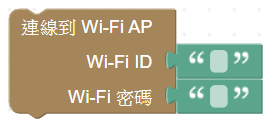

圖片說明：這是本頁第 1 張重點圖片，位於「Wi-Fi」相關內容中，主要用來輔助說明 連線到 WiFi AP 積木，功用為使 用 WiFi 熱點帳號及密碼連線到。

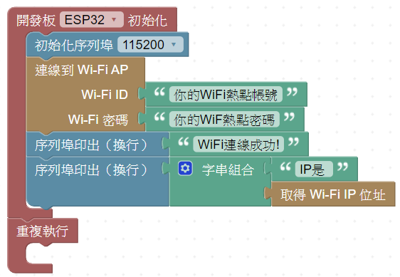

圖片說明：這是本頁第 2 張重點圖片，位於「Wi-Fi」相關內容中，主要用來輔助說明 連線到 WiFi AP 積木，功用為使 用 WiFi 熱點帳號及密碼連線到。

圖片說明：這是本頁第 3 張重點圖片，位於「Wi-Fi」相關內容中，主要用來輔助說明 連線到 WiFi AP 積木，功用為使 用 WiFi 熱點帳號及密碼連線到。

圖片說明：這是本頁第 4 張重點圖片，位於「Wi-Fi」相關內容中，主要用來輔助說明 連線到 WiFi AP 積木，功用為使 用 WiFi 熱點帳號及密碼連線到。

## 第 4 頁

圖 5-2 ESP32 連線 WiFi 熱點 (a)Reset 鍵的位置 (b)序列埠顯示連線結果
延伸練習：
請練習當 WiF 熱點連線成功時，讓內建 LED 變亮，以顯示熱點連線成功。
(a)
(b)

### 圖片

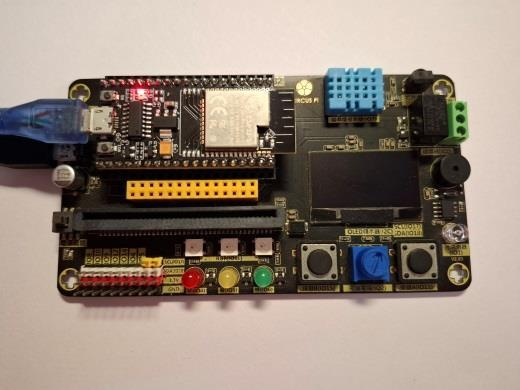

圖片說明：此圖對應「ESP32 連線 WiFi 熱點 (a)Reset 鍵的位置 (b)序列埠顯示連線結果」，位於「圖 5-2 ESP32 連線 WiFi 熱點 (a)Reset 鍵的位置 (b)序列埠顯示連線結果」相關內容中，主要用來輔助說明 請練習當 WiF 熱點連線成功時，讓內建 LED 變亮，以顯示熱點連線成功。

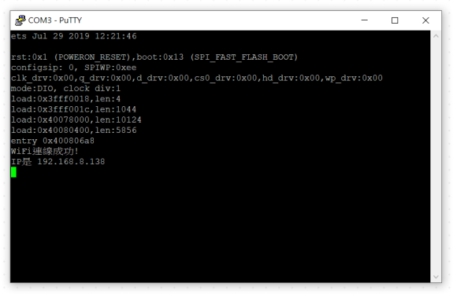

圖片說明：這是本頁第 2 張重點圖片，位於「圖 5-2 ESP32 連線 WiFi 熱點 (a)Reset 鍵的位置 (b)序列埠顯示連線結果」相關內容中，主要用來輔助說明 請練習當 WiF 熱點連線成功時，讓內建 LED 變亮，以顯示熱點連線成功。

## 第 5 頁

5-2 網路時間時鐘
主從式架構(Client-server model)是網際網路提供許多服務的方式，在主從式
架構中會有一台提供服務的電腦，這台電腦叫做伺服器(Server)，一般使用者要
使用該項服務 ， 只要透過網路發出需要服務的請求 ， 當然這些請求是有特殊的規
定，這種特殊規定叫做通訊協定(Communication Protocol)，伺服器收到正確的服
務請求 ， 就會回傳給使用者該項服務的資料 ， 其中發出請求的使用者叫做客戶端
(Client)。
網際網路中有提供網路時間服務 ， 也就是可以在網路中詢問時間的服務 ， 該
項服的通訊協定叫做網路時間協定(Network Communication Protocol， 簡稱NTP)，
提供服務的電腦叫做 NTP 伺服器 ， 要求服務者叫做NTP 客戶端 ， 如圖5-3 所示，
由 NTP 客戶端提出詢問現在時間的請求，當 NTP 伺服器收到請求後，會回覆現
在的時間。
圖 5-3 NTP 服務
由於地球是圓的，會造成同一個時刻，在地球的一邊是白天，另一邊則是黑
夜，又因為我們使用 24 小時制，在地球的對角線上會相差12 小時。為了解決整
個地球表面上的時間全部都不同的問題，所以我們把地球劃分為 24 個時區，在
同一時區的時間都相同，而使用英國的格林威治時間為標準時間 (Greenwish
Mean Time ，簡稱 GMT)。當格林威治時間為零點，台灣已經是早上八點，台灣
比 GMT 快 8 小時，記為 GMT+8，後又因觀測時間的進步，改採用協調世界時
(Coordinated Universal Time，簡稱 UTC)，所以台灣的時區又稱為 UTC+8。
當 ESP32 發出 NTP 請求後，NTP 伺服器會回傳的時間，接著可以使用 ESP32
內建的硬體時鐘(Real Time Clock，簡稱 RTC)儲存回傳的時間，而硬體時鐘會自動
計時，當我們需要時間的時候，就可以到硬體時鐘取得現在時間。
本節介紹由 ESP32 連線 WiF 熱點後，再向 NTP 伺服器取得現在時間，並將

### 圖片

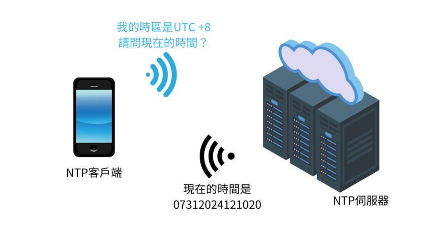

圖片說明：此圖對應「NTP 服務」，位於「5-2 網路時間時鐘」相關內容中，主要用來輔助說明 5-2 網路時間時鐘 主從式架構(Client-server model)是網際網路提供許多服務的方式，在主從式。

## 第 6 頁

時間儲存到 RTC 中，RTC 會自動計時，最後由 RTC 中取出時間顯示在 OLED 顯示
器，即完成網路時間時鐘。
使用積木：
積木選單 積木 說明
吉哥積木 /
ESP32/RTC 網
路校時
由 NTP 伺服器校正 RTC 時間積
木，功用為以時區參數向 NTP 伺
服器發出詢問現在時間的請求，
當 NTP 伺服器回傳現在的時間，
將時間 儲存 到 RTC， 並開始計
時，可調整的參數為時區，本積
木以 UTC 方式表示時區。
吉哥積木 /
ESP32/RTC 網
路校時
取用 RTC 中的時間積木，功用為
取用 RTC 現在計時中的時間，可
調整的參數包括年 、 月 、 日 、 時、
分及秒。
使用元件及接腳：
元件名稱 IO 編號 實際接腳
內建 LED 無 GPIO2
OLED 顯示器 IO17(SCL) GPIO22
OLED 顯示器 IO18(SDA) GPIO21
積木程式—網路時間時鐘：
範例程式：ch4_3_1
1
2
3
4
5
6
7

### 圖片

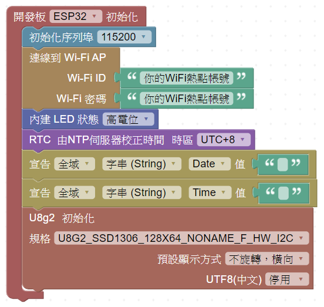

圖片說明：這是本頁第 1 張重點圖片，位於「時間儲存到 RTC 中，RTC 會自動計時，最後由 RTC 中取出時間顯示在 OLED 顯示」相關內容中，主要用來輔助說明 時間儲存到 RTC 中，RTC 會自動計時，最後由 RTC 中取出時間顯示在 OLED 顯示 器，即完成網路時間時鐘。

圖片說明：這是本頁第 2 張重點圖片，位於「時間儲存到 RTC 中，RTC 會自動計時，最後由 RTC 中取出時間顯示在 OLED 顯示」相關內容中，主要用來輔助說明 時間儲存到 RTC 中，RTC 會自動計時，最後由 RTC 中取出時間顯示在 OLED 顯示 器，即完成網路時間時鐘。

## 第 7 頁

程式說明：
初始化部分：
1. 初始化序列埠連線，設定傳輸速度為 115200。
2. 使用你的 WiFi 熱點帳號及密碼，連線到 WiF 熱點。
3. 讓內建 LED 接腳輸出高電位，及讓內建 LED 發亮。
4. 以時區 UTC+8，向 NTP 伺服器發出詢問現在時間的請求，並將 NTP 伺服器回
傳的時間儲存到 RTC，並開始計時。
5. 宣告全域字串變數 Date，並初始化為空字串，準備儲存取用 RTC 中的日期。
6. 宣告全域字串變數 Time，並初始化為空字串，準備儲存取用 RTC 中的時間
7. 將 OLED 顯示器初始化，設定 UTF8(中文)「停用」
重複執行部分：
8. 取用 RTC 中的年、月、日，並在中間加入”/”，存入變數 Date，取得 RTC 中的
日期。
12
13
14
15
4
8
9
10
16
17
18
11

### 圖片

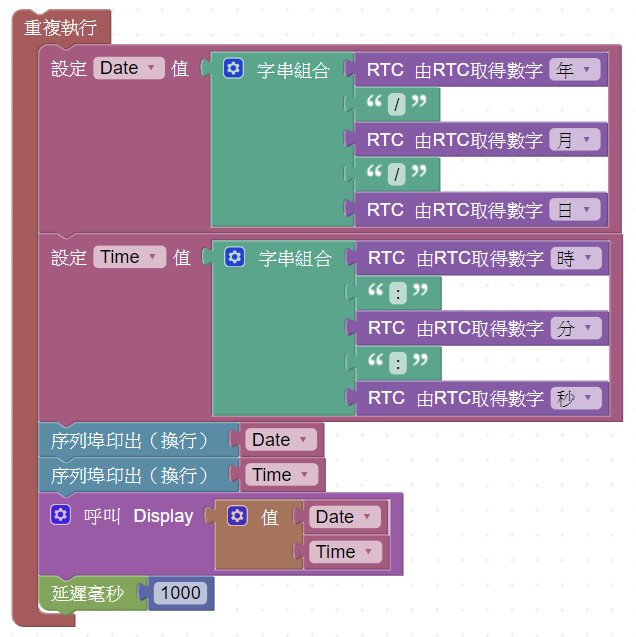

圖片說明：這是本頁第 1 張重點圖片，位於「程式說明：」相關內容中，主要用來輔助說明 1. 初始化序列埠連線，設定傳輸速度為 115200。 2. 使用你的 WiFi 熱點帳號及密碼，連線到 WiF 熱點。

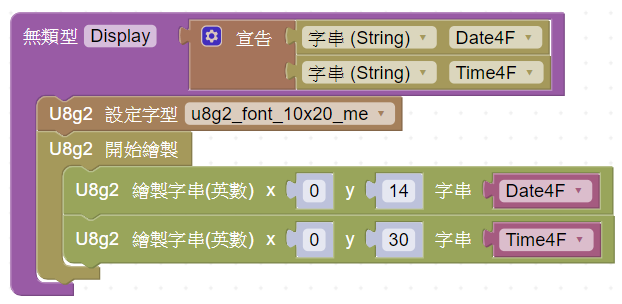

圖片說明：這是本頁第 2 張重點圖片，位於「程式說明：」相關內容中，主要用來輔助說明 1. 初始化序列埠連線，設定傳輸速度為 115200。 2. 使用你的 WiFi 熱點帳號及密碼，連線到 WiF 熱點。

## 第 8 頁

9. 取用 RTC 中的時、分、秒，並在中間加入”：”，存入變數 Time，取得 RTC 中
的時間。
10. 序列埠列印出變數 Time 的內容值，列印完成後換行。
11. 序列埠列印出變數 Date 的內容值，列印完成後換行。
12. 呼叫 Display 函式，並且傳遞變數 Time 及變數 Date 給 Display 函式。。
13. 延遲 1000 毫秒(1 秒)。
Display 函式部分：
14. 定義函式名稱為 Display，負責顯示部份的工作，並宣告兩個字串引數，分別
為 Date4F 及 Time4F，負責接收來自字串變數 Date 及字串變數 Time 傳送來的數
值，另外設定函式內的功能程式為積木 15 至積木 18。
15. 設定顯示英數的字型為「u8g2_font_10x20_me」。
16. 以整頁的方式，先清除 OLED 顯示的內容，再顯示積木 17 及積木 18 的設定
內容。
17. 設定 OLED 顯示起始位置為 x 軸：0、y 軸：14，內容為變數 Date4F 的內容值，
即顯示現在的日期。
18. 設定 OLED 顯示起始位置為 x 軸：0、y 軸：30，內容為變數 Time4F 的內容值，
即顯示現在的時間。
程式一開始先連線 WiF 熱點，連上網際網路之後，向 NTP 伺服器發出詢問
現在時間的請求，NTP 伺服器回傳時間之後，將回傳的時間存入 RTC 中，由 RTC
開始計時，所以RTC 不用手動設定，即可得到準確的時間，不過只需程式開始執
行時進行一次向 NTP 的請求，我們將由 NTP 伺服器校正 RTC 時間積木放在初始
化積木中，接著在重複執行積木中每秒取用 RTC 的內容值，再透過呼叫 Display
函式，將目前日期及時間顯示出來，即可達到時鐘計時及顯示時間的功能。
執行結果：
程式燒錄後 ， 啟動序列埠 ， 並按下Reset 鍵 ， 稍後片刻 ， 完成WiFi 熱點連線，
ESP32 的內建 LED 發亮 ， 接著會看到OLED 顯示器開始顯示日期及時間 ， 如圖5-4(a)
所示，觀察序列埠監看視窗，同步顯示顯示日期及時間，如圖 5-4(b)所示。
(a)
(b)

### 圖片

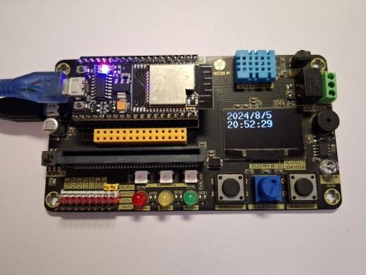

圖片說明：這是本頁第 1 張重點圖片，位於「9. 取用 RTC 中的時、分、秒，並在中間加入”：”，存入變數 Time，取得 RTC 中」相關內容中，主要用來輔助說明 9. 取用 RTC 中的時、分、秒，並在中間加入”：”，存入變數 Time，取得 RTC 中 10. 序列埠列印出變數 Time 的內容值，列印完成後換行。

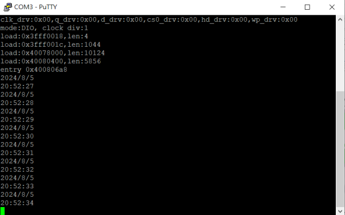

圖片說明：這是本頁第 2 張重點圖片，位於「9. 取用 RTC 中的時、分、秒，並在中間加入”：”，存入變數 Time，取得 RTC 中」相關內容中，主要用來輔助說明 9. 取用 RTC 中的時、分、秒，並在中間加入”：”，存入變數 Time，取得 RTC 中 10. 序列埠列印出變數 Time 的內容值，列印完成後換行。

## 第 9 頁

圖 5-4 網路時間時鐘顯示 (a)OLED 顯示時間 (b)序列埠監看視窗顯示時間
延伸練習：
今天我們做科學實驗，需要每隔 3 分鐘觀察實驗結果，並完成觀察紀錄，請
用製作 3 分鐘計時器，提醒實驗紀錄者要進行觀察及紀錄。

## 第 10 頁

5-3 LINE Notify 推播
生活中經常使用社群軟體 LINE 傳送即時訊息，也可以做重要事項的提醒，
LINE 為了方便使用者，提供訊息推播服務，也就是說，我們可以直接透過 LINE
的推播服務 ， 就可以完成訊息的傳送 ， 不用透過LINE App 的操作。如圖 5-5 所示，
我們可以使用 ESP32，透過 LINE Notify 的推播服務，傳送LINE 簡訊，本節要介紹
如何使用 ESP32 透過 LINE Notify 傳送簡訊。
圖 5-5 LINE Notify 推播服務
要使用 LINE Notify 傳送簡訊 ， 需要到LINE Notify 網站進行設定， 產生連動帳
號及權帳(Token)，設定操作說明如下：
步驟 1：取得 LINE App 的登入帳號及密碼。
步驟 2：進入 LINE Notify 網站，並點選網站中的「登入」。
LINE Notify 的超連結為 https://notify-bot.line.me/zh_TW/
步驟 3：在 Email address 欄位中輸入 LINE 帳號，在 Password 欄位中

### 圖片

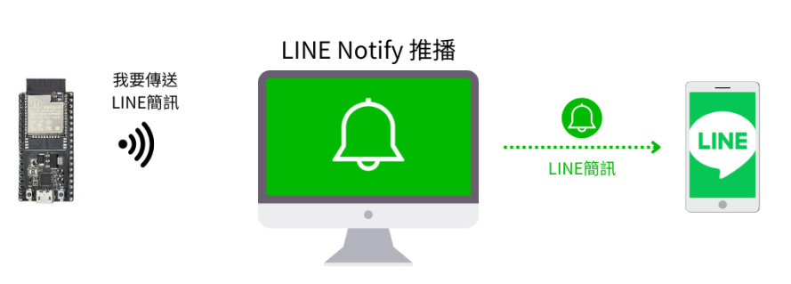

圖片說明：此圖對應「LINE Notify 推播服務」，位於「5-3 LINE Notify 推播」相關內容中，主要用來輔助說明 5-3 LINE Notify 推播 生活中經常使用社群軟體 LINE 傳送即時訊息，也可以做重要事項的提醒。

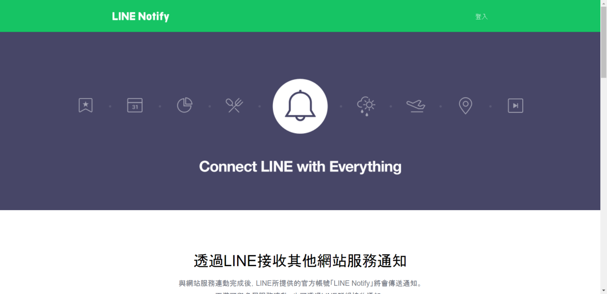

圖片說明：這是本頁第 2 張重點圖片，位於「5-3 LINE Notify 推播」相關內容中，主要用來輔助說明 5-3 LINE Notify 推播 生活中經常使用社群軟體 LINE 傳送即時訊息，也可以做重要事項的提醒。

## 第 11 頁

輸入 LINE 密碼，最後點選「Log in」。
步驟 4：使用手機 LINE App 輸入驗證碼，進行驗證。
步驟 5：點選「姓名」，接著點選彈出視窗中的「My page」。
輸入 LINE 帳號
輸入 LINE 密碼

### 圖片

圖片說明：這是本頁第 1 張重點圖片，位於「輸入 LINE 密碼，最後點選「Log in」。」相關內容中，主要用來輔助說明 輸入 LINE 密碼，最後點選「Log in」。 步驟 4：使用手機 LINE App 輸入驗證碼，進行驗證。

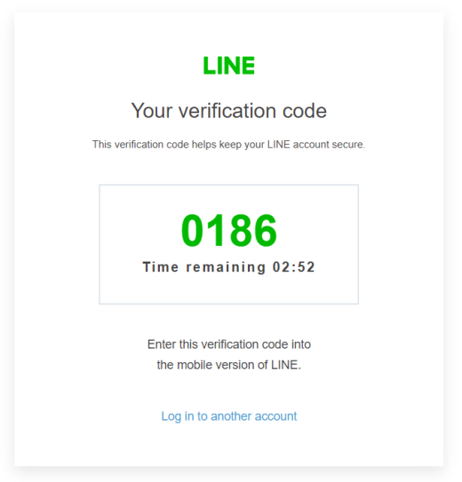

圖片說明：這是本頁第 2 張重點圖片，位於「輸入 LINE 密碼，最後點選「Log in」。」相關內容中，主要用來輔助說明 輸入 LINE 密碼，最後點選「Log in」。 步驟 4：使用手機 LINE App 輸入驗證碼，進行驗證。

## 第 12 頁

步驟 6：進入設定頁面後，到網頁的最底端，點選「Generate token」，準備產生
程式要用的權杖。
步驟 7：在 Token 欄位中填入”ESP32 testing”，接著點選「1-on-1 chat with LINE
Notify」，讓 Notify 發簡訊給自己，最後點選「Generate token」，產生權杖。
❶
❷
❶
❷
❸

### 圖片

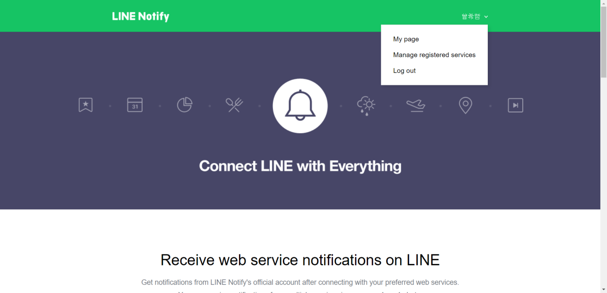

圖片說明：這是本頁第 1 張重點圖片，位於「步驟 6：進入設定頁面後，到網頁的最底端，點選「Generate token」，準備產生」相關內容中，主要用來輔助說明 步驟 6：進入設定頁面後，到網頁的最底端，點選「Generate token」，準備產生 步驟 7：在 Token 欄位中填入”ESP32 testing”，接著點選「1-on-1。

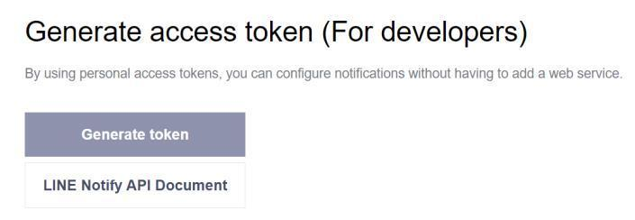

圖片說明：這是本頁第 2 張重點圖片，位於「步驟 6：進入設定頁面後，到網頁的最底端，點選「Generate token」，準備產生」相關內容中，主要用來輔助說明 步驟 6：進入設定頁面後，到網頁的最底端，點選「Generate token」，準備產生 步驟 7：在 Token 欄位中填入”ESP32 testing”，接著點選「1-on-1。

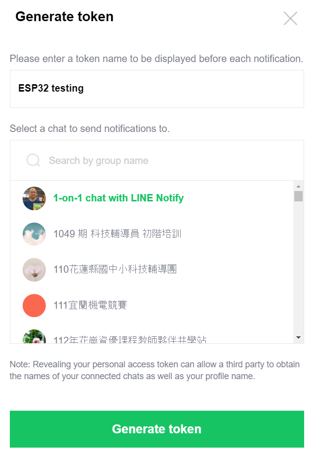

圖片說明：這是本頁第 3 張重點圖片，位於「步驟 6：進入設定頁面後，到網頁的最底端，點選「Generate token」，準備產生」相關內容中，主要用來輔助說明 步驟 6：進入設定頁面後，到網頁的最底端，點選「Generate token」，準備產生 步驟 7：在 Token 欄位中填入”ESP32 testing”，接著點選「1-on-1。

## 第 13 頁

步驟 8：產生權杖之後，點選「Copy」，複製權杖後，立刻權杖紀錄起來，否則
視窗關閉後就無法再看到權杖，確認完成權杖紀錄之後，點選「Close」，結束視
窗。
0CGaXyuadSFUOlfebScU6zPk97alMYwGp5r8hxMCCod
步驟 8：回到網頁的最上方，可以找到剛才建立的連動設定。
步驟 9：在手機的 LINE App 中可以看到，LINE Notify 傳送產生權杖的簡訊，接下
來要開始寫程式。
使用積木：
積木選單 積木 說明
法蘭斯積木/
Line 通知
LINE 發出文字訊息積木，功用為
使用 LINE Notify 權杖，傳送文字
訊息，其中訊息參數 可使用 中
文。
法蘭斯積木/
Line 通知
LINE 發出表情貼圖訊息積木，功
用為使用 LINE Notify 權杖，傳送
表情貼圖訊息，本積木須由 LINE
發出文字訊息積木修改參數後可
得，參數修改方式為將參數「字
串」修改成「貼圖」。
❶
❷

### 圖片

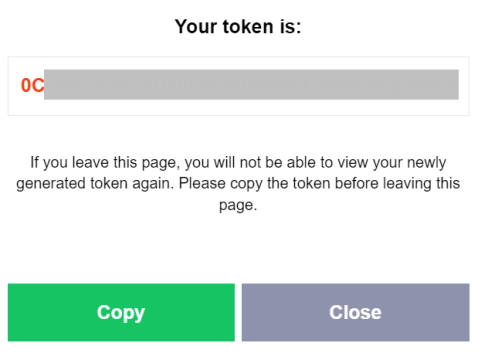

圖片說明：這是本頁第 1 張重點圖片，位於「步驟 8：產生權杖之後，點選「Copy」，複製權杖後，立刻權杖紀錄起來，否則」相關內容中，主要用來輔助說明 步驟 8：產生權杖之後，點選「Copy」，複製權杖後，立刻權杖紀錄起來，否則 視窗關閉後就無法再看到權杖，確認完成權杖紀錄之後，點選「Close」，結束視。

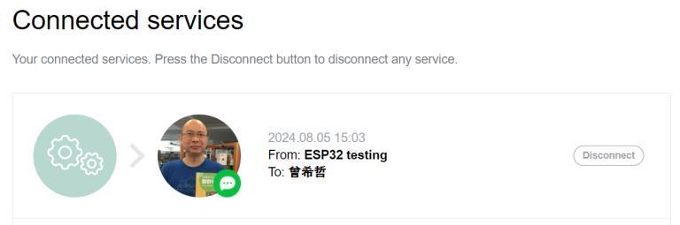

圖片說明：這是本頁第 2 張重點圖片，位於「步驟 8：產生權杖之後，點選「Copy」，複製權杖後，立刻權杖紀錄起來，否則」相關內容中，主要用來輔助說明 步驟 8：產生權杖之後，點選「Copy」，複製權杖後，立刻權杖紀錄起來，否則 視窗關閉後就無法再看到權杖，確認完成權杖紀錄之後，點選「Close」，結束視。

圖片說明：這是本頁第 3 張重點圖片，位於「步驟 8：產生權杖之後，點選「Copy」，複製權杖後，立刻權杖紀錄起來，否則」相關內容中，主要用來輔助說明 步驟 8：產生權杖之後，點選「Copy」，複製權杖後，立刻權杖紀錄起來，否則 視窗關閉後就無法再看到權杖，確認完成權杖紀錄之後，點選「Close」，結束視。

圖片說明：這是本頁第 4 張重點圖片，位於「步驟 8：產生權杖之後，點選「Copy」，複製權杖後，立刻權杖紀錄起來，否則」相關內容中，主要用來輔助說明 步驟 8：產生權杖之後，點選「Copy」，複製權杖後，立刻權杖紀錄起來，否則 視窗關閉後就無法再看到權杖，確認完成權杖紀錄之後，點選「Close」，結束視。

## 第 14 頁

法蘭斯積木/
Line 通知
換行積木，功用為文字訊息換
行。
法蘭斯積木/
EZ Start Kit+
EZ Start Kit+ 按鈕偵測積木，本積
木為 EZ Start Kit 擴充版專用，功
用為偵測擴充板上的 A 鍵、B 鍵
或 A+B 鍵是否被按下，如果有任
何按鍵被按下，則執行相對應的
積木程式。
LINE 發出表情貼圖訊息積木中的表情貼圖共有兩種 ， 這兩種表情貼圖的查詢
網址如下超連結所示 ， 另外第一種表情貼圖所對應表情包代碼及表情包貼圖代碼，
如圖 5-6 所示，第二種表情貼圖所對應表情包代碼及表情包貼圖代碼，如圖 5-7
所示。
圖 5-6 第一種表情貼圖的代碼查詢
圖 5-7 第二種表情貼圖的代碼查詢
第一種表情貼圖超連結：
https://github.com/jackjeanab/LINE-Notify/blob/main/sticker_list.pdf
第二種表情貼圖超連結：
https://developers.line.biz/en/docs/messaging-api/sticker-list/
使用元件及接腳：
表情包代碼
表情包貼圖代碼
表情包代碼
表情包貼圖代碼

### 圖片

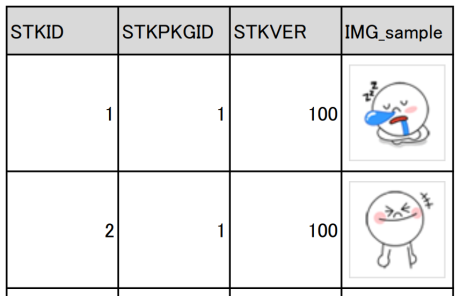

圖片說明：此圖對應「第一種表情貼圖的代碼查詢」，位於「法蘭斯積木/」相關內容中，主要用來輔助說明 換行積木，功用為文字訊息換 EZ Start Kit+。

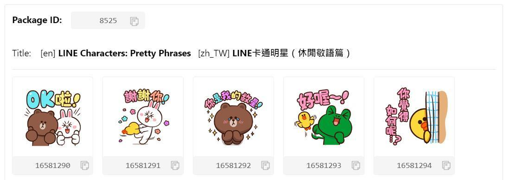

圖片說明：此圖對應「第二種表情貼圖的代碼查詢」，位於「法蘭斯積木/」相關內容中，主要用來輔助說明 換行積木，功用為文字訊息換 EZ Start Kit+。

## 第 15 頁

元件名稱 IO 編號 實際接腳
按鈕開關 IO11 GPIO5
按鈕開關 IO15 GPIO36
積木程式—LINE 傳送文字及表情貼圖簡訊：
程式說明：
初始化部分：
1. 宣告全域字串變數 Token，並將你的權杖儲存於變數中。
2. 使用你的 WiFi 熱點帳號及密碼，連線到 WiF 熱點。
3. 讓內建 LED 接腳輸出高電位，及讓內建 LED 發亮。
4. 傳送 LINE 的文字簡訊，簡訊內容為”您好!”，換行，”這是測試訊息”。
5. 傳送 LINE 的表情貼圖簡訊，簡訊內容為第一種表情貼圖，表情包代碼為 1，
表情包貼圖代碼為 2。。
本程式為 LINE 傳送訊息測試程式，所以程式全部都在初始化積木中，以免
不小心傳送過多簡訊 ， 所以文字簡訊及表情貼圖簡訊各傳送一則 ， 另外發送表情
貼圖積木中的訊息字串一定要填，如果不填，將無法傳送表情貼圖。
執行結果：
程式燒錄後，稍後片刻，完成WiFi 熱點連線，ESP32 的內建 LED 發亮，接著
會看到手機 LINE App 的 LINE Notify 帳號中顯示兩則新簡訊，一則是文字簡訊，
另一則是表情貼圖簡訊，如圖 5-8 所示。
範例程式：ch5_3_1
1
2
3
4
5

### 圖片

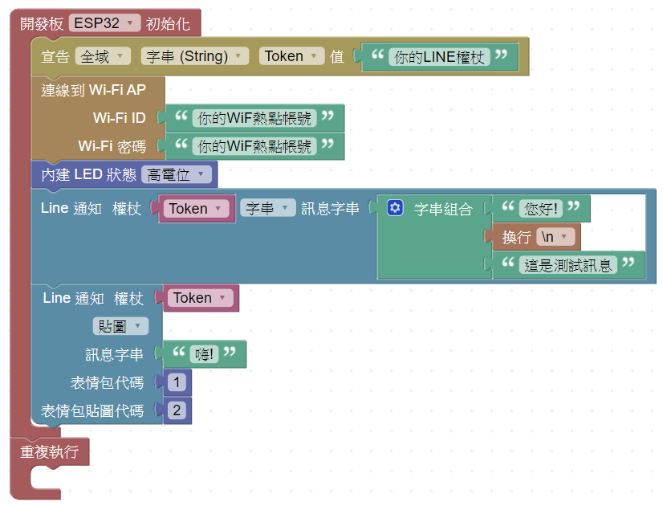

圖片說明：這是本頁第 1 張重點圖片，位於「元件名稱 IO 編號 實際接腳」相關內容中，主要用來輔助說明 元件名稱 IO 編號 實際接腳 按鈕開關 IO11 GPIO5。

## 第 16 頁

圖 5-8 LINE Notify 收到簡訊
積木程式—控制 LINE 傳送簡訊：
程式說明：
初始化部分：
1. 宣告全域字串變數 Token，並將你的權杖儲存於變數中。
2. 使用你的 WiFi 熱點帳號及密碼，連線到 WiF 熱點。
3. 讓內建 LED 接腳輸出高電位，及讓內建 LED 發亮。
1
2
3
4
範例程式：ch5_3_2
5
6

### 圖片

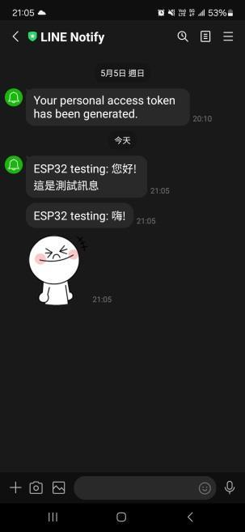

圖片說明：此圖對應「LINE Notify 收到簡訊」，位於「圖 5-8 LINE Notify 收到簡訊」相關內容中，主要用來輔助說明 積木程式—控制 LINE 傳送簡訊： 1. 宣告全域字串變數 Token，並將你的權杖儲存於變數中。

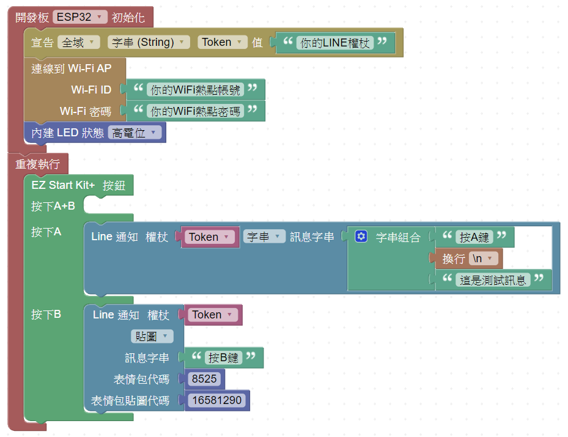

圖片說明：這是本頁第 2 張重點圖片，位於「圖 5-8 LINE Notify 收到簡訊」相關內容中，主要用來輔助說明 積木程式—控制 LINE 傳送簡訊： 1. 宣告全域字串變數 Token，並將你的權杖儲存於變數中。

## 第 17 頁

重複執行部分：
4. 偵測是否按下 A 鍵或 B 鍵，如果按下 A 鍵，則執行積木 5，如果按下 B 鍵，
則執行積木 6，如果全部都沒按，則往下繼續執行。
5. 傳送 LINE 的文字簡訊，簡訊內容為”按 A 鍵”，換行，”這是測試訊息”。
6. 傳送 LINE 的表情貼圖簡訊 ， 簡訊內容為第二種表情貼圖 ， 表情包代碼為8525，
表情包貼圖代碼為 16581290。。
本程式延續範例 ch5_3_1， 改用EZ Start Kit 上的按鍵控制 LINE 簡訊的傳送，
按下 A 鍵，則傳送文字簡訊，-按下 B 鍵，則傳送表情貼圖簡訊。
執行結果：
程式燒錄後，稍後片刻，完成WiFi 熱點連線，ESP32 的內建 LED 發亮，接著
按下 EZ Start Kit 的 A 鍵，會看到手機 LINE App 的 LINE Notify 帳號中顯示文字簡
訊，如圖 5-9(a)所示，接著按下 B 鍵，看到手機 LINE App 的 LINE Notify 帳號中顯
示文字簡訊，如圖 5-9(b)所示。
圖 5-9 LINE Notify 收到訊息 (a)當按下 A 鍵時 (b)當按下 B 鍵時
延伸練習：
如果有人經過光感測器時 ， 光感測器輸出的數值會產生變化 ， 請利用這個特
點，設計路人偵測器，當有人經過時就會傳簡訊給自己。
(a)
(b)

### 圖片

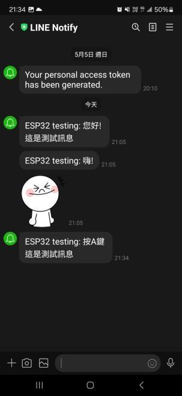

圖片說明：此圖對應「LINE Notify 收到訊息 (a)當按下 A 鍵時 (b)當按下 B 鍵時」，位於「重複執行部分：」相關內容中，主要用來輔助說明 4. 偵測是否按下 A 鍵或 B 鍵，如果按下 A 鍵，則執行積木 5，如果按下 B 鍵， 則執行積木 6，如果全部都沒按，則往下繼續執行。

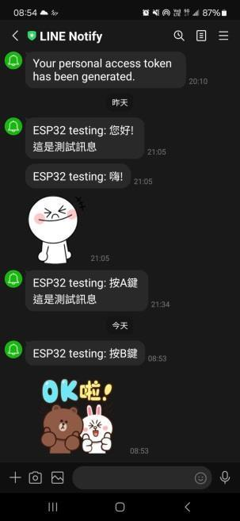

圖片說明：這是本頁第 2 張重點圖片，位於「重複執行部分：」相關內容中，主要用來輔助說明 4. 偵測是否按下 A 鍵或 B 鍵，如果按下 A 鍵，則執行積木 5，如果按下 B 鍵， 則執行積木 6，如果全部都沒按，則往下繼續執行。

## 第 18 頁

5-4 Google 試算表
ESP32 及感測模組可以將生活環境中的狀況轉換成為數值，讓我們容易觀察
或進行控制 ， 例如透過光感測器把環境的亮度轉換成為數值 ， 但卻無法自動紀錄 ，
以供後續的分析，如果想要紀錄感測模組產生的數值，我們可以使用 Google 試
算表做線上紀錄，而且完成紀錄後又可以直接在試算表中進行分析，只要有
Google 帳號就可以做紀錄，真是方便！
本節要介紹使用 Google 試算表做可變電阻值的線上紀錄，首先要新增試算
表，接著還要設定試算表的權限，完成設定才能讓 ESP3 透過網路寫入資料，新
增試算表及設定權限的操作說明如下：
步驟 1：使用 Google 帳號，進入 Google 雲端硬碟，點選「新增」。
步驟 2：點選彈出視窗中的「Google 試算表」，新增 Google 試算表。

### 圖片

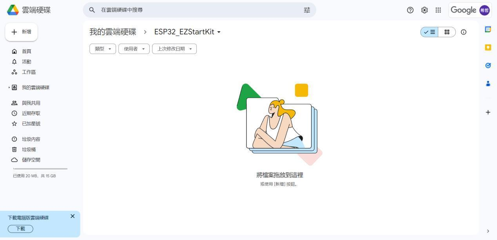

圖片說明：這是本頁第 1 張重點圖片，位於「5-4 Google 試算表」相關內容中，主要用來輔助說明 5-4 Google 試算表 ESP32 及感測模組可以將生活環境中的狀況轉換成為數值，讓我們容易觀察。

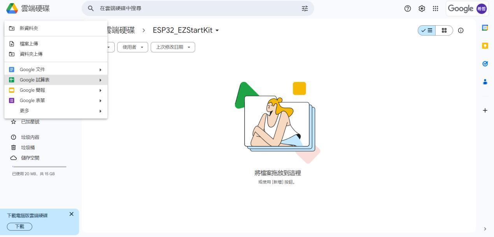

圖片說明：這是本頁第 2 張重點圖片，位於「5-4 Google 試算表」相關內容中，主要用來輔助說明 5-4 Google 試算表 ESP32 及感測模組可以將生活環境中的狀況轉換成為數值，讓我們容易觀察。

## 第 19 頁

步驟 3：在檔案名稱的欄位中輸入”ESP32 測試”，修改檔案名稱。
步驟 4：在第一列的第 A 欄輸入”時間”，接著在第一列的第 B 欄輸入”VR 數值”，
設定表頭欄位的名稱。
步驟 5：點選「功用」，接著點選彈出視窗中的「限制」 ，再繼續點選彈出視窗中
的「知道連結的任何人」 ，開始設定試算表的使用權限。

### 圖片

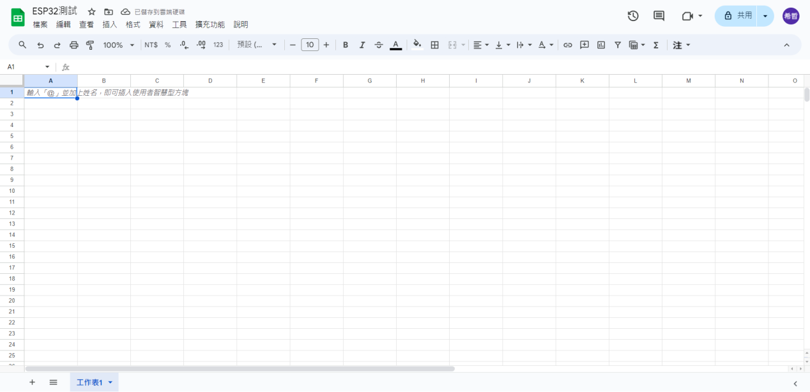

圖片說明：這是本頁第 1 張重點圖片，位於「步驟 3：在檔案名稱的欄位中輸入”ESP32 測試”，修改檔案名稱。」相關內容中，主要用來輔助說明 步驟 3：在檔案名稱的欄位中輸入”ESP32 測試”，修改檔案名稱。 步驟 4：在第一列的第 A 欄輸入”時間”，接著在第一列的第 B 欄輸入”VR 數值”。

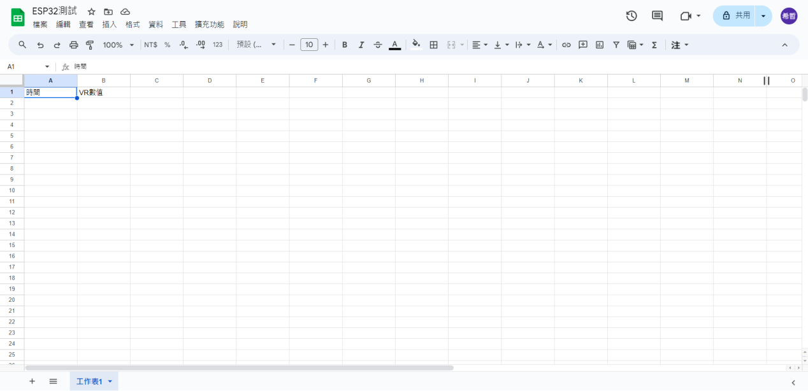

圖片說明：這是本頁第 2 張重點圖片，位於「步驟 3：在檔案名稱的欄位中輸入”ESP32 測試”，修改檔案名稱。」相關內容中，主要用來輔助說明 步驟 3：在檔案名稱的欄位中輸入”ESP32 測試”，修改檔案名稱。 步驟 4：在第一列的第 A 欄輸入”時間”，接著在第一列的第 B 欄輸入”VR 數值”。

## 第 20 頁

步驟 6：點選「檢視者」，接著點選彈出視窗中的編輯者，將檔案權限改成只要
知道連結的人就可以編輯。
步驟 7：最後點選「完成」，即可完成試算表的新增及權限的設定，由於檔案權
限設定為只要知道連結的人就可以編輯 ， 如果完成資料收集任務時 ， 要將檔案功
用改為限制，接著開始撰寫程式。
❶
❷
❸
❶
❷

### 圖片

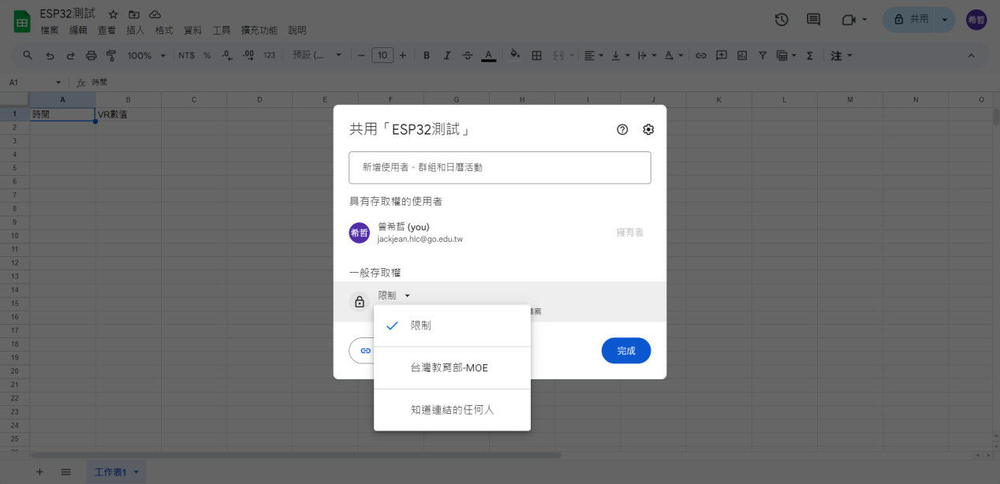

圖片說明：這是本頁第 1 張重點圖片，位於「步驟 6：點選「檢視者」，接著點選彈出視窗中的編輯者，將檔案權限改成只要」相關內容中，主要用來輔助說明 步驟 6：點選「檢視者」，接著點選彈出視窗中的編輯者，將檔案權限改成只要 知道連結的人就可以編輯。

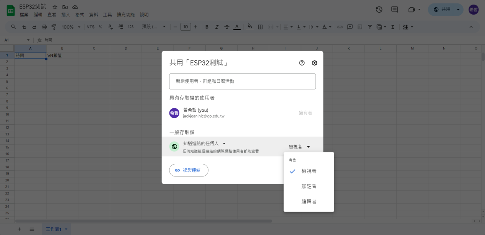

圖片說明：這是本頁第 2 張重點圖片，位於「步驟 6：點選「檢視者」，接著點選彈出視窗中的編輯者，將檔案權限改成只要」相關內容中，主要用來輔助說明 步驟 6：點選「檢視者」，接著點選彈出視窗中的編輯者，將檔案權限改成只要 知道連結的人就可以編輯。

## 第 21 頁

使用積木：
積木選單 積木 說明
法蘭斯積木/
EZ Start Kit+
可變電阻類比輸入值積木，本積
木為 EZ Start Kit 擴充板專用，功
用讀取可變電阻的數值。
法蘭斯積木/
Google 試算
表
Google 試算表新增一列積木，功
用為使用 Google 試算表的網址
及工作表名稱，新增一列資料到
指定的位置，可調整的重要參數
有新增資料到哪一列，以及哪一
個欄位。
法蘭斯積木/
Google 試算
表
完整時間資料積木，功用為在
Google 試算表的儲存格中加入完
整時間。
使用元件及接腳：
元件名稱 IO 編號 實際接腳
可變電阻 IO2 GPIO34
積木程式—傳送可變電阻的數值到 Google 試算表：
範例程式：ch5_4

### 圖片

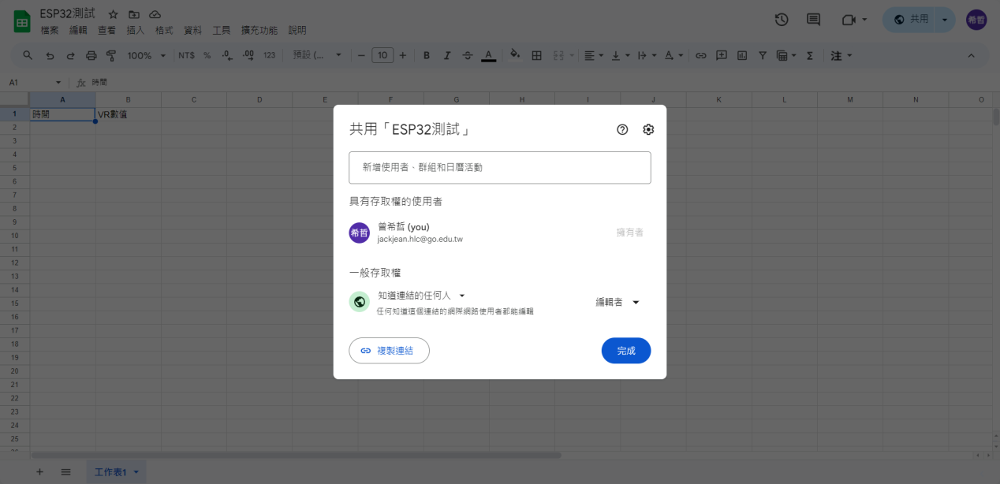

圖片說明：這是本頁第 1 張重點圖片，位於「使用積木：」相關內容中，主要用來輔助說明 積木選單 積木 說明 EZ Start Kit+。

## 第 22 頁

程式說明：
初始化部分：
1. 初始化序列埠連線，設定傳輸速度為 115200。
2. 使用你的 WiFi 熱點帳號及密碼，連線到 WiF 熱點。
3. 讓內建 LED 接腳輸出高電位，及讓內建 LED 發亮。
4. 宣告全域整數變數 VR，並初始化為 0。
重複執行部分：
5. 將 EZ Start Kit 中可變電阻的類比輸入值儲存到變數 VR。
6. 由序列埠列印變數 VR 的內容值，列印完成後換行。
7. 以 Google 試算表的網址及工作表名稱新增一列資料，新增到試算表的最後一
列，新增的資料為完整時間及變數 VR 的內容值。
8. 延遲 20000 毫秒(20 秒)。
程式的 Google 試算表新增一列積木中有新增參數 B 儲存格，新增的方式是
點選積木中的齒輪符號，再調整彈出視窗中的儲存格積木，如圖 5-10 所示。
1
2
3
4
5
6
6
7
8

### 圖片

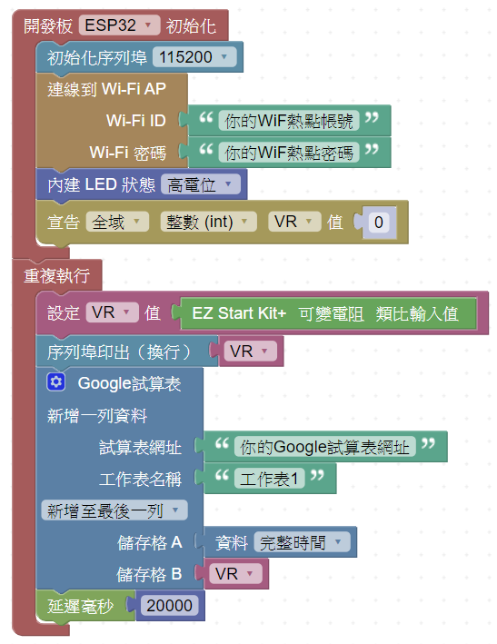

圖片說明：這是本頁第 1 張重點圖片，位於「程式說明：」相關內容中，主要用來輔助說明 1. 初始化序列埠連線，設定傳輸速度為 115200。 2. 使用你的 WiFi 熱點帳號及密碼，連線到 WiF 熱點。

## 第 23 頁

圖 5-10 調整儲存格參數
本程式以可變電阻值傳送到 Google 試算表中紀錄，每次新增資料在試算表
的最後一列，所以最新的資料會在試算表的最下方，最上方是最舊的資料，每次
紀錄的資料的 A 儲存格為完整時間 ， 在後續分析資料時 ， 可以確認資料紀錄的時
間。另外 Google 試算表新增一列積木中試算表網址及工作表名稱參數必須填入
前面設定完成權限的試算表，其網址及工作表名稱的位置如圖 5-11 所示。最後
因為 Google 試算表無法快速接收資料，所以程式中傳送資料會間隔 20 秒。
圖 5-11 Google 試算表網址及工作表名稱的位置
執行結果：
程式燒錄後，稍後片刻，完成WiFi 熱點連線，ESP32 的內建 LED 發亮，接著
會可以到每隔 20 秒就會寫入一列資料到 Google 試算表的最後一列 ， 同時序列埠
監看視窗中也會顯示可變電阻的數值，如圖 5-12 所示。
Google 試算表的網址
Google 試算表的工作表名稱

### 圖片

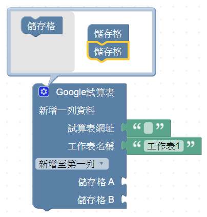

圖片說明：此圖對應「調整儲存格參數」，位於「圖 5-10 調整儲存格參數」相關內容中，主要用來輔助說明 本程式以可變電阻值傳送到 Google 試算表中紀錄，每次新增資料在試算表 的最後一列，所以最新的資料會在試算表的最下方，最上方是最舊的資料，每次。

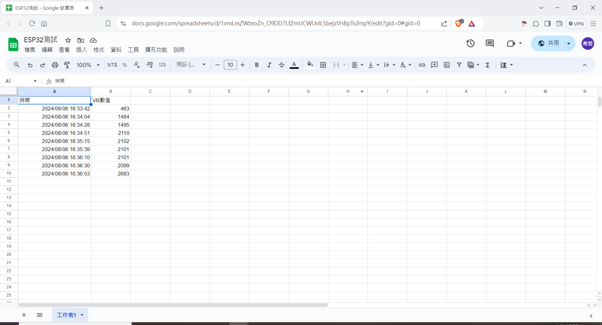

圖片說明：此圖對應「Google 試算表網址及工作表名稱的位置」，位於「圖 5-10 調整儲存格參數」相關內容中，主要用來輔助說明 本程式以可變電阻值傳送到 Google 試算表中紀錄，每次新增資料在試算表 的最後一列，所以最新的資料會在試算表的最下方，最上方是最舊的資料，每次。

## 第 24 頁

圖 5-12 LINE Notify 收到簡訊
延伸練習：
班上同學想知道每個月教室室溫及相對濕度的平均值，請利用 Google 試算
表及 EZ Start Kit， 設計物聯網室溫及相對濕度平台 ， 紀錄教室的室溫及相對濕度，
並計算一個月的平均值。

### 圖片

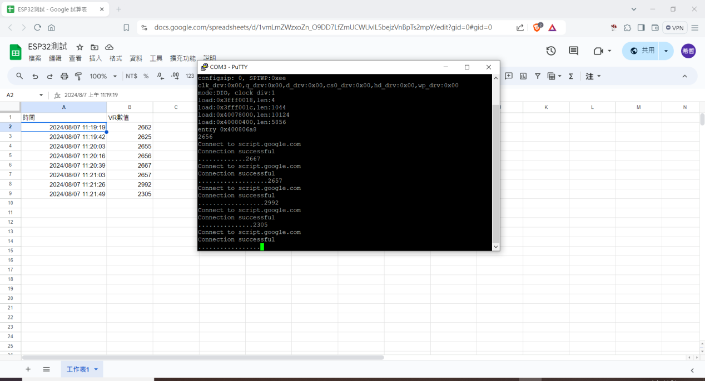

圖片說明：此圖對應「LINE Notify 收到簡訊」，位於「圖 5-12 LINE Notify 收到簡訊」相關內容中，主要用來輔助說明 班上同學想知道每個月教室室溫及相對濕度的平均值，請利用 Google 試算 表及 EZ Start Kit， 設計物聯網室溫及相對濕度平台 ， 紀錄教室的室溫及相對濕度。

## 第 25 頁

5-5 MQTT
MQTT(Message Queuing Telemetry Transport)是用於物聯網的通訊協定，使用
發布(Publish)及訂閱(Subscribe)方式傳送訊息 ， 跟5-2 節所提過的主從式架構不同。
MQTT 通訊系統中有三種角色分別是代理者(Broker)、發布者(Publisher)及訂閱者
(Subscriber)，發布者以主題(Topic)及訊息(Message)發布訊息，訂閱者透過訂閱該
主題來接收訊息 ， 代理者負責接收發布者所發布的主題及訊息 ， 再轉傳給訂閱該
主題的訂閱者。
如圖 5-13 所示，由溫度感測器發布主題為溫度，訊息為 28°C，由 MQTT 代
理者轉傳給訂閱主題為溫度的筆記型電腦，最後由筆記型電腦接收到 28°C 的訊
息。另外相對濕度感測器的發布者也是用相同的方式，將訊息為65%傳送給訂閱
主題為相對濕度的手機。
圖 5-13 MQTT 之發布及訂閱
本節要介紹首先使用 MQTT 伺服器的測試，接著再介紹用手機 App 透過
MQTT 傳送控制指令，依據指令控制 ESP32 的 LED 亮滅。
本節使用夜市小霸王(尤睿哲老師)所架設的 MQTT 伺服器，該伺服器還有提
供測試網頁，首先介紹測試網頁的操作方式，說明如下：
步驟 1：進入 MQTT GO 伺服器的測試網頁，網址為 https://broker.mqttgo.io/，進
入測試網頁後，點選「連線」，連線伺服器。

### 圖片

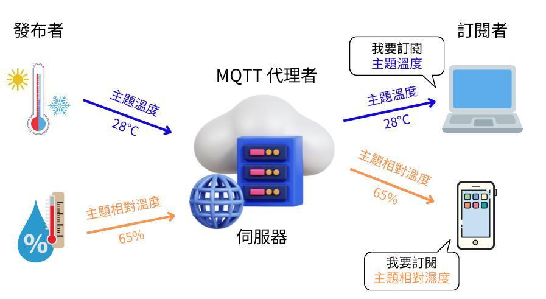

圖片說明：此圖對應「MQTT 之發布及訂閱」，位於「5-5 MQTT」相關內容中，主要用來輔助說明 MQTT(Message Queuing Telemetry Transport)是用於物聯網的通訊協定，使用 發布(Publish)及訂閱(Subscribe)方式傳送訊息。

## 第 26 頁

步驟 2：連線伺服器成功後，連線伺服器的燈號會變成綠色，以及文字顯示
connected，接著點選「Add Subcription(新增訂閱主題)」， 接著再彈出視窗中的Topic
欄位填入「Jack/testing」， 最後點選「Subscribe」， 完成主題為Jack/testing 的訂閱。
步驟 3：訂閱完成後 ， 在Add Subcription(新增訂閱主題)的下方會出現 Jack/testing
欄位，接著在推播(Publish)的 Topic 欄位中輸入”Jack/testing”，在訊息欄位輸入”
測試”，最後點選「Publish」，完成主題為 Jack/testing，訊息為測試的發布，同時
在訂閱(Subcription)中的訊息會新增『測試』一欄，代表我們設定的訂閱
Jack/testing 主題收到訊息為測試。完成以上測試，代表伺服器正常工作。
❷
❶
❸
❹
\

### 圖片

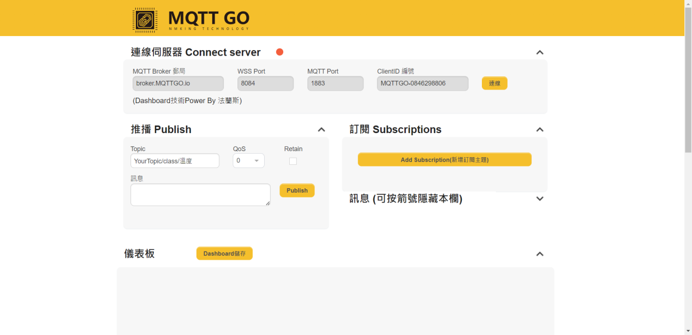

圖片說明：這是本頁第 1 張重點圖片，位於「步驟 2：連線伺服器成功後，連線伺服器的燈號會變成綠色，以及文字顯示」相關內容中，主要用來輔助說明 步驟 2：連線伺服器成功後，連線伺服器的燈號會變成綠色，以及文字顯示 connected，接著點選「Add Subcription(新增訂閱主題)」， 接著再彈出視窗中的Topic。

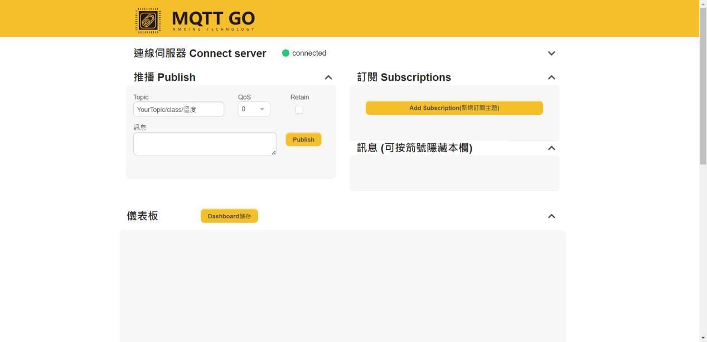

圖片說明：這是本頁第 2 張重點圖片，位於「步驟 2：連線伺服器成功後，連線伺服器的燈號會變成綠色，以及文字顯示」相關內容中，主要用來輔助說明 步驟 2：連線伺服器成功後，連線伺服器的燈號會變成綠色，以及文字顯示 connected，接著點選「Add Subcription(新增訂閱主題)」， 接著再彈出視窗中的Topic。

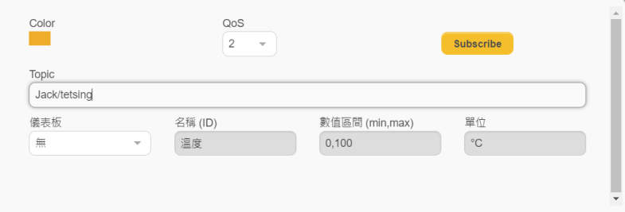

圖片說明：這是本頁第 3 張重點圖片，位於「步驟 2：連線伺服器成功後，連線伺服器的燈號會變成綠色，以及文字顯示」相關內容中，主要用來輔助說明 步驟 2：連線伺服器成功後，連線伺服器的燈號會變成綠色，以及文字顯示 connected，接著點選「Add Subcription(新增訂閱主題)」， 接著再彈出視窗中的Topic。

## 第 27 頁

完成 MQTT GO 伺服器的測試，接著我們要介紹以手機 App 為發布者，發布
控制指令給 ESP32 訂閱，透過訂閱控制指令的內容控制 LED 的亮滅，如圖 5-14
所示。
圖 5-14 手機發布訊息控制 ESP32 的 LED
我們在手機上使用 IoT MQTT Panel App，可以在手機上發布訊息，也可以訂
閱訊息，接著要繼續介紹 IoT MQTT Panel App 的設定方式，如圖 5-14 所示，在
App 中使用主題 Jack/LED，發布的訊息為”1”及”0”，作為控制 LED 的指令，App
的設定操作方式說明如下：
步驟 1：下載及安裝 IoT MQTT Panel。
Android 手機下載連結：
https://play.google.com/store/apps/details?id=snr.lab.iotmqttpanel.prod&hl=en
iPhone 手機下載連結：
https://apps.apple.com/pl/app/iot-mqtt-panel/id6466780124
步驟 2：啟動 IoT MQTT Panel，點選「SETUP A CONNECTION」，新增 MQTT 伺服器
的連線。
❶
❷
❸
❹
❺

### 圖片

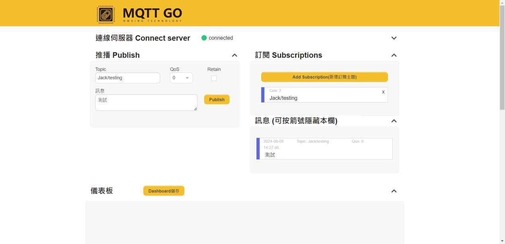

圖片說明：此圖對應「手機發布訊息控制 ESP32 的 LED」，位於「完成 MQTT GO 伺服器的測試，接著我們要介紹以手機 App 為發布者，發布」相關內容中，主要用來輔助說明 完成 MQTT GO 伺服器的測試，接著我們要介紹以手機 App 為發布者，發布 控制指令給 ESP32 訂閱，透過訂閱控制指令的內容控制 LED 的亮滅，如圖 5-14。

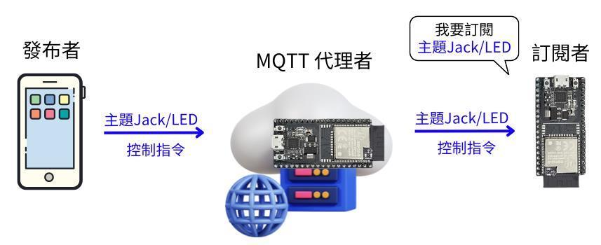

圖片說明：這是本頁第 2 張重點圖片，位於「完成 MQTT GO 伺服器的測試，接著我們要介紹以手機 App 為發布者，發布」相關內容中，主要用來輔助說明 完成 MQTT GO 伺服器的測試，接著我們要介紹以手機 App 為發布者，發布 控制指令給 ESP32 訂閱，透過訂閱控制指令的內容控制 LED 的亮滅，如圖 5-14。

## 第 28 頁

步驟 3：在Connection name 欄位中輸入”MQTT GO”， 接著在Broker Web/IP address
欄位輸入”broker.mqttgo.io”，在彈出視窗中的 Dashborad name 欄位中輸入”LED
Control”，接著點選「SAVE」，回到原本視窗後，最後點選「CREATE」。
步驟 4： 連線完成建立後 ， 畫面會出現MQTT GO 的連線 ， 如果成功連線伺服器，
在 MQTT GO 的右側會出現打勾的圖示，接著點選「MQTT GO」連線，繼續點選
「ADD PANEL」，再來點選「Button」，準備新增 Button panel。
❶
❷
❸
❹
❺
❻

### 圖片

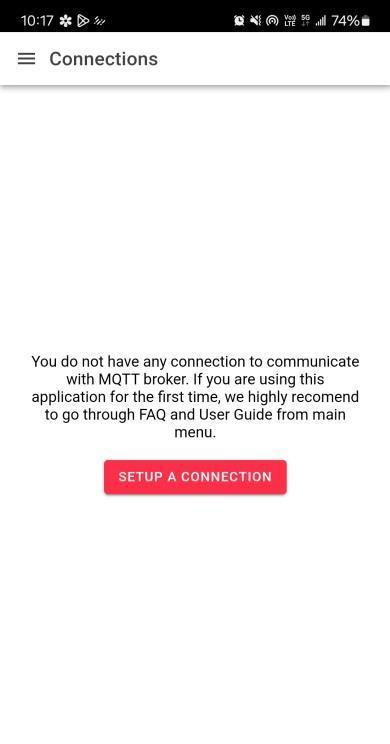

圖片說明：這是本頁第 1 張重點圖片，位於「步驟 3：在Connection name 欄位中輸入”MQTT GO”， 接著在Broker Web/IP address」相關內容中，主要用來輔助說明 步驟 3：在Connection name 欄位中輸入”MQTT GO”， 接著在Broker Web/IP address 欄位輸入”broker.mqttgo.io”，在彈出視。

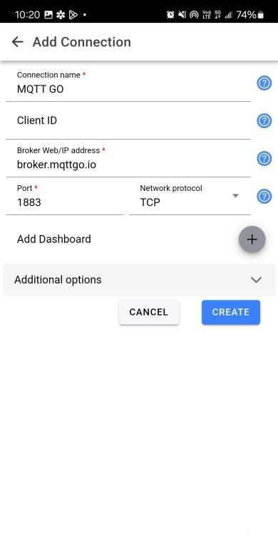

圖片說明：這是本頁第 2 張重點圖片，位於「步驟 3：在Connection name 欄位中輸入”MQTT GO”， 接著在Broker Web/IP address」相關內容中，主要用來輔助說明 步驟 3：在Connection name 欄位中輸入”MQTT GO”， 接著在Broker Web/IP address 欄位輸入”broker.mqttgo.io”，在彈出視。

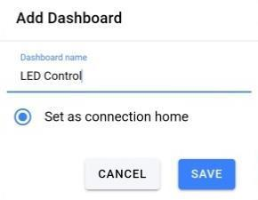

圖片說明：這是本頁第 3 張重點圖片，位於「步驟 3：在Connection name 欄位中輸入”MQTT GO”， 接著在Broker Web/IP address」相關內容中，主要用來輔助說明 步驟 3：在Connection name 欄位中輸入”MQTT GO”， 接著在Broker Web/IP address 欄位輸入”broker.mqttgo.io”，在彈出視。

## 第 29 頁

步驟 5：在 Panel name 欄位中輸入”LED ON”， 接著在Topic 欄位中輸入”Jack/LED”，
繼續在 Payload 欄位中輸入”1”，Button color 選擇「紅色」，最後點選「CREATE」。
步驟 6：LED ON 的 Button 建立後，會出現在手機畫面中，接著點選畫面中的「+
號」，新增另一個 Button panel，Panel name 為入”LED OFF”，接著在 Topic 欄位中
輸入”Jack/LED”，繼續在 Payload 欄位中輸入”0”，Button color 選擇「綠色」，最
後點選「CREATE」。
❶
❷
❸
❶
❷
❸
❹
❺

### 圖片

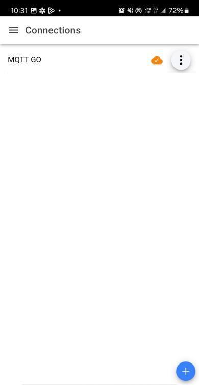

圖片說明：這是本頁第 1 張重點圖片，位於「步驟 5：在 Panel name 欄位中輸入”LED ON”， 接著在Topic 欄位中輸入”Jack/LED”，」相關內容中，主要用來輔助說明 步驟 5：在 Panel name 欄位中輸入”LED ON”， 接著在Topic 欄位中輸入”Jack/LED”， 繼續在 Payload 欄位中輸入”1”，Button col。

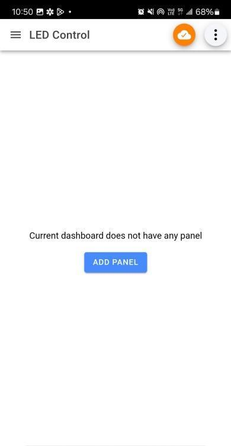

圖片說明：這是本頁第 2 張重點圖片，位於「步驟 5：在 Panel name 欄位中輸入”LED ON”， 接著在Topic 欄位中輸入”Jack/LED”，」相關內容中，主要用來輔助說明 步驟 5：在 Panel name 欄位中輸入”LED ON”， 接著在Topic 欄位中輸入”Jack/LED”， 繼續在 Payload 欄位中輸入”1”，Button col。

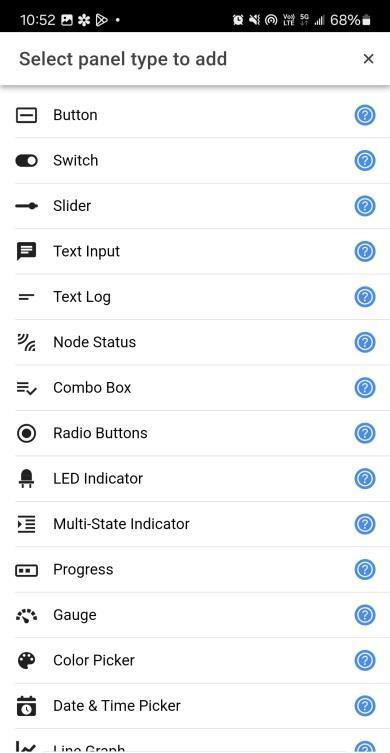

圖片說明：這是本頁第 3 張重點圖片，位於「步驟 5：在 Panel name 欄位中輸入”LED ON”， 接著在Topic 欄位中輸入”Jack/LED”，」相關內容中，主要用來輔助說明 步驟 5：在 Panel name 欄位中輸入”LED ON”， 接著在Topic 欄位中輸入”Jack/LED”， 繼續在 Payload 欄位中輸入”1”，Button col。

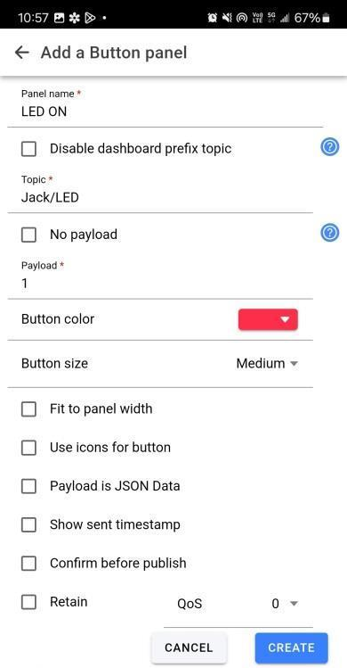

圖片說明：這是本頁第 4 張重點圖片，位於「步驟 5：在 Panel name 欄位中輸入”LED ON”， 接著在Topic 欄位中輸入”Jack/LED”，」相關內容中，主要用來輔助說明 步驟 5：在 Panel name 欄位中輸入”LED ON”， 接著在Topic 欄位中輸入”Jack/LED”， 繼續在 Payload 欄位中輸入”1”，Button col。

## 第 30 頁

步驟 7：完成新增兩個 Button 後，手機畫面會出現兩個按鍵，一個是紅色的 LED
ON，另一個則是綠色的 LED OFF。
步驟 8：在 MQTT GO 測試網頁中，要按下連線按鈕，並確定連線燈號顯示綠色
後，繼續新增訂閱”Jack/LED”主題，新增完成後，按下手機上的 LED ON 按鍵，
MQTT GO 的訊息會出現 1，按下手機上的 LED OFF 按鍵，MQTT GO 的訊息會出
現 0。完成 App 設定及 MQTT 發布訊息的測試後，我們要繼續來寫程式，
❷
❸
❹
❺
❻
❶

### 圖片

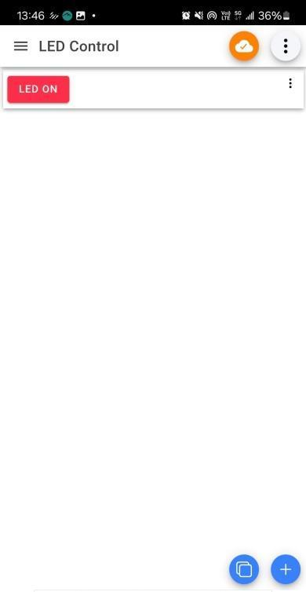

圖片說明：這是本頁第 1 張重點圖片，位於「步驟 7：完成新增兩個 Button 後，手機畫面會出現兩個按鍵，一個是紅色的 LED」相關內容中，主要用來輔助說明 步驟 7：完成新增兩個 Button 後，手機畫面會出現兩個按鍵，一個是紅色的 LED ON，另一個則是綠色的 LED OFF。

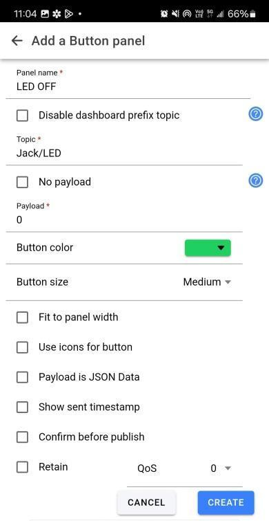

圖片說明：這是本頁第 2 張重點圖片，位於「步驟 7：完成新增兩個 Button 後，手機畫面會出現兩個按鍵，一個是紅色的 LED」相關內容中，主要用來輔助說明 步驟 7：完成新增兩個 Button 後，手機畫面會出現兩個按鍵，一個是紅色的 LED ON，另一個則是綠色的 LED OFF。

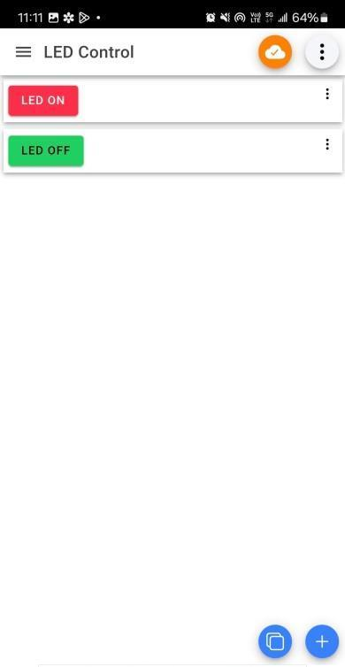

圖片說明：這是本頁第 3 張重點圖片，位於「步驟 7：完成新增兩個 Button 後，手機畫面會出現兩個按鍵，一個是紅色的 LED」相關內容中，主要用來輔助說明 步驟 7：完成新增兩個 Button 後，手機畫面會出現兩個按鍵，一個是紅色的 LED ON，另一個則是綠色的 LED OFF。

## 第 31 頁

使用積木：
積木選單 積木 說明
法蘭斯積木/
MQTT
MQTT 初始化積木積木，功用為
以連線所需要的參數連線 MQTT
伺服器，並完成某主題的訂閱，
其參數包括主機位址、埠號、帳
號、密碼及客戶端 ID 等。
法蘭斯積木/
MQTT
當收到 MQTT 訂閱訊息積木，功
用為監聽 MQTT 連線，當收到訊
息時執行判斷訊息的主題，如果
符合設定條件的主題時，則執行
本積木中程式。
法蘭斯積木/
MQTT
取得 MQTT 收到訊息積木，功用
為取用 MQTT 所收到的訊息。
法蘭斯積木/
MQTT
向 MQTT 的主題發布訊息積木，
功用為向 MQTT 連線的某個主題
發布訊息。
使用元件及接腳：
元件名稱 IO 編號 實際接腳
紅色 LED IO4 GPIO16
可變電阻 IO2 GPIO 34
積木程式—接收 MQTT 訂閱主題的訊息：
範例程式：ch5_5

### 圖片

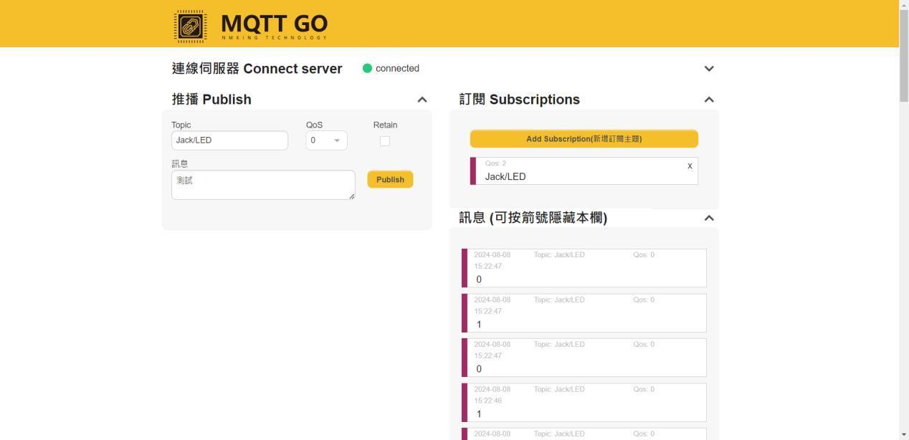

圖片說明：這是本頁第 1 張重點圖片，位於「使用積木：」相關內容中，主要用來輔助說明 積木選單 積木 說明 MQTT 初始化積木積木，功用為。

圖片說明：這是本頁第 2 張重點圖片，位於「使用積木：」相關內容中，主要用來輔助說明 積木選單 積木 說明 MQTT 初始化積木積木，功用為。

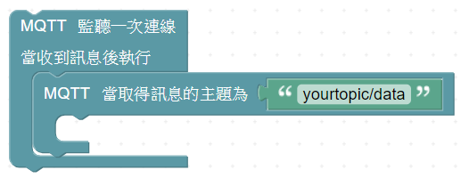

圖片說明：這是本頁第 3 張重點圖片，位於「使用積木：」相關內容中，主要用來輔助說明 積木選單 積木 說明 MQTT 初始化積木積木，功用為。

## 第 32 頁

程式說明：
初始化部分：
1. 初始化序列埠連線，設定傳輸速度為 115200。
2. 宣告全域字串變數 ReData，並初始化為空字串。
3. 使用你的 WiFi 熱點帳號及密碼，連線到 WiF 熱點。
4. 讓內建 LED 接腳輸出高電位，及讓內建 LED 發亮。
5. 以 MQTT GO 伺服器的網址及埠號連線伺服器，連線完成後訂閱主
題”Jcak/LED”。
重複執行部分：
6. 監聽一次 MQTT 連線，當收到訊息時，執行積木 7 到 13。
1
2
3
4
5
6
6
7
8
9
10
11
13
12

### 圖片

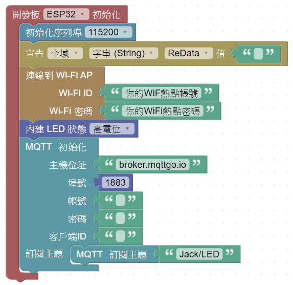

圖片說明：這是本頁第 1 張重點圖片，位於「程式說明：」相關內容中，主要用來輔助說明 1. 初始化序列埠連線，設定傳輸速度為 115200。 2. 宣告全域字串變數 ReData，並初始化為空字串。

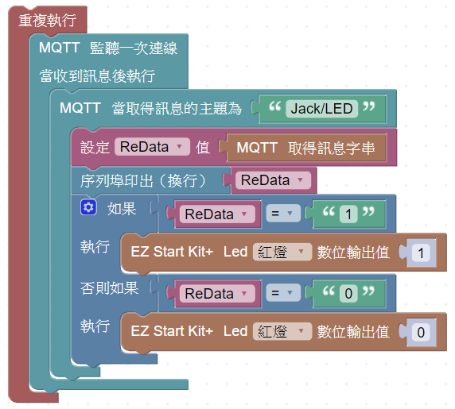

圖片說明：這是本頁第 2 張重點圖片，位於「程式說明：」相關內容中，主要用來輔助說明 1. 初始化序列埠連線，設定傳輸速度為 115200。 2. 宣告全域字串變數 ReData，並初始化為空字串。

## 第 33 頁

7. 當收到訊息的主題為 Jack/LED 時，執行積木 8 到 13。
8. 將 MQTTw 收到的訊息儲存到變數 ReData。
9. 由序列埠列印變數 ReData 的內容值，列印完成後換行。
10. 如果變數 ReData 的內容值為”1”，則執行積木 11。
11. 讓 EZ Start Kit 的紅色 LED 變亮。
12. 如果變數 ReData 的內容值為”0”，則執行積木 13。
13. 讓 EZ Start Kit 的紅色 LED 變滅。
程式中完成 WiFi 熱點連線後，接著連線 MQTT 伺服器，所有連線都完成以
後，開始監聽 MQTT 連線，如果有收到主題為”Jack/LED”的訊息，代表訊息是手
機發布的控制指令，讓手機 App 發布的控制指令控制 LED 亮滅，接著判斷訊息
內容 ， 如果訊息內容為”1”， 則讓EZ Start Kit 的紅色 LED 變亮 ， 如果訊息內容為”0”，
則讓 EZ Start Kit 的紅色 LED 變滅。
由於 MQTT GO 為公開的伺服器，所以無須使用者的帳號及密碼即可完成連
線，完成連線後的通道為公開通道，只要有訂閱主題均可收到訊息，使用上要特
別注意。
執行結果：
程式燒錄後，稍後片刻，完成WiFi 熱點連線，ESP32 的內建 LED 發亮，接著
啟動手機的 IoT MQTT Panel App，按下 App 上的 LED ON 鍵，EZ Start Kit 的 LED 會
發亮，如圖 5-15(a)所示，按下 App 上的 LED OFF 鍵，EZ Start Kit 的 LED 會變滅，
如圖 5-15(b)所示。另外可以使用 MQTT GO 的測試網頁訂閱主題『Jack/LED』，監
看手機發布的訊息，如圖 5-16 所示。
圖 5-15 手機 MQTT 遙控 LED (a) 當按下 LED ON 鍵時 (b) 當按下 LED OFF 鍵時
(a)
(b)

### 圖片

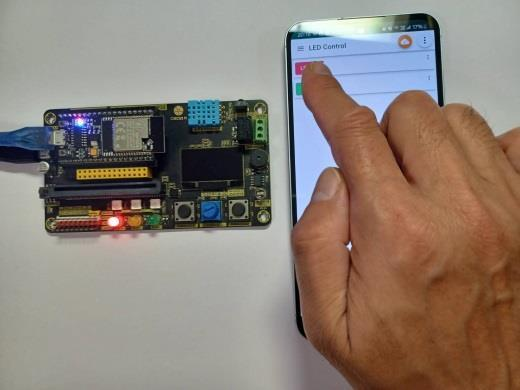

圖片說明：此圖對應「手機 MQTT 遙控 LED (a) 當按下 LED ON 鍵時 (b) 當按下 LED OFF 鍵時」，位於「7. 當收到訊息的主題為 Jack/LED 時，執行積木 8 到 13。」相關內容中，主要用來輔助說明 7. 當收到訊息的主題為 Jack/LED 時，執行積木 8 到 13。 8. 將 MQTTw 收到的訊息儲存到變數 ReData。

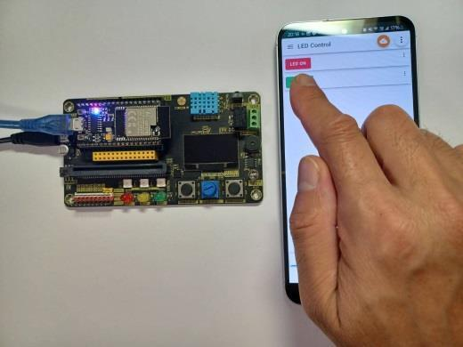

圖片說明：這是本頁第 2 張重點圖片，位於「7. 當收到訊息的主題為 Jack/LED 時，執行積木 8 到 13。」相關內容中，主要用來輔助說明 7. 當收到訊息的主題為 Jack/LED 時，執行積木 8 到 13。 8. 將 MQTTw 收到的訊息儲存到變數 ReData。

## 第 34 頁

圖 5-16 MQTT GO 測試網頁收到的訊息
延伸練習：
範例中使用 IoT MQTT Panel App 中的 Button panel 發布訊息，另外 App 中有
Switch panel 可以在 ON 時發布一種訊息，在 OFF 時發布另一種訊息，請用三個
Switch panel 控制 EZ Start Kit 的三顆 LED。

### 圖片

圖片說明：此圖對應「MQTT GO 測試網頁收到的訊息」，位於「圖 5-16 MQTT GO 測試網頁收到的訊息」相關內容中，主要用來輔助說明 範例中使用 IoT MQTT Panel App 中的 Button panel 發布訊息，另外 App 中有 Switch panel 可以在 ON 時發布一種訊息，在 OFF。

## 第 35 頁

5-6 MQTT 接收可變電阻值
在 5-5 節我們透過 MQTT 使用手機發布主題為 Jack/LED 的控制訊息，再由
ESP32 訂閱 Jack/LED 主題，並接收控制訊息。本節延續 5-5 節的 MQTT 介紹，如
圖 5-17 所示，以 ESP32 作為發布者，使用主題為 Jack/VR 的主題，發布可變電阻
值，再由手機訂閱 Jack/VR 主題，接收可變電阻值，並顯示在手機的畫面上。
圖 5-17 手機訂閱主題接收訊息
本節繼續介紹 IoT MQTT Panel App 的使用，如圖 5-17 所示，在 App 中訂閱
主題 Jack/VR，並接收該主題的訊息，App 的設定操作方式接續 5-5 節，在已經
建好的連線中新增 dashboard，說明如下：
步驟 1：重新啟動 IoT MQTT Panel App，點選「MQTT GO」，進入 LED Control
dashborad 後，點選右上角的「三個點」，繼續點選彈出視窗中的「Add a new
dashborad」。
❶
❷
2
❸

### 圖片

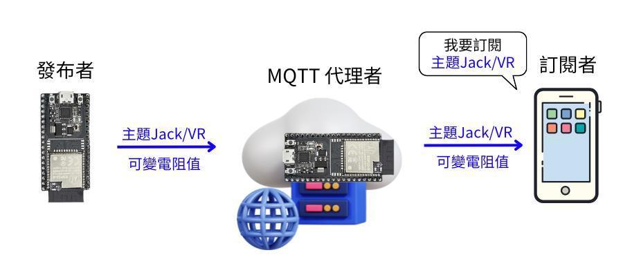

圖片說明：此圖對應「所示，以 ESP32 作為發布者，使用主題為 Jack/VR 的主題，發布可變電阻」，位於「5-6 MQTT 接收可變電阻值」相關內容中，主要用來輔助說明 5-6 MQTT 接收可變電阻值 在 5-5 節我們透過 MQTT 使用手機發布主題為 Jack/LED 的控制訊息，再由。

圖片說明：此圖對應「手機訂閱主題接收訊息」，位於「5-6 MQTT 接收可變電阻值」相關內容中，主要用來輔助說明 5-6 MQTT 接收可變電阻值 在 5-5 節我們透過 MQTT 使用手機發布主題為 Jack/LED 的控制訊息，再由。

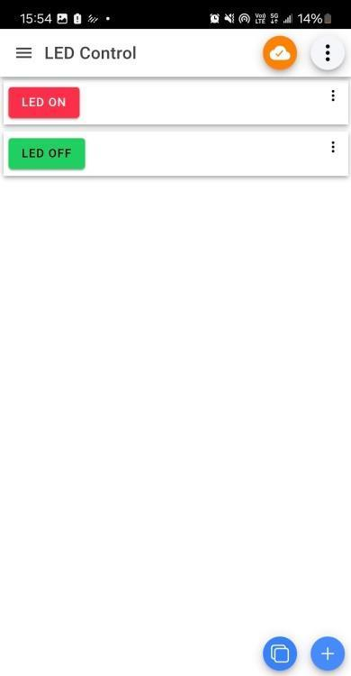

圖片說明：這是本頁第 3 張重點圖片，位於「5-6 MQTT 接收可變電阻值」相關內容中，主要用來輔助說明 5-6 MQTT 接收可變電阻值 在 5-5 節我們透過 MQTT 使用手機發布主題為 Jack/LED 的控制訊息，再由。

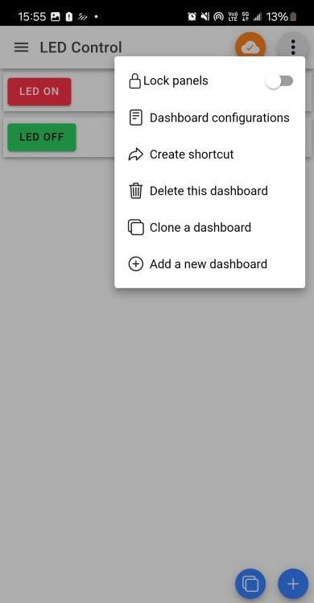

圖片說明：這是本頁第 4 張重點圖片，位於「5-6 MQTT 接收可變電阻值」相關內容中，主要用來輔助說明 5-6 MQTT 接收可變電阻值 在 5-5 節我們透過 MQTT 使用手機發布主題為 Jack/LED 的控制訊息，再由。

## 第 36 頁

步驟 2：在 Dashborad name 欄位中輸入”VR Display”，接著點選「CREATE」，回到
LED Control dashborad 後，最後點選「VR Display」。
步驟 3：點選「ADD PANEL」，再來點選「Gauge」，準備新增 Gauge panel。
步驟 5：在 Panel name 欄位中輸入”VR”，接著在 Topic 欄位中輸入”Jack/VR”，
繼續在 Payload min 欄位中輸入”0”， 在 Payload max 欄位中輸入”4095”，最後點
選「CREATE」。
❶
❷
❶
❷
❸

### 圖片

圖片說明：這是本頁第 1 張重點圖片，位於「步驟 2：在 Dashborad name 欄位中輸入”VR Display”，接著點選「CREATE」，回到」相關內容中，主要用來輔助說明 步驟 2：在 Dashborad name 欄位中輸入”VR Display”，接著點選「CREATE」，回到 LED Control dashborad 後，最後點選「VR Di。

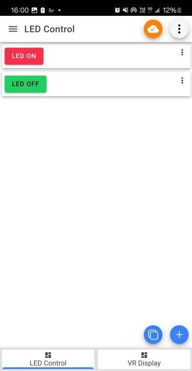

圖片說明：這是本頁第 2 張重點圖片，位於「步驟 2：在 Dashborad name 欄位中輸入”VR Display”，接著點選「CREATE」，回到」相關內容中，主要用來輔助說明 步驟 2：在 Dashborad name 欄位中輸入”VR Display”，接著點選「CREATE」，回到 LED Control dashborad 後，最後點選「VR Di。

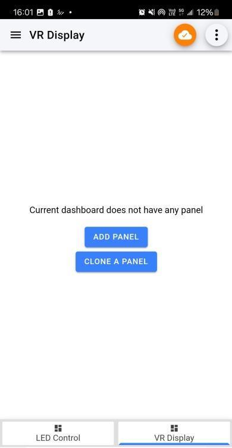

圖片說明：這是本頁第 3 張重點圖片，位於「步驟 2：在 Dashborad name 欄位中輸入”VR Display”，接著點選「CREATE」，回到」相關內容中，主要用來輔助說明 步驟 2：在 Dashborad name 欄位中輸入”VR Display”，接著點選「CREATE」，回到 LED Control dashborad 後，最後點選「VR Di。

圖片說明：這是本頁第 4 張重點圖片，位於「步驟 2：在 Dashborad name 欄位中輸入”VR Display”，接著點選「CREATE」，回到」相關內容中，主要用來輔助說明 步驟 2：在 Dashborad name 欄位中輸入”VR Display”，接著點選「CREATE」，回到 LED Control dashborad 後，最後點選「VR Di。

## 第 37 頁

步驟 6：完成新增 Gauge 後，手機畫面會出現綠色儀表。
步驟 8：在 MQTT GO 測試網頁中，要按下連線按鈕，並確定連線燈號顯示綠色
後，繼續將推播(Publish)的 Topic 欄位輸入”Jack/VR”，並在訊息欄中輸入 1024，
為了確認伺服器是否正常，另外訂閱 Jack/VR 主題，再來點選「Publish」，最後
檢查測試網頁及手機 App 上都會顯示 1024。
❶
❷
❸
❹
❺

### 圖片

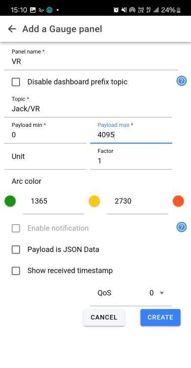

圖片說明：這是本頁第 1 張重點圖片，位於「步驟 6：完成新增 Gauge 後，手機畫面會出現綠色儀表。」相關內容中，主要用來輔助說明 步驟 6：完成新增 Gauge 後，手機畫面會出現綠色儀表。 步驟 8：在 MQTT GO 測試網頁中，要按下連線按鈕，並確定連線燈號顯示綠色。

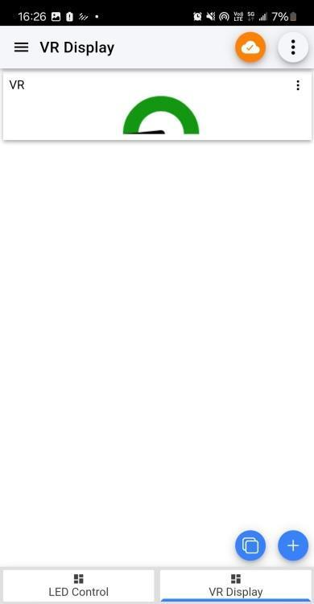

圖片說明：這是本頁第 2 張重點圖片，位於「步驟 6：完成新增 Gauge 後，手機畫面會出現綠色儀表。」相關內容中，主要用來輔助說明 步驟 6：完成新增 Gauge 後，手機畫面會出現綠色儀表。 步驟 8：在 MQTT GO 測試網頁中，要按下連線按鈕，並確定連線燈號顯示綠色。

## 第 38 頁

使用積木：
積木選單 積木 說明
法蘭斯積木/
MQTT
MQTT 初始化積木，功用為以連
線所需要的參數連線 MQTT 伺服
器，並完成某主題的訂閱，其參
數包括主機位址、埠號、帳號、
密碼及客戶端 ID 等。
法蘭斯積木/
MQTT
向 MQTT 的主題發布訊息積木，
功用為向 MQTT 連線的某個主題
發布訊息，參數為主題及發布訊

### 圖片

圖片說明：這是本頁第 1 張重點圖片，位於「使用積木：」相關內容中，主要用來輔助說明 積木選單 積木 說明 MQTT 初始化積木，功用為以連。

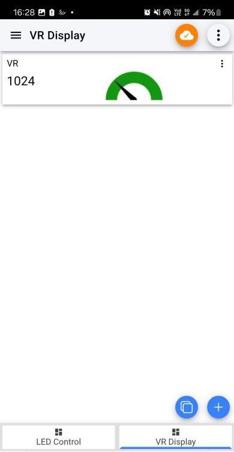

圖片說明：這是本頁第 2 張重點圖片，位於「使用積木：」相關內容中，主要用來輔助說明 積木選單 積木 說明 MQTT 初始化積木，功用為以連。

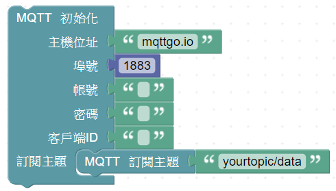

圖片說明：這是本頁第 3 張重點圖片，位於「使用積木：」相關內容中，主要用來輔助說明 積木選單 積木 說明 MQTT 初始化積木，功用為以連。

## 第 39 頁

息的字串。
法蘭斯積木/
自訂程式碼
資料型態轉換積木，功用為將變
數內容或數值轉換成字串，修改
參數可轉換成整數等其他型態。
使用元件及接腳：
元件名稱 IO 編號 實際接腳
可變電阻 IO2 GPIO 34
積木程式—接收 MQTT 訂閱主題的訊息：
程式說明：
初始化部分：
1. 初始化序列埠連線，設定傳輸速度為 115200。
2. 宣告全域整數變數 VR，並初始化為 0。
3. 使用你的 WiFi 熱點帳號及密碼，連線到 WiF 熱點。
4. 讓內建 LED 接腳輸出高電位，及讓內建 LED 發亮。
5. 以 MQTT GO 伺服器的網址及埠號連線伺服器。
重複執行部分：
6. 讀取 EZ Start Kit 的可變電阻數值，儲存到變數 VR。
範例程式：ch5_5
1
2
3
4
5
6
6
7
8
9
10

### 圖片

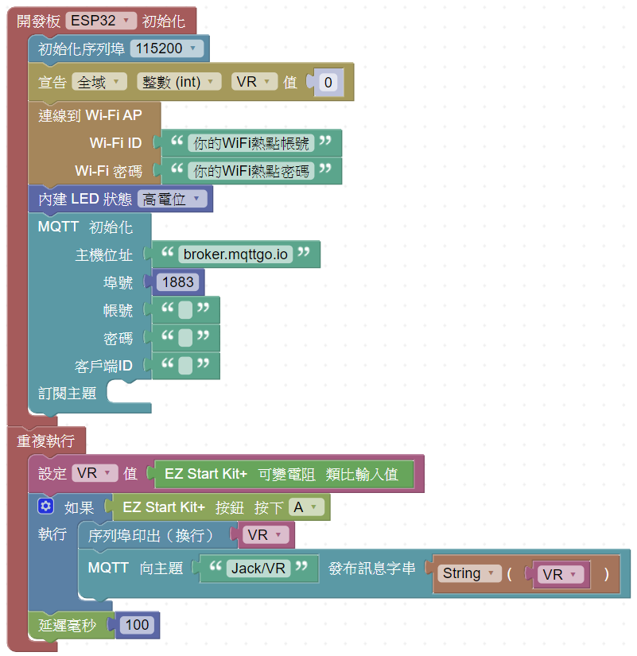

圖片說明：這是本頁第 1 張重點圖片，位於「息的字串。」相關內容中，主要用來輔助說明 資料型態轉換積木，功用為將變 數內容或數值轉換成字串，修改。

## 第 40 頁

7. 當 EZ Start Kit 的 A 鍵被按下時， 執行積木8 到 9， 如果未按則往下繼續執行。
8. 由序列埠列印變數 VR 的內容值，列印完成後換行。
9. 將整數變數 VR 的內容值轉換成字串後，向 MQTT 連線的 Jack/VR 主題發布訊
息。
10. 延遲 100 毫秒(0.1 秒)。
程式中完成 WiFi 熱點連線後，接著連線 MQTT 伺服器，所有連線都完成以
後，開始讀取可變電阻的數值，搭配按下 A 鍵，將可變電阻的數值向 Jack/VR 發
布，再由手機 App 訂閱及讀取可變電阻的數值，最後在手機的畫面上顯示。程
式的 MQTT 初始化積木可以不訂閱主題 ， 但如果要同時發布及訂閱 ，則需要訂閱
相關主題。
在向 MQTT 的主題發布訊息積木中發布訊息參數必須使用字串型態 ， 所以在
該摻數中使用資料型態轉換積木，將整數變數 VR 的內容值轉換成字串。
執行結果：
程式燒錄後，稍後片刻，完成WiFi 熱點連線，ESP32 的內建 LED 發亮，接著
啟動手機的 IoT MQTT Panel App，選擇 VR Display panel， 按下EZ Start Kit 的 A 鍵，
App 會顯示可變電阻的數值 ， 如圖5-18(a)所示 ， 同時在序列埠監看視窗也會顯示
可變電阻的數值，如圖 5-18(b)所示。
圖 5-18 ESP32 發布訊息 (a)按下 A 鍵手機收到可變電阻值 (b)序列埠監看視窗
顯示可變電阻值
延伸練習：
請使用 IoT MQTT Panel App 顯示 EZ Start Kit 中溫濕度感測器的數值
